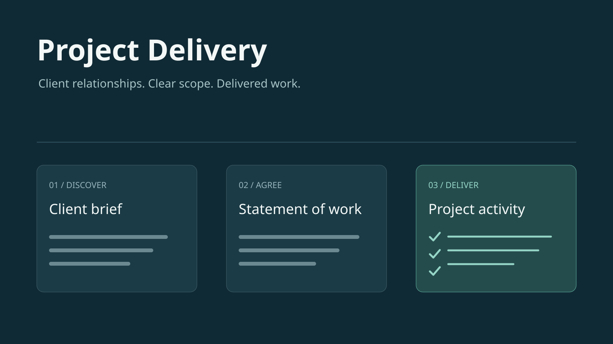

# Field Operations



Field Operations is a construction field-operations workspace: schedule a site job, dispatch a
contractor, track on-site progress, raise scope-change requests, and collect photographic
evidence whose integrity is checked mechanically. It is deliberately focused — it does not attempt
project costing, payroll, or portfolio management, and the platform's native approval system owns the
variation approval lifecycle.

## 1. What this workspace is

The problem: field-service work needs the right people at the right site on the right day, and the
evidence that the work happened needs to be trustworthy. A photo of a job site is not proof by
itself — the same photo can be reused, a photo can be taken somewhere else, and a photo says nothing
about which site it shows unless the site's identity is readable in it.

Field Operations answers with a dispatch pipeline (site → job → contractor assignment)
followed by an evidence pipeline (per-photo integrity checks, geolocation, site-identity inference,
and a one-way suspect escalation for controllers to scrutinise).

## 2. The mental model

### Domain shape

```text
site → jobs → job assignment ← contractor profile
             ↓
       photo evidence ← variation request
```

- **site** — a physical site with client context and an optional map location. Past jobs remain
  attached to it.
- **jobs** — work scheduled for one site and one calendar day, beginning `unassigned` and following
  the assignment's progress (`assigned` → `in_progress` → `completed`).
- **contractor_profiles** — a contractor organisation, linked one-to-one with a tenant user who can
  open the contractor workspace and receive its dispatched work.
- **job_assignments** — one contractor per job. Identity (job + contractor) is immutable after
  dispatch; status runs `dispatched` → `in_progress` → `completed`, with `suspect` as a one-way
  integrity overlay (see below). Completion timestamps the assignment and advances the job.
- **variation_requests** — a scope change against one assignment. Creation is governed by the
  contractor policy's approval flow: writing one raises a platform approval request for a controller
  review step, not a row that is directly applied.
- **photo_evidence** — one explicitly selected photo attached to exactly one assignment or one
  variation, with deterministic integrity results. Conversation history and unselected media are not
  retained.

### The evidence integrity pipeline

Every photo, from every entry path (workspace upload or channel), passes through the same
`photo_evidence` create hooks:

1. **Ingest** — JPEG/PNG only, exactly one parent (assignment or variation), SHA-256 fingerprint,
   Meta PDQ perceptual hash (256-bit), EXIF parse (`exifr`), and quality/metadata signals.
2. **Duplicate check** — the create `after` hook compares the new photo against everything already
   stored: exact SHA-256 matches, and perceptual near-duplicates via `findNearest` on a 256-dim 0/1
   vector indexed with HNSW (L2 metric, threshold √31 ≈ PDQ Hamming 31). Matches are recorded as
   `exact_duplicate` / `visual_duplicate` flags with the matched evidence ids.
3. **Geolocation** — EXIF GPS is compared against the job site's map location (500 m tolerance).
   No GPS → `missing_geolocation`; capture beyond tolerance → `location_mismatch`.
4. **Site identity (automation)** — a vision model uses its own multimodal judgement over the whole
   naturally photographed scene, ignoring overlays, and compares it with the assigned site. A visibly
   wrong location latches `site_identity_mismatch` even when one expected indicator is present, and
   stores the model's free-text rationale. Inconclusive photos do not overwrite a prior mismatch. Each
   photo records a durable
   pending/terminal identity state; provider work runs from the platform's leased retry queue rather
   than holding the upload or environment reset open.
5. **Classification** — deterministic inspection records evidence attributes; it does not pretend
   those attributes are the verdict. Missing GPS is neutral on its own because WhatsApp commonly
   strips EXIF. Reuse and a GPS mismatch are strong signals, but the multimodal model classifies the
   whole scene against the assigned site and writes the human-readable rationale. A scene mismatch
   latches `suspect` and cannot be cleared by a later match. The controller dashboard shows the
   attributes and AI rationale; contractors and the WhatsApp agent never see them.

## 3. What ships

### Apps

| App                    | Audience                                                   | What it provides                                                                                                                                                                                       |
| ---------------------- | ---------------------------------------------------------- | ------------------------------------------------------------------------------------------------------------------------------------------------------------------------------------------------------ |
| `field_ops_controller` | Dispatch / operations staff (the BCA controller dashboard) | A dated dispatch schedule as a status kanban beside a site map, the suspect-scrutiny panel, weekly roster CSV import, and tabs for sites and contractors.                                              |
| `field_ops_contractor` | Field contractor                                           | One table of its own assignments: job · site · date, dispatch time, progress, reported location, and summary. Opening a row shows the job scope, assignment activity, variations, and evidence photos. |

Flag visibility is reserved for the controller dashboard: photo integrity flags, the `suspect`
status, and the `site_identity_*` markers render only for controllers. Contractors see their own
assignment's progress and their evidence photos — never the integrity results.

### The WhatsApp channel

`field_ops_whatsapp` is a conversational entry point for contractors who already have an active
workspace account. Administrators assign the contractor to the profile policy and verify the
WhatsApp number on that account. An unknown number receives a registration prompt and no model run.

The channel runs under the strict capability lock:

- **The linked account is the requestor.** `${requestor.norbital_id}` policy conditions scope reads
  and writes to that contractor's profile, assignments, variations, and evidence.
- **The channel declaration remains the ceiling.** The WhatsApp agent receives the
  `field_ops_contractor` policy even if that person holds a broader web-app role elsewhere.
- **DMs are private; groups are shared.** Every assigned member sees profile group transcripts in
  Agent UI, while only the DM owner and administrators see a private transcript.
- The task never exposes controller-only integrity fields and directs photo uploads to the app.

Policy grants remain row-level rather than column-level, so the task still explicitly forbids
controller-only integrity fields even though the contractor can update their own assignment row.

### Automations, policies, remotes, seed

| Kind       | Name                   | What it does                                                                                                                                                                                        |
| ---------- | ---------------------- | --------------------------------------------------------------------------------------------------------------------------------------------------------------------------------------------------- |
| Automation | `photo_site_identity`  | Post-commit vision inference on each new photo; verifies the assignment's site identity once, never re-flags on inconclusive photos.                                                                |
| Policy     | `field_ops_controller` | Full command of every collection, both apps. The reconciliation key is the filename.                                                                                                                |
| Policy     | `field_ops_contractor` | Requestor-scoped grants: own profile, assigned sites/jobs, own assignments (read + update), own variations (read + create/update behind the variation approval flow), own evidence (read + create). |
| Policy     | `field_ops_whatsapp`   | The channel lock above: exactly one grant — `update` on `job_assignments`.                                                                                                                          |
| Remote     | `field_ops_dashboard`  | Date-specific controller query: assignment cards, board ids, map points (with suspect tones), and the month's suspect assignments.                                                                  |
| Seed       | —                      | Fixture data is Core-owned (`src/+seed.ts` is deliberately absent); the weekly roster CSV lives in `assets/` with its own README.                                                                   |

## 4. Under the hood

### Source layout

```text
src/
├── apps/                           +field_ops_controller.svelte, +field_ops_contractor.svelte
├── channels/                       +field_ops_whatsapp.channel.ts
├── policies/                       the three policies and the variation approval flow
├── collections/                    models, relationships, hooks, pipelines, representations
│   └── photo_evidence/lib/         photo-integrity.ts — PDQ + EXIF inspection, geo flags, parenting
├── custom-types/
│   ├── money/                      money value with renderer (ISO 4217 currency)
│   └── photo_source/               where a photo came from: workspace upload or a channel message
├── i18n/                           messages.en.json + messages.zh.json (identical key sets)
├── lib/
│   ├── calendar.ts                 calendar-day derivation in a named timezone (Asia/Singapore)
│   ├── calendar.ts                 calendar-day derivation in a named timezone (Asia/Singapore)
│   └── haversine.ts                site-tolerance distance math
├── remotes/                        +field_ops_dashboard.ts
```

Apps are deliberately thin because the work happens inside a record: opening an assignment brings up
its job scope, activity, variations, and photo evidence together; opening a site separates upcoming
jobs from activity history. Hooks carry the domain rules so they apply to every client, remote, and
agent — not only the UI:

- A job must reference an existing site; an assignment must reference an existing job and contractor
  and be unique per job.
- `source_message_id` is an idempotency key for inbound assignments and variations.
- Assignment identity cannot be moved after dispatch; a reported location beyond the site tolerance
  forces `suspect` (one-way); completion advances the job state.
- Photo evidence: JPEG/PNG only, exactly one parent, fingerprints and integrity flags recorded.

### How photo integrity works

- **PDQ**: Meta's perceptual hash, computed in-process via `pdq-wasm` (bundled with its WASM sidecar
  by the Vite config). The 256-bit hash is stored as a 256-dim 0/1 `vector` (`hexToBinaryEmbedding`);
  L2 distance equals √Hamming, so the near-duplicate threshold √31 is PDQ's Hamming 31.
- **Similarity search**: `findNearest` on the HNSW `photo_evidence_pdq_hnsw` index (`vector_l2_ops`)
  with bounded limits — the fast, indexed path, not a scan.
- **EXIF**: `exifr` reads capture time, software, and GPS. `missing_geolocation` records that the
  signal is absent, but does not classify the photo: WhatsApp commonly strips EXIF.
  `metadata_anomaly`/`edited_metadata`/`low_quality` are also evidence attributes.
- **Flags** live on the photo row (`flags` array, `matched_evidence_ids`). Cross-assignment reuse and
  GPS mismatch are strong inputs, not a verdict by themselves. The multimodal site-identity layer
  judges the whole natural scene, records its rationale, and is the layer that can latch an assignment
  suspicious. The controller dashboard renders both the deterministic attributes and that rationale.

### How the WhatsApp channel works

The host (Core) holds the transport credential and delivers an already-authenticated inbound command
(`channel` / `inbound` with transport conversation id, provider message id, text, sender). Pod binds
the conversation to a transcript, claims the message exactly once, and matches its sender to a
verified WhatsApp identity on an account assigned to `field_ops_contractor`. The linked contractor's
identity supplies policy placeholders; the channel principal supplies the policy membership, keeping
the profile as the ceiling. The reply goes back over the same transport. Public profiles skip the
identity match but must declare durable sender, profile, and concurrency limits.

## 5. Changing the template

```bash
pnpm sync    # compile the workspace: .norbital/generated, types, migrations
pnpm lint    # prettier --check + svelte-check
pnpm build   # vite build
```

- Never hand-edit `.norbital/` generated output. `sync` may update `.norbital/migrations/`; commit
  that history alongside the authored change. Model edits are the only thing that should produce a
  migration — this template has none pending.
- Seed data stays Core-owned; tenant fixtures belong in `src/+seed.ts` (deliberately absent here).
- Publishing and tenant lifecycle: publish the template through the OSS release workflow, then have
  Core redeploy a tenant checkpoint (`pnpm tenant:update --org=<org> --template=<key>`) before a
  revision reaches a tenant; use `env:reset` only for a deliberate reseed. The template detail page
  on the website is generated from this README and `norbital.template.json` — no separate copy.
