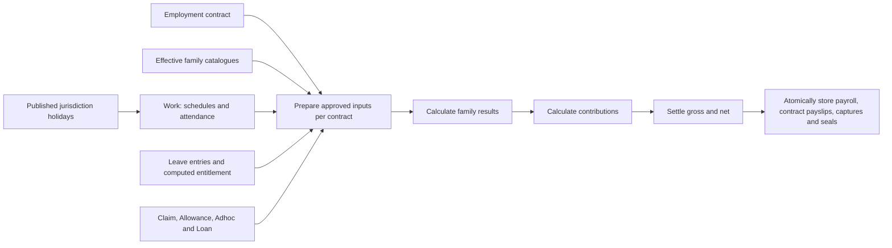

# HR & Payroll


This Bolt workspace calculates payroll from approved employment, attendance, Leave and monetary
entries. Effective catalogue revisions define calculation rules and statutory treatments. Results
retain their source captures and calculation provenance.

## Payroll model

Exactly one payroll is permitted per company and period. A draft can be deleted and recreated;
a paid payroll is immutable. Late approved payments and corrections settle through a later regular
period. There is no ad hoc payroll or second run for a settled period.

The domain families are Work, Leave, Claim, Allowance, Adhoc, Loan and Contribution. Each owns its
catalogue and business inputs. Adhoc uses one catalogue and one request collection for bonuses,
notice pay, separation payments and corrections.



- **Work** owns salary, overtime and unexplained absence calculations.
- **Leave** records time off, manual encashment, carry-forward, adjustments and reversals.
  Entitlement is computed from effective catalogue and employment facts; balances include recorded
  activity and pending reservations. No annual account, ledger refresh or automatic departure
  settlement is created. Encashment pays the approved amount without repricing it from salary.
- **Claim, Allowance and Adhoc** provide approved monetary entries. A single-use entry is consumed
  once, including a signed correction. Recurring allowances remain eligible across their range.
- **Loan** owns agreements and repayment schedules. Outstanding recovery is the amount due less
  paid captures. Partial recovery remains at its source.
- **Contribution** evaluates statutory schemes against the treatments supplied by calculated items.

The existing `employments` collection represents contracts. Every employee event and payslip names
its contract. A person may have at most one active contract per entity on any date, including future
dates, and may hold active contracts in other entities. Rehire creates a new contract and a fresh
entitlement calculation. The first committed reference permanently seals the contract; departure is
a separate immutable fact and creates no financial entries. Statutory YTD retains the aggregation
required across contracts for the same person and entity.

Observed holidays are annual jurisdiction inputs, independent of employment and company settings
revisions. Published calendar coverage is required for overtime. Workday links and payroll captures
permanently seal the dates they consume, including dates with no holiday. Deleting a consumer does
not reopen those dates. `holiday_import` prepares next-year drafts from Google Calendar each
1 October, with manual jurisdiction/year refreshes. HR reviews observations and annual completeness
before publication. Source configuration and credentials are separate from annual calendars.

Payroll writes `payroll_runs`, `payslips` (adjustments inlined), the three capture junctions
(allowance, leave, loan repayment) and the single-use sources' settlement pins as one atomic graph. Payslips contain base, proration and statutory results; adjustments reference their
causal captures. Payroll outputs are calculated rather than supplied as seed inputs.

Only approved, committed source rows are payable. Held creates live in the platform approval
queue. Leave includes their debit reservations when calculating available entitlement.

## Applications

**Employee self-service** has Home, Events and Payslips. Events uses a family sidebar for Work,
Leave, Claim, Allowance, Adhoc and Loan. Employees submit their own time-off requests; HR controls
manual encashment, carry-forward, adjustments and reversals.

**Controller** shares the selected legal entity across its pages:

| Area                | Purpose                                                              |
| ------------------- | -------------------------------------------------------------------- |
| Entities            | Select the legal entity                                              |
| People              | Profiles, contracts, departures, effective terms and statutory facts |
| Events              | Work, Leave, Claim, Allowance, Adhoc and Loan records                |
| Payroll             | Create the regular period, review results, mark paid and export      |
| Settings → Catalog  | Review family definitions within the settings lineage                |
| Settings → Holidays | Configure sources, import, review and publish annual calendars       |
| Kiosk               | Attendance clock and face enrollment                                 |

Policies distinguish employee, supervisor, manager, HR controller, HR manager, senior management
and kiosk access. Payroll writes belong to HR manager and senior management. Approved Leave entries
are immutable; corrections use new entries. HR controller manual Leave activity requires HR manager
or senior management review.

`src/+agents.md` supplies shared agent context. It grants no permissions; the signed-in person's
policies remain authoritative.

## Automation

`statutory_drift` checks configured official research sources monthly. It proposes a draft settings
revision with review notes; a person reviews and seals it. It never edits a sealed version or seals
its own proposal. `holiday_import` uses the managed Google Calendar connection to fetch complete
annual source pages and save review candidates; it cannot publish calendars. There are no automatic
encashment, carry-forward or annual entitlement jobs.

## Source layout

```text
src/
├── apps/                     # employee, controller groups, kiosk
├── collections/              # models, hooks, representations and import/export pipelines
│   └── payroll_runs/lib/     # preparation, calculation, settlement and output graph
├── datatypes/                # structured business values and renderers
├── access/                   # policies and teams
├── i18n/                     # matching English and Chinese message keys
├── automations/              # statutory drift and annual holiday import
├── lib/                      # family logic, scheduling and shared presentation
└── +agents.md
```

Models describe storage. `src/collections/+relationship.ts` declares the relation graph.
Before hooks validate and return the complete write graph; a refusal leaves no partial payroll.
Representations own collection forms. Pipelines import roster/attendance workbooks and export payroll
reports, bank files and payslips.

`src/lib/payroll/families.ts` coordinates family preparation, source calculation and grouped
Contribution assessment. Work, monetary requests, Loan and Contribution have their own modules in
that directory; Leave's payroll boundary is `src/lib/leave/payroll.ts`. Payroll's run core handles
shared context, settlement and the output graph without querying family-owned source tables or
dispatching their calculation definitions. See [Architecture](docs/architecture.md#payroll-flow).

## Verification and changes

The family source boundary is implemented. Artifact sync, type checks, full-suite and browser
verification of the combined change set remain in progress; local source is not a deployed tenant
release. Holiday imports also require a configured managed `GOOGLE_CALENDAR_API_KEY` and a reviewed
source for each jurisdiction.

Acceptance tests use invented public fixtures under `tests/fixtures/seed/` and the isolated Bolt
self-host. Confidential reconciliation inputs are not test fixtures. See
[`docs/data.md`](docs/data.md), [`docs/architecture.md`](docs/architecture.md) and
[`docs/leave.md`](docs/leave.md).

```bash
pnpm lint
pnpm sync
pnpm test
pnpm test:e2e
```

`sync` generates workspace types and the portable artifact at `.norbital/artifact/bundle.mjs`.
For model changes, generate migrations with `pnpm exec bolt migrate --name <name>`. Review generated
history without hand-editing it. Template changes reach an existing tenant only through its release
and provisioning workflow; editing local source does not change a running tenant.

The template pins its own first-party packages and lockfile. From the realm root,
`pnpm run env -- link` overlays local package builds for verification. Publishing and provisioning
remain separate operations.
