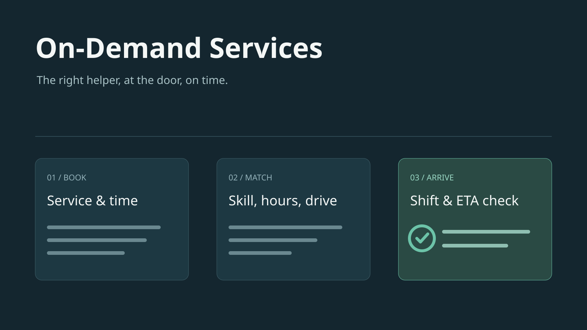

# CRM



A two-sided B2B trade workspace: the **sales side** qualifies accounts and contacts, quotes from a
product catalogue, runs the pipeline to won, and confirms the deal; the **purchase side** raises
purchase orders against suppliers and confirms the buy. Both sides work from master data imported
from the company's system of record — an ERP or accounting system that owns customers, items, and
vendors — and export their committed documents in a fixed, versioned shape. One entry, no re-keying.

This is an executable Bolt template, not a production-operations manual. It demonstrates
server-enforced document lifecycles, revision-safe quoting, snapshot line items, money arithmetic
that holds up to reconciliation, a cost-secrecy boundary drawn by policy omission, and idempotent
master-data imports keyed on the external system's own codes.

## The mental model

```
external system of record (owns customers, items, vendors)
        │ master exports, imported
        ▼
accounts · products · suppliers   (the masters — keyed on external_code, edited in place)

sales chain:   contact → quote → quote_lines →(confirm)→ sales_invoices → sales_invoice_lines
               quote ──▶ contract_signings · quote ──▶ settlements (received)
buy chain:     supplier → purchase_orders → purchase_order_lines
               purchase_orders ──▶ goods_receipts → goods_receipt_lines
               purchase_orders ──▶ purchase_invoices → purchase_invoice_lines
               purchase orders & invoices ──▶ settlements (paid)
```

Four ideas carry the whole workspace:

- **Masters in, documents out.** `accounts`, `products`, and `suppliers` hold the external
  system's masters: every row carries the system's own key in `external_code`, and each arrives
  through its collection's `import` pipeline, which skips codes already on file so a re-imported
  export is a no-op. Committed documents go the other way: `quotes` and `purchase_orders` declare an
  `export_confirmed` query that serializes a confirmed document and its lines.
- **A document is a lifecycle, not a row.** Every document collection carries a `state` field whose
  declared moves and per-state edit rules the engine enforces on every write path. `draft` is the only editable state — lines, prices, and
  terms lock the moment a document leaves draft — and the terminal states are the ones that export,
  which is what makes their figures safe to hand across the boundary.
- **History is snapshots.** Quote, order, and invoice lines snapshot the product code, name, unit,
  and price at creation, so a later catalogue edit never rewrites a historical document. Documents
  snapshot their account or supplier the same way.
- **Money is decided in one place.** Each line computes `net`, `tax`, and `line_total` once, from
  the parent document's currency and tax mode; a document total is the sum of already-rounded
  lines. Paid / partial / unpaid is never stored — it is derived at render from settlements against
  the document gross, and only for committed documents.

### Lifecycles

```
quote:            draft ──▶ sent ──▶ won ──▶ confirmed (terminal)
                  sent ──▶ draft = revision (revision_number+1, revision_of set)
                  draft/sent/won ──▶ lost ──▶ won (a lost deal may reopen)
                  draft/sent/won ──▶ cancelled (terminal, reason required)
purchase order:   draft ──▶ submitted ──▶ confirmed (terminal) · cancelled
sales invoice:    draft ──▶ issued (terminal) · cancelled
purchase invoice: draft ──▶ confirmed (terminal, the three-way match checkpoint) · cancelled
contract signing: unstamped ──▶ counterparty_stamped ──▶ acknowledged · voided (re-signing)
goods receipts:   no status — a receipt is an immutable event
```

Confirming is re-checked against the masters: the account or supplier must still be active, the
document must carry at least one line, and every line's product must still be active — a document
never confirms against stale master data. A quote under adverse credit (account on hold, or over its limit)
confirms only with an explicit `credit_acknowledged`, which lands in the audit trail. Cancelling
any document requires a reason. Sent quotes past `valid_until` are caught by the daily automation.

### Entities

| Collection               | Role                                                                                                            |
| ------------------------ | --------------------------------------------------------------------------------------------------------------- |
| `accounts`               | Customer companies — the ERP customer master, carrying the credit position.                                     |
| `contacts`               | People at accounts: decision-makers, buyers, day-to-day contacts.                                               |
| `quotes`                 | The sales pipeline document, with trade terms on the header and a revision lineage.                             |
| `quote_lines`            | Line items: product snapshot plus computed amounts. Editable only while draft.                                  |
| `sales_invoices`         | Billing raised against a confirmed quote; lines allocate quoted quantities.                                     |
| `sales_invoice_lines`    | One billed quantity per quote line, capped across live invoices.                                                |
| `contract_signings`      | The confirmed quote's contract lifecycle; `binding_hash` fingerprints the quote substance at generation.        |
| `activities`             | Interaction log (call / meeting / email / task / note) on an account or a quote: `regarding`, an exclusive arc. |
| `products`               | Sellable catalogue — the ERP item master. Sell prices and tax rate only; cost never lives here.                 |
| `settlements`            | Payments in or out against any committed document (`regarding`). Paid status derived at render.                 |
| `suppliers`              | Vendors — the ERP vendor master, with contact, category, and payment terms.                                     |
| `purchase_orders`        | The buying pipeline document, snapshotting the supplier and inheriting its currency.                            |
| `purchase_order_lines`   | Line items carrying the struck unit cost — a buy-side fact sales has no grant to read.                          |
| `goods_receipts`         | Received-against-order events; remaining-to-receive is derived, never stored.                                   |
| `goods_receipt_lines`    | Received quantities per order line, capped at the ordered quantity.                                             |
| `purchase_invoices`      | Supplier invoices booked against a confirmed order; `draft → confirmed` is the three-way match checkpoint.      |
| `purchase_invoice_lines` | Invoiced quantities and costs per order line, capped across live invoices.                                      |

## What ships

### Apps

| App            | What a user does                                                                                                                                                                                                                                                                                                                                    |
| -------------- | --------------------------------------------------------------------------------------------------------------------------------------------------------------------------------------------------------------------------------------------------------------------------------------------------------------------------------------------------- |
| `crm`          | Sales CRM (`src/app/crm/+desk.page.svelte`). The account picker in the header scopes the page (the first active account by name until one is chosen). Pipeline board over the quote states with a rep filter, then quotes, quote lines, accounts, contacts, products, activities, invoices, invoice lines, contracts and payments for that account. |
| `crm_purchase` | Purchasing (`src/app/crm_purchase/+desk.page.svelte`). A live dashboard of orders per status, committed spend per currency and the top five suppliers; then purchase orders, order lines (with `received`), suppliers, goods receipts, receipt lines, purchase invoices, their lines and payments.                                                  |

Every collection opens in the shell's record sheet; `src/data/collection/<c>/+representation.svelte` lays out its form
(`src/lib/ui/record-form.svelte`), labels from the messages, the quote's contact picked from the chosen account's people,
and an **Export** button on a confirmed quote or purchase order.

### Automation

`quote_expiry_watch` — daily at 06:00 (workspace zone), a read-only sweep of sent quotes past `valid_until`, run as the
`quote_watch` policy; the lapsed quotes are the run's result, and all of them its `expired-quotes.json` attachment.

### Imports, exports, queries

- **Import — the ERP's masters.** `accounts`, `products` and `suppliers` each declare a `+pipeline.ts` import
  (`lib/erp-feed.ts`): a delivered page of customers, items or vendors, trimmed and required (a malformed page fails the
  whole batch), codes already on file skipped (`onConflict: 'keep'`), so importing the same export twice changes nothing.
- **Export — confirmed documents.** `quotes.export_confirmed` and `purchase_orders.export_confirmed` return one
  versioned JSON document per confirmed record the caller may read (`norbital.crm.confirmed_quote.v1`,
  `norbital.crm.confirmed_purchase_order.v1`), field-enumerated, so cost and other internal facts can never serialize;
  the record's Export button runs the same query and saves them.
- `purchase_orders.purchase_matching` — ordered / received / invoiced per order line, the three-way match (cancelled
  invoices do not count). `settlements.settlement_summary` — paid to date per document of one type.

### Policies

| Policy                | Apps           | What it owns                                                                                                                       |
| --------------------- | -------------- | ---------------------------------------------------------------------------------------------------------------------------------- |
| `accounts_read`       | —              | The sole account-read grant.                                                                                                       |
| `products_read`       | —              | The sole product-read grant (sell prices only).                                                                                    |
| `suppliers_manage`    | —              | The supplier master.                                                                                                               |
| `commercial_shared`   | —              | The settlement ledger and its summary.                                                                                             |
| `sales_rep`           | `crm`          | Own quotes, sales invoices and signings (read and change), their lines, contacts, activities, the quote export; the desk's limits. |
| `procurement_officer` | `crm_purchase` | Purchase orders and lines, receipts, purchase invoices and lines, the match and the order export.                                  |
| `quote_watch`         | —              | Held by no team: the expiry sweep's read of quotes.                                                                                |

The sales/procurement split is drawn by **omission**: sales has no `purchase_order_lines` grant (the only cost column),
and procurement no quote grant. `src/access/+team.ts` binds the three teams (Sales, Procurement, Sales & Procurement).

### Channel and envoy

`sales_desk` — a Telegram channel (`src/channel/+sales_desk.channel.ts`) answered by the `sales_desk` envoy
(`src/agent/envoy/+sales_desk.envoy.ts`, public, groups ignored, delegation on). An unlinked customer's direct message
runs under the Sales team's four policies alone; a linked member's adds their own authority. `envoys.receive` caps each
sender at 8 a minute and the desk at 300; the desk's turns share `sales_rep`'s 100 an hour.

### Seed

The bank's `crm` tree (`seed/seed.ts`: an activity's `regarding_type`/`regarding_id` becomes its `regarding`
reference; the purchase cost lookup stays in the bank). `bolt build --bank=<seed bank>` writes it as the `sample` pack.

## Under the hood

```text
src/
├── +workspace.ts              Asia/Singapore; app order
├── data/
│   ├── +relationship.ts       every reference; lines are owned by their document
│   ├── model/<c>/+model.ts    fields, states (to / edit), seq numbers, sum and count roll-ups, checks
│   └── collection/<c>/        +collection.ts (allowlists, the one transform, queries), +representation.svelte,
│                              +pipeline.ts (the three master imports)
├── access/                    +team.ts and the seven +<p>.policy.ts
├── agent/                     +agent.md, envoy/+sales_desk.envoy.ts
├── automation/                +quote_expiry_watch.automation.ts
├── channel/                   +sales_desk.channel.ts
├── app/                       crm/ and crm_purchase/: +app.ts and +desk.page.svelte
├── i18n/                      +messages.ts / +zh.messages.ts over messages.en.json / messages.zh.json
└── lib/                       pricing.ts (the only rounding), erp-feed.ts, document-export.ts, currency.ts, ui/
```

- **A document is a state field.** Each lists its moves (`to`) and what may change in each state (`edit`); lines are
  owned, so they are written only while their document is a draft. The transforms add what a move needs: lines to
  submit, issue or confirm; active master data; the credit acknowledgement; a reason to cancel or void; the stamps.
- **Numbers and totals are the model's.** `doc_no` is a `seq` (`QT-`, `SI-`, `PO-`, `PI-`, `GRN-<yyyy>-<nnnn>`, in
  the workspace zone, never reused); `net` / `tax` / `gross` are `sum` roll-ups of the already-rounded lines.
- **Caps** (billed ≤ quoted, received and invoiced ≤ ordered, live invoices only) are refused in the line transforms
  with the running figures; receipts are also bounded in the statement by the order line's `received` roll-up and check.
- **Money** (`lib/pricing.ts`): half-up by exponent shift, a tax-inclusive line's tax the residual `gross − net`.

## Changing the template

```bash
pnpm check   # bolt check: layout, names, bundle, seed, schema, rules, tsc and svelte-check
pnpm test    # bolt build --bank=… (the sample pack), then bolt test (vitest on the test kit, the surface sweep)
pnpm run env -- serve --template=templates/crm --seed=bank   # from the realm root: bolt start on the sample pack
```

Publishing is unchanged: pushing to `main` of the templates repository republishes `refs/heads/templates/crm`.
