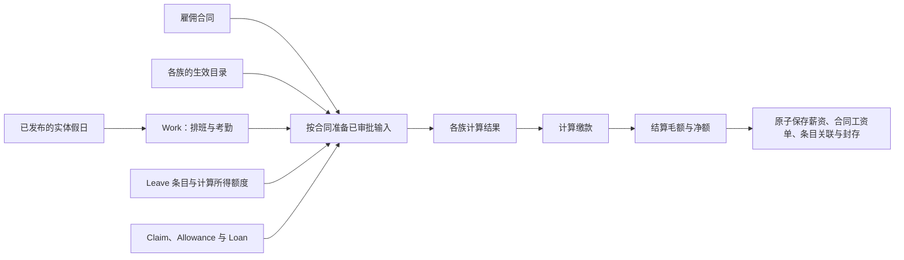

# HR 与薪资


本 Bolt 工作区根据已审批的雇佣、考勤、休假与金额条目计算薪资。生效的目录版本定义计算规则与法定计入项。运行消费的每一条条目都关联到结算它的工资单，结果保留其计算来源。

## 薪资模型

每个公司每个期间只允许一次薪资运行。草稿可删除后重建；已付款的薪资不可变。迟批的付款与更正通过后续常规期间结算。没有临时薪资，也没有针对已结算期间的第二次运行。

业务族为 Work、Leave、Claim、Allowance、Loan 与 Contribution。Work 的规则位于设置版本上；其余各族各自拥有目录与业务条目。奖金、通知期付款、离职补偿与更正都是 Allowance 目录行；没有单独的付款目录。



- **Work** 负责工资、加班与未解释缺勤的计算。
- **Leave** 记录休假、手工兑现、结转、调整与冲销。额度按生效目录与雇佣事实计算；结余包含已记录的活动与待批预留。不创建年度账户或结余刷新任务；合同关闭时，离职者未使用的年假余额会自动生成一条待人事经理审批的兑现记录。兑现按已审批金额支付，不从工资重新定价。
- **Claim 与 Allowance** 提供已审批的金额。报销只消费一次，带符号的更正亦然。津贴一律为常设项：一个目录项、一个月度金额和一段生效窗口；触及该窗口的每次薪资运行都会在工资单下生成一条 `allowance_entries`，按与基本工资相同的基准分摊（期中入职或离职按受雇天数计；无薪假仅在辖区 `allowance_npl_prorates` 为真时扣减——菲律宾扣、新加坡、马来西亚、台湾、印尼、越南不扣）。一次性奖金即窗口为一个薪资周期的津贴。类型只向目录行指明的人员提供，目录行要求时必须附收据。
- **Loan** 管理协议与还款计划。每期还款由一张工资单整笔回收；净薪保护无法承担的一期保持未关联，留待下一次运行。
- **Contribution** 根据各计算行携带的法定计入项评估法定计划。

`employments` 集合表示合同。每个员工事件与工资单都指明其合同。一个人在任一日期（含未来日期）在同一实体最多持有一份有效合同，可同时在其他实体持有有效合同。再入职建立新合同并重新计算额度。首次提交的引用永久封存合同；离职是独立、不可变的事实，不产生任何财务条目。法定年度累计保留同一人、同一实体跨合同的汇总。

观察到的假日每个法律实体每天一行，独立于雇佣与设置版本，逐条发布：已发布的假日自此用于排班、休假与薪资，未发布的视为不存在。薪资在运行时读取该实体已发布的假日并记录在运行快照上；已完成的运行不再改变。被工作日或薪资运行读取过的假日即冻结——日期、名称与发布状态不能修改，也不能删除。假日可手工录入、从假日表格模板导入，或从实体的 Google 日历导入（`holiday_import`，每年 10 月 1 日及按需）；每条入口都跳过实体已有的日期，且从不发布。

薪资以一个原子图写入 `payroll_runs` 与 `payslips`（调整内联），通过每条条目自己的可空 `payslip_id` 关联每条被消费的条目，并为每个常设津贴在工资单下生成一条 `allowance_entries`（记录计价所用的天数、除数、基准与无薪假天数）；删除草稿会释放所有关联并随工资单删除这些条目。半月制实体以 `semi_monthly_statutory_cutoff` 指明按月计征的法定项（SSS、PhilHealth、Pag-IBIG）落在哪个结算日（`FIRST`、`LAST`，或 `SPLIT` 各半按自身基数），预扣税按薪资周期计。工资单包含状态、基础、分摊与法定结果；调整引用引起它的条目。薪资输出是计算所得，不作为种子输入提供。

只有已审批的来源行可支付。需要审核的新建会被临时提交并打上 `approval_id`，直到暂存关闭；拒绝则恢复原像。Leave 计算可用额度时计入暂存的扣减预留。

## 应用

**员工自助服务**有首页、事件与工资单。事件按 Work、Leave、Claim、Allowance 与 Loan 分族侧栏。员工自行提交休假申请；HR 负责手工兑现、结转、调整与冲销。

**控制器**在各页面间共享所选法律实体：

| 区域            | 用途                                                                                                                                                                                                                                                                                                                                                 |
| --------------- | ---------------------------------------------------------------------------------------------------------------------------------------------------------------------------------------------------------------------------------------------------------------------------------------------------------------------------------------------------- |
| 实体            | 选择法律实体；其「假日」选项卡承载该实体的假日与 Google 来源                                                                                                                                                                                                                                                                                         |
| 人员            | 档案、合同、离职、生效条款与法定事实                                                                                                                                                                                                                                                                                                                 |
| 事件            | Work、Leave、Claim、Allowance 与 Loan 记录                                                                                                                                                                                                                                                                                                           |
| 薪资            | 创建常规期间、复核结果、标记已付款并导出                                                                                                                                                                                                                                                                                                             |
| 设置 → 目录     | 在设置谱系中查看各族定义；金额目录行以个人（身份、家庭、居留月数）、合同条款与 `grade`、公司地区上的条件规定谁可申请、上限多少，休假行规定谁得多少天；法定计划的规则以同样方式规定覆盖谁、收取什么；休假带薪与否，其各档携带法定计入项；工作规则包含分摊基准、薪资费率行、有序档表及其汇入、排班必须遵守的工时上限与休息规则、夜班津贴，以及一处引用 |
| 设置 → 快照对比 | 对比所选谱系的两个快照：设置字段与每一目录行，逐叶列出差异                                                                                                                                                                                                                                                                                           |
| 考勤机          | 考勤打卡与人脸登记                                                                                                                                                                                                                                                                                                                                   |

策略区分员工、主管、经理、HR 控制员、HR 经理、高级管理层与考勤机。薪资写入属于 HR 经理与高级管理层。已审批的 Leave 条目不可变；更正使用新条目。HR 控制员的手工 Leave 活动须经 HR 经理或高级管理层审核。

`src/+agents.md` 提供共享的代理上下文。它不授予任何权限；登录人员的策略仍然是权威。

## 自动化

`statutory_drift` 每月检查已配置的官方研究来源。它提议一个带复核备注的草稿设置版本；由人复核并封存。它从不编辑已封存版本，也不封存自己的提议。`holiday_import` 通过受管 Google Calendar 连接读取每个实体的来源页面并保存待复核候选；它不能发布假日。`leave_encashment_on_exit` 在合同关闭时为离职者未使用的年假余额生成一条待审批兑现记录，由人事经理批准或驳回。没有自动结转或年度额度任务。

## 源码布局

```text
src/
├── apps/                     # 员工、控制器组、考勤机
├── collections/              # 模型、集合声明、representation 与导入/导出流水线
│   └── payroll_runs/lib/     # 准备、计算、结算与输出图
├── datatypes/                # 结构化业务值与渲染器
├── access/                   # 策略与团队
├── i18n/                     # 键集一致的英文与中文消息
├── automations/              # 法定漂移与年度假日导入
├── lib/                      # 各族逻辑、排班与共享呈现
└── +agents.md
```

模型描述存储。`src/collections/+relationship.ts` 声明关系图。每个 `+collection.ts` 声明一次写入可携带的内容，以及校验整批的 `transform`；一次拒绝不会留下部分薪资。Representation 拥有集合表单。流水线导入排班/考勤工作簿，导出薪资报告、银行文件与工资单。

`src/lib/payroll/families.ts` 协调各族准备、来源计算与合并的 Contribution 评估。Work、金额申请、Loan 与 Contribution 在该目录中各有模块；Leave 的薪资边界是 `src/lib/leave/payroll.ts`。薪资运行核心处理共享上下文、结算与输出图，不查询各族所属的来源表，也不分派其计算定义。参见[架构](docs/architecture.md#payroll-flow)。

## 验证与修改

各族的来源边界已实现，组合变更集在本地通过构件同步、类型检查、完整测试与浏览器验收。本地源码不是已部署的租户发布。假日导入还需要配置受管的 `GOOGLE_CALENDAR_API_KEY` 与每个实体经复核的来源。

验收测试使用 `tests/fixtures/seed/` 下虚构的公开夹具与隔离的 Bolt 自托管环境。机密对账输入不是测试夹具。参见 [`docs/data.md`](docs/data.md)、[`docs/architecture.md`](docs/architecture.md)、[`docs/leave.md`](docs/leave.md) 与 [`docs/scheduling.md`](docs/scheduling.md)。引擎捕获了什么、法律要求而引擎尚未捕获的是什么、何时落地了什么，见 [`docs/gap-tracker.md`](docs/gap-tracker.md)。

```bash
pnpm lint
pnpm sync
pnpm test
pnpm test:e2e
```

`sync` 生成工作区类型与 `.norbital/artifact/bundle.mjs` 处的可移植构件。模型变更用 `pnpm exec bolt migrate --name <name>` 生成迁移。审阅生成的历史，不手工修改。模板变更只通过发布与配置流程到达既有租户；修改本地源码不会改变正在运行的租户。

模板固定自己的首方包与锁文件。从 realm 根目录运行 `pnpm run env -- link` 可叠加本地包构建供验证。发布与配置是独立的操作。
