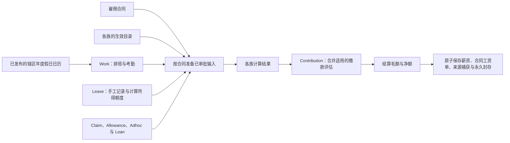

# HR 与薪资


## 这个工作区是什么

本模板是一个多国 HR 与薪资结算工作区。它把经审批的雇佣合同、考勤、休假与薪资事件转化为可审计的薪资结果：按生效日期的雇佣条款、排班日分类、法定加班与缴款、还款计划、草稿删除后重建、已发薪期锁定以及与来源关联的工资单行。各族的目录版本定义计算规则与缴款处理，每一次发薪都能追溯到产生它的已审批输入。

## 心智模型

薪资通过 Work、Leave、Claim、Allowance、Adhoc、Loan 与 Contribution 七个业务族准备输入并计算结果。每个族拥有自己的目录、业务记录和计算；目录中的规则就是政策。薪资核心组合标准结果、结算并原子保存工资单与来源捕获，不直接处理兑现或结转等具体类别。



- **Work** 计算工资、加班与未解释缺勤；**Leave** 记录休假、手工兑现、结转、调整和冲销。额度按合同、生效目录及日期计算，不建立年度额度账户或定期入账台账。兑现使用已审批的天数和金额；离职与年度切换不自动创建兑现、结转或付款。
- **Claim、Allowance、Payment** 提供已审批的金额记录。奖金、通知期付款、离职补偿及更正使用 Payment 的目录和申请；更正通过原族记录的 `as_adjustment_entry` 表达。**Loan** 管理协议与还款计划；未收回金额由到期金额减已支付捕获推导。
- **Contribution** 根据各族结果声明的处理方式计算缴款。同一人、同一实体与同一评估期间的多份合同工资单先合并评估，再按确定性规则分配到各合同；重新入职不会清除适用的年度累计。
- **`payroll_runs`、`payslips` 与 `payslip_adjustments`** 保存一次公司—期间结算、每份合同的结果和指向来源捕获的调整。每个公司每期只允许一次常规薪资；草稿可删除后重建，已付款结果不可修改。迟批项目与更正在后续常规期间结算，不提供临时或额外薪资运行。

`employments` 表示雇佣合同。每个员工事件和工资单都必须关联合同。同一员工档案在同一实体的合同服务日期不得重叠，但可同时在其他实体持有合同。首次关联永久封存合同；离职以独立、不可变的事实记录，再入职建立新合同并重新计算额度，旧记录和余额保留在旧合同。

`companies` 选择 `jurisdiction_settings` 谱系；各族目录随设置版本封存。`jurisdiction_holidays` 每个假期一行，按辖区逐条发布，不属于员工、工作日事件或公司目录版本。已发布的假期自此用于排班、休假和薪资；未发布的视为不存在。薪资在运行时读取该辖区已发布的假期并记录在运行上；已完成的运行不再改变。被工作日或薪资运行读取过的假期即冻结，不能修改或删除。

两条不变量塑造了一切：

- **加班、缴款、毛额与净额是计算出来的，从不存储或播种。** 运行根据输入记录推导它们，并与独立提供的来源工作簿比对。
- **审批是门槛。** `approval_id` 是平台拥有的系统列，而不是业务状态。`approval_id IS NULL` 表示已提交且未被审批请求锁定的记录。被暂存的新建申请尚无业务记录；薪资只读取已提交、未锁定的输入。

## 工作区包含什么

### 应用

**`hr_employee`** —— 员工自助服务。员工查看自己的档案、公司与下一个发薪日，可以记录考勤、发起休假申请与报销（各自进入审批流），并查看自己的贷款协议与工资单。没有有效雇佣的人会被告知原因；有多份雇佣的人选择页面以哪份为范围。

**`hr_controller`**（组）—— HR 操作界面。法律实体在**实体**页选择，并由其他页面继承。

| 应用            | 用户在其中做什么                                                                                                 |
| --------------- | ---------------------------------------------------------------------------------------------------------------- |
| **实体**        | 选择所有其他 HR 控制器页面使用的法律实体                                                                         |
| **人员**        | 劳动力：员工档案、雇佣、按生效日期的条款、法定事实，以及劳动力结构图                                             |
| **事件**        | 按 Work、Leave、Claim、Allowance、Payment 与 Loan 查看和处理合同记录；HR 手工提交兑现、结转、调整和冲销          |
| **薪资核算**    | 创建常规期间、复核结果、标记已付款，导出银行文件、工资单 PDF 与报告工作簿；草稿可删除后重建                      |
| **设置 → 目录** | 在管辖地设置谱系中查看各族定义，封存版本及其目录只读；金额类目录行以合同条款与职级上的条件规定谁可申请、上限多少 |
| **设置 → 假日** | 配置辖区来源、导入和复核年度日期，独立发布日历                                                                   |
| **考勤机**      | 通过人脸识别或人工输入打卡并登记人脸；设备账户只看到此无外壳页面                                                 |

### 策略

- **`employee`** —— 员工自助服务及本人范围内须审批的考勤、报销与休假创建。
- **`supervisor`** —— 查看团队并复核、记录其考勤与休假。
- **`manager`** —— 查看公司人员运营并管理直属团队的考勤与休假。
- **`hr_controller`** —— 管理人员、排班、申请、贷款与条目；薪资可见但不可结算。
- **`hr_manager`** —— HR 管理权限加创建、运行与删除薪资运行。
- **`senior_management`** —— 完整人员运营视图加薪资运行权限。
- **`holiday_import_automation`**：读取辖区来源并保存年度导入草稿，不能发布日历。
- **`statutory_drift_automation`**：仅供系统读取设置版本及其法定行，并一次提议一个草稿版本；从不封存、编辑或删除。
- **`kiosk`** —— 仅供考勤机打卡、人脸登记及其必要的受限读取。

策略按 `hr_controller` 应用*组*命名而非逐页命名，因此新增控制器页面无需改动任何角色声明。

### 实时分析

控制器的休假、薪资组件与考勤图表直接通过 `client.db` 读取相关集合。这些查询由工作区同步引擎自动保持最新；组件在本地派生有界的五年热力图与八周考勤趋势，无需轮询、手动刷新或查询函数。

### 代理上下文

`src/+agents.md` 为网页与 envoy 对话提供共享的 HR/薪资上下文：如实引用工具结果、集合含义、金额与日期规则，以及法定建议边界。它本身不授予任何权限；网页代理仍完全受登录人员的策略约束。

### 自动化、集成与种子数据

两个自动化，各有自己的策略，都可在「自动化」中手动启动：

- **`statutory_drift`**（每月）：对每个谱系当前生效的版本，通过运行时的页面读取器读取该版本在 `research_urls` 中命名的官方页面，向模型询问每个法定行的官方现状（方案费率档、法定休假权益、法定薪资项目的缴款处理），与已封存的行比对；有差异时把该版本克隆为草稿，草稿携带变更后的行与复核清单（`research_notes`）。「设置」把该草稿标为「法定漂移提议」，HR 复核后由 HR 经理封存。它从不封存、从不触碰已封存版本，每个谱系同时只提议一个草稿；没有研究网址的版本不会被研究。每个无法读取的官方页面都连同原因记录在运行结果和草稿的复核清单上；所有页面都无法读取的谱系不会产生草稿，并在结果中按名称列出。
- **`holiday_import`**（每年 10 月 1 日）：通过 Google Calendar API 完整读取下一年的辖区假日来源，保存待复核的年度草稿。可手工指定辖区和年份刷新。重复导入保留已作决定；来源变更与取消须复核，不能覆盖已封存日期。HR 确认实际观察日期和全年完整性后发布。没有自动兑现、结转或年度额度入账任务。

假日导入使用受管 Google Calendar 连接，需要 `GOOGLE_CALENDAR_API_KEY`，并为各辖区配置日历标识与时区。年度日历独立于目录版本；计算规则变更仍通过新的管辖地设置版本处理。租户**不存在 `+seed.ts` 编译器角色**；薪资输入遵循 [`docs/data.md`](docs/data.md) 的种子与对账契约。

## 运营边界

只播种薪资输入。绝不播种薪资运行、工资单、已计算的加班金额、法定缴款、毛额、净额或来源激励加班结果。运行必须根据输入记录计算这些值，然后与独立提供的来源工作簿比对。这条规则正是引擎在无法产生某个数字时拒绝运行而非近似处理的原因，也是已发薪期不可变的原因——更正永远是后续草稿中的新审批事件。

## 底层原理

### 源码布局

编译器知道的工作区一切都在 `src/` 中：

```text
src/
├── apps/                     # 每个应用一个 +<app>.svelte；hr_controller/+group.ts 归属组
├── collections/              # +model.ts、+hooks.ts、+pipelines.ts、+representation.svelte
│   └── payroll_runs/lib/     # 结算引擎（阶段、加班、覆盖、导出）
├── datatypes/                # 结构化业务值与渲染器
├── access/                   # +teams.ts、匿名限流与策略
├── i18n/                     # messages.en.json / messages.zh.json（相同的键集）
├── automations/              # 法定漂移检查与年度假日导入
├── lib/                      # 各族计算、排班、日历、显示格式化与策略授权
└── +agents.md
```

- **模型**只描述存储；呈现属于应用与 representation。`src/collections/+relationship.ts` 拥有关系图——外键由它推导，绝不在模型中声明。
- **钩子**负责校验与推导。薪资创建钩子解析运行的考勤窗口、发薪日与配置哈希；排班钩子强制可发布性；还款钩子让分期计划与本金精确对账。
- **流水线**（`work_days` 与 `payroll_runs` 上的 `+pipelines.ts`）塑造工作簿导入/导出：排班与考勤导入器把来源工作簿映射为行，薪资导出器生成应用提供的银行文件、工资单 PDF 与报告工作簿。
- **Representation** 决定每个集合的创建/展示/编辑。`payroll_runs` 与 `payslips` 拒绝手工创建输出；工资单由引擎写出，绝不手工生成。
- **i18n** —— 英文与中文目录使用相同的键集，按语言环境的侧边栏标签来自目录。

`src/lib/payroll/families.ts` 协调各族输入准备、计算及合并的 Contribution 评估。Work、金额申请、Loan 和 Contribution 在该目录中各有所属模块；Leave 的薪资边界是 `src/lib/leave/payroll.ts`。薪资核心负责共享上下文、结算和输出图，不直接查询各族所属的业务表或分派计算定义。

### 文档

- [`docs/architecture.md`](docs/architecture.md) —— 各族边界、合同范围、截算与期间、加班控制、合并缴款、手工 Leave、年度假日、来源捕获与封存，以及已有计算规则与实现限制。
- [`docs/data.md`](docs/data.md) —— 原始来源 → 清洗来源 → 种子数据的契约、防止派生输出回流到输入的检查，以及如何把独立来源工作簿与生成的工作簿对账。
- [`docs/leave.md`](docs/leave.md) —— 休假目录、按合同和日期计算的额度、手工兑现与结转、审批预留、冲销及薪资捕获。

## 验证

各族的源码边界已实现；组合变更的构件同步、类型检查、完整测试及浏览器验证仍需按集成结果确认。源码修改不代表已部署到租户。模板包含算术、导出、行为及浏览器检查：

```bash
pnpm sync     # 重新生成 .norbital（切勿手工编辑生成输出）
pnpm lint     # prettier + svelte-check
pnpm test     # 同步、静态诊断、算术、导出及行为检查
pnpm test:e2e # 独立 Bolt 自托管环境中的浏览器检查
node scripts/verify-payroll-arithmetic.mjs   # 长篇算术验收运行
node scripts/verify-fixture-shapes.mjs       # 针对真实 API 形状审计该运行的测试夹具
```

`node scripts/generate-import-templates.mjs` 把排班与考勤导入模板写到 `~/Desktop`——一个法人实体 × 一个月、一人一行、一日一列，并带简短 Settings 表。长表（一人一天一行）仍可导入；发给操作人员的是这两种月网格。`Read me first` 表只陈述读取器实际执行的规则。

算术运行过去是按需执行、独立于 `pnpm test` 之外的。现在它已纳入 `pnpm test`，因为正是不在其中的状态让一个夹具在无人察觉中腐坏，直到它上面的断言不再有意义。没人运行的检查就是不存在的检查。

`verify-fixture-shapes.mjs` 会在插桩下重跑算术脚本，并报告两件事：引擎读取过但夹具从未提供的字段，以及 `src/` 中任何地方都不存在的夹具键。它存在是因为一个夹具曾描述过 API 并不具备的响应形状——在臆造的 `componentType` 上加了 `nature`——使一个通过的断言证明不了任何事。已删除的集合会残留在陈旧构建产物（`.norbital/dist/`）中，因此针对其中之一编写的夹具看似正确实则不然；请改查 `src/collections/<name>/+model.ts`。在信任一次绿色运行前先读该脚本的头部注释：它对自己看不到的东西是诚实的，而且除非完成其中描述的变更检查，否则绿色运行说明不了任何事。

机密来源对账在宿主端为可选启用；参见
[`docs/data.md`](docs/data.md#reconciliation-method)。

## 修改模板

这是一个 Bolt 租户工作区：Bolt 文件系统编译器只从 `src/` 推导出 `.norbital/` 下的注册表、工作区、客户端与本地类型。工作流：

```bash
pnpm sync     # 编辑 src/ 下的任何内容之后——重新生成 .norbital（已提交的迁移保持不变）
pnpm lint     # 对整个工作区运行 prettier + svelte-check
pnpm test     # 验证行为
```

- **模型** —— 编辑 `+model.ts` 后运行 `pnpm sync` 生成类型与 `.norbital/artifact/bundle.mjs`。使用 `pnpm exec bolt migrate --name <name>` 生成迁移，审阅生成历史，不手工修改或格式化已提交的迁移。
- **种子数据** —— 公开测试夹具在 `tests/fixtures/seed/`。机密来源对账数据不是测试夹具；种子不包含计算所得的薪资输出。播种不能原地演进已部署的租户。
- **发布** —— 模板在自己的 `package.json` 与锁文件中固定首方包版本。从 realm 根目录运行 `pnpm run env -- link` 可叠加本地包构建供验证。发布与租户配置属于独立流程；既有租户只通过其发布和配置流程消费模板变更，修改本地源码不会更新正在运行的租户。
