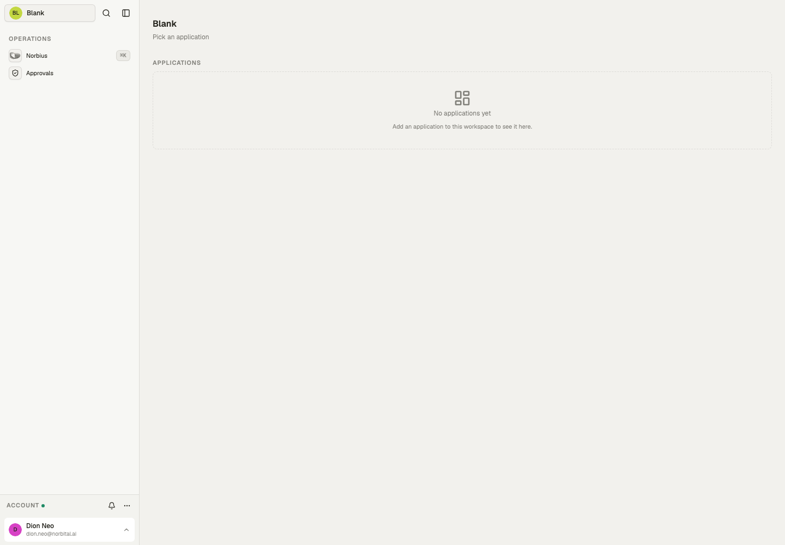

# Blank — User guide

Blank is an empty workspace. It has no apps and no automations, only the shell every Norbital
workspace shares and one starter collection, **Notes**. It is for someone who wants to build their
own workspace from scratch, with Norbius doing the building.

- The full workspace shell from day one: sign-in, people and teams, approvals, notifications, audit
  and settings.
- **Norbius**, the workspace assistant, set up to build the workspace with you: collections, apps,
  automations and access, one piece at a time.
- Changes Norbius makes are private drafts until a person previews and publishes them.
- One starter collection, **Notes** (a title and a body). It is read-only and shows on no page; replace
  it or remove it once your first real collection exists.
- No sample data.

Screens in this guide show the workspace as it starts: empty.

## Who uses what

| Person                                | Team | App                                          |
| ------------------------------------- | ---- | -------------------------------------------- |
| Whoever sets the workspace up (admin) | —    | **Norbius**, **Approvals** and **Settings**  |
| Everyone else                         | —    | Nothing yet: add teams and apps as you build |

Blank declares no teams. The person the workspace was created for is its administrator.

## Home

The home page lists the workspace's applications. On Blank it reads **No applications yet**; each
app you add appears here as a card.

The sidebar holds the shell:

- **Norbius** (⌘K) opens the assistant.
- **Approvals** lists what waits on you.
- The search button at the top; what you type there can also go straight to Norbius (**Ask
  Norbius**).
- Under **Account**: the bell for notifications, **…** for settings, and your name for language,
  appearance, **Preview as a team** and **Sign out**.

## Norbius

Start here. Tell Norbius what the workspace is for, for example "we run a small cleaning company;
we need bookings and a schedule". Norbius:

- first says which collections and which app pages it intends to create, then makes the edits;
- prefers a small first cut that works over a large design that does not;
- asks one focused question when a request is ambiguous, rather than guessing a whole domain;
- checks that the workspace still builds after each change, and says so when it cannot make a change
  work, leaving the workspace as it was.

It also explains what exists in the workspace, answers questions and drafts text. Type **/plan** to
work through an approach before anything is built.

## Approvals

Anything that needs a person's approval lands in the **Approvals** list of the **Inbox**. On a fresh Blank workspace, **Nothing waits on
you.**

## Settings

The **…** menu under **Account** opens the settings pages: **People**, **Organization**, **Audit**,
**Automations**, and under **System**, **Channels**, **Integrations** and **Environment secrets**.

**People** lists the members (at first, only you), the teams, invitations and team assignments.
Invite colleagues here once there is something for them to use.

**Organization** shows the workspace name, locale (`en-SG`) and time zone (`Asia/Singapore`). These
are set by the workspace itself; ask Norbius to change them.

**Audit** records every change and who made it. **Automations** lists every automation run; on
Blank there are none yet.

## How it works

- **The Notes collection** holds a title and an optional body. Nobody can add or change a note, and
  no page shows it; it is there so the workspace has one collection to start from.
- **Nothing runs on its own.** There are no automations, no channels and no scheduled work until you
  add them.
- **Building is drafting.** Norbius writes changes as private drafts. A person previews a draft and
  publishes it; only then does the workspace change for everyone.

## Connections

Blank declares no channels, integrations or environment secrets, so **Channels**, **Integrations**
and **Environment secrets** start empty. When you ask Norbius for something that needs one (email or
WhatsApp messages, an outside service, an API key), it adds the declaration, and the setting then
appears on those pages for you to fill in.

**Channels** are connected by you, with your own accounts: open the channel in **Settings →
Channels** and follow its **Connection** tab. An email channel is your own mailbox over IMAP + SMTP,
with a password or by signing in with Microsoft or Google through your own OAuth app. A WhatsApp
channel connects through **Official (Twilio)** or **Unofficial (WhatsApp Web)**.

**Integrations → API keys** lets an administrator issue a key so another system can reach this
workspace.

<!-- current-screenshots:start -->

## Current screenshots

Captured 2 October 2026 from the standalone template with sample data.

### Blank

<!-- current-screenshots:end -->
