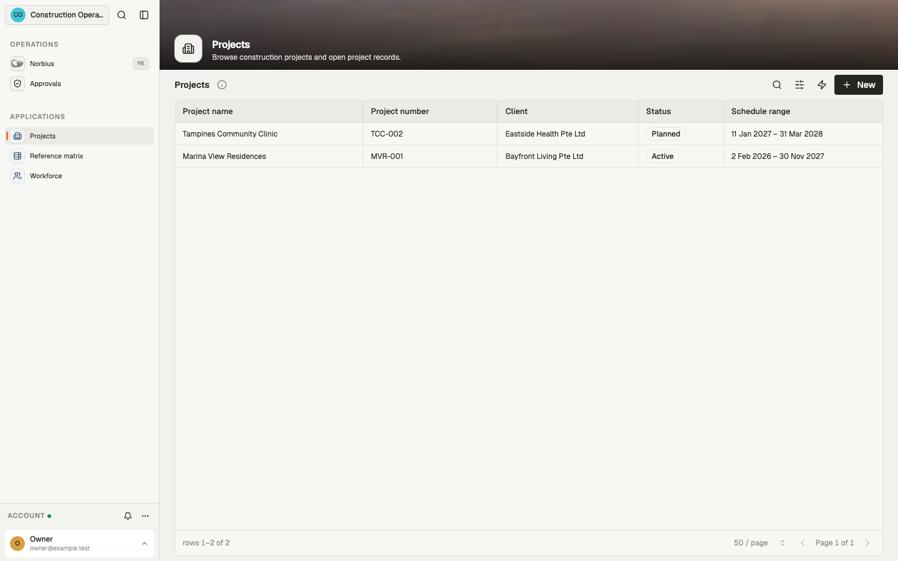
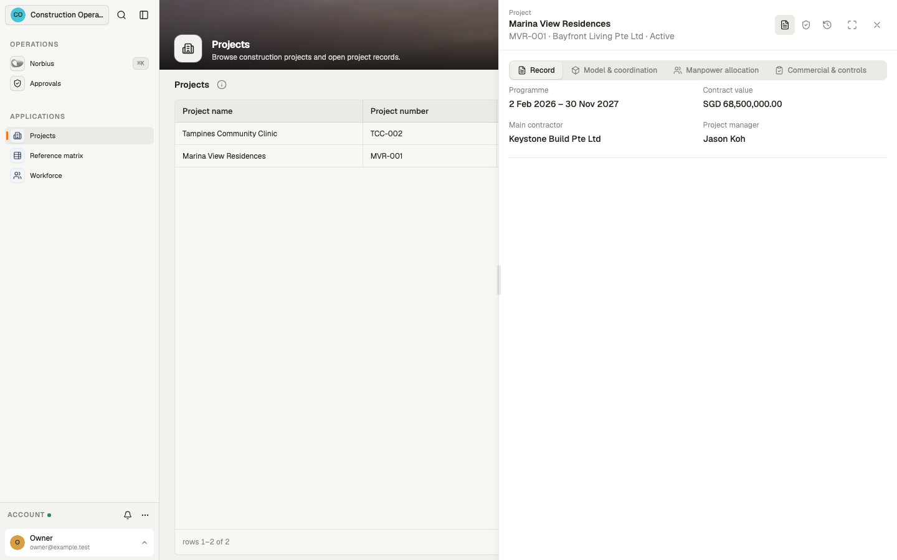
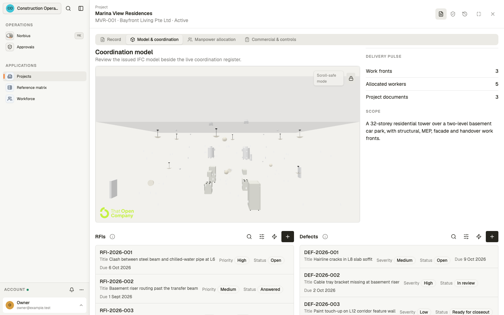
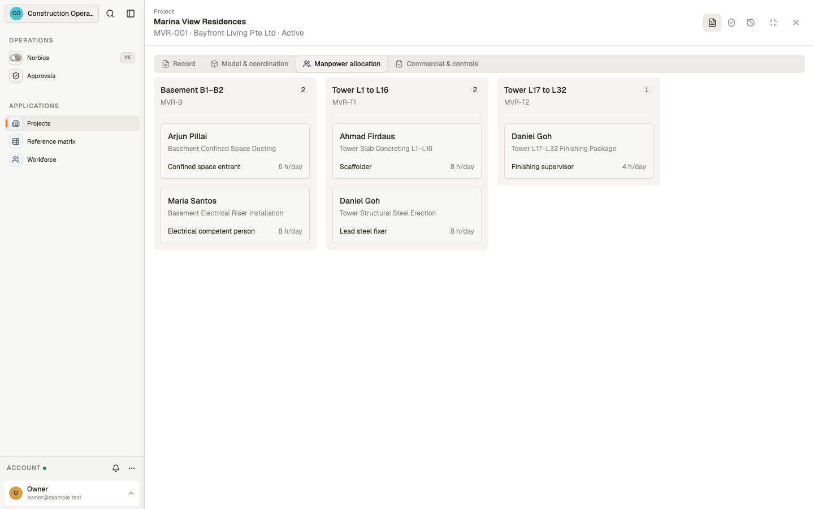
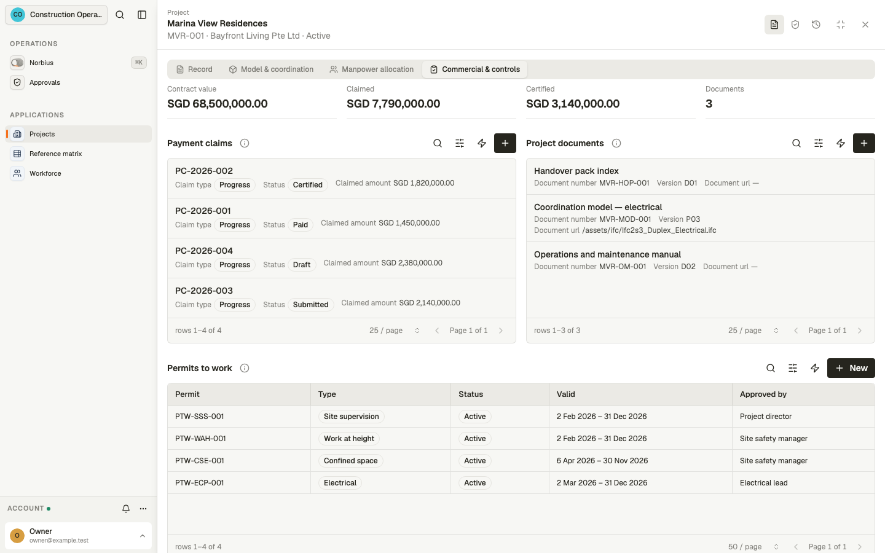
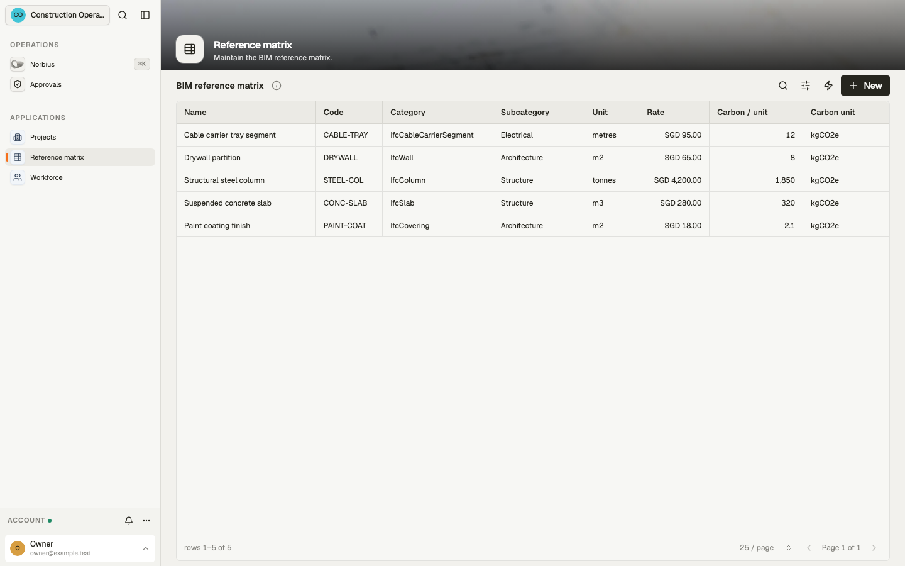
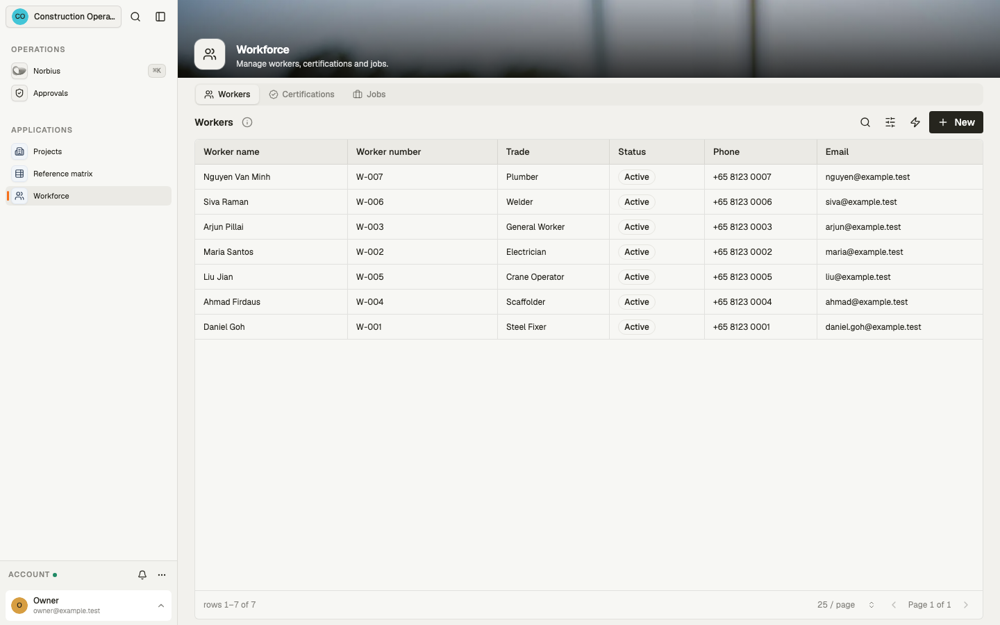
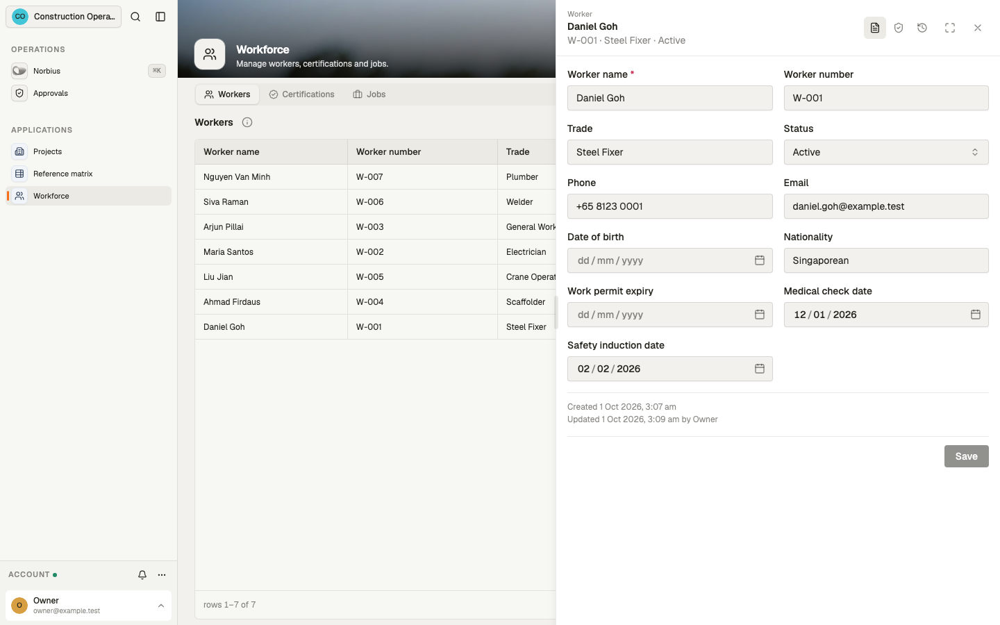
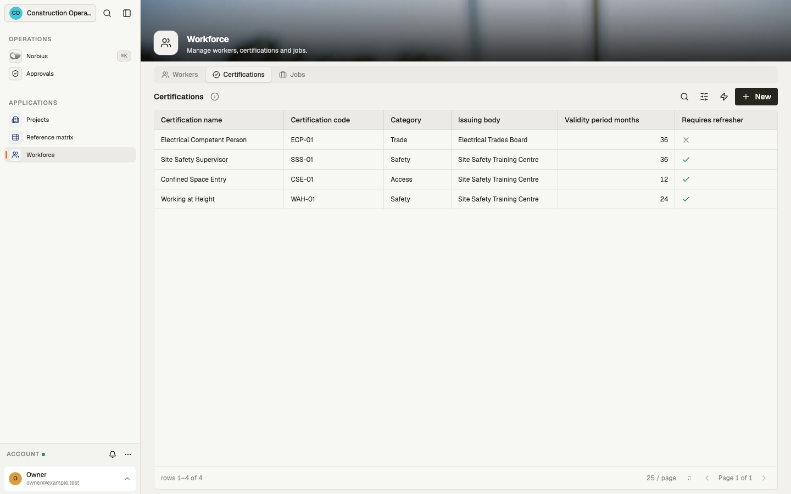
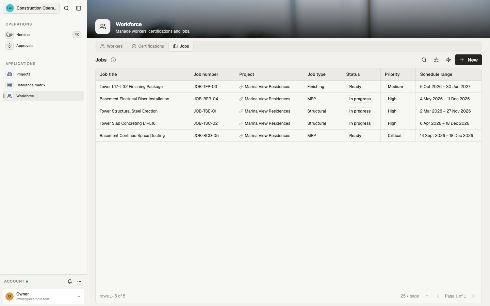

# Construction — User guide

Construction runs project delivery for a main contractor: projects and their work fronts, the
workforce and its permits, RFIs, defects, payment claims, handover documents and a BIM reference
matrix. It is the operations record and the safety check for a site. It does not replace an ERP, a
BIM authoring tool or the authority that issues permits.

- Every project opens on one record: its coordination model beside the RFI and defect registers,
  manpower by work front, and the commercial position.
- A worker can be put on a job only when a permit to work, active and in force today, covers every
  certification the work needs. The check runs on every assignment, however it is made.
- Contract value, claimed and certified amounts sit side by side, per currency, and are never mixed.
- The workforce library keeps workers, certification types and jobs in one place.
- The BIM reference matrix holds rates and embodied carbon per unit for cost and carbon baselines.
- Four morning digests collect the permits, defects, RFIs and claims that need a look.

Screens in this guide use sample data.

## Who uses what

| Person                          | Team                              | App                                                                   |
| ------------------------------- | --------------------------------- | --------------------------------------------------------------------- |
| Project manager, site team      | `Project Delivery`                | **Projects**                                                          |
| Safety and workforce officer    | `Workforce Administrators`        | **Workforce**                                                         |
| Quantity surveyor, BIM engineer | `Reference Matrix Administrators` | **Reference matrix**                                                  |
| Construction lead               | `Construction Administrators`     | All three apps                                                        |
| Anyone above                    | —                                 | **Norbius**, the assistant, within what their own access lets them do |

Every team can read the projects, workforce and reference records; the team decides which apps it
opens. Creating
and changing records is for workspace administrators: the teams' own access is read-only.

A **project** holds its **site locations** (work fronts), **jobs** (work packages), **permits to
work**, **RFIs**, **defects**, **payment claims** and **documents**. **Workers**, **certification
types** and the **BIM reference matrix** sit beside the projects and feed them.

## Projects app

### Projects

Every project with its number, client, status and programme. **New** opens a project form: the
**Project** section (name, number, client, main contractor, status, type, project manager) and
**Schedule and value** (programme, currency, contract value) are open; **Address** and
**Description** start collapsed. Open a row for the project record.

### Project record

The header gives the project number, client and status. The **Record** tab shows the programme,
the contract value, the main contractor and the project manager. Three more tabs hold the delivery
detail.

**Model & coordination.** The coordination model, the project's issued IFC model, opens in a 3D
viewer. It shows when one of the project's documents is an IFC model (or links to an `.ifc` file);
until then the panel asks you to link one. **Scroll-safe mode** keeps the page scrolling past the
viewer; unlock it with the padlock to orbit and zoom. Select an element to see its properties. Beside it, **Delivery pulse** counts the work fronts, allocated
workers and live documents, over the project's scope. Below are the project's **RFIs** (number,
title, priority, status, due date) and **Defects** (number, title, severity, status, due date), each
with **+** to add one.

**Manpower allocation.** One lane per work front, with its code and head count. Each card is a
worker on a job there: the worker, the work package, their role and planned hours a day. A project
with no site locations asks for one first.

**Commercial & controls.**

- **Contract value**, total **Claimed** and total **Certified**, one figure per currency, and the
  count of live documents.
- **Payment claims**: number, type (**Progress**, **Variation**, **Final**), status (**Draft**,
  **Submitted**, **Certified**, **Paid**, **Rejected**) and claimed amount.
- **Project documents**: those in draft, in review or issued. Superseded and archived ones drop off.
- **Permits to work** in force today. A permit whose validity has ended is not listed, whatever its
  status says.

## Reference matrix

The BIM item master sheet: each reference's name and code, IFC category and subcategory, unit of
measure, rate, and embodied carbon per unit with its unit. A reference can also carry a
specification, a BIM GUID and its data source. Jobs point at a reference, so a work package can be
costed and its carbon estimated from the quantities. **New** adds a reference.

## Workforce

### Workers

The worker roster: name, number, trade, status (**Active**, **Inactive**, **Suspended**), phone and email.

A worker's record opens on the worker and their **Compliance** dates (work permit expiry, medical
check, safety induction). **Contact** (phone, email) and **Personal details** (date of birth,
nationality) start collapsed, each showing its first value.

### Certifications

The certification library: name, code, category, issuing body, how many months it stays valid and
whether a refresher is required.

### Jobs

Every job: title, number, project, type, status (**Planned**, **Ready**, **In progress**, **Completed**,
**Blocked**, **Cancelled**), priority and schedule. A job's record adds its site location, BIM reference, budget
and description.

## How it works

**Assigning a worker.** An assignment puts one worker on a job at a site location. It is accepted
only when all of these hold:

1. at least one job at that site location names the certifications it requires (a job that
   requires nothing qualifies nobody);
2. the worker is on one or more permits to work whose status is **active** and whose validity
   covers today;
3. between them, those permits cover every certification that job requires.

Otherwise it is refused: "Worker must satisfy at least one site-location job requirement with all
required active certifications before assignment." The same check runs again when an assignment
moves to another worker or site location. Changing only its job, role, hours or dates does not re-check.
A lapsed permit, or one marked expiring soon, suspended or closed, no longer qualifies anyone.

**Permits.** A permit has a number, a type (work at height, site supervision, electrical, confined
space, hot work, lifting, excavation), a status, a validity range and who approved it. The workers
it covers and the certifications it evidences are lists of their own: those lists, not the
single worker on the permit form, are what the assignment check reads. There is no screen for
the lists, for assignments or for a job's required certifications. Record them through Norbius
(for example "add Maria Santos and Arjun Pillai to PTW-CSE-001, covering Confined Space Entry"),
which follows the same rules.

**Claims.** Each claim holds one currency, a claimed amount (what was asked for) and a certified
amount (what was agreed). The project totals add claims of the same currency only.

**Morning digests.** Four digests run every day at 06:00, Singapore time. Each takes up to 25
records and publishes them as a JSON extract for review. They send no messages and change
nothing.

| Digest                        | Lists                                                       |
| ----------------------------- | ----------------------------------------------------------- |
| Permit expiry watch           | Permits active or expiring soon, oldest request first       |
| Defect closeout digest        | Defects open, in review or ready for closeout, earliest due |
| RFI follow-up watch           | Open RFIs, earliest due                                     |
| Payment claim readiness watch | Draft and submitted claims, most recently changed first     |

Norbius can start a digest on demand.

**Norbius.** The assistant answers questions across projects, sites, jobs and workers, and drafts
site reports, RFI chases and claim summaries. It records changes only for someone whose access
allows writing, it keeps claimed and certified amounts apart, and it quotes permit and compliance
dates exactly.

The workspace runs on Singapore time and is available in English and Chinese.

## Connections

This workspace needs no connections or secrets. It sends no messages of its own: the digests are
extracts for review, and a deployment that wants alerts must add a messaging channel. A channel,
once added, is connected by the business with its own account in **Settings → Channels**: an email
channel is your own mailbox over IMAP + SMTP (a password, or Microsoft or Google sign-in through
your own OAuth app); a WhatsApp channel is **Official (Twilio)** or **Unofficial (WhatsApp Web)**. Norbius needs
the host's AI to be configured. The sample coordination model is an IFC file shipped with the
template. A project's own model is linked as a document of type IFC model.
