# CRM — User guide

CRM runs both sides of a B2B trading desk: selling to customer companies and buying from suppliers.
Customers, products and suppliers come from the company's own ERP or accounting system; the desk
quotes, confirms, bills and buys against them, and hands confirmed documents back.

- **Sales** qualifies accounts and contacts, quotes from the product catalogue, moves each quote
  along a pipeline to won and confirmed, then bills it, raises its contract and records payment.
- **Purchasing** raises purchase orders to suppliers, receives the goods, books the supplier's
  invoice against what was ordered and received, and records payment.
- Every document follows fixed steps. Only a draft can be edited; a confirmed, issued or cancelled
  document is frozen, so its figures can be handed to the accounting system.
- Lines keep a copy of the product's code, name, unit and price as they were, so a later catalogue
  change never rewrites an old document.
- Sales never sees buy costs, and purchasing never sees quotes or sell prices, unless a person is on
  the team that holds both.
- A daily check lists the quotes that were sent and have passed their valid-until date.

Screens in this guide use sample data.

## Who uses what

| Person                   | Team                  | App                                          |
| ------------------------ | --------------------- | -------------------------------------------- |
| Sales representative     | `Sales`               | **Sales**                                    |
| Buyer / procurement      | `Procurement`         | **Purchasing**                               |
| Manager or administrator | `Sales & Procurement` | Both apps, the only team seeing price & cost |
| Customer                 | —                     | The sales desk on Telegram                   |

A sales representative sees and changes only the quotes, invoices and contracts they own, and only
those documents' lines. They can hand one over by naming another owner. Accounts and products are
shared; contacts and activities are shared too, and any rep can add a contact or close an activity.
Everyone on either desk can record payments.

In any table, click a document's number to open it. A document opens with its number in the header, the
party and status under it, and its lines on a **Lines** tab. A confirmed, issued or cancelled document opens
read-only.

## Sales

The account picker in the header scopes every tab to one customer. Until you pick one, the first
active account by name is shown. **Accounts** and **Products** list the whole book, not just the
picked account.

### Pipeline

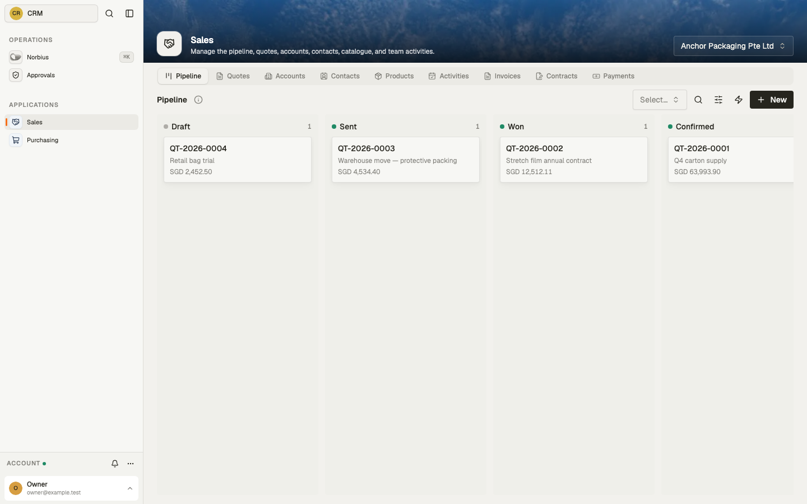

The account's quotes in lanes: **Draft**, **Sent**, **Won**, **Confirmed** and **Lost**. Each card
shows the quote number, title and total. Pick someone in the picker beside the search to see only
their quotes. **New** opens a quote; click a card to open it.

### Quotes

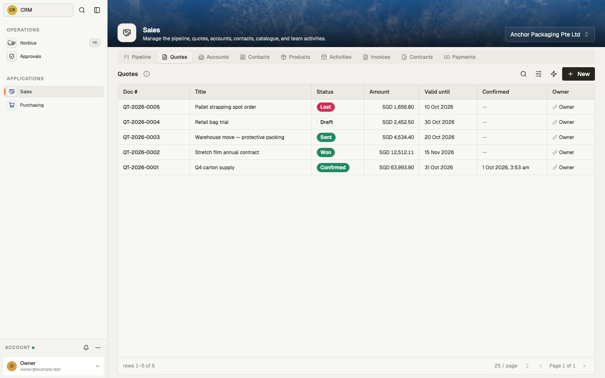

The same quotes as a table: number, title, status, amount (with its currency, `SGD 1,234.50`), valid until, when
confirmed and the owner.

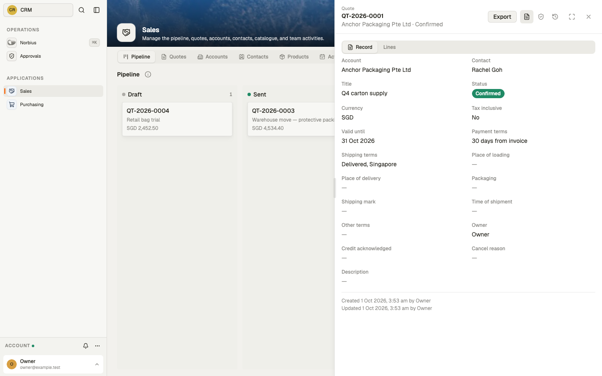

A quote carries the account and a contact (picked from that account's people), the currency and
whether prices include tax, and the valid-until date. The **Trade terms** section (payment, shipping,
place of loading and delivery, packaging, shipping mark, time of shipment and any other terms) and
**Notes** start collapsed, showing the payment terms and the first words of the notes. The currency
is the account's unless you choose another. Each quote is numbered `QT-<year>-<nnnn>` when it is
created.

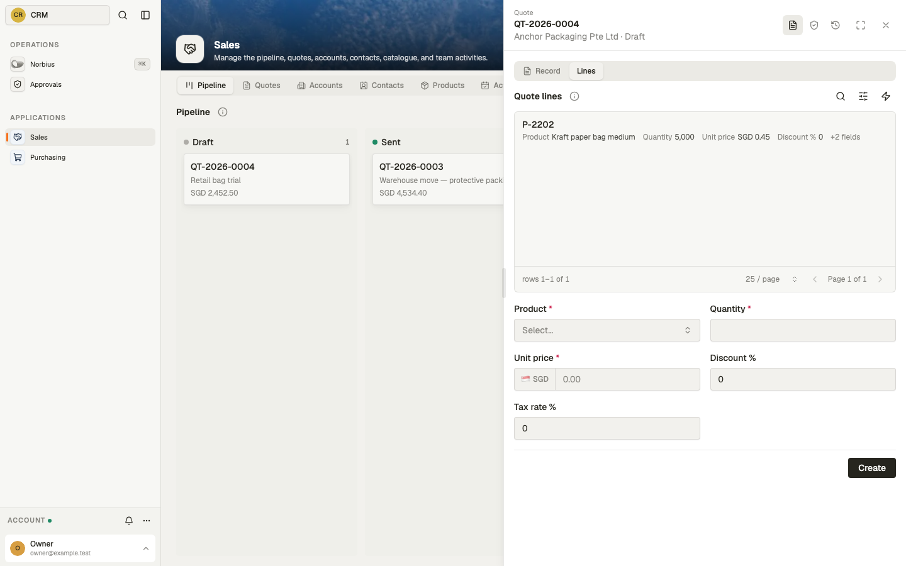

Add lines on a draft quote's **Lines** tab: pick a product and give the quantity. The product's
sell price and tax rate are filled in, and you can change them or add a discount. The product's
code, name and unit are copied. The line's net, tax and total are worked out for you, and the
quote's totals are the sum of its lines. Once a quote has lines, its currency and tax basis cannot
change; remove the lines first.

A confirmed quote has an **Export** button. It saves the quote and its lines as a file for the
accounting system.

### Accounts

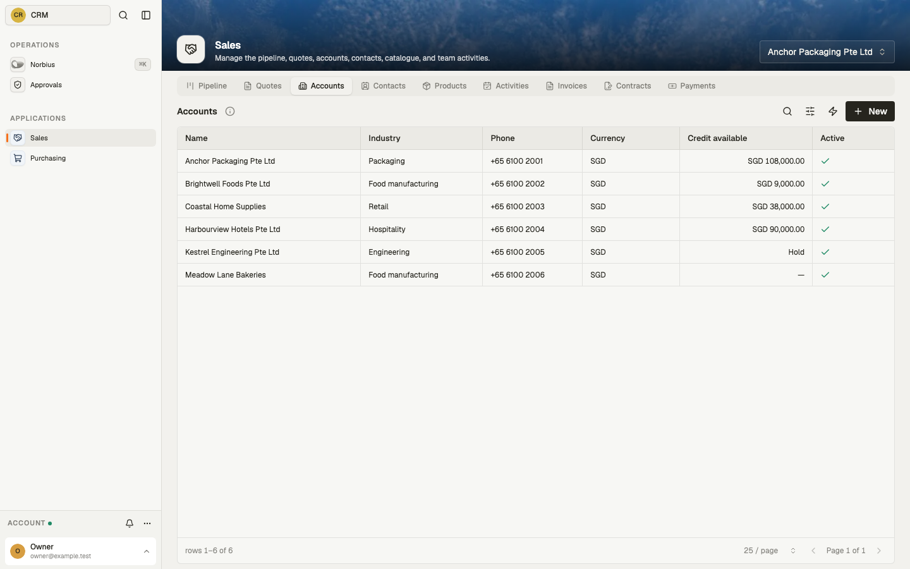

Customer companies from the ERP: name, industry, phone, currency and **Credit available** (credit
limit less credit used, or **Hold** when the account is on credit hold). Only active accounts are
listed.

### Contacts

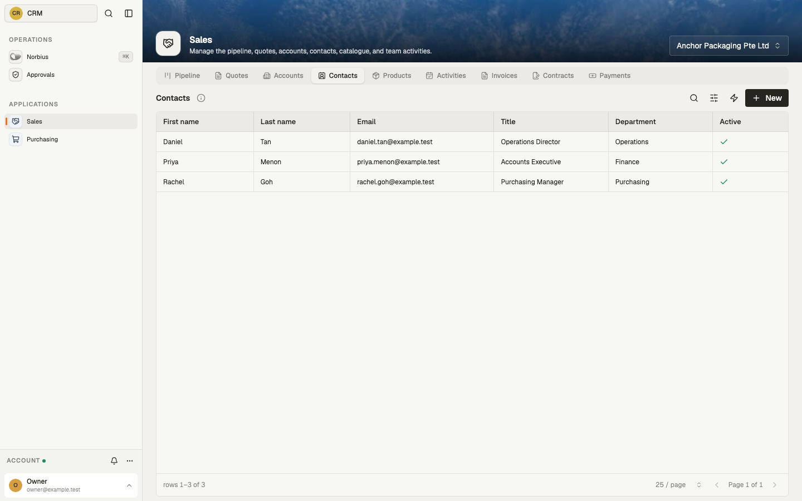

The people at the picked account: name, email, job title and department.

### Products

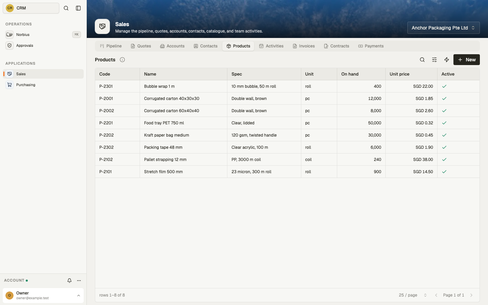

The catalogue from the ERP: code, name, specification, unit, quantity on hand and sell price in the
product's own currency (the workspace's, SGD, unless the ERP says otherwise). Only
active products are listed, and only they can be quoted. Buy costs are never kept here.

### Activities

Calls, meetings, emails, tasks and notes, each about the account or one of its quotes, with a due
date and when it was completed. A task entered without a due date is due today.

### Invoices

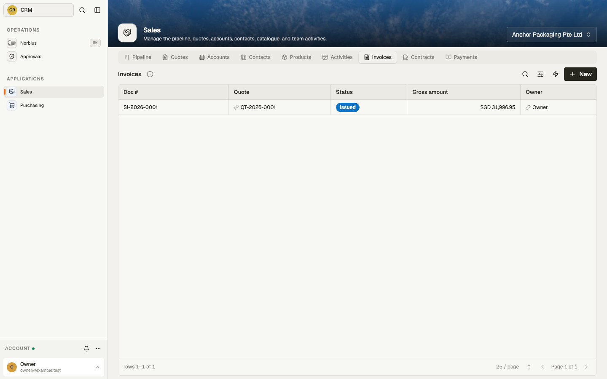

Invoices raised against the account's confirmed quotes, numbered `SI-<year>-<nnnn>`. Create one
against a confirmed quote, then add lines on its **Lines** tab, choosing which of that quote's lines
to bill and how much of each. A billed line keeps the quote line's price, discount and tax rate.
One quote can be billed over several invoices. Issue the invoice when it is ready.

### Contracts

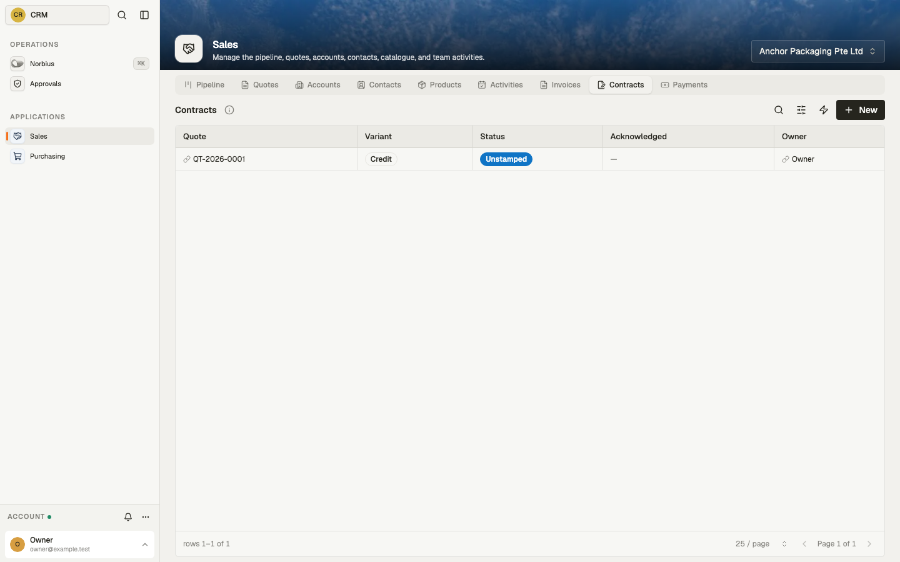

The contract for a confirmed quote, as an **Advance** or **Credit** variant. It moves from
**Unstamped** to **Counterparty stamped** (when the customer's stamped copy is uploaded) to
**Acknowledged**. A quote has one live contract at a time; to re-sign, void the current one with a
reason and raise a new one.

### Payments

Payments received against the account's confirmed quotes: the quote, amount (with its currency),
**Settled on** date and a reference. **New** records one.

## Purchasing

### Dashboard

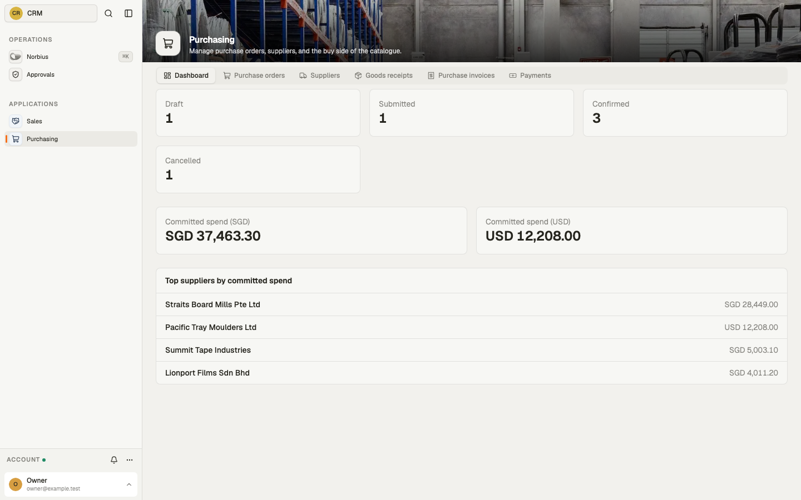

How many purchase orders are in each state (**Draft**, **Submitted**, **Confirmed**,
**Cancelled**); committed spend per currency, which counts submitted and confirmed orders; and the
top five suppliers by committed spend. It updates as orders change.

### Purchase orders

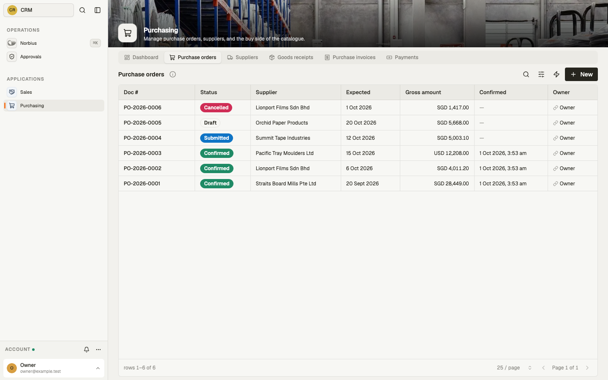

Every order: number (`PO-<year>-<nnnn>`), status, supplier, expected date, total (with its currency), when
confirmed and the owner. An order's **Lines** tab shows the quantity ordered, the quantity received
so far and the unit cost of each line.

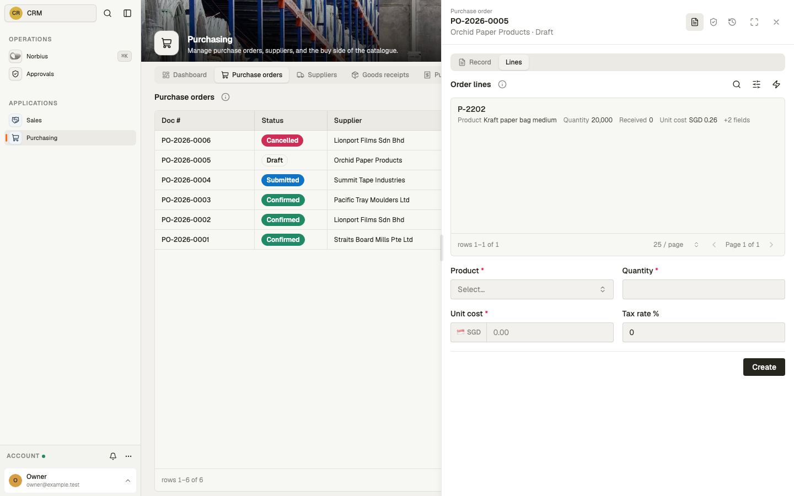

Create an order for an active supplier. It takes the supplier's code, name and currency, and expects
delivery 14 days out unless you give a date. Add lines on its **Lines** tab with product, quantity
and unit cost (the product's tax rate is filled in), then submit and confirm it. Once an order has
lines, its currency and tax basis cannot change. A confirmed order has an **Export** button, like a quote.

### Suppliers

The vendor list from the ERP: code, name, contact, category, currency and payment terms in days.
Only active suppliers are listed, and only they can be ordered from.

### Goods receipts

Each delivery against a confirmed order, numbered `GRN-<year>-<nnnn>`, with the date received
(today unless you give one) and who received it. Its **Lines** tab records how much of each of the
order's lines arrived. A receipt is written once and never edited.

### Purchase invoices

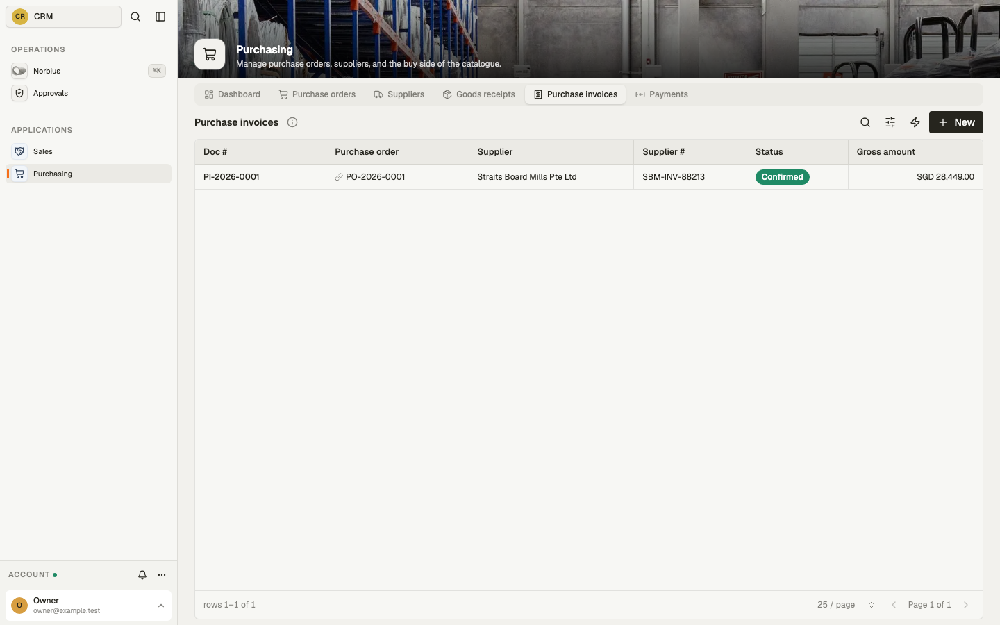

The supplier's invoice, booked against a confirmed order and numbered `PI-<year>-<nnnn>`, with the
supplier's own invoice number and date. On its **Lines** tab, add a line per order line invoiced
(it takes the order line's cost and tax rate), then confirm it.

### Payments

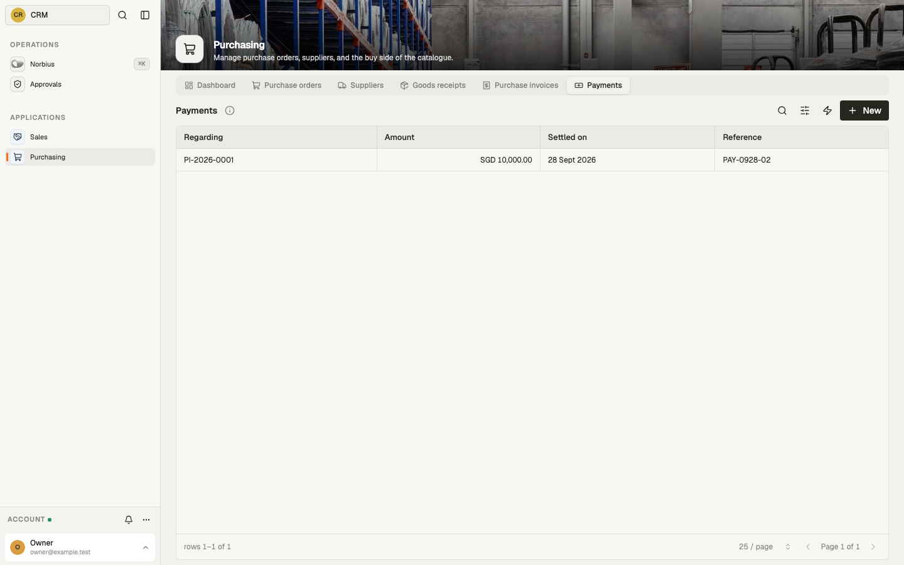

Payments made against confirmed purchase orders and purchase invoices: what the payment is
**Regarding**, the amount, **Settled on** date and a reference.

## How it works

**Quote steps.**

| From      | Can move to                   |
| --------- | ----------------------------- |
| Draft     | Sent, Won, Lost, Cancelled    |
| Sent      | Draft (a revision), Won, Lost |
| Won       | Confirmed, Lost, Cancelled    |
| Lost      | Won (a lost deal may reopen)  |
| Confirmed | — (final)                     |
| Cancelled | — (final)                     |

- Only a draft quote and its lines can be edited. Taking a sent quote back to draft raises its
  revision number and remembers the quote it revises.
- A quote can only be created for an active account.
- Confirming needs at least one line, an active account, and every line's product still active.
  The confirmation time is stamped.
- **Credit check.** When the account is on credit hold, or its credit used plus this quote would go
  over its limit, confirming is refused until **Credit acknowledged** is ticked. The warning never
  blocks outright; the acknowledgement stays on the quote's history.
- Cancelling needs a reason, and stamps the time.

**Other documents.**

| Document         | Steps                                                      | Rules                                                                                    |
| ---------------- | ---------------------------------------------------------- | ---------------------------------------------------------------------------------------- |
| Purchase order   | Draft → Submitted → Confirmed; or Cancelled                | Active supplier only. Submitting needs a line. After submitting, only confirm or cancel. |
| Sales invoice    | Draft → Issued; or Cancelled                               | Only against a confirmed quote. Issuing needs a line.                                    |
| Purchase invoice | Draft → Confirmed; or Cancelled                            | Only against a confirmed order. Confirming needs a line.                                 |
| Contract         | Unstamped → Counterparty stamped → Acknowledged; or Voided | Only for a confirmed quote. Stamping needs the stamped file; voiding needs a reason.     |
| Goods receipt    | none                                                       | Only against a confirmed order. Written once.                                            |

Every cancellation needs a reason. An invoice copies its account or supplier, currency and tax basis
from its quote or order.

**Quantities cannot run over.**

- Billed quantity across a quote's invoices cannot pass the quoted quantity.
- Received quantity across an order's receipts cannot pass the ordered quantity, and each receipt
  line must be more than zero.
- Invoiced quantity across an order's supplier invoices cannot pass the ordered quantity.
- Cancelled invoices do not count. A refusal states how much has been used so far.

**Three-way match.** For any purchase order, the desk can see per line what was ordered, received
and invoiced, and what is still to be received.

**Money.**

- A line's net, tax and total are worked out once, in the document's currency, rounded half-up to
  the currency's smallest unit (no decimals for JPY, three for KWD). A unit price or cost keeps four
  decimals.
- On a tax-inclusive document the tax is what remains of the total after the net.
- A document total is the sum of its rounded lines.
- Quantity must be above zero; price and cost cannot be negative; discount and tax rate must be
  between 0 and 100.

**Payments.** A payment is recorded only against a confirmed quote, purchase order or purchase
invoice, for an amount above zero, in that document's currency (taken from it if left blank).
Paid-to-date per document is added up from its payments; it is never stored.

**Document numbers** run per year in Singapore time and are never reused.

**Expired quotes.** Every morning at 06:00 Singapore time, an automation looks for sent quotes past
their valid-until date. The run's result lists the first 50, and every lapsed quote is attached as a
file. It changes nothing.

**Importing from the ERP.** Accounts, products and suppliers each take an import of the ERP's
export. Every record needs a code and a name, or the whole import is refused. A record whose code is
already on file is skipped, so importing the same export twice changes nothing.

**Exporting to the ERP.** A confirmed quote or purchase order exports as a fixed, versioned file of
the document and its lines. Only listed fields are written, so buy costs and other internal facts
never leave in a quote.

## Connections

| Setting                    | For                                                                  |
| -------------------------- | -------------------------------------------------------------------- |
| Telegram channel           | The customer-facing sales desk bot                                   |
| AI (host)                  | Norbius, the in-app assistant, and the sales desk's replies          |
| ERP import / export (file) | Accounts, products and suppliers in; confirmed quotes and orders out |

**Connecting the Telegram bot.** You connect the channel with your own bot in **Settings →
Channels**: open **Sales desk**, create a bot with Telegram's @BotFather, paste the bot token it
answers with into **Bot token** and press **Connect**. The workspace registers the bot's webhook
with Telegram itself. Skip the setup's group step: the sales desk ignores group messages, so there
is no reason to add the bot to a group. The **Messages** tab lists what went out on the channel, with each message's
delivery status.

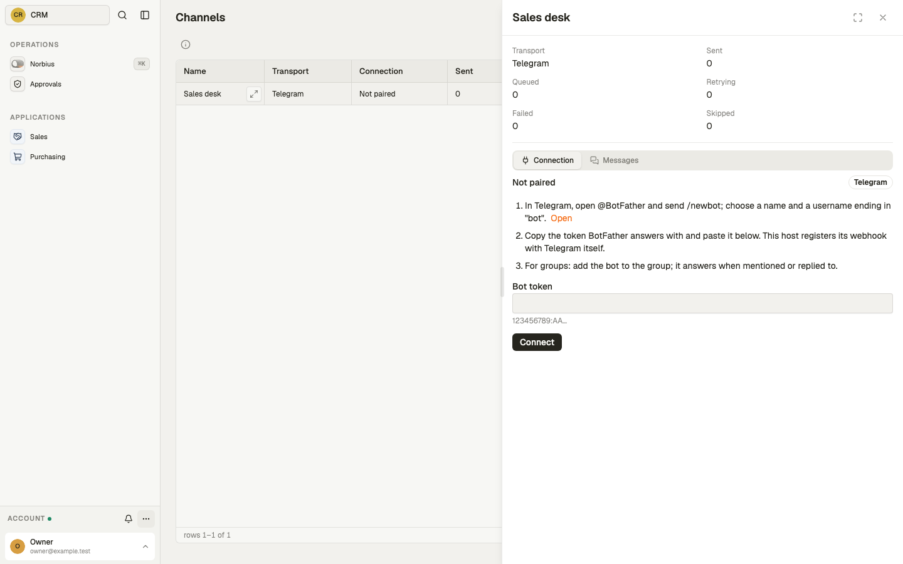

**Sales desk on Telegram.** Anyone can message the bot directly; group messages are ignored. It
answers questions about a customer's quotes and account with the Sales team's access only. A
staff member who has linked their Telegram gets their own access as well. Each sender can send 8
messages a minute, and the desk takes 300 a minute in total.

The workspace runs on Singapore time. There are no API keys to set.
