# Field Operations — User guide

Field Operations dispatches site jobs to contractors and checks that the work happened. It fits a
contractor business or a programme office that sends crews to homes, estates and workshops, and
needs proof of each visit.

- Controllers file work orders by hand or import a whole sheet, then dispatch each job by naming the
  contractor.
- A dispatch board shows one day's jobs by status beside a map of that day's sites.
- Contractors see only their own jobs, report progress and completion, and raise variations (scope
  changes). A variation waits for a controller's approval.
- Contractors can also report by WhatsApp: the assistant files their messages and photos on the
  right job.
- Every photo is checked for reuse, GPS position and editing. An AI review reads each job's photos
  and messages and flags the doubtful ones for a controller to resolve.

Screens in this guide use sample data.

## Who uses what

| Person                         | Team                           | App                                                       |
| ------------------------------ | ------------------------------ | --------------------------------------------------------- |
| Dispatcher, controller         | `Field Operations Controllers` | **Dispatch** and **Contractor Workspace**                 |
| Contractor                     | `Contractor`                   | **Contractor Workspace**, on a phone or desktop; WhatsApp |
| Contractor who also dispatches | `Contractor (Controller)`      | Both apps, as a controller. Cannot approve variations     |

A **site** is one address. It holds **job assignments**: one day's job each, with the work order
and the contractor who holds it. A job carries its **variations**, its **photo evidence** and its
**messages**.

## Dispatch

### Dispatch schedule

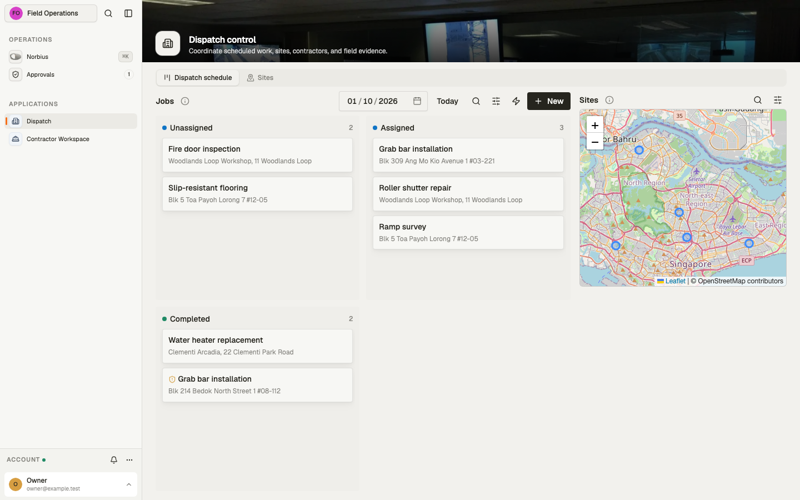

The chosen day's jobs in three lanes: **Unassigned**, **Assigned** and **Completed**. Pick the day
at the top, or press **Today**. The map on the right shows that day's sites.

- Each card shows the kind of work and the site. A shield marks a job with an open suspicion.
- **Drag a card to another lane** to change its status.
- **New** files a job. The form can first add a site by its address (**New site by address**).
- The actions menu (lightning icon) has:
  - **Suspicion review**: runs the evidence review now, for every job not yet checked.
  - **Import**: reads a work-order sheet (CSV or Excel) and files one job per row.

**Importing a sheet.** Columns: `site` (address or site code), `postal_code`, `scheduled_for`
(`YYYY-MM-DD`), `title`, and optionally `nature`, `description`, `assignee_user_id` and
`external_ref`. The template ships a blank sheet with these columns.

- The whole sheet is checked first. A bad day, a malformed user id or a repeated reference refuses
  the import and lists every faulty row.
- A site is matched by its code or its address. An address no site has becomes a new site.
- A row already filed is skipped: the same reference, or the same title on the same day at the same
  site. Importing the same sheet twice files nothing twice.

### A job's record

Open a job from the board or from any job list. The header gives its status and when it was
dispatched; a job with an open suspicion shows it in the header's pill, its reason behind it.

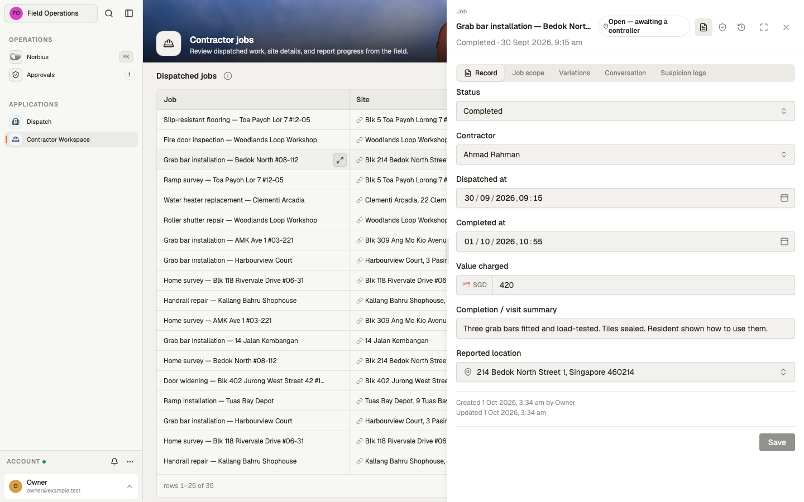

- **Record**: status, contractor, dispatch and completion times, value charged, the completion
  summary and the reported location. Save with **Save**.
- **Job scope**: the site, title, kind of work, day and the full description.

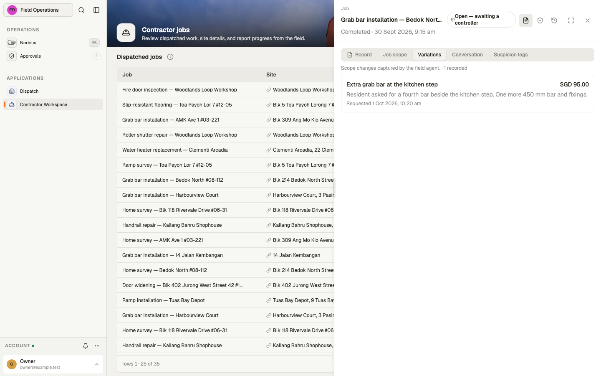

- **Variations**: scope changes raised on this job, with amount and time.

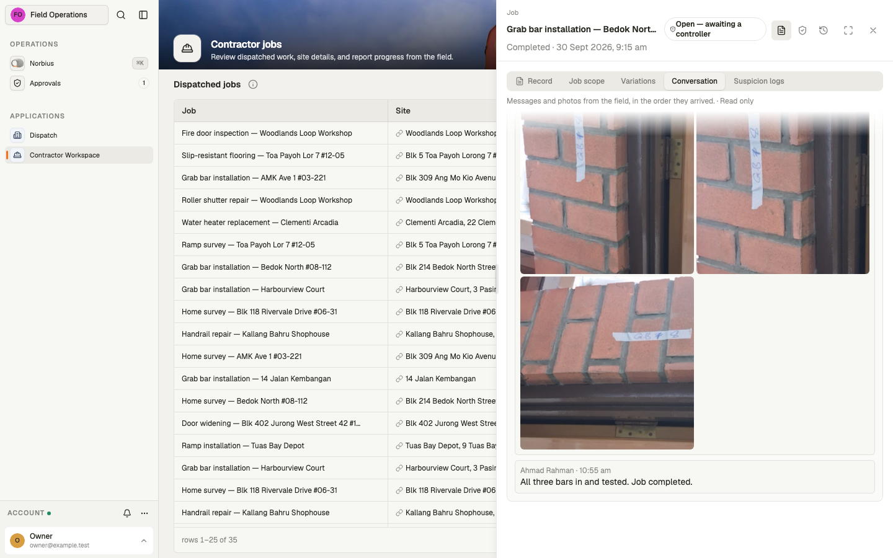

- **Conversation**: the messages and photos that came in about this job, in order, grouped by day.
  It is read-only. Click a photo to see it full size.

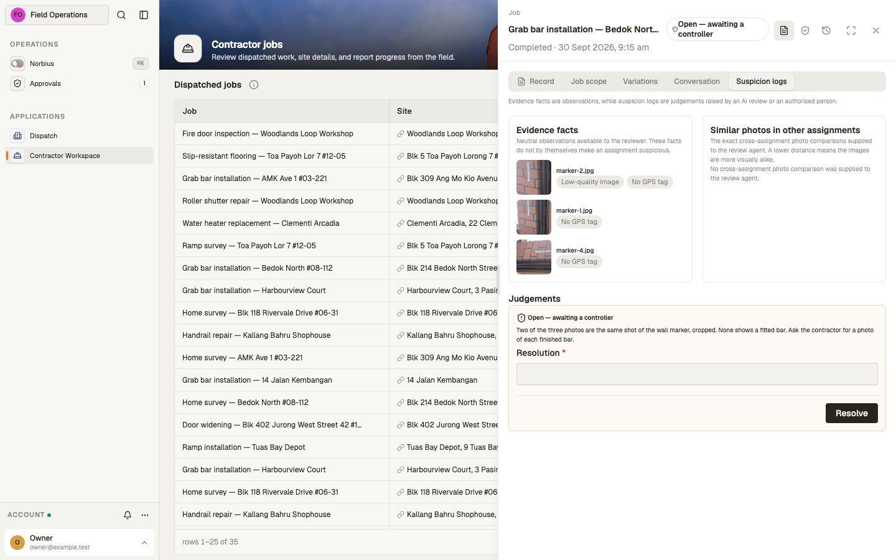

- **Suspicion logs** (controllers only):
  - **Evidence facts**: each photo with a flag on it, and its flags.
  - **Similar photos in other assignments**: photos from other jobs that the review compared with
    this job's.
  - **Judgements**: each suspicion raised on the job. Close an open one by writing a **Resolution**
    and pressing **Resolve**. A resolved judgement cannot be reopened or changed.

### Sites

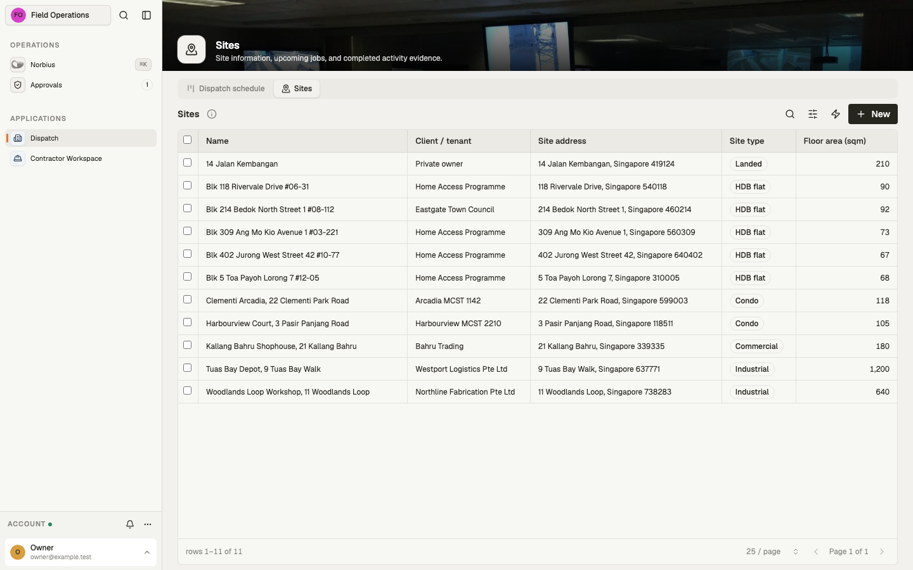

Every site: name, client, address, type (HDB flat, condo, landed, commercial, industrial, other)
and floor area. **New** adds a site.

- Two sites cannot share an address. Adding one that exists is refused with the existing site's
  name.
- Select sites and choose **Site handover** from the actions menu. It builds, per site, one JSON
  file with the site, its jobs, variations and photo evidence, plus a CSV for each of those
  tables, for handing the site over to another system.

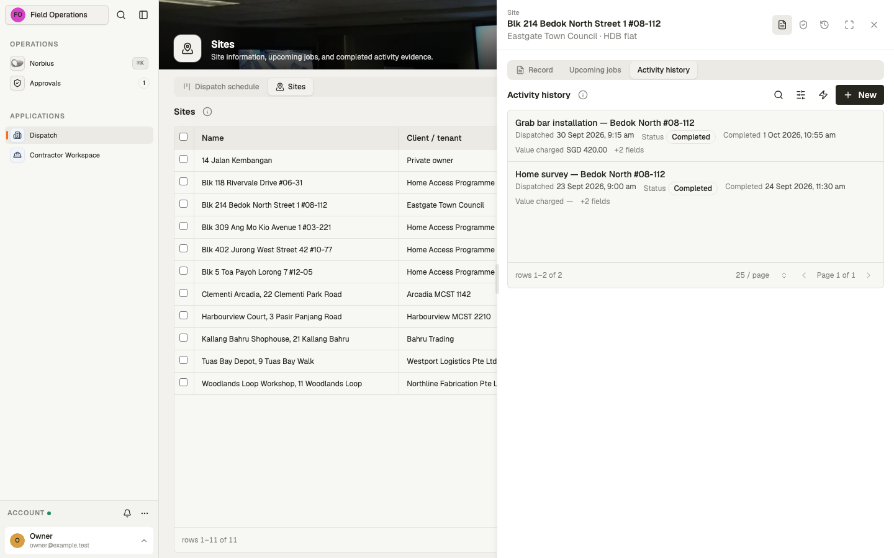

A site's record has **Upcoming jobs** (from today on, plus any still open) and **Activity history**
(jobs assigned or completed, with value charged, reported location and summary).

### Approvals

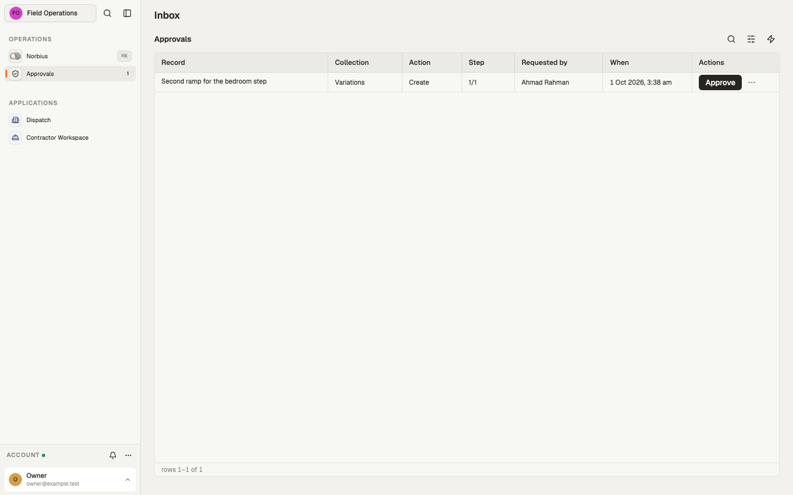

A variation raised or changed by a contractor lands here for the `Field Operations Controllers`
team. It takes effect only when approved: press **Approve**, or open the menu beside it to
**Request changes** or **Reject**.

## Contractor Workspace

### Dispatched jobs

A controller sees every contractor's jobs, with a **Contractor** column and **New** to file a job.
The table's info button says whose jobs are listed.

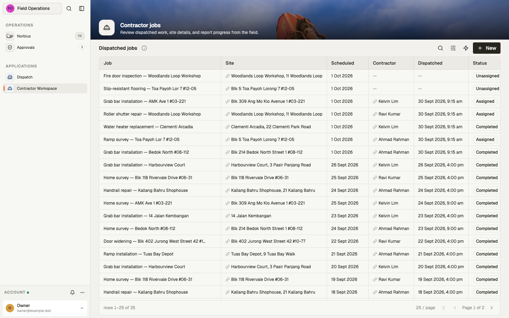

A contractor sees only the jobs assigned to them.

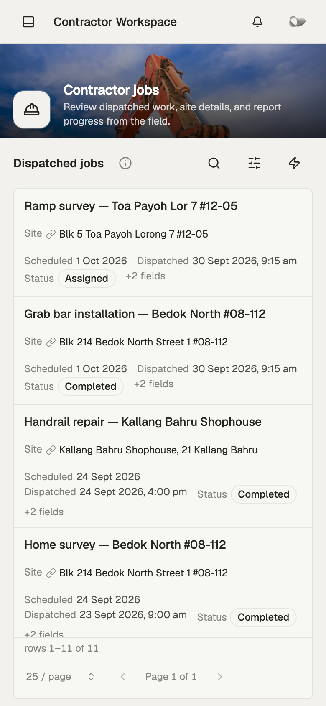

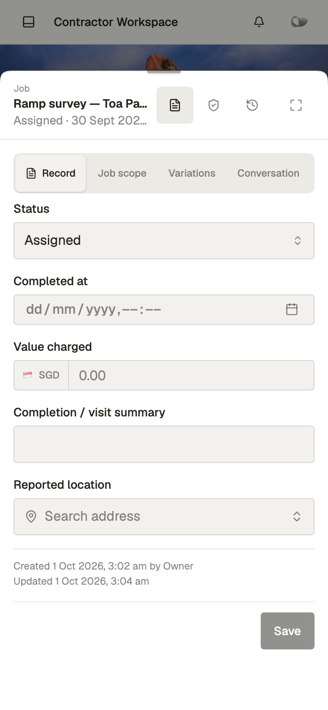

On a job, a contractor can:

- set the status and the completion time, the value charged, a summary and the reported location;
- ask the assistant (**Norbius**) to raise a variation, which waits for a controller's approval;
- add photos to their own jobs.

A contractor sees the job's scope, variations, messages and photos. Nothing about photo checks or
suspicions is shown to them.

## WhatsApp

A contractor who already has a workspace account can report on WhatsApp. An administrator verifies
the contractor's WhatsApp number on their account. An unknown number is told it is not recognised
and gets no answer.

- The assistant finds the job the report is about by the site or the work named. When it could be
  more than one, it asks.
- One report becomes one update on that job: the status (**completed** when they say it is done),
  a summary, every photo sent and every text message about the work.
- In a direct message, the assistant acts with the sender's own access. In a group, it replies when
  mentioned or replied to, and any member's report can update any job.
- It cannot create, delete or reassign jobs, change the work order, or see photo checks or
  suspicions.

## How it works

**Dispatch.**

- A job must name an existing site and a day.
- Naming a contractor dispatches it: it becomes **Assigned** and the dispatch time is recorded. A
  job with no contractor stays **Unassigned**.
- Setting **Completed** records the completion time if none is given.
- A dispatch reference (`external_ref`) is unique, so a job cannot be filed twice from one
  reference.

**Photos.** Each photo belongs to exactly one job or one variation. Its file, its job and its source
cannot change after filing: a different photo is new evidence. As soon as a photo is filed it is
inspected, and it may get these flags:

| Flag                         | When                                                             |
| ---------------------------- | ---------------------------------------------------------------- |
| No GPS tag                   | The photo has no position. Common: WhatsApp strips it            |
| GPS does not match site      | The photo was taken more than 500 m from the site's map position |
| Exact photo match            | The same file is filed under another job                         |
| Visually similar photo match | A near-identical picture is filed under another job              |
| Metadata anomaly             | The capture details are inconsistent, or dated in the future     |
| Editing software recorded    | Photoshop, Lightroom, GIMP, Snapseed or Pixelmator edited it     |
| Low-quality image            | Smaller than 640 × 480                                           |

A repeat inside the same job is not a flag. Flags are facts, not a verdict.

**Suspicion review.** An AI review reads each job's evidence and decides whether a controller
should look.

- It runs whenever a job is filed or changes, and from **Suspicion review** on the board.
- It looks at the job, its site, the photo facts, up to three photos and the recent messages. It
  also compares the photos with similar-looking photos from other jobs.
- It raises a judgement only for a concrete reason tied to a named photo, or when a photo is judged
  to show the same scene as another job's. Missing GPS alone is never enough.
- Every review is recorded, including the clear ones. A job is not reviewed again until it changes:
  a new status, photo or message, or an edit.
- A review that fails is retried at the next two-hour slot.
- Only a controller's resolution closes a judgement.

**Access.**

- Controllers can do everything on jobs, sites, variations and photos. Messages and reviews cannot
  be edited or deleted by anyone; a judgement can only be resolved.
- Contractors see only their own jobs, the sites of those jobs, and their own variations, photos
  and messages. They cannot change the work order or reassign a job.

## Connections

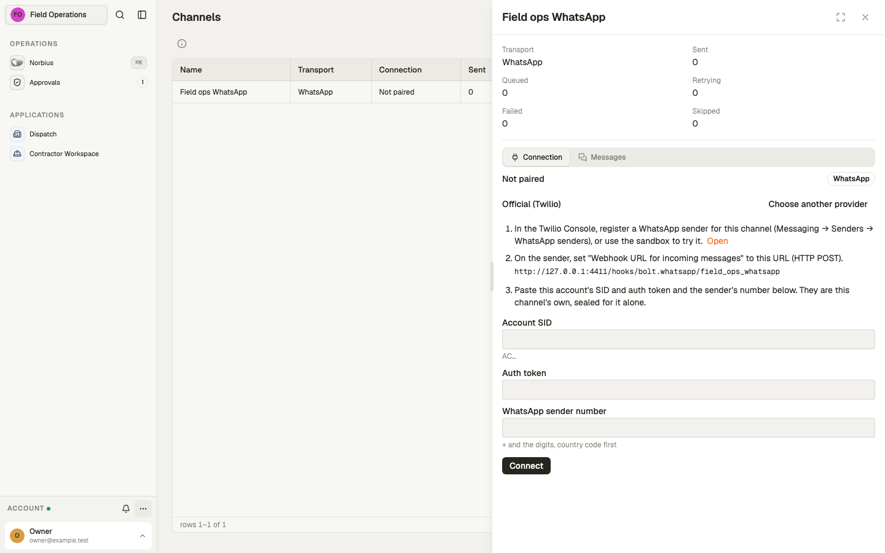

The workspace connects its WhatsApp channel, **Field ops WhatsApp**, with its own credentials: an
administrator opens **Settings → Channels**, picks the channel and chooses how it connects.

- **Official (Twilio)**: register a WhatsApp sender in the Twilio Console, set its incoming-message
  webhook to the URL shown, then paste the account SID, auth token and sender number and press
  **Connect**.
- **Unofficial (WhatsApp Web)**: pair a WhatsApp number the way WhatsApp Web does.

Until it is connected, the channel shows **Not paired** and contractors cannot report by WhatsApp.
The channel's **Messages** tab lists what it sent and received, with each message's delivery status.

| Setting                  | For                                                      |
| ------------------------ | -------------------------------------------------------- |
| WhatsApp channel         | Contractor reports and replies (`field_ops_whatsapp`)    |
| AI model (host)          | The suspicion review and the in-app assistant            |
| `scene` embedding (host) | Finding photos of the same scene across jobs             |
| Geocoding (host)         | Address search on sites and on a job's reported location |

The workspace runs on Singapore time and Singapore dollars. Without the `scene` embedding, the
review still runs its exact and near-identical photo checks, but cannot find re-shot or cropped
scenes across jobs.
