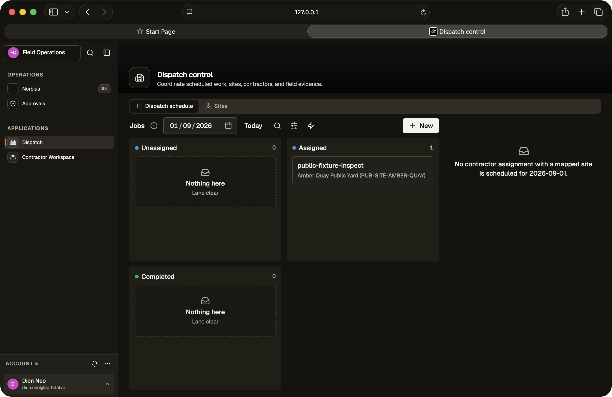
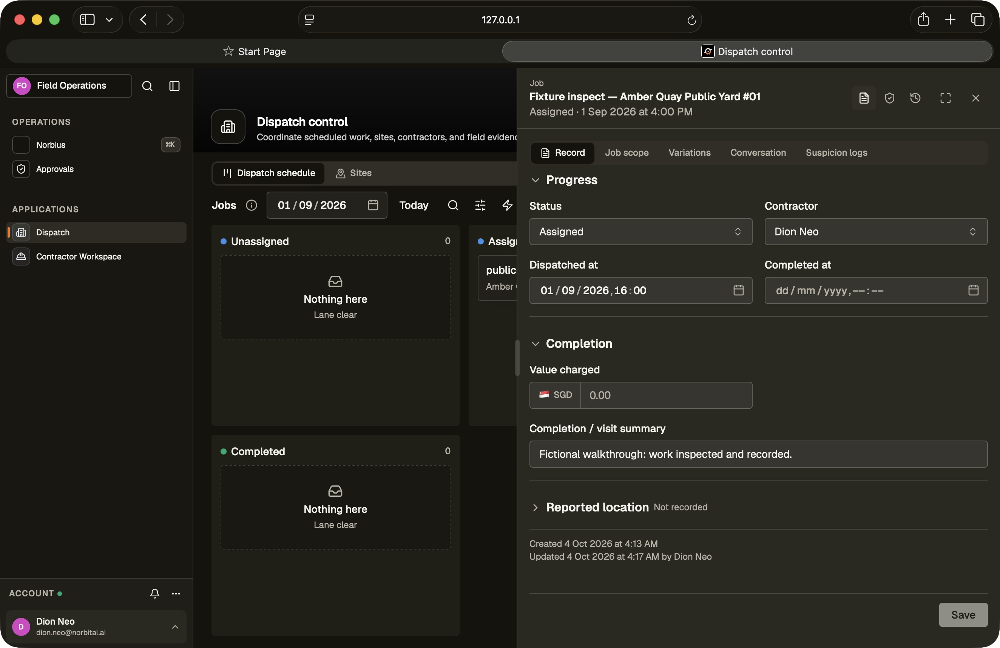
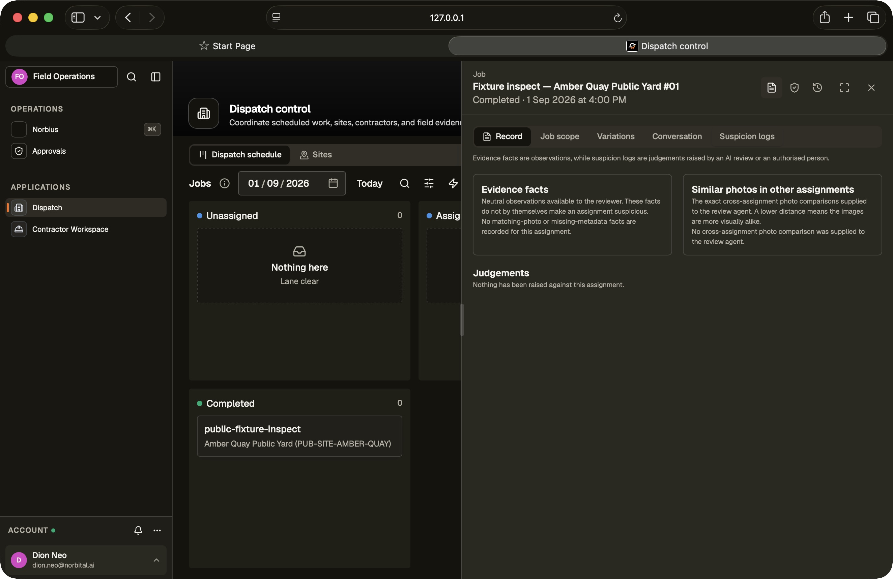
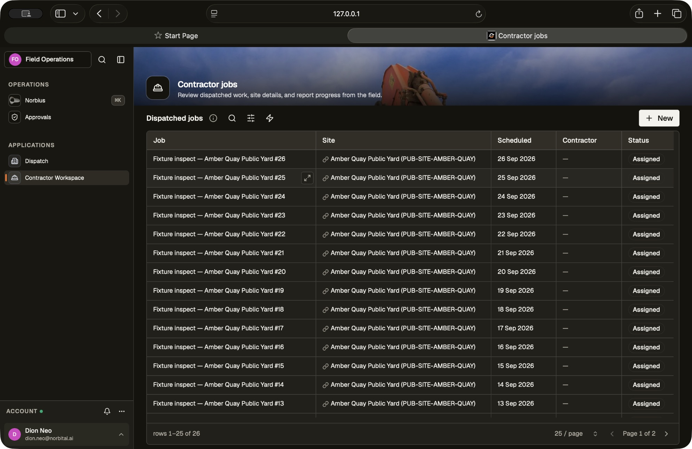
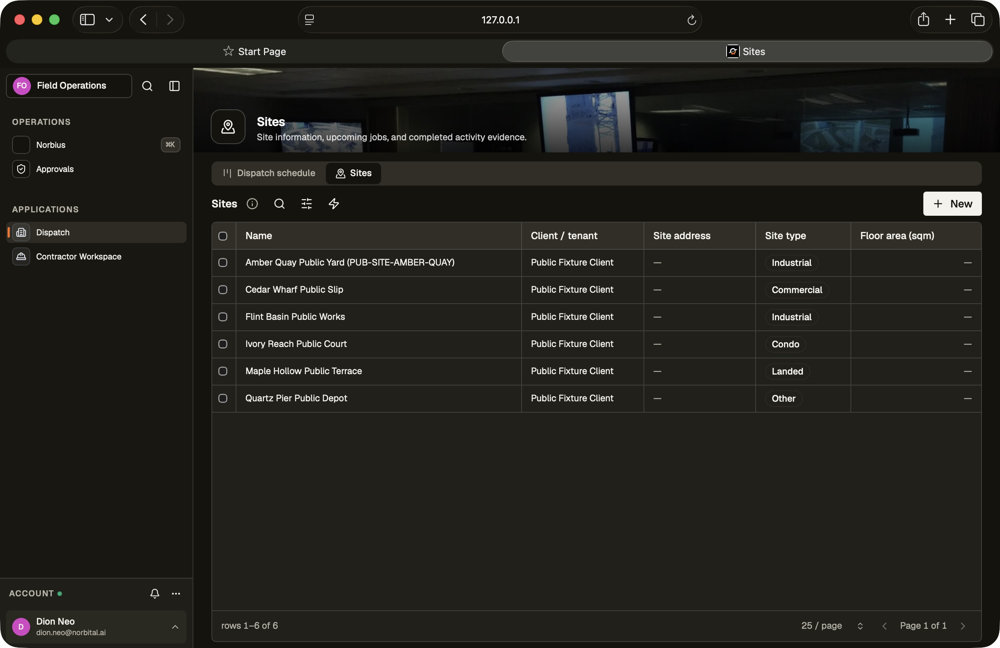

# Field Operations user flows

Field operations manages site jobs, day-based dispatch and evidence review.

Screens captured on 4 October 2026 from locally hosted public fixtures and fictional manual records. No private seed-bank customer records are shown.

## Dispatch the day

Open Dispatch and choose the working date. Review the New, Assigned and Completed lanes, then open a job. The map appears only when sites have coordinates. The public walkthrough uses fictional sites without map pins.

## Assign and record the job

In the job record, choose a site, scheduled day, assignee and status; save the changes. Add the inspection summary and available evidence to the same record. The public fixtures have unlinked assignees, so select a valid local user before relying on an assignment.

## Complete and review

Set the job to Completed and save. Review the Suspicion tab for recorded facts, comparisons and judgements. An empty review means no findings have been recorded; it does not establish that an external AI inspection ran.

## Review the assigned work list

Open Jobs to scan title, site, scheduled day, assignee and status. Open an individual job for its detailed notes and reported location. Contractor permissions scope the list to the contractor; the screenshot was captured as the local administrator and shows the broader list.

## Maintain the site inventory

Open Sites to check the site list. Maintain each site record and its coordinates before expecting it to appear on Dispatch. Job evidence stays associated with the job and site for subsequent review.

## Exceptions and variations

Open the relevant job to inspect its assignee, status and evidence before changing dispatch. Reassignment is a deliberate edit of the assignee followed by Save. The current template does not generate absence recommendations or a timed travel route.

Variation records and their approval rules are available in the template. The visible Variations view is a review list; a raise-variation action is not shown in this walkthrough. Provider or agent-created variation flows require separate integration verification.

## Verification and limitations

Manually verified: date-filtered dispatch, assigning a fictional job to a valid local user, saving its summary, completing it, and reviewing job/site lists. The compact jobs table removes secondary evidence columns; those details remain in each record. Empty map placeholders are suppressed when sites lack coordinates.

12 focused access, rule and public-fixture tests passed. Contractor scoping is covered by access tests; this manual walkthrough used an administrator. WhatsApp delivery, external photo analysis and GPS ingestion were not exercised. Scheduling is by day, without travel-time slot generation or a 90-minute en-route confirmation.
