# On-Demand Services — User guide

On-Demand Services books, dispatches and tracks home-service visits: cleaning, laundry, handyman
work — anything booked by the visit. It replaces matching helpers to jobs over phone and chat.

- Customers book on a page that can sit on your own website. They verify their mobile number with
  a texted code, pick a service and a time, and see their bookings. No app, no password.
- Every visit is matched to a helper who has the skill and is free, with the drive between jobs
  allowed for. Among qualified helpers, the least added driving and the lightest week win.
- Before each working day, helpers confirm their shift. A helper who does not answer, or cannot
  come, is replaced automatically.
- Before each visit, the helper's position is checked. A helper who is too far away is flagged for
  the desk to call.
- Helpers run their day from their phone: their visits, the drive to each, one tap to start and
  complete.

Screens in this guide use sample data.

## Who uses what

| Person                   | Team         | App                                                                           |
| ------------------------ | ------------ | ----------------------------------------------------------------------------- |
| Scheduler (service desk) | `Operations` | **Scheduler**: Scheduling, Configurations, Customer profiles, Helper profiles |
| Helper                   | `Helpers`    | **My Day** on their phone                                                     |
| Customer                 | —            | **Book a visit** portal, on your website or as its own page                   |

A **customer** books a **service** at their address. A **booking** has one **visit** per
occurrence (once, weekly, fortnightly or monthly), and every visit is held by one **helper**.

## Scheduler

The Scheduler has four pages in the sidebar: **Scheduling** (tabs **Schedule**, **Warnings**,
**Live map**, **Bookings**), **Configurations**, **Customer profiles** and **Helper profiles**.

### Schedule

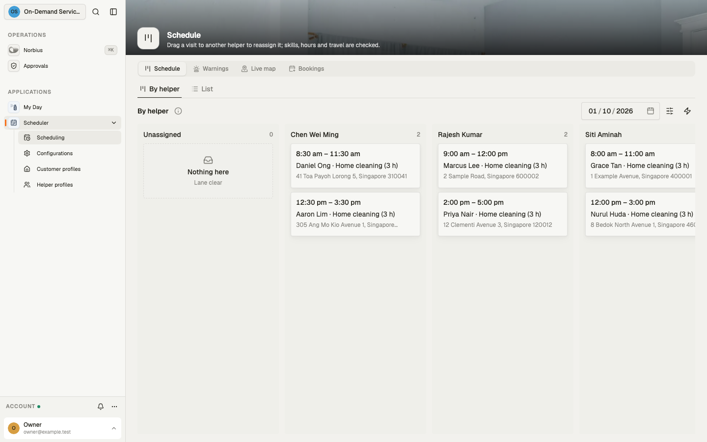

**By helper** shows the day's visits, one lane per helper plus an **Unassigned** lane. Pick the
day at the top right.

- **Drag a visit to another lane** to reassign it. The move is checked against the helper's skills,
  working hours, time off and the drive from and to their other visits. A move that breaks a rule is
  refused with the reason ("…has another visit too close to this one, counting the drive between
  them").
- Each card shows the shift check and ETA status.
- Open a visit for its record — when, where, who and what; **Dispatch checks** (shift check, ETA,
  proposals) opens itself while the visit needs attention, **Completion** while it is under way — and
  its **Free helpers** tab: every helper who could take it instead,
  best match first, with the drive it would add to their day and their hours that week.

**List** shows the same day as a table. Each row has **Reassign to best match** and **Cancel
visit**.

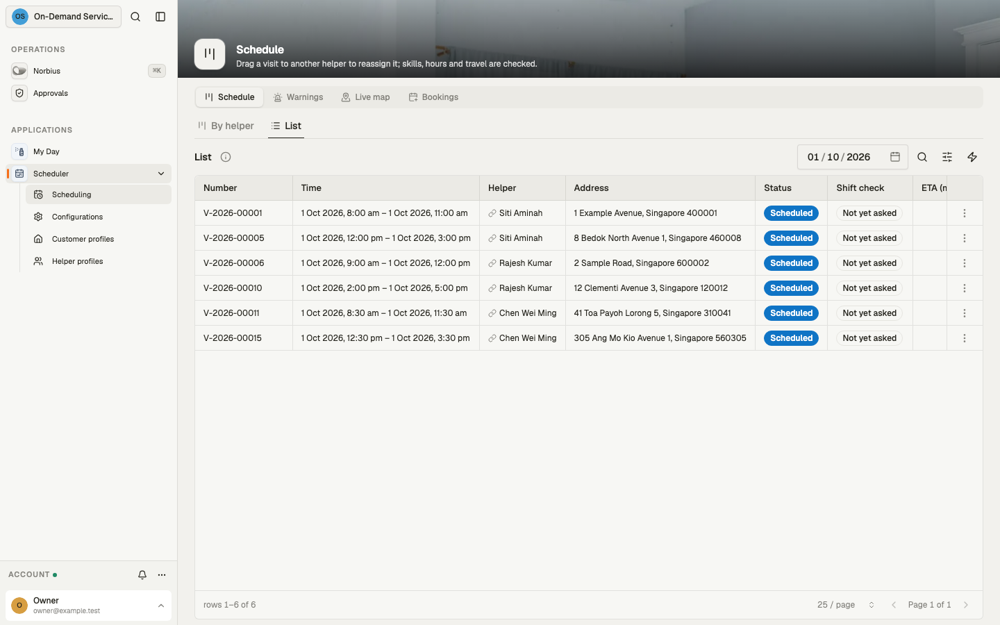

### Warnings

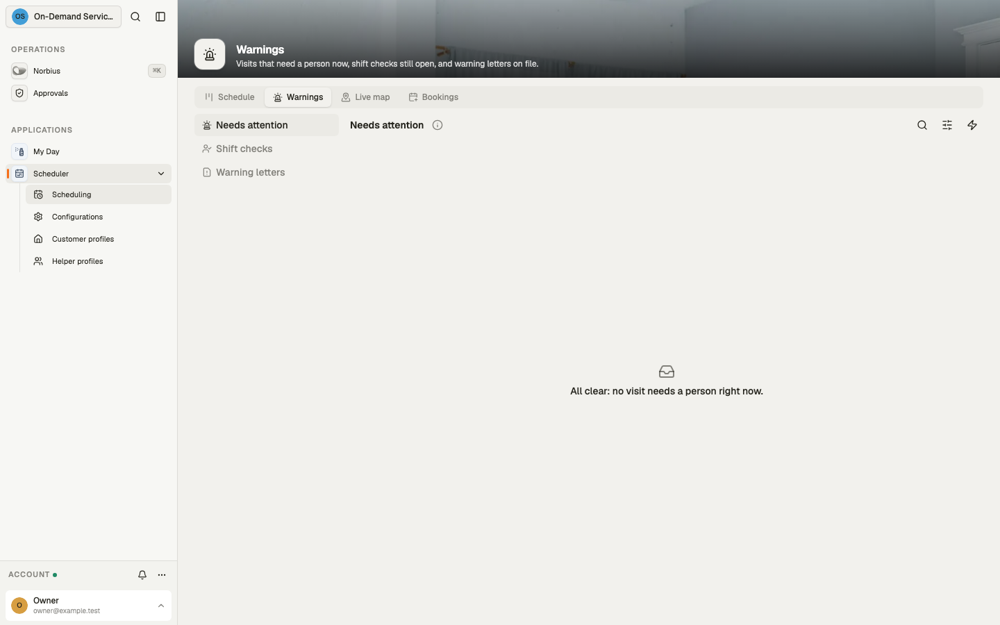

**Needs attention** is one list of what needs a person now: visits with no helper, ETA risks, and
proposals after a helper left. When nothing does, it reads "All clear". **Shift checks** lists the
shift checks still open, and **Warning letters** the letters on file.

### Live map

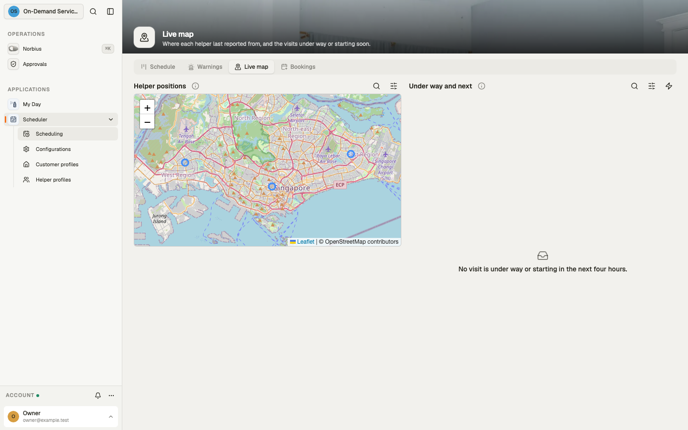

**Helper positions** shows each helper's last reported position. **Under way and next** lists the
visits under way or starting in the next four hours.

### Bookings

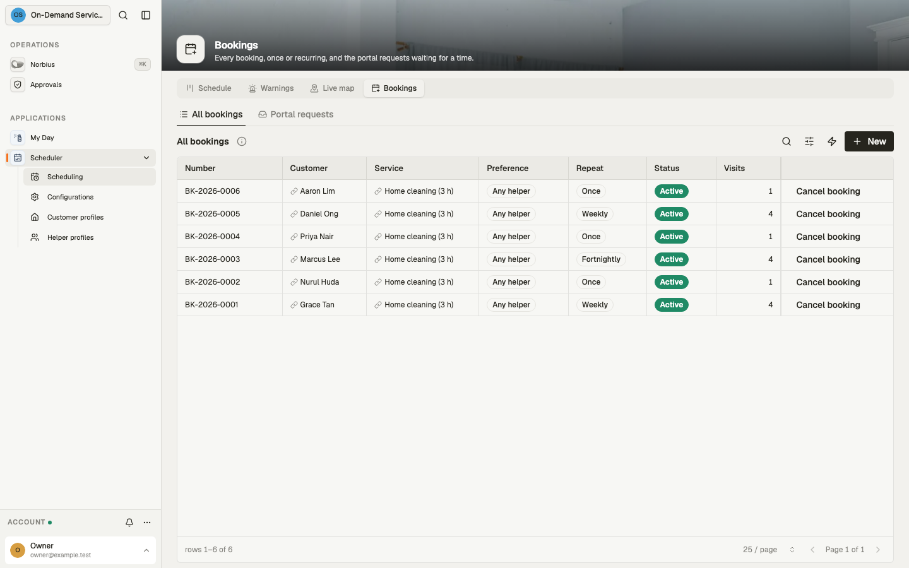

- **All bookings** lists every booking. Cancelling a booking cancels its visits still to come.
- **New** on its toolbar takes a booking. Pick the customer and the service, the date and time,
  and how often. **Repeat** starts closed, showing **Once**; open it for a recurring booking.
  - With **Any helper**, the best match is chosen; a recurring customer keeps that helper while
    they stay free.
  - With **Preferred helpers**, name them in the customer's order. There is a tab per helper with
    the half-hours they are free that week. The time you pick goes to the first of them who is free.
- **Portal requests** lists requests from the portal that no helper could take at the time asked,
  for the desk to propose a time.

### Helper profiles

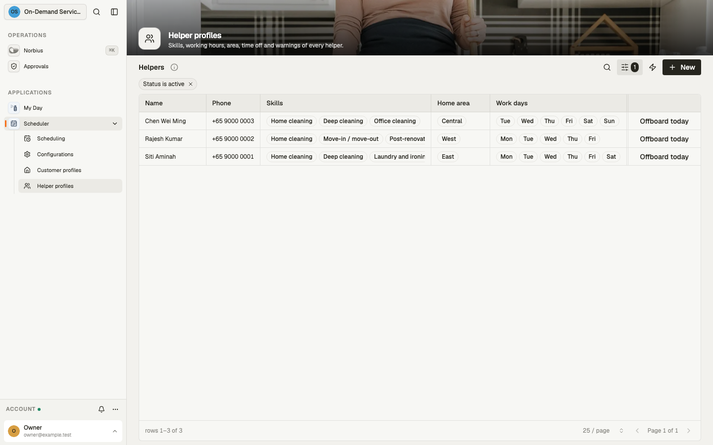

Skills, phone, home area, working days and hours, time off and warnings; the sign-in account and
map locations fold into **Sign-in and location** ("Last seen …"). **Offboard
today** marks a helper as leaving today. Each of their later visits gets a proposal: the helper with the closest
skills at the same time, or the nearest time anyone is free. The customer is emailed the proposal,
and the desk accepts it from the visit.

### Customer profiles

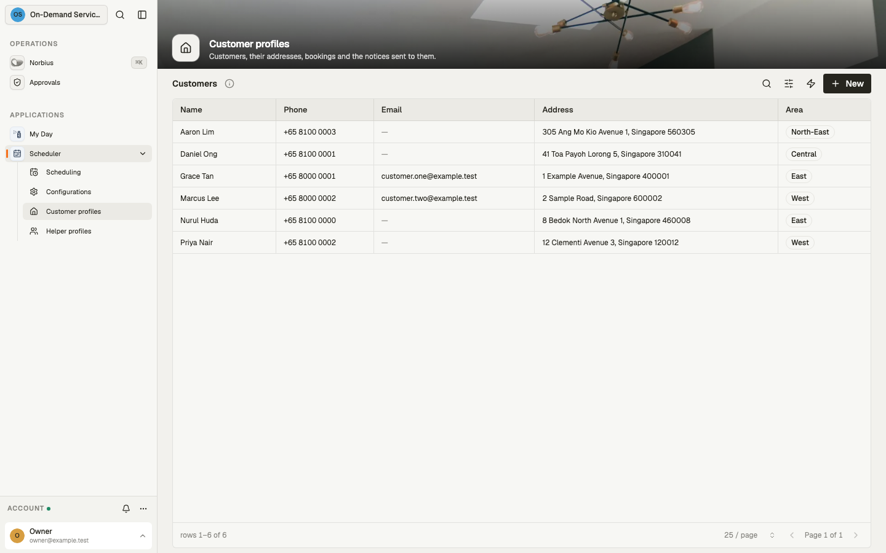

Contact details, address and area, their bookings, and every notice sent to them. **Notes** and the
**Map location** pin fold away behind a one-line summary.

### Configurations

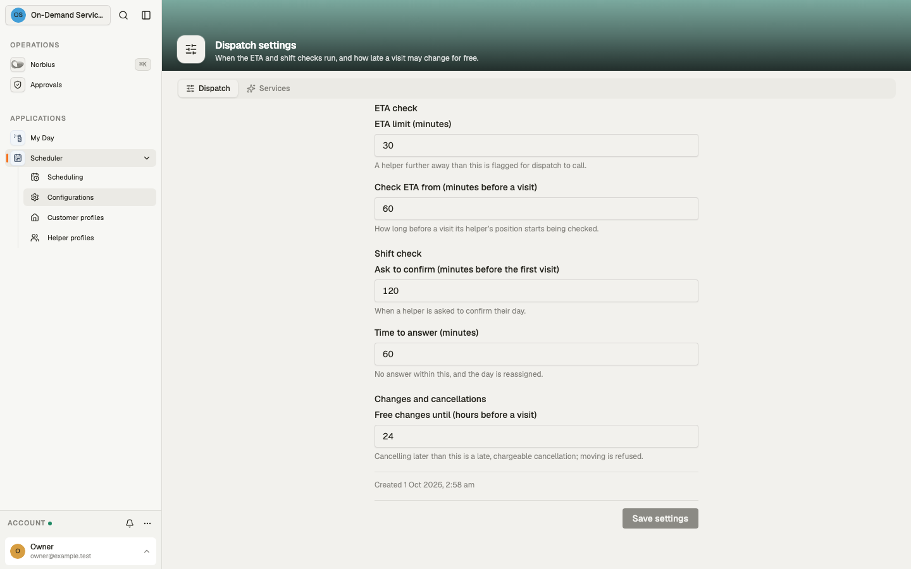

**Dispatch** holds the settings below; change them and press **Save settings**.

| Setting                                         | Default | What it does                                                |
| ----------------------------------------------- | ------- | ----------------------------------------------------------- |
| ETA limit (minutes)                             | 30      | A helper further away than this before a visit is flagged   |
| Check ETA from (minutes before a visit)         | 60      | How long before a visit the ETA check starts                |
| Ask to confirm (minutes before the first visit) | 120     | When a helper is asked to confirm their day                 |
| Time to answer (minutes)                        | 60      | No answer within this, and the day is reassigned            |
| Free changes until (hours before a visit)       | 24      | Later cancellations are chargeable; later moves are refused |

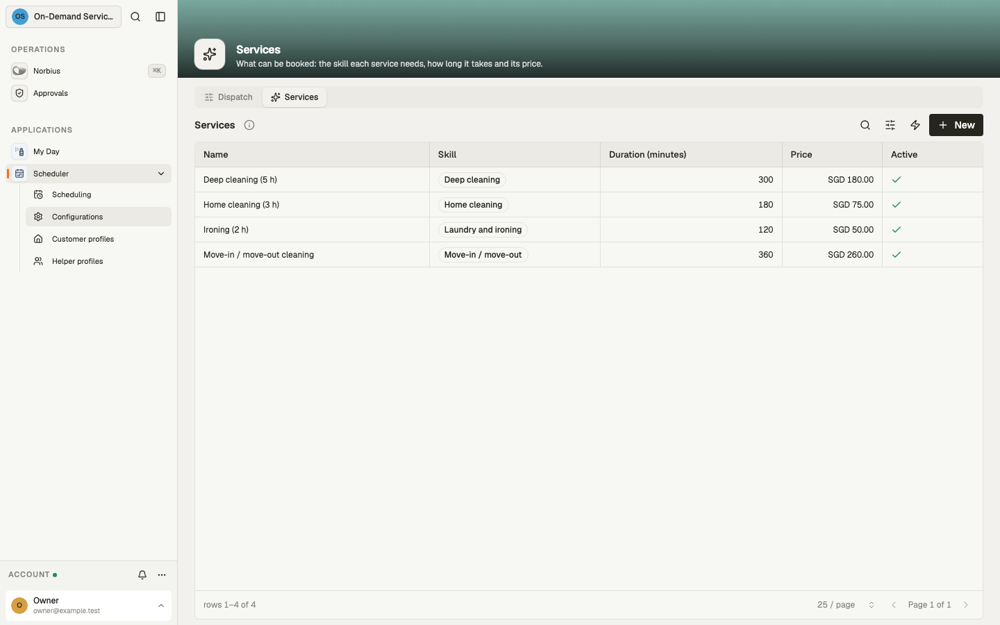

**Services** lists what can be booked. Each has a skill (the matching requirement), a duration, a price and a description.
Only active services are offered on the portal.

## Customer portal

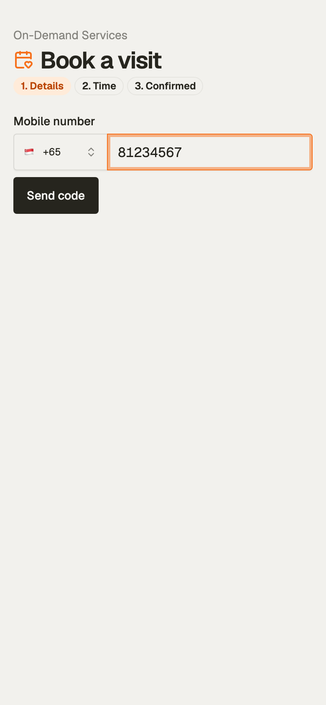

1. **Details.** The customer types their mobile number and presses **Send code**. The six-digit code
   box appears beside **Verify**; the sixth digit verifies. The first verification signs them up.
   They then pick the service, address and area, how often, and their name. **How often** and the
   optional notes start closed, showing **Once** and **No notes**; a tap opens them. A returning
   customer finds these filled in.
2. **Time.** The service's open start times over the next two weeks, day by day. Only times a
   qualified helper can take are offered.
3. **Confirmed.** The visit is matched and confirmed on the spot, with a reference. If the time was
   taken meanwhile, the request goes to the desk, who proposes a time.

**My bookings** lists upcoming and past visits (who is coming, how far away they are on the day) and
the messages sent to the customer. Changes and cancellations go through the desk.

A signed-up customer sees the portal only, and only their own records. **Settings → People** can
close sign-up.

**On your website.** Only the portal's pages may be framed, and the embedding site must use HTTPS:

```html
<iframe
	src="https://<workspace host>/app/portal/book"
	style="width:100%;height:760px;border:0"
></iframe>
```

## Signing in

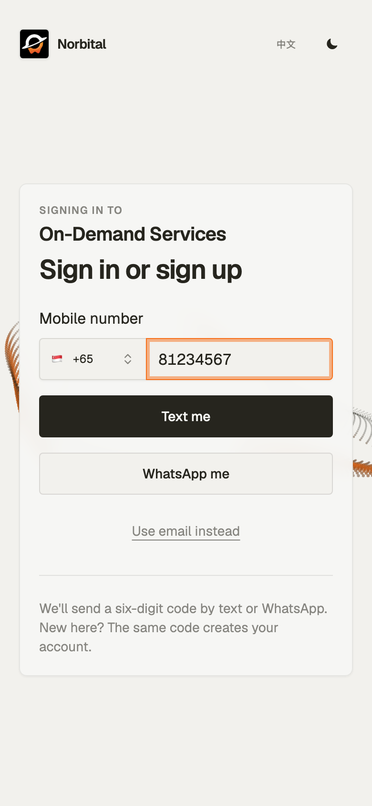

Everyone signs in to the workspace with a six-digit code. On **Sign in or sign up**, type the
mobile number and press **Text me** (or **WhatsApp me**) to get the code; **Use email instead**
sends it by email. A number that is new to the workspace signs up as a customer, the same as on the
portal.

## Helper app — My Day

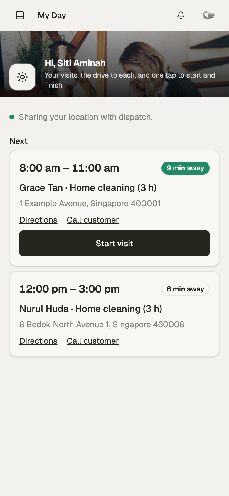

- **Shift check.** Confirm the day, or say you cannot come, with or without a medical certificate.
- **Your visits.** The visit under way, then the next ones: time, customer, service, address, and
  how far away you are now.
- **Directions** and **Call customer**, **Start visit** with one tap, and a completion sheet with
  notes for the desk.
- While the app is open, your position is shared with the desk. Stop sharing at any time.

Install it to the phone's home screen from the browser. A helper signs in as the member their
helper profile names.

## How assignment works

The same rules run for every booking, drag, reassignment, move and portal time.

**Hard requirements.** A helper can take a visit only when:

1. they are active and have the service's skill;
2. they work that weekday, and the visit fits inside their hours;
3. they are not on time off that day;
4. they have no visit too close to it: the drive between the two addresses, plus 15 minutes to park
   and carry the kit in, must fit on both sides.

**Ranking.** Every helper who passes is scored in minutes of driving, and the highest wins:

| What counts                                 | Score                         |
| ------------------------------------------- | ----------------------------- |
| Drive this visit adds to the helper's day   | − minutes                     |
| Hours already booked that week              | − 2 per hour (load balancing) |
| Helper lives in the customer's area         | + 5                           |
| Same helper as this booking's earlier visit | + 100 (recurring continuity)  |

The added drive is the trip in from the helper's last stop (a visit, or home), plus the trip on to
their next visit that day, less the direct trip it replaces. A visit on a helper's way costs almost
nothing, so days stay tight and total driving stays low. Between two helpers with similar drives,
the one with fewer hours that week wins. With preferred helpers, the customer's order decides
among those who pass.

**No double booking.** Three layers stop it:

- The database refuses two overlapping visits for one helper, however they are written.
- Every drag, reassignment and move is re-checked against the hard requirements.
- Every 15 minutes, and whenever the schedule changes, each helper's next two weeks are walked in
  order. A visit they can no longer reach in time from the one before goes to the best other
  helper. That happens when Google's drive time is longer than the estimate, or when two bookings
  landed at once. When nobody can take it, it waits in **Warnings**.

## Around each visit

**Shift check.** Two hours before a helper's first visit of the day (configurable), they are asked
in My Day to confirm.

- No answer within the reply window, or a decline, and the day's visits are reassigned to the best
  match.
- Without a medical certificate, a warning and a warning letter (PDF) are filed on the helper's
  record.
- A customer who asked for particular helpers is told who comes instead; one who did not is not.

**ETA check.** From an hour before each visit, the drive from the helper's last position is
re-estimated every five minutes.

- Over the ETA limit, or no position in the last 15 minutes, and the visit is flagged. The desk is
  notified to call the helper and reassign from the board if need be.
- The flag clears on its own when the helper gets closer.

**Changes and cancellations.** A visit can be moved or cancelled up to the free change window before
it starts. Later, a cancellation is marked late (chargeable) and a move is refused.

**Messages.**

- Customers: booking confirmations, a change of helper, proposals and cancellations. These go by
  WhatsApp, plus email when they have one.
- Helpers: new and changed visits, by WhatsApp.
- The desk: in-app alerts for ETA risks, visits without a helper and portal requests that need a
  time.

## Connections

| Setting                                    | For                                                                                                                 |
| ------------------------------------------ | ------------------------------------------------------------------------------------------------------------------- |
| `GOOGLE_MAPS_API_KEY` (Settings → Secrets) | Real drive times for matching, and live-traffic ETAs. Needs the Google Maps **Routes API**                          |
| WhatsApp channel                           | Customer and helper messages                                                                                        |
| Customer mail channel (your own mailbox)   | Customer notices mailed to customers with an address; each notice shows sent, delivered, opened, bounced or replied |
| Text messages (host)                       | Sign-in codes, on the portal and the sign-in page                                                                   |

**Channels.** You connect each channel with your own account in **Settings → Channels**. Open the
channel, and its **Connection** tab asks how it connects; **Messages** shows what went out on it
and each message's delivery status.

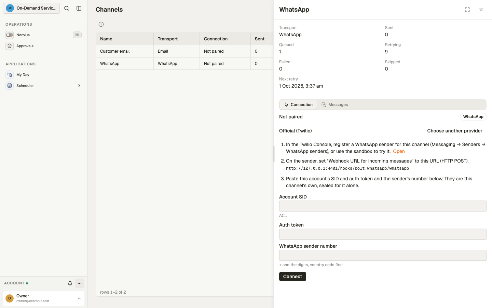

- **WhatsApp**: **Official (Twilio)** takes your Twilio account SID, auth token and WhatsApp sender
  number; set the sender's incoming-message webhook to the URL shown. **Unofficial (WhatsApp Web)**
  links a WhatsApp account as a linked device instead.
- **Customer mail**: your own mailbox over IMAP + SMTP. Choose **Mail server (IMAP + SMTP,
  password)**, or sign in with Microsoft 365 or Google Workspace / Gmail through your own OAuth app.

Until a channel is connected, nothing is delivered on it: the channel counts its messages as queued, retrying or failed.

**Drive times.** Without a Google key, a drive is estimated from straight-line distance at an urban
25 km/h. With one:

- Every leg a helper's next two weeks will be driven is timed by Google once. That is home to the
  first visit, then visit to visit.
- Times are cached per pair of ~1 km squares, so a weekly customer's drives are looked up once and
  reused.
- A leg not yet timed uses the estimate until the next check, at most 15 minutes later.
- The ETA check asks Google in live traffic whenever the estimate is over half the ETA limit.

At 2,000 visits a month, Google usage sits within or near its monthly free allowance.
