# HR & Payroll — User guide

HR & Payroll keeps employment records, rosters, attendance, leave, claims and loans for one or more
legal entities, and runs each entity's monthly payroll under that entity's country rules. It is for
an HR team that pays people in several countries and wants every payslip to trace back to the
records it settled.

- One profile per person, with their employment contracts, dated contract terms and statutory
  registrations.
- A monthly roster per entity: the planned shift, the clock-in and the leave for every person-day.
- Leave, claims, one-off payments and loans are recorded as events, approved, and settled by the
  payroll run of their period.
- A payroll run builds one payslip per contract: earnings, statutory contributions (CPF, SDL and
  the rest for each country), take-home pay and employer cost, with exports for the bank.
- Country rules (contribution rates, leave types, claim and loan classes) are dated, sealed
  versions that HR reviews before payroll uses them.
- Employees see their own schedule, leave balances, claims, loans and payslips, and clock in at an
  attendance kiosk.

Screens in this guide use sample data: one invented Singapore entity and eight invented people.

## Who uses what

| Person                         | Team                                       | App                                                                  |
| ------------------------------ | ------------------------------------------ | -------------------------------------------------------------------- |
| Employee                       | `Employee`                                 | **Employee Self-Service**                                            |
| Supervisor, production manager | `Supervisor`, `Production Manager`         | **Employee Self-Service**; approves their reports' attendance, leave |
| Direct manager                 | `L1 Manager`                               | **HR Controller** apps and **Employee Self-Service**                 |
| HR administrator               | `HQ Payroll HR`, `Manager (HR Controller)` | **HR Controller**: People, Entities, Events, Payroll, Settings       |
| HR manager                     | `HR Manager`                               | **HR Controller**, plus the payroll approvals                        |
| Senior management              | `Senior Management`                        | **Employee Self-Service**, **Approvals**                             |
| Shop-floor tablet              | `Attendance Kiosk`                         | **Attendance Kiosk**                                                 |

People, Events and Payroll work on one legal entity at a time: pick it at the top right. Settings
works on one country version instead.

## People

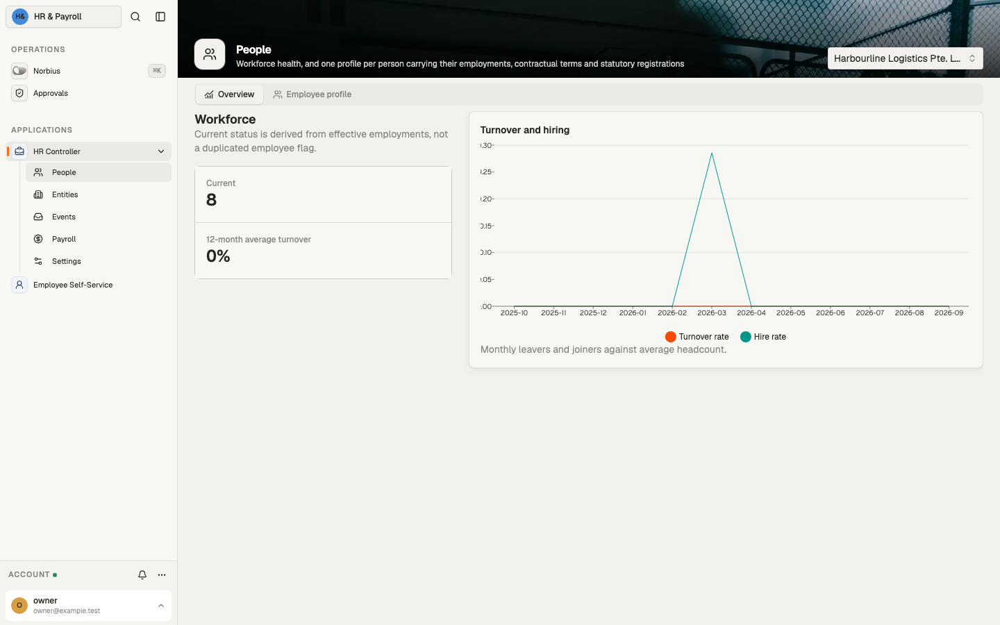

**Overview** shows the entity's headcount today and a twelve-month chart of turnover and hiring.
Both are worked out from the employment contracts' start and end dates.

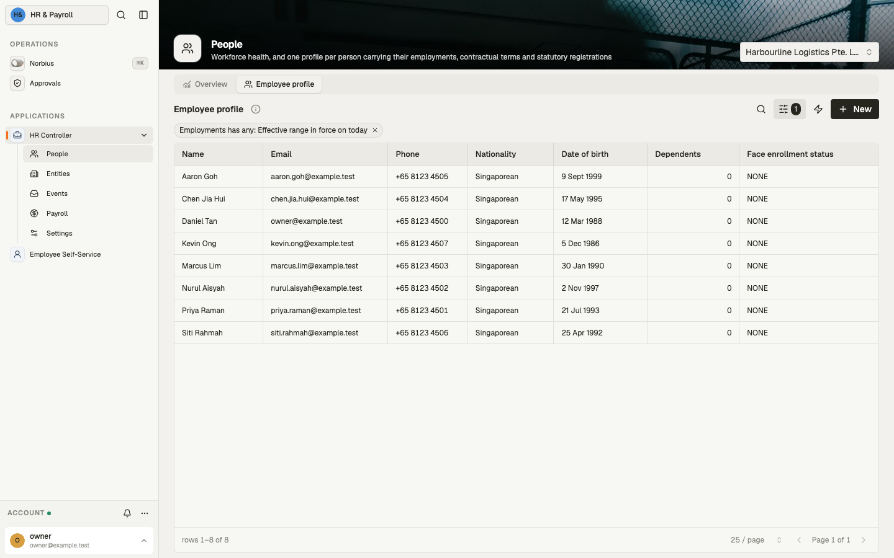

**Employee profile** lists the people employed by the entity. It starts filtered to contracts in
force today; clear the filter to include leavers. **New** adds a person.

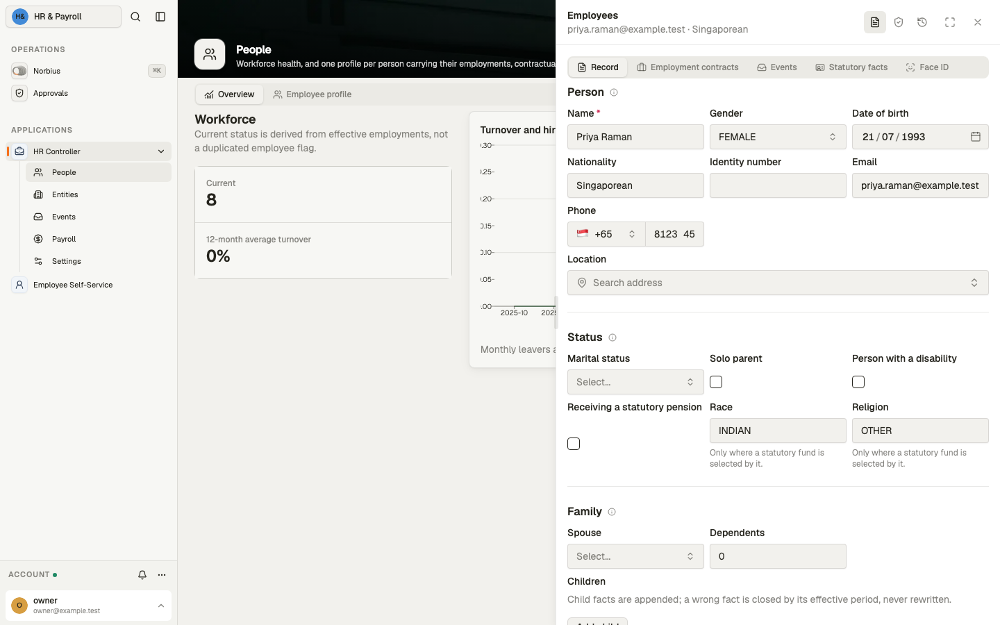

Open a person for their record:

- **Record**: name, date of birth, nationality, contact details, marital status, race and religion
  (used only where a statutory fund depends on them), and family.
- **Employment contracts**: each contract with one entity, its employee number, bank details and
  dates, and its dated **terms** (salary, currency, residency, work pattern, allowances).
- **Events**, **Statutory facts** (scheme registrations such as SDL) and **Face ID** (the kiosk
  enrolment).

A change of pay or pattern closes the current terms and starts new ones. A departure is recorded by
ending the contract with a reason.

## Entities

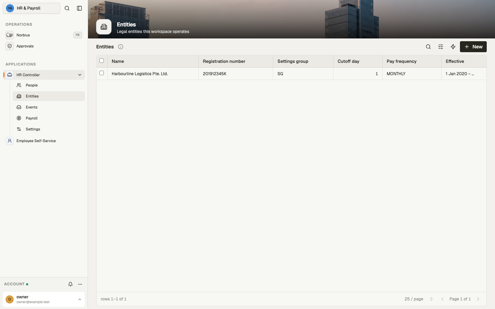

The legal entities this workspace pays. Each has a registration number, the **Settings group**
whose country rules it follows, a pay **Cutoff day** and a **Pay frequency** (monthly, twice a
month, or weekly).

**Import spreadsheet** loads public holidays for several entities at once: one sheet per entity.
Days an entity already has are skipped. Imported days arrive unpublished; payroll uses a holiday
only once it is published.

## Events

**Events** opens on **Work**. Its other pages are **Leave**, **Claims**, **Ad hoc** and
**Loans**; open them from the search box at the top of the sidebar. Leave, Claims and Ad hoc show
one pay period at a time: pick it next to the entity.

### Work

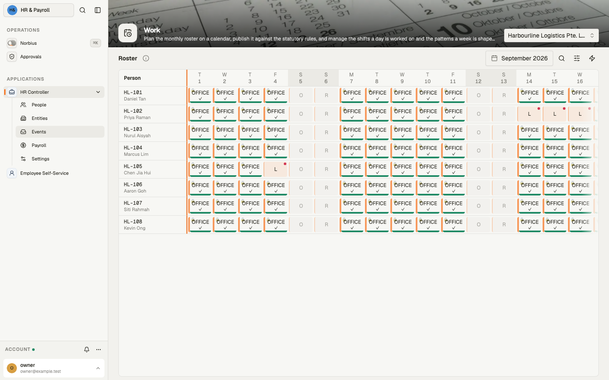

One row per person, one column per day. Each cell shows the shift the person's work pattern plans
(here **OFFICE**, **O** for the off day, **R** for the rest day), any roster change, and the
attendance clocked that day. **L** marks leave.

- Click a cell to assign a shift, record attendance, or swap two days.
- **Import** loads a month's roster and time entries from a workbook; **Download import template**
  gives the expected sheet.
- **Show unresolved clock-outs** finds days with a clock-in and no clock-out.
- A day that a paid payroll run has settled is locked.

### Leave

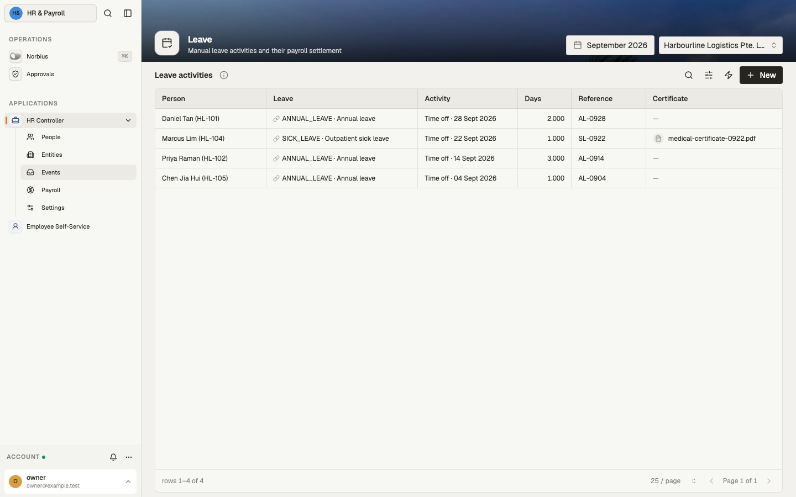

Every leave activity of the period: time off, balance adjustments, carry-forwards and encashments.
Each row shows the leave type, the days and the certificate where one is needed. **New** records an
activity.

Approved leave cannot be edited or deleted. To correct it, record a linked reversal and a
replacement. Where the country declares statutory benefit cases (for example maternity benefit),
extra tabs appear for the cases, contribution history, advance plans, cutoffs and cash evidence.

### Claims

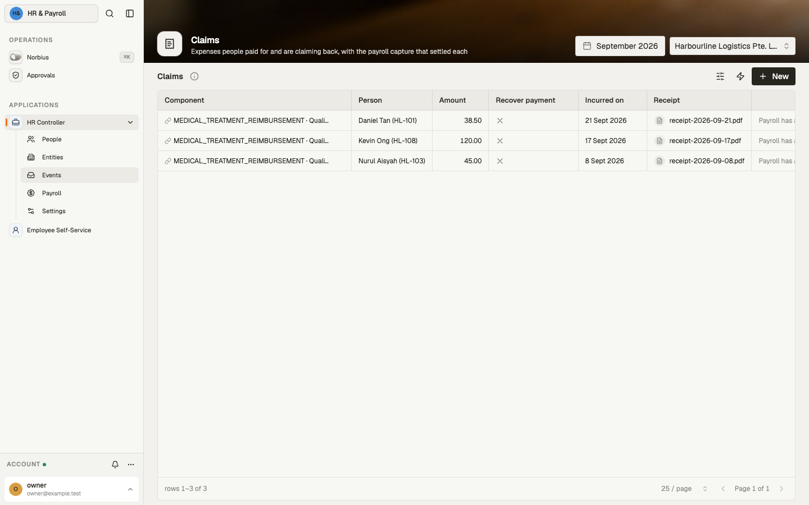

Expenses people paid and are claiming back: the claim type, the person, the amount, the date
incurred and the receipt. The last column says why a row is locked: held for approval, or already
settled by a payroll run. **Recover payment** marks a claim that takes money back instead of paying
it.

**Ad hoc** has the same layout for one-off payments and deductions: bonuses, back pay, separation
pay and recoveries.

### Loans

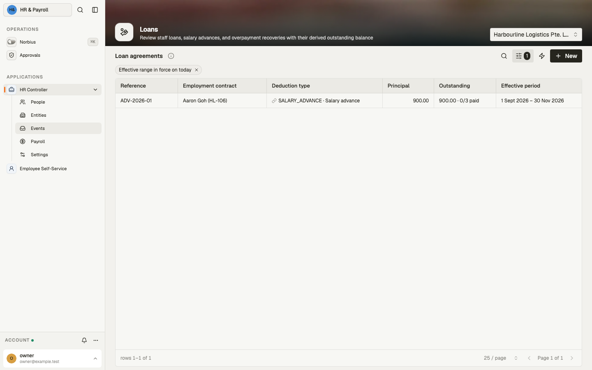

Staff loans, salary advances and overpayment recoveries. **Outstanding** is what is still to be
recovered and how many repayments are paid. Open a loan for its repayment schedule: the due dates
and amounts, which must add up to the principal and fall inside the loan's dates.

## Payroll

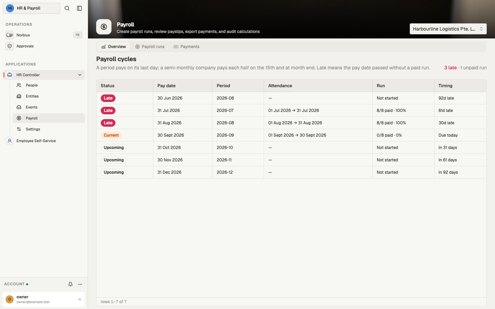

**Overview** lists the entity's pay cycles from three months back to three months ahead. Each row
has its pay date, the attendance window the run used, how many payslips are paid, and how long
until (or since) the pay date.

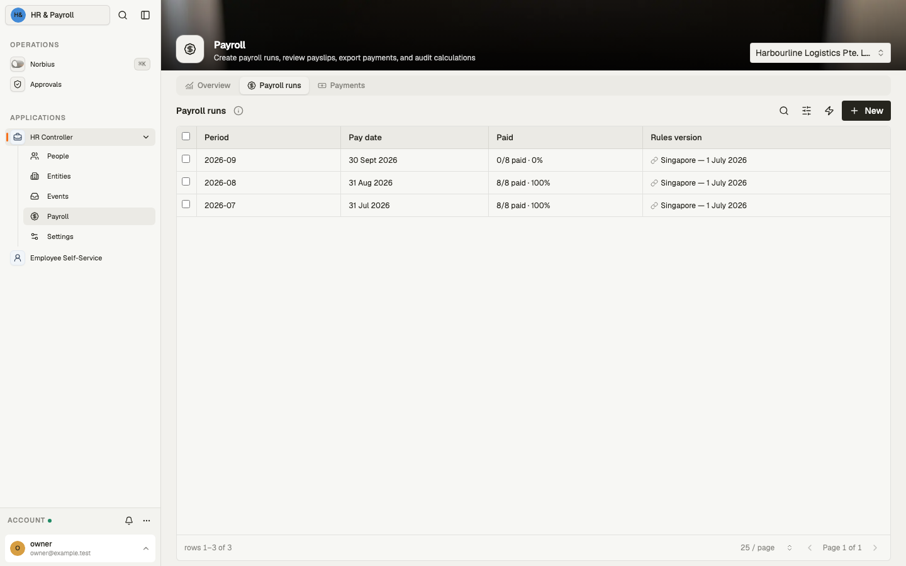

**Payroll runs** lists every run with its period, pay date, paid progress and the rules version it
used.

- **New** creates the run for a period. It builds one payslip per contract.
- Select runs to download **Bank files**, **Payslip PDFs**, the **Payroll workbook** or the
  **Catalogue entries** (allowances, claims and loans per person).
- An unpaid run can be deleted and created again.

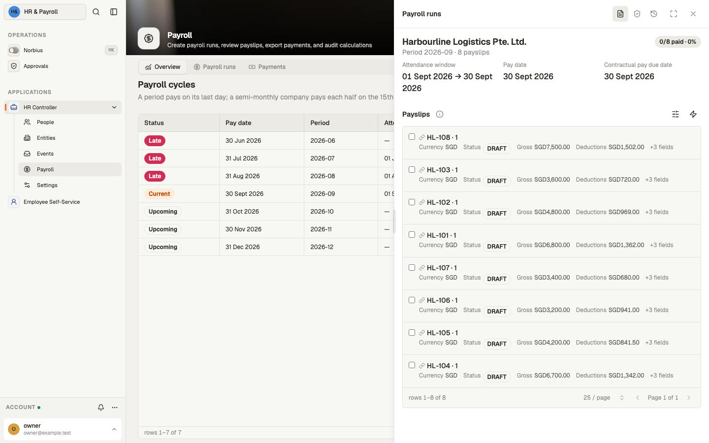

Open a run for its attendance window, pay date and payslips.

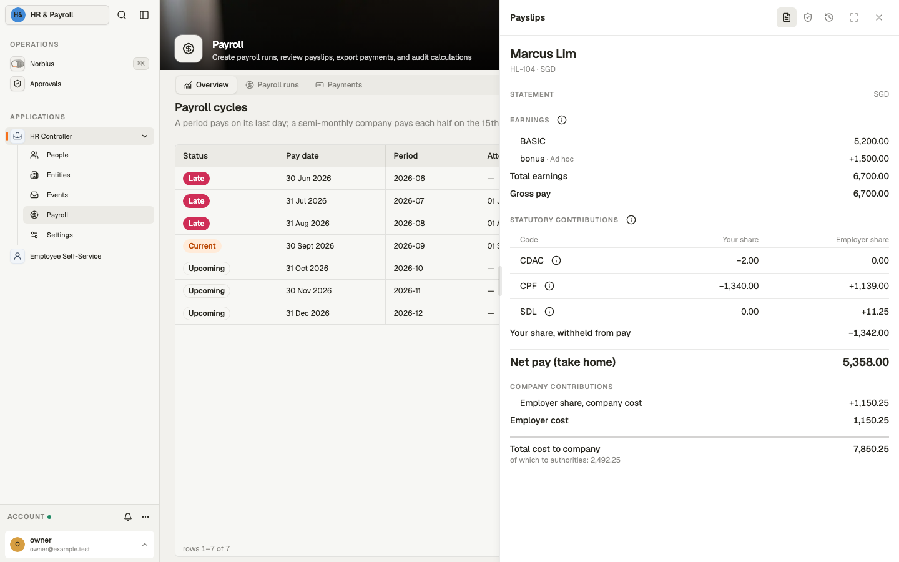

Open a payslip for the statement: earnings (basic pay, allowances, claims, ad hoc items), each
statutory contribution with the employee's and the employer's share, take-home pay, and the total
cost to the company.

A payslip is **DRAFT** until paid. It can be put **ON_HOLD** (held payslips are left out of bank
files) and marked **PAID** with the day it was paid. A paid payslip cannot change. **Payments**
records payment events and settlements outside a contract.

## Settings

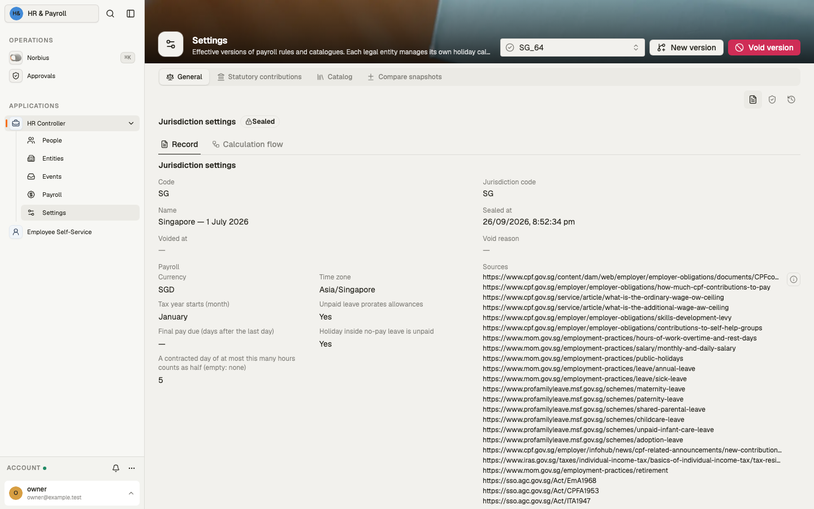

Pick a country version at the top: each country lists its versions by the dates they govern, marked
in force, sealed, draft or voided.

- **General**: currency, time zone, tax year, work rules and the official sources.
- **Statutory contributions**: the schemes (for Singapore: CPF, SDL, CDAC, ECF, MBMF, SINDA) and
  their rates.
- **Catalog**: leave types, claim, loan, allowance and ad hoc classes.
- **Compare snapshots**: what changed between two versions.

**New version**, **Seal version** and **Void version** sit in the header of the **General** tab.
**New version** starts a draft from the current one. Sealing a draft freezes it; **Void version**
retires one. Both need approval.

## Employee Self-Service

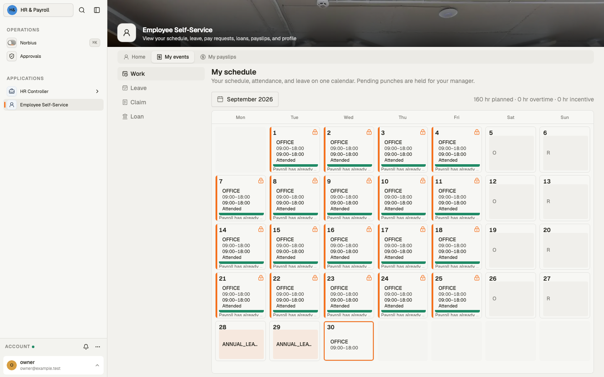

An employee sees only their own records. **Home** has their profile, contract and next payday.
**My events** has four pages:

- **Work**: their month, planned shifts and attendance. A punch they report waits for their
  manager.
- **Leave**: balances and their leave applications. **New** applies for time off.
- **Claim**: their claims. **New** raises one, with the receipt.
- **Loan**: their loans.

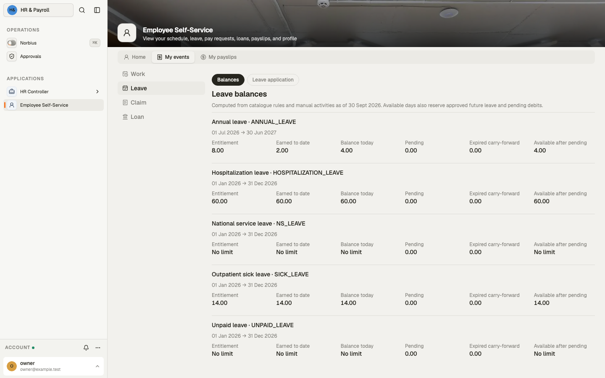

Balances are worked out on the day from the country's leave rules and the person's recorded leave:
the entitlement, what is earned so far, the balance, what is pending approval, and what is
available.

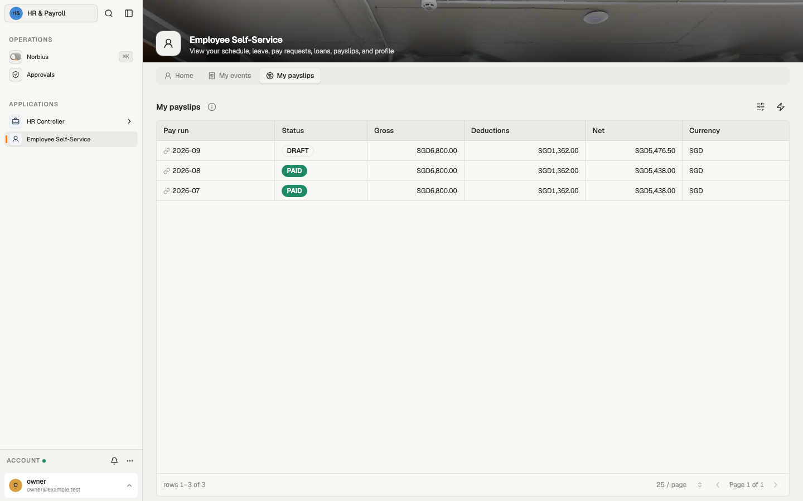

**My payslips** lists every payslip with its status, gross, deductions and net pay.

## Attendance Kiosk

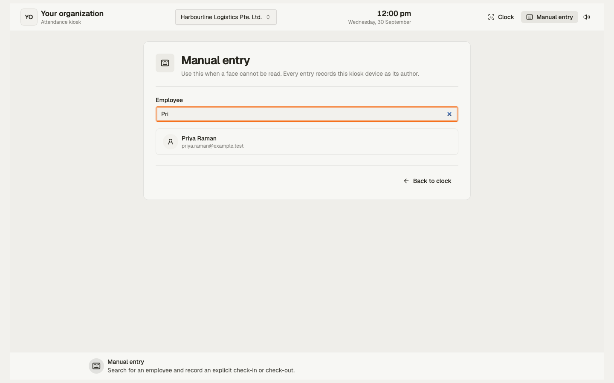

A time clock for a shared tablet, signed in as the `Attendance Kiosk` team. Pick the legal entity,
then:

- **Clock**: the camera recognises an enrolled face and records a check-in or check-out.
- **Manual entry**: search for a person by name or email and record a check-in or check-out. Every
  entry records the kiosk device as its author.

The kiosk can also enrol faces for people waiting to be enrolled.

## How it works

**Approvals.** A write that needs approval waits in **Approvals** and is not used until approved.

| What                                     | Who approves                                         |
| ---------------------------------------- | ---------------------------------------------------- |
| Time off, attendance an employee reports | `L1 Manager`, `HR Manager` or `Senior Management`    |
| Other leave activities recorded by HR    | `HR Manager` or `Senior Management`                  |
| A claim a person raises for themselves   | `HQ Payroll HR`, `HR Manager` or `Senior Management` |
| A separation payment raised on departure | `HR Manager` or `Senior Management`                  |
| A payroll run created by `HQ Payroll HR` | `HR Manager` or `Senior Management`                  |
| Sealing or voiding a country version     | `HR Manager` or `Senior Management`                  |

**Payroll runs.**

- One regular run per entity and period.
- A run reads the contract terms, work pattern, roster, attendance, published holidays, approved
  leave, claims, ad hoc items and loan repayments of its period. It computes each payslip under the
  country version in force.
- An approved entry that arrives after its period's run is paid by a later run, against its
  original contract.
- A loan repayment is recovered whole by one payslip, and only within the net-pay limit.
- A paid payslip freezes that person's days and the records it settled.

**Records that stay.**

- Approved leave is changed only by a reversal and a replacement.
- Contract terms that a payroll run used are never rewritten; a change starts new terms.
- A sealed country version is never edited; a change is a new version.

**Leave.** Time off is refused when the leave type needs a certificate and none is attached.
Annual leave also needs the person's attendance on record for the service year, so that absence can
be counted.

**Claims.** A claim type can require a receipt; its claims are refused without one. Some claim
types also ask for facts about the expense (for medical claims: who was treated, where, and by a
qualified practitioner).

**Automations.**

| Automation               | When                                                         | What it does                                                                                                         |
| ------------------------ | ------------------------------------------------------------ | -------------------------------------------------------------------------------------------------------------------- |
| Late arrival notice      | At each shift start plus the entity's grace (15 min default) | Reminds the production manager, once per person-day, of a rostered shift with no clock-in. Approved leave excuses it |
| Leave encashment on exit | When a contract's end, exit reason or exit facts change      | Raises unused leave encashment and eligible separation payments for approval                                         |
| Leave encashment due     | Daily at 01:00 UTC                                           | Does the same for departures recorded in advance, once they fall due                                                 |
| Holiday import           | Every 1 October, or by hand                                  | Adds next year's holidays from each entity's Google calendar, unpublished                                            |
| Statutory drift          | Monthly, or by hand                                          | Checks each country version against its official sources and puts reported changes in one draft for review           |
| Payroll export           | From the Payroll runs toolbar                                | Builds the bank files, payslip PDFs, payroll workbook and catalogue entries                                          |

None of them publishes, seals or pays anything on its own.

**Assistant.** **Norbius** answers questions about the workspace and records hires, contract
changes, leave, claims and loans on a person's behalf, within that person's own access.

## Connections

| Setting                                        | For                                                                                            |
| ---------------------------------------------- | ---------------------------------------------------------------------------------------------- |
| `GOOGLE_CALENDAR_API_KEY` (Settings → Secrets) | The holiday import reads each entity's Google holiday calendar. Imports are refused without it |
| `GOOGLE_CALENDAR_BASE_URL`                     | The Google Calendar API address. Leave the default                                             |
| AI models                                      | Norbius, and the monthly statutory drift research                                              |

## Further reading

- [Architecture](architecture.md): models, calculation and settlement
- [Leave](leave.md): entitlement, balances, manual activity, approval and payroll
- [Scheduling](scheduling.md): patterns, rosters, attendance, holidays and kiosk
- [Attendance](attendance.md): roster, day type, planned overtime, clock, cut-off and lock
- [Source data](data.md): input evidence, provisioning and reconciliation
- [Expression reference](expression-context.md): fields and functions for rule expressions
- [Verification record](verification.md): acceptance and known limits
- [Jurisdiction obligation registers](inventory/README.md): the law per country and open findings
