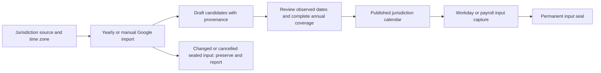
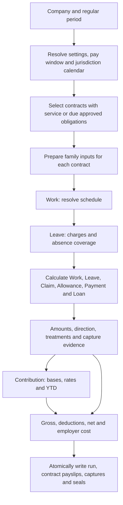
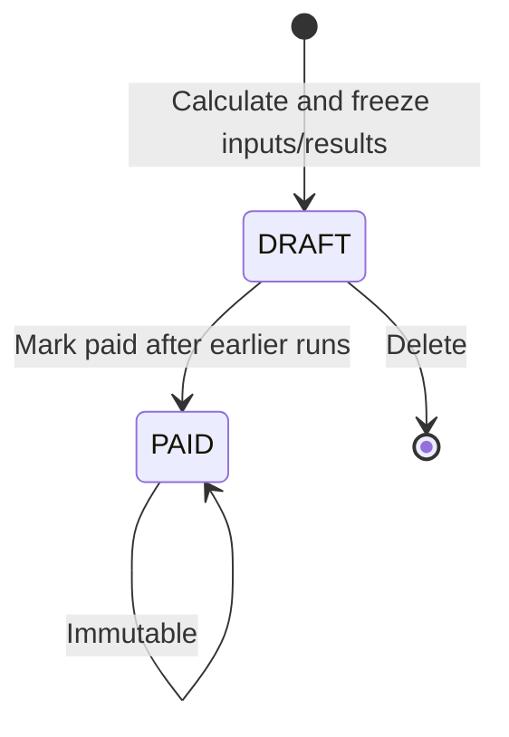

# HR and payroll architecture

Payroll settles approved family inputs for an employment contract. Each family owns its catalogue,
activity and calculation rules. Payroll combines monetary results, applies Contribution, and commits
one result graph. Catalogue content is the policy; there is no separate policy object for each
business action.

This document describes the implemented family source boundary. The combined contract, Payment and
holiday changes remain under integration: artifact sync, generated migrations, type checks,
full-suite checks and browser acceptance are still required. No deployment status is implied.

## Identity and family ownership

`employees` identifies a person. `employments` identifies one contract with one legal entity and one
uninterrupted service period. Every employee event, loan instalment and payslip references its
`employment_id`; shared catalogues and jurisdiction calendars are not employee events.

For each employee/entity pair, service dates cannot overlap, including future contracts. Departure
is the last active day, so a same-entity rehire starts later. A person may simultaneously have active
contracts in other entities, each with its own pay and entitlement. Rehire starts a fresh contract;
old activity and unpaid obligations stay on the old contract.

The first committed reference permanently seals the contract through `employment_contract_inputs`.
Deleting the referring event or draft payroll does not remove that evidence. Pending references also
prevent conflicting contract edits. A sealed contract cannot be edited, reassigned, reopened or
deleted. Departure is recorded once on the contract (`exit_date`, `exit_reason`, `exit_note`);
once set, those three columns are immutable and the sealed contract terms stay unchanged. It
generates no encashment, carry or departure package.

Effective terms amendments belong to the same stint and do not reset service. Contribution retains
any person/entity/year aggregation required by its scheme; a new contract does not erase paid YTD.

Jurisdiction-relative residency belongs to effective `employment_terms.residency_status`. Concurrent
contracts in different jurisdictions can therefore have different standings. Eligibility resolves
the term effective on the date being evaluated. An unrecorded standing remains unknown; it is not
inferred from nationality or a shared employee-profile value.

| Family       | Catalogue                                      | Contract inputs                                                                 | Results                                                      |
| ------------ | ---------------------------------------------- | ------------------------------------------------------------------------------- | ------------------------------------------------------------ |
| Work         | `work_catalogue`                               | Terms, patterns, roster codes, `work_days`, holiday inputs and absence coverage | Salary, overtime, unexplained absence                        |
| Leave        | `leave_catalogue`                              | Contract history and `leave_entries`                                            | Paid/unpaid absence coverage, reductions, entered encashment |
| Claim        | `claim_catalogue`                              | `claim_requests`                                                                | Reimbursements                                               |
| Allowance    | `allowance_catalogue`                          | `allowance_requests`                                                            | One-off or recurring allowances                              |
| Payment      | `payment_catalogue`                            | `payment_requests`                                                              | Bonuses, notice pay, separation payments and corrections     |
| Loan         | `loan_catalogue`                               | `loans` and `loan_repayments`                                                   | Recovery deductions                                          |
| Contribution | `statutory_contributions` (with their `bands`) | Contract statutory facts and source-family results                              | Employee deductions and employer costs                       |

Different business inputs retain typed collections. A family interface does not require a universal
entry table. `lib/payroll/family.ts` carries the shared pay-item metadata. Work declares metadata for
salary, overtime, excess overtime and absence; Leave declares the metadata of its distinct monetary
outputs. Contribution consumes that metadata rather than inspecting the activity that produced it.

## Catalogue revisions and jurisdiction calendars

A company selects a settings lineage through `companies.settings_code`. `jurisdiction_settings`
versions carry that lineage's effective configuration and own the family catalogues and Contribution
rate tables through `settings_id`. `jurisdiction_code` identifies the holiday jurisdiction separately:
companies with different catalogue lineages can share the same annual calendar.

Sealing a settings version freezes its catalogue children. A change is a new draft version, reviewed
and sealed through the existing workflow. A sealed version remains available to the runs and source
entries that cite it. A wrong version can be voided through its supported path; it is not unsealed.
`lib/jurisdiction_settings.ts` resolves effective versions consistently.

`new_settings_version` clones the chosen version and its owned rows, remapping dependent references.
`statutory_drift` checks configured research sources monthly and may propose a draft with review
notes and retrieval evidence. It cannot seal its proposal or edit sealed rules. Unreachable sources
remain visible in the outcome; a failed retrieval is not evidence that the law is unchanged.

Holidays have their own annual publication lifecycle. `jurisdiction_holiday_sources` configures a
Google calendar identifier and time zone for a jurisdiction. `jurisdiction_holiday_calendars` stores
a year, revision, observed dates, provenance and import review. Holiday publication does not require
a new catalogue version. Company closures remain schedule decisions and receive no public-holiday
classification merely because the company is closed.



`holiday_import` runs each 1 October for the following year; an operator can request a jurisdiction
and year explicitly. It uses a managed connection with `GOOGLE_CALENDAR_API_KEY`, expands recurring
events and reads all pages before saving the import. It preserves all-day dates, upstream identity
and operator decisions. Partial or failed reads cannot replace coverage. The automation saves review
evidence and cannot publish a calendar.

An imported observance becomes a payroll holiday only after review. Publication declares complete
annual coverage, including a reviewed empty year where appropriate. A missing or draft calendar
blocks classification; it must not be interpreted as a year without holidays. A cross-year window
requires every relevant year.

Workday links seal their holiday input before payroll. Payroll captures also seal ordinary dates:
adding a holiday later would change the already consumed non-holiday classification. A successor
calendar must preserve sealed dates and observations, including their stable upstream identities.
Deleting a consumer, re-importing or renaming a moved event cannot bypass the seal. Existing links
keep their exact calendar revision; unlinked dates use the latest applicable published revision.
Observed substitute dates come from the jurisdiction calendar. Work applies explicit rest/holiday
precedence without inventing personal substitute holidays.

## Payroll flow



The family processing boundary has four responsibilities:

| Stage     | Payroll                                           | Family                                                                |
| --------- | ------------------------------------------------- | --------------------------------------------------------------------- |
| Prepare   | Resolve common run context and invoke preparation | Read approved domain facts, applicable revisions and earlier captures |
| Calculate | Invoke source calculations, then Contribution     | Produce results from prepared inputs without additional reads         |
| Settle    | Apply shared arithmetic and recovery ordering     | Supply direction, treatments and recoverable constraints              |
| Commit    | Return the complete atomic graph                  | Supply causal captures and frozen calculation evidence                |

`lib/payroll/families.ts` is the static coordinator used by the payroll run core:

| Entry point                   | Responsibility                                                                     |
| ----------------------------- | ---------------------------------------------------------------------------------- |
| `prepareFamilyCatalogues`     | Ask each owner for its definitions and pay-item metadata                           |
| `prepareFamilyObligations`    | Prepare approved Leave and monetary obligations for contract selection             |
| `prepareFamilyInputs`         | Prepare Work, Loan and Contribution facts and required historical Allowance inputs |
| `prepareFamilyHistory`        | Resolve earlier captures, recoveries and Contribution YTD                          |
| `finalizeFamilyConfiguration` | Complete shared prepared configuration, source treatments and calendar evidence    |
| `calculateFamilies`           | Coordinate source-family calculations in dependency order                          |
| `calculateFamilyAssessments`  | Validate family inputs/results and assess grouped Contribution                     |

The owners are `lib/payroll/work.ts` for Work, `money.ts` for the shared Claim/Allowance/Payment
implementation, `loan.ts` for Loan, `contribution.ts` for Contribution and `lib/leave/payroll.ts`
for Leave. The family modules own their source/catalogue reads and definition dispatch. The
coordinator preserves cross-family ordering and the Work/Leave dependency without creating another
editable catalogue or a universal entry table.

`collections/payroll_runs/lib/engine.ts` orchestrates the run: `gatherPayrollRun` resolves shared
context through configuration and gather, which invoke family preparation; `buildPayrollRun` invokes
family assessments, applies common settlement and passes the result to `graph.ts`. Calculation uses
prepared facts without database writes. The run core does not query family-owned source/catalogue
tables or dispatch their calculation definitions.

The engine phases are PICK, VALIDATE, GATHER, MEASURE, ACCUMULATE, CONTRIBUTE, SETTLE and GRAPH.
Preparation gathers the input snapshot once. Validation refuses incomplete treatments, required
facts, open clocks, missing calendar coverage, invalid references and truncated reads. Nothing is
persisted until all contracts have a valid result graph.

Paid time off provides Work with absence coverage and does not add a second salary payment. Unpaid
time off produces one Leave reduction and is excluded from unexplained absence in Work. For daily
and hourly wages, paid and unpaid leave coverage must preserve the same no-double-charge rule.

### Run lifecycle and captures

Exactly one run is permitted per company and period. There is no ad hoc or supplemental run.



A draft is a frozen calculation. Replacing it means deleting it and creating another. Paid results
cannot be edited or deleted. A late approved entry or correction remains outstanding for a later
regular period. New runs require existing company runs to be paid so YTD does not move underneath
the calculation.

`payroll_runs` stores configuration and calculation identity once per run. Each `payslip` belongs to
one contract and holds base, proration and statutory arrays. `payslip_adjustments` names its causal
capture; the family-specific `payslip_*_inputs` relations retain source identity, including sources
that produced zero money. The source and capture must belong to the payslip's contract.

Single-use monetary entries settle once. Loan instalments may be recovered partially; their
outstanding amount is the scheduled amount less paid recoveries. Other monetary obligations and
statutory charges settle in full. If net remains negative after the permitted Loan reduction, the
whole calculation is refused before captures are committed.

### Periods, cutoffs and service boundaries

Three dates remain distinct:

| Concept                          | Example                     |
| -------------------------------- | --------------------------- |
| Salary period                    | 1–31 January                |
| Attendance window with cutoff 21 | 21 December–20 January      |
| Pay date                         | The configured payment date |

The attendance cutoff is its first included day. Money-entry defaults are separate: with cutoff 21,
an event on or before the 21st defaults to that calendar month; a later event defaults to the next
month. An explicit `pay_period` chooses the earliest intended regular period without changing the
service/receipt date. An overdue uncaptured entry remains due after that period passes.

A monthly company uses `YYYY-MM`; a semi-monthly company uses `YYYY-MM-1` and `YYYY-MM-2`. At a
semi-monthly company, semi-monthly contracts settle each half; monthly, daily and hourly contracts
settle in the second run on their applicable window. Half-month wage fractions use the full month's
denominator. Withholding projections account for both the number and size of remaining payslips.

Salary covers the intersection of service dates and effective terms. A late joiner whose first
attendance window has closed can be deferred; the next run derives the skipped contractual wages
without creating a manual Payment entry. Attendance remains in its own window and is not paid twice.
The final service period extends attendance to the departure date and prorates wages through that
date. A contract that both starts and ends in the period is settled rather than deferred beyond its
end. Outstanding manual payments remain attached to an ended contract without restarting salary,
recurring allowances or entitlement.

### Manual departure package

Recording resignation, misconduct or another departure reason creates no monetary request. HR
submits the approved items independently through their owning families.

For example, a contract ending 30 June has six days of computed final entitlement and four used days.
HR enters a Leave `ENCASHMENT` for the remaining two days, an agreed rate of 100 and gross amount of 200. Leave validates the available quantity and arithmetic. Approval consumes those two days and
makes the entered amount due; payroll does not calculate a resignation-specific price.

A separate approved separation payment belongs to Payment. An outstanding expense belongs to Claim;
contracted wages belong to Work; repayment belongs to Loan. A shared supporting reference can group
the package without creating a duplicate lump sum. HR determines its completeness. A later regular
payroll settles uncaptured obligations against the original contract, even after a rehire.

## Leave activity and computed entitlement

`leave_entries` contains approved immutable business activities: `TIME_OFF`, `ENCASHMENT`,
`CARRY_FORWARD`, `ADJUSTMENT` and `REVERSAL`. There is no annual entitlement account, generated
opening/accrual row, refresh job or second record mirroring each time-off application.

The catalogue defines eligibility, service bands, annual window, availability, proration and
paid/unpaid treatment. Entitlement is queried for a contract, stable leave code, window and date
using the effective facts required by that calculation. Unlimited leave retains eligibility,
approval and usage records while omitting the numerical ceiling.

```text
available quantity
  = computed entitlement
  + approved incoming carry and adjustments
  - approved time off, encashment and outgoing carry
  - expired unused credit
```

Application validation also accounts for held debit reservations, approved future commitments and
the validity of each credit on the date it would be consumed. Pending credits are not spendable.
Balances and source allocations must be revalidated at approval and under concurrent writes.

A manual carry entry names both source and destination windows, quantity and credit validity. Its
creation date does not decide which year receives it. Encashment names its quantity and approved
monetary terms. Neither action is automatically generated at year end or departure.

Time off preserves a contiguous half-day range and its exact dated charges and calendar/schedule
provenance. Each payroll settles only its own dates in that range. A reversal restores the original
allocations and expiry; a paid monetary reversal offsets the captured amount instead of reopening
the original obligation. A carry reversal must not restore source credit already spent at the
destination. See [Leave](leave.md) for the full validation and correction contract.

## Work calculation

### Schedule, overrides and observed time

A named `shift_patterns` row is referenced by effective employment terms. `PATTERNED` projects a
cycle from an anchor, including phased rotations. `ROSTERED` expresses a contractual workload where
HR supplies assignments. No pattern means rostered as assigned.

A `work_days` row belongs to one contract and date. Its planned roster code overrides that date's
assignment; its actual side contains worked intervals and break minutes. An attendance-only row
keeps the projected plan. For a patterned contract, no row means worked to the base with no overtime;
a reviewed empty interval list on a Work day is absence unless Leave supplies coverage. Rostered
contracts need explicit assignments and any configured workload validation.

`shift_definitions` is the physical collection for roster codes. The variants are `WORK`, `REST`
and `OFF`; holidays are never roster codes. A Work code supplies start, end and unpaid break, from
which paid minutes and crossing midnight are derived. REST remains a protected baseline when work
is assigned over it; OFF is another non-working day. Work uses calendar-backed day classification
and configured holiday/rest precedence before applying the monetary ladder.

### Duration and pricing

Overtime is derived from clock intervals against the effective schedule. Open, reversed or
overlapping intervals cannot be priced. Source columns labelled OT hours or incentive OT are not
payroll inputs. Early-arrival handling, shift boundaries and unpaid breaks are applied by the dated
calculation. Payable overtime is floored to half-hour units: 1.99 becomes 1.5; 2.49 becomes 2.0.
There is no round-up or automatic one-hour minimum.

An annualised hourly-rate configuration uses:

```text
hourly rate = round(monthly salary × 12 / (weekly hours × 52), 2)
dated rate  = round(hourly rate × statutory multiple, 2)
dated pay   = round(dated units × dated rate, 2)
period pay  = sum(dated pay inside the settlement window)
```

Where the applicable Work rules require the Malaysian statutory floor, the comparison is with
`round((monthly salary / 26) / normal daily hours, 2)`. The higher hourly rate applies. Ordinary and
off-day work use the ordinary ladder. Rest and public-holiday work may combine a day-wage award
within normal hours and an hourly award beyond them; a flat source multiplier cannot express that.

Base salary is segmented at effective term boundaries and each segment uses the same full-period
proration denominator. Proration is Work catalogue configuration. Calendar-day proration uses the
month's actual days; a fixed-day basis uses its configured divisor. Neither is inferred from an
output workbook.

### Excess overtime and compliance

Work has separate overtime and excess-overtime output metadata. Both amounts are derived from the
same priced dated hours. An `INCENTIVE` boundary in the Work regime can classify ordinary-day value
above an explicit total-work boundary as excess. With no such arrangement, the daily/monthly controls
provide the classification boundaries. Reclassification retains the value of earned work.

The Malaysian configuration distinguishes a daily total-work boundary from the calendar-month
ordinary/off-day overtime counter. The latter excludes rest-day/public-holiday awards and advances
chronologically by the full qualifying duration. A daily excess must not make the same hours vanish
from the monthly counter.

Compliance classification and payment selection use different windows. A 21 December–20 January
settlement may need the whole December and January calendars to classify hours, but only pays its
own dates. There is no blanket one-month incentive delay.

Validation follows the configured limit behavior: a monthly `BLOCK` breach refuses the run;
`WARN` reports the breach. Current daily work/overtime checks emit warnings. A paid or reclassified
amount is not proof that scheduling complied with the law.

### Coverage

`work_catalogue.regime.overtime_coverage` states a wage basis, ceiling and inclusivity, category
basis, exemptions/exclusions and authority. `coverage.ts` evaluates excluded categories first,
then exemptions, then the wage test. It returns COVERED, NOT_COVERED or UNDETERMINED. Missing wage
basis or mismatched currency cannot be replaced with a convenient salary field. A null coverage
rule currently means universal coverage; it does not establish that the jurisdiction has been
researched.

Where the configured rule uses statutory wages, `deriveStatutoryWages` combines contracted basic
wages with eligible cash-for-work entries. This comparison uses contractual figures, not prorated
partial-month pay. Overtime itself is excluded from that input set. The current classification
cannot distinguish commissions or subsistence allowance from other earnings, and formula amounts
are unavailable at this stage. These are explicit limits of the coverage calculation.

## Contribution calculation and audit

Every monetary output has an explicit treatment for each applicable scheme code:

| Treatment          | Base effect                                               |
| ------------------ | --------------------------------------------------------- |
| `INCLUDE`          | Include the amount                                        |
| `EXCLUDE`          | Omit the amount                                           |
| `REDUCE`           | Reduce the base by the applicable absence/recovery amount |
| `SPECIAL`          | Apply a declared scheme-specific rule                     |
| `UNSET` or missing | Refuse incomplete configuration                           |

A shared code survives catalogue revisions. Historical approved entries retain their source
catalogue metadata; the current run resolves the applicable Contribution scheme and rates. Sequence
orders dependencies and reliefs. Contribution persists its base, employee and employer amounts,
band reference and special amounts so an amount-only reconciliation cannot hide an incorrect base.

`lib/payroll/contribution.ts` groups the run's contract calculations by employee and legal entity.
For compatible assessment intervals, it combines the scheme bases and special remuneration before
assessing charges once. Fixed charges, thresholds and personal relief are therefore not repeated
for each contract. The charges are allocated proportionally to the contracts' scheme remuneration,
with fractional-cent ties resolved by contract ID. Each payslip retains its own bases, special
amounts and source captures; allocations sum exactly to the combined assessment.

Different entities remain separate assessments. Conflicting salary windows, projection cadences,
registration statuses or rate overrides refuse the grouped calculation rather than selecting one
contract's interpretation. Company headcount counts distinct employees, not contract rows.

YTD is calculated from earlier PAID results in the tax year for the relevant person/entity/scheme.
It is not a mutable accumulator. Proration rows explain base wages and do not contribute a second
amount. A correction is a new approved family entry in a later regular payroll, with a reference to
the original output and contract. Paid configuration, captures and output remain unchanged.

```text
family catalogue revision ──→ frozen run configuration
contract + approved input ──→ source capture ──→ payslip adjustment
contract and effective terms ────────────────→ payslip base/proration
source-family amounts + treatments ─────────→ contribution results
```

The run retains actual configuration values, applicable holiday snapshots and calculation version.
A hash alone cannot reproduce a result. Captures preserve business source identity and distinguish
"read and worth zero" from "not read". Permanent contract and holiday seals outlive draft captures.

## Applications and authoring boundaries

Controller uses a shared entity selection. People holds profiles, contracts, terms, statutory facts
and departures. Events has Work, Leave, Claim, Allowance, Payment and Loan pages. Settings → Catalog
holds family definitions, including Contribution; Settings → Holidays owns import, review and annual
publication. Employee Events presents the same family navigation scoped to the selected contract.

Scheduling and Leave use related reads for source rows, effective terms, calendars and captures.
Computed balances are query results; screens do not subscribe to stored entitlement accounts.
Policy grants decide whose activity can be submitted and who can approve it. Payroll uses only
approved committed inputs; held creates reserve eligible quantities without becoming payable facts.

The kiosk writes ordinary Work events against a contract. Its camera assets resolve relative to the
versioned artifact, and manual entry remains available when camera recognition is unavailable. See
[Scheduling and attendance](scheduling-leave-proposal.md) for the operational layers and current
integration boundaries.

Models live in `src/collections`, relationships in `src/collections/+relationship.ts`, representations
with their collections and family preparation/calculation in `src/lib/payroll` and `src/lib/leave`.
Shared calculation primitives and run orchestration remain in `src/collections/payroll_runs/lib`.
Generated types, artifacts and migrations come from Bolt tooling and are not authored by hand.
Public acceptance fixtures contain invented data; private reconciliation evidence is described in
[Data](data.md) and is not copied into the template.

## Retained statutory research record

This section preserves the earlier source assessment behind the Work implementation. It is a
research record, not a fresh legal verification or a statement that all jurisdictions are complete.
Effective, cited catalogue values and their review govern each deployment.

The recorded Malaysian ladder cites ordinary overtime at 1.5 times hourly rate, rest-day awards at
half/full day wage plus 2 times hourly rate beyond normal hours, and public-holiday awards at twice
day wage plus 3 times hourly rate beyond normal hours. The two recorded limits measure different
quantities: 104 overtime hours per calendar month and 12 total work hours per day. Their authorities
are EA 1955 ss.60, 60A and 60D, with the 1980 overtime-limitation regulations. These figures must not
be reused as defaults for other jurisdictions.

The recorded First Schedule coverage interpretation uses an inclusive RM4,000 threshold on its stated
wage basis, exempt manual-labour/supervision/commercial-vehicle categories and exclusion for vessel
work. The source assessment below distinguishes primary instruments from reproductions.

| Fact                                                                                                                          | Source                                                                                     | Tier                                 |
| ----------------------------------------------------------------------------------------------------------------------------- | ------------------------------------------------------------------------------------------ | ------------------------------------ |
| First Schedule paras 1, 1A, 2, 3 as substituted; P.U. (A) 262; gazetted 15 Aug 2022                                           | Malaysian Employers Federation circular AG 16/2022, reproducing the Order's table verbatim | Secondary, verbatim reproduction     |
| s.60A(1)(a)–(d), provisos (i)–(iii), s.60A(3), s.60A(4)(a); Part XII heading and contents; s.2 "wages"; First Schedule para 3 | Laws of Malaysia reprint, Act 265                                                          | Primary                              |
| "forty-eight" → "forty-five" in s.60A(1); s.60A(1)(a) unamended                                                               | Laws of Malaysia, Act A1651 s.20 (gazette print)                                           | Primary                              |
| 104 overtime hours in any one month                                                                                           | Employment (Limitation of Overtime Work) Regulations 1980 reg.2, JTKSM/MOHR published copy | Primary                              |
| Commencement deferred from 1 Sep 2022 to 1 Jan 2023                                                                           | Consistent across several law-firm publications; **no instrument was located**             | Secondary, uncorroborated by gazette |
| Labor Code arts. 82, 83, 85, 87                                                                                               | LawPhil reproduction of P.D. 442                                                           | Secondary, verbatim reproduction     |
| Meal period shortened to 20 min is compensable                                                                                | Omnibus Rules Book III Rule I s.7, via secondary summaries only                            | Secondary, not relied on             |
| PP 35/2021 Pasal 26, 27, 29                                                                                                   | JDIH Kemnaker published PDF                                                                | Primary                              |
| UU 13/2003 Pasal 79(2)(a) as amended                                                                                          | UU 6/2023 Bab IV text                                                                      | Primary                              |

The earlier research did not establish the paid/unpaid status of the Malaysian leisure break or
the Philippine ordinary meal period from the cited primary wording. The current Work regime stores
optional `rest_break_rules` with a consecutive-hours trigger, minimum duration, working-time treatment,
applicability, enforcement choice and authority. Omitted or empty rules produce no assessment.

`restBreakAssessment` reads worked intervals, qualifying gaps and recorded break minutes.
`deriveDailyOvertime` reduces raw payable overtime by a quantified break shortfall only when the
configured rule explicitly has `counts_as_worked_time: false`, before applying the half-hour floor.
True or null treatment causes no additional reduction, and a recorded break is not deducted twice.
A null minimum duration or an open interval leaves the shortfall unquantified. The implementation's
strict consecutive-hours comparison and lack of a recorded continuous-attendance exception remain
limitations; a duration alone does not establish full break compliance.

Payroll overtime consumes this assessment. The source also provides break-message and write-blocking
helpers, but their existence does not establish roster enforcement: the day-sheet notice remains an
integration slot and the Work write/publish path does not currently invoke those helpers.

Remaining research/model limitations include commission/subsistence wage classification; formula
wages in the coverage comparison; Philippine exclusions beyond represented categories; Indonesia's
contract-dependent exempt occupational groups; and unverified Singapore, Vietnam and Taiwan coverage.
Normal-work limits such as weekly hours and daily spread require their own measured facts. This
record must not be read as evidence that those gaps are closed by the family migration.

### Reference links

- [Employment Act 1955 (current JTKSM download page)](https://jtksm.mohr.gov.my/en/borang/employment-act-1955)
- [Employment (Limitation of Overtime Work) Regulations 1980](https://jtksm.mohr.gov.my/sites/default/files/2023-03/7.%20EMPLOYMENT%20%28LIMITATION%20OF%20OVERTIME%20WORK%29%20REGULATIONS%201980_0.pdf)
- [JTKSM Employment Act 2022 amendment FAQ](https://jtksm.mohr.gov.my/ms/soalan-lazim/akta-kerja-1955-pindaan-2022)
- [EPF employer contribution guidance](https://www.kwsp.gov.my/en/employer/responsibilities/mandatory-contribution)
- [PERKESO contribution rates](https://www.perkeso.gov.my/en/rate-of-contribution.html)
- [LHDN PCB specifications](https://www.hasil.gov.my/majikan/potongan-cukai-bulanan-pcb/)
