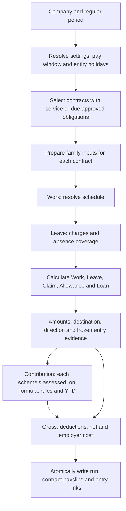
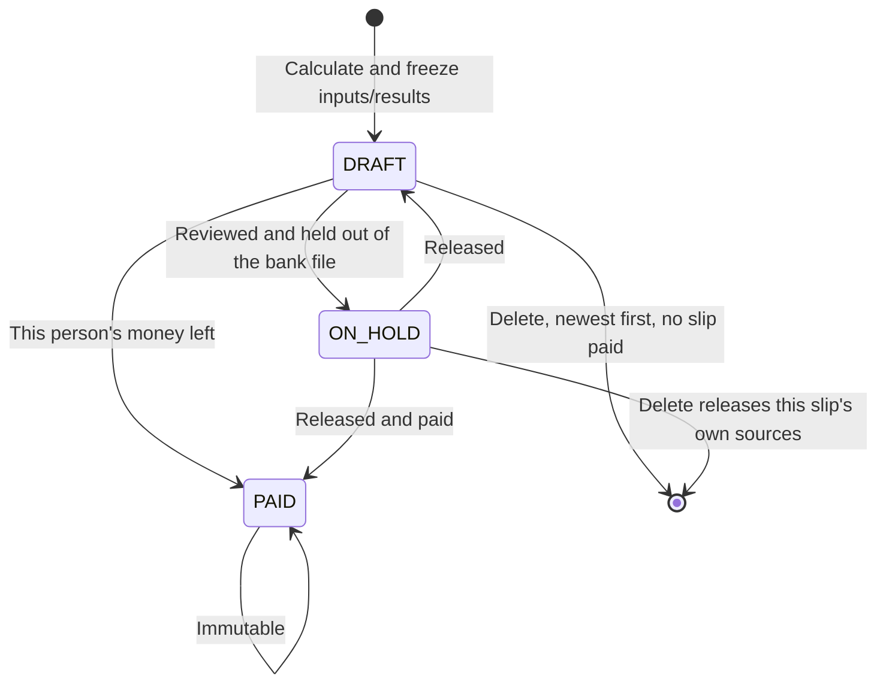

# HR and payroll architecture

Payroll settles approved family inputs for an employment contract. Each family owns its catalogue,
activity and calculation rules. Payroll combines monetary results, applies Contribution, and commits
one result graph. Catalogue content is the policy; there is no separate policy object for each
business action.

This document describes the implemented family source boundary. The combined contract, catalogue
and contribution changes are verified locally by artifact sync, generated migrations, type checks,
full-suite checks and browser acceptance. No deployment status is implied.

## Identity and family ownership

`employees` identifies a person. `employments` identifies one contract with one legal entity and one
uninterrupted service period. Every employee event, loan instalment and payslip references its
`employment_id`; shared catalogues and entity holidays are not employee events.

For each employee/entity pair, service dates cannot overlap, including future contracts. Departure
is the last active day, so a same-entity rehire starts later. A person may simultaneously have active
contracts in other entities, each with its own pay and entitlement. Rehire starts a fresh contract;
old activity and unpaid obligations stay on the old contract.

The first committed reference seals the contract: while any employee event, term, loan or payslip
names it, it cannot be edited, reassigned, reopened or deleted, and a held (provisionally
committed) reference guards it the same way. There is no separate seal log; a contract whose every consumer has been removed is editable
again. Consumed term dates are read off the consumers (`work_days.work_date`, approved Leave charges,
`payslips.terms_through`). Departure is recorded once on the contract (`exit_date`, `exit_reason`, `exit_note`);
once set, those three columns are immutable and the sealed contract terms stay unchanged. Closing
the range raises the leaver's encashment, held for review ([leave.md](leave.md#encashment-on-departure));
it generates no carry or departure package.

Effective terms amendments belong to the same stint and do not reset service. Contribution retains
any person/entity/year aggregation required by its scheme; a new contract does not erase paid YTD.

Jurisdiction-relative residency belongs to effective `employment_terms.residency_status`. Concurrent
contracts in different jurisdictions can therefore have different standings. Eligibility resolves
the term effective on the date being evaluated. An unrecorded standing remains unknown; it is not
inferred from nationality or a shared employee-profile value.

| Family       | Catalogue                                      | Contract inputs                                                                        | Results                                                                                                                |
| ------------ | ---------------------------------------------- | -------------------------------------------------------------------------------------- | ---------------------------------------------------------------------------------------------------------------------- |
| Work         | `settings.work_rules`                          | Terms, patterns, roster codes, `work_days`, holiday inputs and absence coverage        | Salary, the overtime classes, incentive and unexplained absence                                                        |
| Leave        | `leave_catalogue`                              | Contract history and `leave_entries`                                                   | Paid/unpaid absence coverage, reductions, engine-priced encashment                                                     |
| Claim        | `claim_catalogue`                              | `claim_requests`                                                                       | Reimbursements                                                                                                         |
| Allowance    | `allowance_catalogue`                          | `allowances` (the standing sources) and `allowance_entries` (what each payslip priced) | Standing allowances, prorated like basic salary: transport, housing, a bonus keyed as a one-period window, corrections |
| Loan         | `loan_catalogue`                               | `loans` and `loan_repayments`                                                          | Recovery deductions                                                                                                    |
| Contribution | `statutory_contributions` (with their `rules`) | Person statutory facts and source-family results                                       | Employee deductions and employer costs                                                                                 |

Different business inputs retain typed collections. A family interface does not require a universal
entry table. `lib/payroll/family.ts` carries the shared pay-item metadata: every catalogue row and
every engine-priced Work line states its `destination` (`PAY`, `NET`, `EMPLOYER`, `DISPLAY`) and
`direction` (`ADD`/`SUBTRACT`), which is the §9 table the settlement reads. Work is not a catalogue:
its lines live on `settings.work_rules`, priced by `bands` in declaration order. Leave
declares the metadata of its distinct monetary outputs. Contribution reads each scheme's own `assessed_on`
formula over the settled lines rather than inspecting the activity that produced a line.

## Catalogue revisions and holidays

A company selects a settings lineage through `companies.settings_code`. `jurisdiction_settings`
versions carry that lineage's effective configuration and own the family catalogues and Contribution
rate tables through `settings_id`. `jurisdiction_code` identifies the payroll jurisdiction, which
decides the statutory regime — not the calendar: holidays belong to the employing entity.

Sealing a settings version freezes its catalogue children. A change is a new draft version, reviewed
and sealed through the existing workflow. A sealed version remains available to the runs and source
entries that cite it. A wrong version can be voided through its supported path; it is not unsealed.
`lib/jurisdiction_settings.ts` resolves effective versions consistently.

`new_settings_version` clones the chosen version and its owned rows, remapping dependent references.
`statutory_drift` checks configured research sources monthly and may propose a draft with review
notes and retrieval evidence. It cannot seal its proposal or edit sealed rules. Unreachable sources
remain visible in the outcome; a failed retrieval is not evidence that the law is unchanged.

A version is identified by its snapshot id `<code>_<index>`, counting from the lineage's oldest
version (`MY_1`, `MY_2`, …), so a successor extends the roll without renumbering an id an operator
has already seen. The window is read half-open — `[start, end)` — so a version governs from its
start day up to, but not including, its end; the end is the first day its successor governs, and the
display prints the last governed day. `change_summary` records, in the operator's words, what the
version changes against its predecessor; the engine never reads it. The Settings app's **Compare
snapshots** tab diffs two versions of one lineage: the settings fields (`payroll`,
`work_rules`, `sources`, `facts`) and every catalogue that hangs off a version — Contribution,
Leave, Claim, Allowance and Loan — matched by `code` with leaf-level changes, additions and removals.
Holidays are entity-owned, so they are not part of a lineage diff.

**Holidays are entity-owned. There is no per-jurisdiction holiday concept.** `jurisdiction_holidays`
stores one observed day per entity — `unique(company_id, date)` — with its name, the original date
when the observance moved, provenance and `published_at`. Two entities in the same country keep
different calendars: a factory on its state's gazetted days and the office beside it on the federal
ones is the ordinary case, not an exception to model around. Publication is per holiday and needs
no catalogue version. Company closures remain schedule decisions and receive no public-holiday
classification merely because the company is closed.

`companies.holiday_source` names the Google calendar identifier and time zone the entity's annual
drafts are read from; it is operational configuration on the entity, under no seal, and the annual
import iterates entities. An entity that configures none falls back to the public calendar of the
country its settings lineage names, so an API key alone is enough to import.

If it is published, it is used; if it is not, it is not there. Rosters, leave and payroll read the
entity's published holidays at the point of reading; nothing asks a year to be complete first, and
a missing day is simply not a holiday. Every door in — the record form, the holidays spreadsheet,
the Google import — passes through one dedupe: a day the entity already has is skipped, never
duplicated or overwritten, and an import never publishes. The spreadsheet names entities rather
than ids and one file may carry every entity at once; a name that resolves to no entity refuses the
whole file naming every such row, and a day duplicated in the file or already on record is reported
with its reason rather than counted.

The holidays surface is the entity's own, paginated a year at a time — a year's worth is reviewed at
a time, and a table showing every year at once cannot be checked against a gazette.

A holiday that has been read is history, and the freeze derives from the live references,
not a stamp. Work days never link a holiday — the calendar is overlaid by date — and payroll
captures the holidays it read on the run (`payroll_runs.holidays`); retracting a holiday
(unpublish, moving its day or entity, delete) is refused while a run captures it, while any Leave charge that names the
holiday refuses the change. A finished run is never touched by a holiday published later,
and a holiday published after a run has no effect on that run. Observed substitute dates are
their own rows with an `original_date`. Work applies explicit rest/holiday precedence without
inventing personal substitute holidays; a SUBSTITUTE row's `given_to` is evaluated per person
(pattern plus `work_days` plus Leave).

### No figure of the engine's

Every figure and every code-keyed decision lives on a version's row, never in the engine. What the
engine used to infer it now reads: the row that off-boarding pays out is `leave_catalogue.encash_on_exit`,
not a code prefix; a day-in-lieu row is `entitlement.availability: CREDITED`, not a code; a scheme's
printed name, its place in the entity's listing and the column it folds into are
`statutory_contributions.short_name`, `listing_order` and `listing_group`, frozen on each charge; a
daily, hourly or weekly basic becomes a month on the version's `ordinary_divisor_days`; a contract
with no roster is measured on its own `employment_terms.ordinary_hours_per_week` or the version's
`normal_hours`, and a contract stating neither is refused by name rather than priced on a figure of
the engine's. Codes are named freely inside a version's own CEL (`code('ANNUAL_LEAVE')`,
`catalog('ALLOWANCE', {exclude: ['bonus']})`); the rule is that the engine's source names none.

## Payroll flow



The family processing boundary has four responsibilities:

| Stage     | Payroll                                           | Family                                                             |
| --------- | ------------------------------------------------- | ------------------------------------------------------------------ |
| Prepare   | Resolve common run context and invoke preparation | Read approved domain facts, applicable revisions and earlier links |
| Calculate | Invoke source calculations, then Contribution     | Produce results from prepared inputs without additional reads      |
| Settle    | Apply shared arithmetic and recovery ordering     | Supply destination, direction and recoverable constraints          |
| Commit    | Return the complete atomic graph                  | Supply causal entry links and frozen calculation evidence          |

`lib/payroll/families.ts` is the static coordinator used by the payroll run core:

| Entry point                   | Responsibility                                                                     |
| ----------------------------- | ---------------------------------------------------------------------------------- |
| `prepareFamilyCatalogues`     | Ask each owner for its definitions and pay-item metadata                           |
| `prepareFamilyObligations`    | Prepare approved Leave and monetary obligations for contract selection             |
| `prepareFamilyInputs`         | Prepare Work, Loan and Contribution facts and required historical Allowance inputs |
| `prepareFamilyHistory`        | Resolve earlier links, recoveries and Contribution YTD                             |
| `finalizeFamilyConfiguration` | Complete shared prepared configuration and calendar evidence                       |
| `calculateFamilies`           | Coordinate source-family calculations in dependency order                          |
| `calculateFamilyAssessments`  | Validate family inputs/results and assess grouped Contribution                     |

The owners are `lib/payroll/work.ts` for Work, `money.ts` for the shared Claim/Allowance
implementation, `loan.ts` for Loan, `contribution.ts` for Contribution and `lib/leave/payroll.ts`
for Leave. The family modules own their source/catalogue reads and definition dispatch. The
coordinator preserves cross-family ordering and the Work/Leave dependency without creating another
editable catalogue or a universal entry table.

`collections/payroll_runs/lib/engine.ts` orchestrates the run: `gatherPayrollRun` resolves shared
context through configuration and gather, which invoke family preparation; `buildPayrollRun` invokes
family assessments, applies common settlement and passes the result to `graph.ts`. Calculation uses
prepared facts without database writes. The run core does not query family-owned source/catalogue
tables or dispatch their calculation definitions.

The three money catalogues (Claim, Allowance, Loan) share the catalogue spine — code, destination and
direction, an optional ordered band table with each band's amount and entitlement limit, and the
`evidence` it demands — which `money.ts` lifts into the engine's `ENTRY` definition. Bands are read
in order: the first band whose `when` holds for the entry supplies its amount and its ceiling; a
row with no bands settles the entry's own amount; no band holding means no entitlement, refused
when the request is written and paid nothing by the run. A Loan catalogue row adds the two facts only a debt has: `loan_type` (`STAFF`,
`GOVERNMENT`, `FESTIVE`) and `minimum_repayment`. A `GOVERNMENT` advance is owed to the authority
rather than the employer, so the final payslip does not settle it and the balance survives the
contract; the other two end with the employment like any deduction. The Allowance row carries no
cadence: every allowance is standing — a monthly amount over an effective window — and a 13th
month, a THR or a bonus is a row HR keys for the month it is paid in, priced by the row's band
over the person and the year as they stand when the window opens. A bonus, a back payment of basic
or a correction of an earlier period's engine-priced line is an allowance row (`ADJ` for basic and
allowances, `BACKPAY_ADD_WAGES` for overtime and other additional wages, excluded wherever
overtime is); there is no payment catalogue. Leave is the one catalogue with no
money: `is_npl`, `can_encash`, `evidence_after_days` and the entitlement bands. `employment_terms.grade` is the contract's benefit tier; the entry
context reads it as `terms.grade` beside department, service months and the rest.

### Statutory grammar

One expression language, CEL, is what every catalogue row, band, rate and scheme speaks, and each
site has one documented context compiled at write time by `lib/expressions` (`contexts.ts` is the
one source; the Fields panel renders it). **Six sites, one subject each:** `person` (catalogue
eligibility, a scheme's person conditions, `wages.applies_when` and `wages.scale`,
`work_rules.normal_hours`, `limits[].when`, the rest limit's `average.when`), `entry` (catalogue
bands and entitlement amounts), `work_day` (work bands, breaks, limits, the night premium,
`overtime_when`), `leave_day` (a leave band's `days` and a row's `pay_fraction`: `leave.month_index`,
`leave.day_index`, `leave.days` over the person root), `assessment`
(`statutory_contributions.assessed_on`) and `scheme` (contribution rules). **Six roots, one meaning each,** with the same members on every site that
carries them: `person` (the employee, contract and employer on the rule date), `period` (key, start,
end, index, instalments, last_of_year, days_employed — the pay month's days the employment covered
on the proration basis, the payslip's segments summed — and days_in_month), `year` (the tax year:
start, end, months_employed,
days_employed, `earned.<code>` over earlier payslips), `scheme` (code, assessment_period,
year_to_date.\* — base, employee, employer and `ordinary`, the part a scheme's `ordinary_on` stored
on each charge — projection.\*, rate_override, since, since_months, `elections.<key>`),
`produced` (`<code>.employee`, `<code>.employee_this_period`, `<code>.employer` of every scheme already charged) and `limits`
(the version's evaluated hour ceilings). A site's subject is bare — the person object on `person`,
the day on `work_day`, `base` on `scheme`, the six reserved money lines on `assessment` — and
everything else is rooted; on every site but `person` the person sits under `person.`.

The `person` root: `employee.gender`, `age`, `age_months`, `citizenship`, `marital_status`,
`spouse_status`, `dependents_count`, `solo_parent`, `race`, `religion`, `residency_months`,
`disabled`; `employment.type`, `classification`, `risk_class`, `service_months`, `service_years`,
`service_start`, `exit_date`, `exit_reason`, `absent_days_12m`; `terms.basic_salary`,
`monthly_basic`, `fixed_allowances`, `monthly_wage`, `statutory_wages`, `workman`,
`statutory_work_category`, `department`, `payroll_group`, `grade`, `ordinary_hours_per_week`,
`working_days_per_week`, `pay_frequency`, `pass_type`, `tax_residency`, `notice_days`;
`children.count`, `children.citizens`, `children.under(n)`; `company.region`, `company.headcount`,
`company.headcount_citizens`, `company.facts.<key>`; `facts.<CODE>.registered`,
`facts.<CODE>.since_months` (the person's fact under a scheme); `event.kind`, `relationship`,
`child_citizenship`, `child_age`, `child_shared_weeks`, `prior_employment_days`, `date` (the leave
entry's event, on a leave rule); `wage_floor`;
`period.working_days`, `period.unpaid_days`. Empty is everyone; an unrecorded fact reads as empty, false or zero — there
is no null — and never claims anything. Race and religion are captured only where a statutory fund
is selected by them.

Open prefixes are data, not schema: `limits.<key>`, `year.earned.<code>`, `produced.<code>`,
`scheme.elections.<key>`, `person.company.facts.<key>`. The compiler checks the prefix; the version
supplies the keys — a scheme row declares the election keys it reads (`elections: [{key, type}]`)
and a settings version the entity facts (`facts`), so a write refuses an undeclared key and the
fact editors offer the declared type's control. Every other member is refused at write when the
site does not declare it, as is a wrong result type; nothing is discovered at payroll. The
functions: `round_cent`, `truncate_cent`, `up_5_cents`, `round_unit`, `floor_unit`, `up_to_unit`,
`bracket`, `ladder` and `progressive` on every site; `minimum_wage(region)` on `person`,
`assessment` and `scheme`; `leave.days(code)` on `entry`; `code('X')` and
`catalog('ALLOWANCE' | 'CLAIM' | 'LOAN', {pick | exclude})` on `assessment`; `annual_exempt(amount,
earned_before, cap)` on `assessment` and `scheme`.

The event forms speak it too. `lib/ui/eligible-types.svelte` reads the chosen employment with its
person, terms and entity in one query, builds the same context as of today (`lib/eligible-types.ts`)
and narrows the type picker to the catalogue rows whose predicate holds; with no person chosen it
offers every row in force. The collection transforms hold the same rule on the event date, so a write that
bypassed the form is refused with the same sentence. An event carries no entitlement of its own:
a claim or allowance is a type, an amount, a date, a receipt when the type demands one, and
whether it claws an earlier line back.

The engine phases are PICK, VALIDATE, GATHER, MEASURE, ACCUMULATE, CONTRIBUTE, SETTLE and GRAPH.
ACCUMULATE folds one payslip's priced lines into the six reserved magnitudes and a
`code → signed amount` map once; CONTRIBUTE evaluates each scheme's formula and ladder over them in
dependency order. Preparation gathers the input snapshot once. Validation refuses a rate band with no pay item, required facts, open clocks, missing calendar
coverage, invalid references and truncated reads. Nothing is persisted until all contracts have a
valid result graph.

Paid time off provides Work with absence coverage and does not add a second salary payment. Unpaid
time off (`is_npl`) produces one Leave reduction at the ordinary day wage — the reserved
`NO_PAY_LEAVE` line — and is excluded from unexplained absence in Work; an encashment's
`encash_days` earn at the same rate as `ENCASHMENT`. A paid day taken is a quantity on the
entitlement and no money at all. Every approved entry is pinned to the payslip of the period it
falls in, so the entitlement it charged is sealed with the run. For daily and hourly wages, paid
and unpaid leave coverage must preserve the same no-double-charge rule.

### Run lifecycle and entry links

Exactly one run is permitted per company and period. There is no ad hoc or supplemental run.



**A run covers every employment eligible in the period.** That is not a choice an operator makes:
a person left off a list is indistinguishable from a person nobody thought of. There is no operator
exclusion list and no per-run withholding input. A person whose pay has to wait is held at the
slip: `status ON_HOLD` keeps the slip in its run and keeps the sources it consumed locked, while
leaving it out of every bank file and the workbook. It can be released back to `DRAFT`, or
deleted — which releases its own sources, unless the person has a later slip standing on it — and
a `PAID` slip is terminal and never deletable. A run
has no status of its own: the Payroll page rolls its slips up (paid, held, draft counts) when it
lists them.

**Payment is the payslip's fact, not the run's.** `payslips.paid_at` is the authority: set once,
from empty, never back — the one column of an immutable output row that may move.
Marking the run paid stamps `paid_at` on each unpaid slip, and a slip can be paid without its
neighbours. **Locking follows the person, not the run**: a payroll
window is settled for an employment, so a colleague's held payslip does not keep this person's day
open and a colleague's payment does not close it. History reads every earlier slip of the person,
paid or not: payment is ordered per person, an earlier run is not deletable under a later sibling,
and an earlier unpaid slip is not deletable while the person has a later one — so what a later
slip counted will have been paid before that slip is.

A draft is a frozen calculation. Replacing it means deleting it and creating another. A run whose
slips are all paid is immutable; a run holding any paid slip refuses deletion, while its drafts
still unwind newest first, judged over the whole delete batch, because a run below a later one
holds inputs that later run has already read and priced. Payment stays ordered: a run cannot
be marked paid while an earlier one is a draft, and a period the company skipped is still refused,
because the skip is the fault. A late approved entry or correction remains outstanding for a later
regular period. **A standing draft does not block the next period** — a month waiting on one
person's correction used to freeze the next month's payroll for everybody.

`payroll_runs` stores configuration and calculation identity once per run. Each `payslip` belongs to
one contract and holds its `status`, base, proration, statutory and adjustment arrays; an
adjustment names its causal input by family and source id. Every entry collection carries a
nullable `payslip_id`: the run sets it on consumption, and deleting a `DRAFT` or `ON_HOLD` slip
clears it — as an update the runtime names, so history, sync capture and every replica see the
release. A standing allowance is never pinned: the run creates one `allowance_entries` row per
period under the payslip (`derived_from_id` → the allowance; the days, divisor, basis, unpaid
days and amount it was priced on), and the entry dies with a draft slip; a Leave entry settles
whole in the one period that contains all of its days (a range that straddles periods is refused
and entered as one entry per period); a loan repayment row is recovered whole by one payslip. One
entry is one line on one payslip, so the pin is always the whole lock and there are no capture
junctions. The source and the slip must belong to the same contract.

Single-use monetary entries settle once. Loan instalments are recovered whole or not at all: the
next unlinked repayment of each agreement that is due by the period is the one taken. Other
monetary obligations and statutory charges settle in full. If net would go negative, whole loan
recoveries are dropped, last emitted first; if net is still negative, the whole calculation is
refused before any link is written.

What the net-pay guard could not take is reported rather than absorbed. A recovery it dropped
raises `LOAN_REPAYMENT_SHORT` as a warning — the row stays unlinked and the next run recovers it —
and a month that recovers less than the catalogue row's `minimum_repayment` raises
`LOAN_REPAYMENT_BELOW_MINIMUM`, which blocks: the operator resolves the deduction or holds that
person's slip. The same rule governs money requests. A claim or allowance the run read and
priced at nothing is still linked, and every such decision — an eligibility rule the person fails,
a band no `when` of which covers them, a period the employment did not touch — raises
`PAY_REQUEST_SKIPPED` naming the entry and the reason, because the link removes it from the
operator's queue and leaves no payslip line to explain it.

### Periods, cutoffs and service boundaries

Three dates remain distinct:

| Concept                          | Example                     |
| -------------------------------- | --------------------------- |
| Salary period                    | 1–31 January                |
| Attendance window with cutoff 21 | 21 December–20 January      |
| Pay date                         | The configured payment date |

Every day-precision column (`pay_date`, `attendance_from`, `work_date`, `effective_range`, …) stores
one canonical UTC day, not the viewer's local midnight: the picker converts at the renderer boundary
and the day prints the same for every viewer. A stored range's membership is resolved with `dateKey`,
never by slicing the instant prefix. Jurisdiction settings read their range half-open (`[start,
end)`); every other effective-dated collection reads it inclusively, as its exclusion constraint
does.

The attendance cutoff is its first included day. Money-entry defaults are separate: with cutoff 21,
an event on or before the 21st defaults to that calendar month; a later event defaults to the next
month. An explicit `pay_period` chooses the earliest intended regular period without changing the
service/receipt date. An overdue unlinked entry remains due after that period passes.

A monthly company uses `YYYY-MM`; a semi-monthly company uses `YYYY-MM-1` and `YYYY-MM-2`. At a
semi-monthly company, semi-monthly contracts settle each half; monthly, daily and hourly contracts
settle in the second run on their applicable window. Half-month wage fractions use the full month's
denominator. Withholding projections account for both the number and size of remaining payslips.

Salary covers the intersection of service dates and effective terms. A late joiner whose first
attendance window has closed can be deferred; the next run derives the skipped contractual wages
without creating a manual Payment entry. Attendance remains in its own window and is not paid twice.
The final service period extends attendance to the departure date and prorates wages through that
date. A contract that both starts and ends in the period is settled rather than deferred beyond its
end. Outstanding manual payments remain attached to an ended contract without restarting salary,
recurring allowances or entitlement.

### Manual departure package

Recording a departure creates one thing: the `leave_encashment_on_exit` automation raises a held
`ENCASHMENT` for the leaver's unused annual leave, when that row is `can_encash`, for the HR Manager to approve or reject
(none for a `DISMISSAL`). Every other item HR submits independently through its owning family.

For example, a contract ending 30 June has six days of computed final entitlement and four used days.
The automation submits a Leave `ENCASHMENT` for the remaining two days, effective and due 30 June.
Leave validates the available quantity; approval consumes those two days and the next regular
payroll prices them at the ordinary day wage. Payroll does not calculate a resignation-specific price.

A separate approved separation payment belongs to Allowance. An outstanding expense belongs to Claim;
contracted wages belong to Work; repayment belongs to Loan. A shared supporting reference can group
the package without creating a duplicate lump sum. HR determines its completeness. A later regular
payroll settles unlinked obligations against the original contract, even after a rehire.

## Leave activity and computed entitlement

`leave_entries` contains approved immutable business activities: `TIME_OFF`, `ENCASHMENT`,
`CARRY_FORWARD`, `ADJUSTMENT` and `REVERSAL`. There is no annual entitlement account, generated
opening/accrual row, refresh job or second record mirroring each time-off application.

The catalogue defines eligibility, the entitlement matrix, annual window, availability, proration,
whether a day is paid and how each scheme charges an unpaid or encashed day. The matrix is rows of
`{eligibility, days}` read top-down on the entitlement date, the first predicate that holds being
the grant, so a service tier and a grade tier are the same kind of row. Entitlement is queried for a contract, stable leave code, window and date
using the effective facts required by that calculation. Unlimited leave retains eligibility,
approval and usage records while omitting the numerical ceiling.

```text
available quantity
  = computed entitlement
  + approved incoming carry and adjustments
  - approved time off, encashment and outgoing carry
  - expired unused credit
```

Application validation also accounts for held debit reservations, approved future commitments and
the validity of each credit on the date it would be consumed. Pending credits are not spendable.
Balances and source allocations must be revalidated at approval and under concurrent writes.

A manual carry entry names both source and destination windows, quantity and credit validity. Its
creation date does not decide which year receives it. Encashment names its quantity and approved
monetary terms. Carry is never generated automatically; encashment is generated, held, at departure.

Time off preserves a contiguous half-day range and its exact dated charges and calendar/schedule
provenance. Each payroll settles only its own dates in that range. A reversal restores the original
allocations and expiry; a paid monetary reversal offsets the linked amount instead of reopening
the original obligation. A carry reversal must not restore source credit already spent at the
destination. See [Leave](leave.md) for the full validation and correction contract.

## Work calculation

### Schedule, overrides and observed time

Effective employment terms carry the shift assignment: `agreed_days_per_week` (1–7, always set —
the proration divisor) and an optional named `shift_patterns` row whose cycle projects from its
anchor and works the agreed days in each of its weeks. A pattern may instead be a declaration
("Rostered 6 days": days and paid minutes per week, no codes inside): the roster stays the record
that prices the person, and a month short of the declaration is a `WORKLOAD_BELOW_TERMS` warning
in which a calendar holiday counts as a met day. No pattern means rostered: every priced day
needs a roster row with a shift, and the run refuses the person by name and period otherwise.

A `work_days` row belongs to one contract and date. Its planned roster code overrides that date's
assignment; its actual side contains worked intervals and break minutes. An attendance-only row
keeps the projected plan. For a patterned contract, no row means worked to the base with no overtime;
a reviewed empty interval list on a Work day is absence unless Leave supplies coverage. Rostered
contracts need explicit assignments and any configured workload validation.

`shift_definitions` is the physical collection for roster codes. The variants are `WORK`, `REST`
and `OFF`; holidays are never roster codes. A Work code supplies start, end and unpaid break, from
which paid minutes and crossing midnight are derived. REST remains a protected baseline when work
is assigned over it; OFF is another non-working day. Work uses calendar-backed day classification
and configured holiday/rest precedence before applying the monetary ladder.

A holiday row has a `kind`: `PUBLIC` and `SUBSTITUTE` days classify as `PUBLIC_HOLIDAY`, `SPECIAL`
(a Philippine special non-working day) as `SPECIAL_HOLIDAY`, a day type with its own ladder. The
regime's `holiday_rest_precedence` decides a holiday falling on the rest day: `PUBLIC_HOLIDAY` or
`REST_DAY` price that day as one or the other; `SUBSTITUTE` keeps the rest day and observes the
holiday on the next working day of the window.

### Duration and pricing

Overtime is derived from clock intervals against the effective schedule. Open, reversed or
overlapping intervals cannot be priced. Source columns labelled OT hours or incentive OT are not
payroll inputs. Early-arrival handling, shift boundaries and unpaid breaks are applied by the dated
calculation. Payable overtime is exact to the minute the punches were made in: no statute states a
coarser unit, so 1.99 h pays 1.99 h. There is no automatic one-hour minimum; a jurisdiction that
pays "each hour or part thereof" (Singapore's rest day, s.37(3)(c)(ii)) rounds in its own band with
`up_to_unit(hours)`. A version's `WEEK NORMAL_HOURS` limit (Singapore's 44, s.38(1)) is read by
payroll: normal-day hours past it in a Monday-to-Sunday week are overtime of the day they fall on.

An annualised hourly-rate configuration uses:

```text
hourly rate = round(monthly salary × 12 / (weekly hours × 52), 2)
dated rate  = round(hourly rate × statutory multiple, 2)
dated pay   = round(dated units × dated rate, 2)
period pay  = sum(dated pay inside the settlement window)
```

Where the applicable Work rules require the Malaysian statutory floor, the comparison is with
`round((monthly salary / 26) / normal daily hours, 2)`. The higher hourly rate applies. Ordinary and
off-day work use the ordinary ladder. Rest and public-holiday work may combine a day-wage award
within normal hours and an hourly award beyond them; a flat source multiplier cannot express that.

`work_rules.ordinary_divisor_days` is one expression over the person returning days per month —
`26.0`, `period.working_days` (the pay month's scheduled working days), or a ternary over the
week shape — and an hour is that day over the contract's normal daily hours (`ordinary-rate.ts`,
`ordinaryDivisorDays`). `work_rules` may state a `night_premium`: hours inside its window add
`ordinary_add`% of the hourly rate on ordinary hours and `overtime_add`% on overtime hours, one
`NIGHT_PREMIUM` line per work day, which a scheme charges through its own `night_premium` flag.

Base salary is segmented at effective term boundaries and each segment uses the same full-month
proration denominator — the month the period sits in, never the run period, so a semi-monthly
company's two halves sum to one month rather than to two. Proration is the typed
`work_rules.proration` (`CALENDAR_DAYS`, `WORKING_DAYS` or `FIXED_DAYS{n}`). Calendar-day proration
uses the month's actual days; working-day proration uses the month's working days; a fixed-day
basis uses its configured divisor, and a run covering part of a month takes that instalment's share
of the divisor. None is inferred from an output workbook.

### Time off in lieu

**Nothing is issued automatically.** Whether a worked premium day is paid or banked is a
conversation with the person, and it is recorded entirely by hand in `leave_entries`, under the
`PUBLIC_HOLIDAY_IN_LIEU` leave code: an `ADJUSTMENT` grants the day, a `TIME_OFF` on a fixed date
takes it, a candidate `TIME_OFF` leaves the choice to the person, and a `REVERSAL` returns the
credit. Nothing is minted by the engine and no day carries a paid-or-banked compensation column, so
the entries are the whole balance and a credit already spent refuses reversal.

### Overtime classes and the incentive funnel

Work prices the day through `work_rules.bands` in declaration order: each band states a `when`
condition, the hours it takes (`take_hours`) and the money that slice earns (`price_amount`, which
reads the slice actually consumed as `hours`), and one component is emitted per (line, label) pair
— so `OVERTIME 1.0/1.5/2.0/3.0` and `INCENTIVE` each settle as their own payslip line. A band's
`funnel_above_hours` routes the portion of its slice above it to the `INCENTIVE` line at the band's
own award: a three-times holiday hour funnels as `INCENTIVE` at three times, not at a
fixed multiple. Jurisdictions without a funnel simply state their statutory ladder. A band reads
the day as `rest_day`, `off_day`, `holiday.kind`, `night_hours` and `requested_by` (who asked for
rest-day work, the MY s.60(3) axis), and a band whose `take_hours` is zero on an unworked day
prices the day by amount alone — the PH art.94 unworked regular holiday. `work_rules.normal_hours`
caps the normal day over the person (SG s.38(1): 9 on a five-day week) so a longer shift is normal
hours plus overtime; a `WEEK NORMAL_HOURS` limit turns the week's hours above it into overtime on
the day that crosses it (SG 44, MY 45). `limits[].when` scopes a limit to the people it governs
(a sector's yearly ceiling, a consented monthly variant); the roster gate judges a pattern against
the unconditional limits and a person against the applicable ones, and payroll reports the same set.
the consecutive-work-days limit's `suspended_by_leave` lets an approved day of the named codes break a run of worked
days the way a rest day does (MY s.59(1A)); `average {days, rest_days, when}` admits the averaging
arm (VN art.111(1): four rest days a month where the work cannot rest weekly). Overtime is derived
to the minute (`roundMinute`), and `payroll.final_pay_due_days` raises `FINAL_PAY_LATE` on a run
whose pay date falls after a leaver's final pay is due. The night premium's two adds are figures or
expressions over the same day context (PH art.86: 10% of the hour's own rate, so the add follows
the day type), and on a shiftless day the first `normal_hours` night hours are the ordinary ones.
`work_rules.proration_by` is an ordered list of `{when, basis}` arms over the person; the first
that holds replaces `proration` for that person everywhere a proration is read — the salary
segment, an absence, an allowance's part period (PH: the monthly-paid on 30.4167). A rostered shift shorter than
`normal_hours` is that day's normal day (ID art.31(2)(b)); an `ALL_OVERTIME_HOURS` limit
counts rest-day and holiday hours beyond the normal day for its warning while the regulated
`OVERTIME_HOURS` count stays the one the monthly funnel — the only company policy in the engine —
reads. `payroll.holiday_in_no_pay_leave_unpaid` and `payroll.short_day_is_half` carry SG s.88(2)
and s.20A(2). A scheme whose ceiling splits ordinary from additional wages states `ordinary_on`,
and `allowance_catalogue.fixed` says which allowances are wage-like (`terms.fixed_allowances`). A person's year is
the tenant's earlier slips (person-first: sibling employments in the company) plus what an earlier
employer declared on the statutory fact (`opening[]` by scheme and tax year: base, employee,
employer, ordinary, months — MY TP3, PH 2316), folded into `scheme.year_to_date`, the relief pools
and `year.months_employed`; nothing else in a tenant can see a previous employer.

Attendance overruns are priced and reported, never blocked and never discarded. Hours a schedule
was never allowed to contain are still paid; that a run paid them is not proof the schedule
complied. Limits are enforced when schedules are written — a pattern or roster override whose
projection breaches any `limits` or `breaks` entry is refused, the projection being the pattern's
own cycle of roster codes plus the explicit roster overlay (`src/lib/scheduling/work-limits.ts`) —
while payroll only reports them.

### Overtime eligibility

`work_rules.overtime_when` is one boolean over the person: who the overtime ladder
covers, empty being everyone. It reads the employment terms' own enums (`employment.classification`,
`terms.statutory_work_category`) and `terms.statutory_wages`, the Employment Act s.2 comparand that
`statutory-wages.ts` derives from contracted basic wages plus eligible cash-for-work entries —
contractual figures, not prorated partial-month pay, with overtime structurally outside the set. A
person the predicate rejects earns no band line and no overtime night add. `work_rules.authority`
is the citation for the whole regime. An empty predicate does not establish that the jurisdiction
has been researched, and the classification cannot distinguish commissions or subsistence
allowance from other earnings.

## Contribution calculation and audit

Each scheme states what it is assessed on as one expression. `statutory_contributions.assessed_on`
is CEL over the `assessment` site: the six reserved lines (`BASE`, `OVERTIME`, `NIGHT_PREMIUM`,
`ABSENCE`, `NO_PAY_LEAVE`, `ENCASHMENT` — the engine's own money, never catalogue rows), the
version's catalogue rows (`code('X')`, `catalog('ALLOWANCE' | 'CLAIM' | 'LOAN', {'pick' | 'exclude':
[...]})`), `year.earned.<code>`, `annual_exempt(amount, earned_before, cap)` and the shared roots
(`person`, `period`, `year`, `scheme`, `produced`). The reserved lines are magnitudes and the
formula writes their sign; a catalogue row carries its own landing signed (an earning adds, a
deduction reduces), so a selection is written with `+` and `-` appears only on reserved lines and
in arithmetic. The result is clamped at zero. An Act defined by inclusion is written with `pick`,
one defined by exclusion with `exclude`, so a new row lands where the Act would put it. The write
compiles the formula, walks its literals and refuses a catalogue that is not one of the three, a
code that is not a row of the scheme's version or one that two catalogues carry, and an empty
formula; the seal repeats every check. An unpaid leave day is the `NO_PAY_LEAVE` line; an
encashed day is `ENCASHMENT`. A scheme carries no `eligibility` field: ineligibility is a rule
whose `when` nobody matches, and a person who matches no rule is charged nothing and appears on
no payslip. The formula is evaluated inside the ordered loop, so it may read `produced.<code>` of
the schemes already charged (an employer premium taxed as the employee's income).

`assessment_scope` is `EMPLOYMENT` (one charge per employment, on its payslip) or `COMPANY`: the
employer's own levy on the salary fund, evaluated once over the sum of every payslip's reserved
magnitudes and code map after the employment schemes, with an employee expression that must be
`0.0`, landing on the run as `company_charges` and on no payslip.

A scheme's `rules` are `{when, employee, employer}` expressions over the `scheme` context (`base`,
the result of `assessed_on`; `person.*`; the eight-member `period.*`; `year.*`; `scheme.*` carrying
`code`, `assessment_period`, `year_to_date`, `projection`, `rate_override`, `since` and
`elections`; `produced.<code>.*`; `minimum_wage(person.company.region)` and the rest), read in
declaration order; the first `when` that holds governs. A year-end reckoning is the first rung,
guarded by `period.last_of_year`, charging the annual scale less the year's withholding; a rung may
charge a negative employee amount, which settles through net as a refund, the payslip prints it as
one, and a relief read of a scheme in its refund month is floored at zero. Every piece of arithmetic that used to be typed — base transform, relief, household share,
rounding, threshold, annualisation — is a call to a registered helper (`round_cent`, `round_unit`,
`bracket`, `ladder`, `progressive`, `up_to_unit`, …) or a plain expression inside a rule; a
progressive rung is just `when base > x && base <= y`, `employee: constant + (base - x) * rate`. A
rule that names `produced.<code>.employee|employee_this_period|employer` declares its dependency: the engine reads the
mentions from the compiled expression, computes the producers first (ties by code), and refuses an
unknown producer or a loop when the rule is written. There is no `sequence` column and no
`scheme_reliefs` junction. The three relief-pool columns (`employee_share_annual_cap`,
`shared_cap_group`, `project_relief_annually`) stay columns: an annual cap shared by a set of
producers is pool state read at the mention, not an order to declare. `minimum_wage(region)` reads
the company's region's wage in `jurisdiction_settings.work_rules.wages.by_region`; a company in a region the
version names no wage for stops the run under such a scheme.

The employment's standing with a scheme is one `employment_statutory_facts` row: `NOT_REGISTERED`
with a reason (charges zero, feeds no relief) or `REGISTERED` with the reference number, an
optional `rate_override`, the day the employment registered (`since`, read as `scheme.since` and
`scheme.since_months`), the authority's directed `instalments` (`{amount, from, to, reference}` —
a Form CP38 direction, added after the ladder to the employee charge and carried apart as the
payslip's `directed_amount`; no formula ever sees it) and the employment's `elections` under the
scheme (`{key: value}`, read as `scheme.elections.<key>`; an SHG opt-out, an SPR full-rate
standing, a PCB disabled relief, a PTKP status). The scheme row declares the keys and types it
reads; the fact write refuses an undeclared key or a value of another type, the scheme write
refuses a rule reading a key the row does not declare, and a declared key the fact leaves out reads
as the type's empty value.

A shared code survives catalogue revisions. Historical approved entries retain their source
catalogue metadata; the current run resolves the applicable Contribution scheme and rules, and the
version in force decides by code which settled lines each scheme's formula selects.
The payslip persists the base, employee and employer amounts, the directed instalment inside the
employee share and the governing rule's `when` as `rule_when`, so an amount-only reconciliation
cannot hide an incorrect base. The run also keeps the whole derivation as `calculation_trace`:
per payslip, each charged scheme's selected lines, producer reads, governing rule and shares, and
as `company_charges` the COMPANY-scoped schemes' one row for the run; read by the payslip's
derivation affordance and drawn as the scheme card's flow, and consumed by no calculation.

`lib/payroll/contribution.ts` groups the run's contract calculations by employee and legal entity.
For compatible assessment intervals, it combines the scheme bases before assessing charges once.
Fixed charges, thresholds and personal relief are therefore not repeated for each contract. The
charges are allocated proportionally to the contracts' scheme bases, with fractional-cent ties
resolved by contract ID. Each payslip retains its own bases and source links; allocations sum
exactly to the combined assessment.

Different entities remain separate assessments. Conflicting salary windows, projection cadences,
registration statuses or rate overrides refuse the grouped calculation rather than selecting one
contract's interpretation. Company headcount counts distinct employees, not contract rows.

YTD is calculated from every earlier slip in the tax year for the relevant person/entity/scheme.
It is not a mutable accumulator. Proration rows explain base wages and do not contribute a second
amount. A correction is a new approved family entry in a later regular payroll, with a reference to
the original output and contract. Paid configuration, links and output remain unchanged.

```text
family catalogue revision ──→ frozen run configuration
contract + approved entry ──→ entry payslip_id ──→ payslip adjustment
contract and effective terms ────────────────→ payslip base/proration
source-family amounts + assessed-on formulas ────────→ contribution results
```

The run retains actual configuration values, applicable holiday snapshots and calculation version.
A hash alone cannot reproduce a result. Entry links preserve business source identity and
distinguish "read and worth zero" from "not read". Permanent contract and holiday seals outlive
draft links.

## Applications and authoring boundaries

Controller uses a shared entity selection. People holds profiles, contracts, terms, statutory facts
and departures. Events has Work, Leave, Claim, Allowance and Loan pages. Settings → Catalog
holds family definitions, including Contribution; the entity's Holidays tab owns import, review and
publication. Employee Events presents the same family navigation scoped to the selected contract.

Scheduling and Leave use related reads for source rows, effective terms, calendars and links.
Computed balances are query results; screens do not subscribe to stored entitlement accounts.
Policy grants decide whose activity can be submitted and who can approve it. Payroll uses only
approved committed inputs; held creates reserve eligible quantities without becoming payable facts.

The kiosk writes ordinary Work events against a contract. Its camera assets resolve relative to the
versioned artifact, and manual entry remains available when camera recognition is unavailable. See
[Scheduling and attendance](scheduling.md) for the operational layers and current integration
boundaries.

Models live in `src/collections`, relationships in `src/collections/+relationship.ts`, representations
with their collections and family preparation/calculation in `src/lib/payroll` and `src/lib/leave`.
Shared calculation primitives and run orchestration remain in `src/collections/payroll_runs/lib`.

Every collection is declared in its `+collection.ts`: the `create` and `update` selections name
exactly the columns a caller may state (a form registers the same fields, nothing hidden), a
`with` selection admits the nested children a write may carry (an employee's first contract, a
contract's first terms, a loan's repayment lines, a settings version's catalogues), and `delete`
is a declaration with no input. A `transform` receives the whole batch with each row's stored
pre-image and returns model-shaped payloads, reading through the workspace in at most two
concurrent waves: it derives what the caller does not state (contract numbers, allocations,
charges, the settled schedule), refuses in one sentence what the rules forbid (a sealed version,
a captured source, an overdrawn credit, an overlapping contract), and names rows the caller did
not — a payroll run's payslips are nested creates that `link` the sources they consume, so the
pin and the slip commit together. What the transform cannot decide, the delete grant's
`authorize` decides on the stored row (`src/lib/policy_grants.ts`); an admin bypasses grants,
not transforms. Server code writes through `api.collection.<name>` with the same grammar; the
kiosk, the holiday import and the workbook import pipeline are its callers.
Generated types, artifacts and migrations come from Bolt tooling and are not authored by hand.
Public acceptance fixtures contain invented data; private reconciliation evidence is described in
[Data](data.md) and is not copied into the template.

## Retained statutory research record

This section preserves the earlier source assessment behind the Work implementation. It is a
research record, not a fresh legal verification or a statement that all jurisdictions are complete.
Effective, cited catalogue values and their review govern each deployment.

The recorded Malaysian ladder cites ordinary overtime at 1.5 times hourly rate, rest-day awards at
half/full day wage plus 2 times hourly rate beyond normal hours, and public-holiday awards at twice
day wage plus 3 times hourly rate beyond normal hours. The two recorded limits measure different
quantities: 104 overtime hours per calendar month and 12 total work hours per day. Their authorities
are EA 1955 ss.60, 60A and 60D, with the 1980 overtime-limitation regulations. These figures must not
be reused as defaults for other jurisdictions.

The recorded First Schedule coverage interpretation uses an inclusive RM4,000 threshold on its stated
wage basis, exempt manual-labour/supervision/commercial-vehicle categories and exclusion for vessel
work. The source assessment below distinguishes primary instruments from reproductions.

| Fact                                                                                                                          | Source                                                                                     | Tier                                 |
| ----------------------------------------------------------------------------------------------------------------------------- | ------------------------------------------------------------------------------------------ | ------------------------------------ |
| First Schedule paras 1, 1A, 2, 3 as substituted; P.U. (A) 262; gazetted 15 Aug 2022                                           | Malaysian Employers Federation circular AG 16/2022, reproducing the Order's table verbatim | Secondary, verbatim reproduction     |
| s.60A(1)(a)–(d), provisos (i)–(iii), s.60A(3), s.60A(4)(a); Part XII heading and contents; s.2 "wages"; First Schedule para 3 | Laws of Malaysia reprint, Act 265                                                          | Primary                              |
| "forty-eight" → "forty-five" in s.60A(1); s.60A(1)(a) unamended                                                               | Laws of Malaysia, Act A1651 s.20 (gazette print)                                           | Primary                              |
| 104 overtime hours in any one month                                                                                           | Employment (Limitation of Overtime Work) Regulations 1980 reg.2, JTKSM/MOHR published copy | Primary                              |
| Commencement deferred from 1 Sep 2022 to 1 Jan 2023                                                                           | Consistent across several law-firm publications; **no instrument was located**             | Secondary, uncorroborated by gazette |
| Labor Code arts. 82, 83, 85, 87                                                                                               | LawPhil reproduction of P.D. 442                                                           | Secondary, verbatim reproduction     |
| Meal period shortened to 20 min is compensable                                                                                | Omnibus Rules Book III Rule I s.7, via secondary summaries only                            | Secondary, not relied on             |
| PP 35/2021 Pasal 26, 27, 29                                                                                                   | JDIH Kemnaker published PDF                                                                | Primary                              |
| UU 13/2003 Pasal 79(2)(a) as amended                                                                                          | UU 6/2023 Bab IV text                                                                      | Primary                              |

The earlier research did not establish the paid/unpaid status of the Malaysian leisure break or
the Philippine ordinary meal period from the cited primary wording. The current `work_rules.breaks`
states each obligation as a `when` over the work day, the `owed_minutes` expression and whether
it `counts_as_worked_time`; the shift's `break_minutes` is what the shift grants. Omitted or empty
rules produce no assessment.

`restBreakAssessment` reads worked intervals, qualifying gaps and recorded break minutes.
`deriveDailyOvertime` reduces raw payable overtime by a quantified break shortfall only when the
configured rule explicitly has `counts_as_worked_time: false`.
A true or null `counts_as_worked_time` causes no additional reduction, and a recorded break is not
deducted twice. A null minimum duration or an open interval leaves the shortfall unquantified. The
implementation's strict consecutive-hours comparison and lack of a recorded continuous-attendance
exception remain limitations; a duration alone does not establish full break compliance.

Payroll overtime consumes this assessment, and the schedule path refuses a plan whose granted break
is below the owed minimum. A granted break at or above it is never deducted twice.

Remaining research/model limitations include commission/subsistence wage classification; formula
wages in the coverage comparison; Philippine exclusions beyond represented categories; Indonesia's
contract-dependent exempt occupational groups; and unverified Singapore, Vietnam and Taiwan coverage.
Daily normal, daily spread and weekly totals are enforced when schedules are written
(`src/lib/scheduling/work-limits.ts`), and a projected overtime figure is measured against the
version's own day `NORMAL_HOURS` limit — a version that declares none projects no overtime, so
those overtime ceilings stay attendance-only there. This record must not be read as evidence that
the coverage gaps are closed by the family migration.

### Reference links

- [Employment Act 1955 (current JTKSM download page)](https://jtksm.mohr.gov.my/en/borang/employment-act-1955)
- [Employment (Limitation of Overtime Work) Regulations 1980](https://jtksm.mohr.gov.my/sites/default/files/2023-03/7.%20EMPLOYMENT%20%28LIMITATION%20OF%20OVERTIME%20WORK%29%20REGULATIONS%201980_0.pdf)
- [JTKSM Employment Act 2022 amendment FAQ](https://jtksm.mohr.gov.my/ms/soalan-lazim/akta-kerja-1955-pindaan-2022)
- [EPF employer contribution guidance](https://www.kwsp.gov.my/en/employer/responsibilities/mandatory-contribution)
- [PERKESO contribution rates](https://www.perkeso.gov.my/en/rate-of-contribution.html)
- [LHDN PCB specifications](https://www.hasil.gov.my/majikan/potongan-cukai-bulanan-pcb/)
