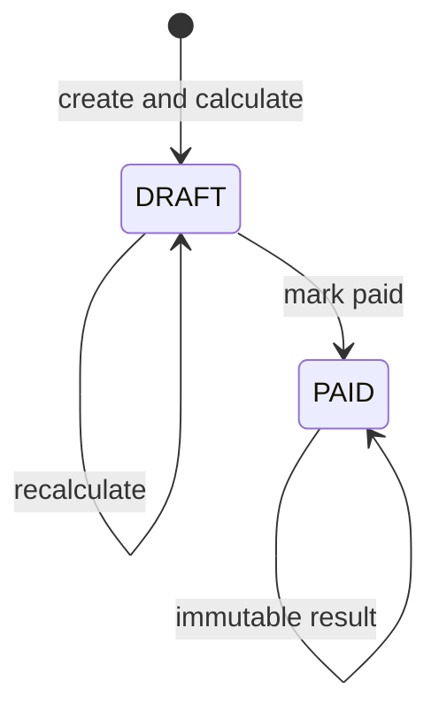
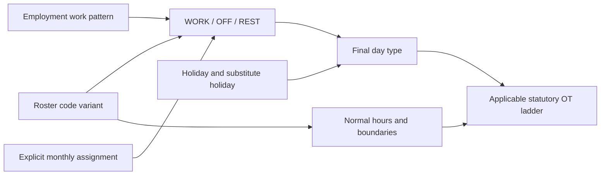
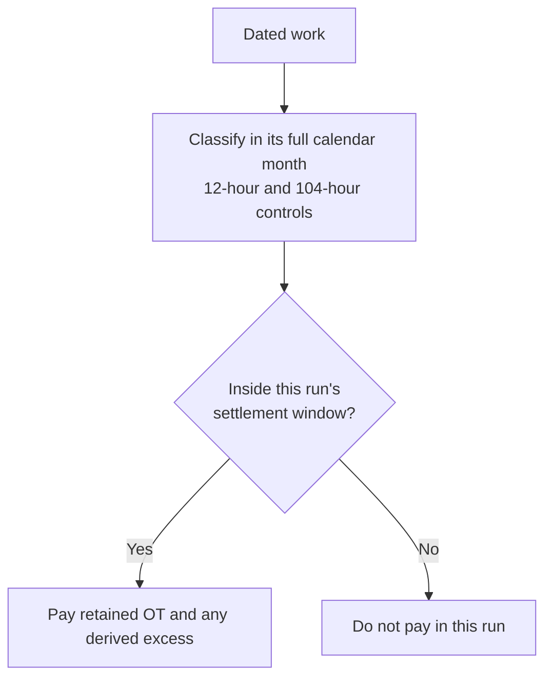
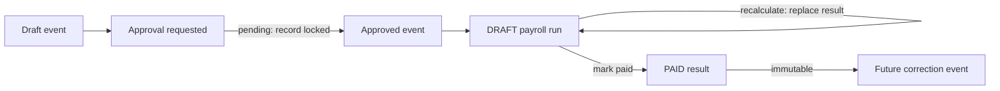

# HR and payroll architecture

Payroll is a deterministic settlement engine over approved, effective-dated facts. The database
keeps business inputs separate from settled output, but does not add projection or linkage layers.

## The model in one map

```text
APPROVED INPUTS                          SETTLED OUTPUT

employment_terms --+                  +-> payroll_runs [one policy + sealed statutory profile]
work_days ----------+                 |        |
leave_requests -----+--> calculator --+        v
component_entries --+                          payslips
loan_repayments ----+                          |- base[]       (caused by no input)
       |                                       |- proration[]  (caused by no input)
       |                                       |- statutory[]  (caused by no input)
       v                                       |
pay_components <-------------------------- payslip_adjustments
 [policy + calculation]                     [one output relation]
                                            |- input: WORK_DAY_INPUT | COMPONENT_ENTRY_INPUT
                                            |        | LEAVE_REQUEST_INPUT | LOAN_REPAYMENT_INPUT
                                            |- label + bucket + amount (frozen)
                                            `- statutory_rule_key (work-day only)

loans -> loan_repayments
 [the agreement, and the amounts due under it]

leave_types
 [accrual + payroll effect + entitlement layers]
       |
       `-- statutory floor
           + organisation enhancement
           + employee enhancement
```

**A payslip comprises four things, and the kind is derived, never declared.** Base, proration and
statutory are caused by no editable record, so they are inlined on `payslips` as arrays. An
adjustment is caused by exactly one captured input, so it is a row that names one. There is no
`kind` column anywhere: pointing at nothing IS base or proration; pointing at a capture IS an
adjustment.

The payroll core is five collections:

1. `pay_components` — one reusable definition with a strict settlement/statutory policy and a
   polymorphic calculation definition.
2. `component_entries` — the employee-specific monetary facts: claims, standing allowances,
   bonuses, arrears settlements and HR manual corrections. The `event` union says why the entry
   exists; the amount is a positive magnitude and direction comes from the component policy.
3. `payroll_runs` — one company-period calculation, naming the sealed statutory profile that
   governed it and the calculation version that interpreted the captured configuration.
4. `payslips` — one employment's totals in a run, plus base, proration and statutory inline, and
   the four captured-input junction relations.
5. `payslip_adjustments` — the one output relation, every row naming the capture that caused it.

`input` is a `reference(...)`: one real foreign key per arm and a database-enforced exclusive arc,
plus a write hook proving the captured input belongs to the adjustment's own payslip. Double
consumption within one run is unrepresentable — the junction's `unique(payslip_id, source)` makes
it so — and the cross-run ceilings are arithmetic, carried by `ENTRY_OVER_CONSUMED` and
`REPAYMENT_OVER_RECOVERED` in `src/lib/settlement_refusals.ts`.

**The capture is the settlement lock.** The four `payslip_*_inputs` junctions exist to say "this
run took this record into account" separately from "this record produced money". A day the run
read and priced at nothing is a junction row with no adjustment beside it: consumed nothing and was
never read are different claims, and the junction's `restrict` FK into the business source is what
refuses the delete.

## Leave and layered entitlement

Leave is not itself money. `leave_requests` is the approved event stream, `leave_types` owns the
entitlement/accrual policy, and a mapped `pay_component` owns only the monetary effect (for example,
unpaid-leave deduction or encashment).

The statutory floor is not hand-typed per company: it lives on the sealed statutory profile's
`statutory_leave` member, per canonical kind, scaled by the employee's child facts where the law
conditions it. The company's own layers stay on the leave type as an effective-dated union:

```text
effective entitlement = max(profile floor by statutory_kind, organisation layer, employee layer)
```

The same layering principle applies to claim and allowance caps in their pay-component definition:
a cap is the most generous of the company's own organisation and employee layers — the statutory
floor is never re-typed there. This is policy data, not a reason to add one collection per benefit
kind.

## Run snapshot and locking

Configuration is captured once on `payroll_runs`, never once per payslip. Every payslip in a run was
calculated from the same picked company and statutory policy. Repeating the snapshot per payslip
would duplicate identical JSON and permit impossible disagreement inside one run.

The run names its law twice, as two different kinds of fact:

```text
statutory_snapshot_id     real FK to the sealed statutory profile that governed the
                          calculation. Engine-owned, restrict on the law's end, replaced whole on
                          a draft recalculation, and append-only once a run is paid: legislation
                          changes enact a new profile version, never an edit of a used one.
calculation_version       the engine/build identity that interpreted the captured configuration.
                          A configuration hash identifies data, not code — without a durable
                          version stamp, two builds of the same captured rules after an engine
                          change would have no explanation on the run of what differed.
```

Both are engine-owned derived columns: no policy grants a person the write, and a recalculation
resolves them again from scratch rather than editing them in place.

```text
DRAFT run --recalculate--> DRAFT run --lock & pay--> PAID run
                                               [immutable]
```

YTD is summed from earlier paid statutory payslip lines. Leave balance is derived from approved
leave events. Neither requires a mutable ledger/cache collection.

## Payroll lifecycle

### Run state

One `payroll_runs` row is unique by company and period.



A draft recalculation deletes that run's previous payslips and cascaded children before writing the
new answer. It never merges old and new lines. A paid run cannot be recalculated or deleted; a later
correction is a new approved event in a later draft.

### Eight phases

| Phase      | Reads or produces                                                                                                                                                                           | Failure behaviour                                                                                                       |
| ---------- | ------------------------------------------------------------------------------------------------------------------------------------------------------------------------------------------- | ----------------------------------------------------------------------------------------------------------------------- |
| PICK       | Company, jurisdiction, component catalogue, rates, OT rules, shifts, holidays and leave policy; produces the configuration hash and resolves the sealed statutory profile the run will name | Fails when no sealed profile covers the period                                                                          |
| VALIDATE   | Mapping completeness, pay calendar and rule integrity                                                                                                                                       | Blocks before reading an employee                                                                                       |
| GATHER     | Approved employees, terms, facts, component entries, loan repayments, leave, work days and what earlier PAID runs consumed                                                                  | Refuses a truncated query, a missing required employment fact, or a one-off entry another standing run already captured |
| MEASURE    | Converts schedule, entries, formulas and overtime into typed monetary lines, and names each line's causal input                                                                             | Refuses unpriced hours, missing terms or invalid formula inputs                                                         |
| ACCUMULATE | Applies every line's statutory treatment to each contribution base                                                                                                                          | Refuses missing or undecided treatment cells                                                                            |
| CONTRIBUTE | Applies effective rate bands and statutory special rules                                                                                                                                    | Refuses an uncovered band or missing selector fact                                                                      |
| SETTLE     | Calculates gross, deductions, net and employer cost                                                                                                                                         | Reduces a deduction that would drive net below zero; what remains owed stays on the source, re-derived next run         |
| PERSIST    | Returns the run, its payslips, the four captured-input junctions and every adjustment as one declarative payload from the `before` hook; the runtime performs the only write there is       | Writes parent-first in one transaction; a draft replacement replaces the whole prior graph or nothing                   |

### Periods and cutoffs

Three dates must not be conflated:

| Concept                      | Meaning                                        | Example value (January)   |
| ---------------------------- | ---------------------------------------------- | ------------------------- |
| Salary period                | Calendar month contractual wages belong to     | `2026-01-01`–`2026-01-31` |
| Attendance settlement window | Dated attendance/ordinary NPL paid in this run | `2025-12-21`–`2026-01-20` |
| Pay date                     | Date the run is paid                           | 28th of the payroll month |

For `pay_cutoff_day = 21`, the implementation treats 21 as the first included day:

```text
attendance start = 21st of previous month
attendance end   = 20th of payroll month
```

This boundary is `[cutoff day of previous month, day before cutoff in current month]`. A 21st event
therefore belongs to the new window, not the closing one.

#### Money-event cutoff

A component entry may state `pay_period` explicitly. That is authoritative. If it is absent, the
default is:

```text
event day <= cutoff day  → event calendar month
event day >  cutoff day  → following payroll month
```

This default is intentionally distinct from attendance selection. A late-submitted claim may be
assigned to a specific pay period without rewriting the service or receipt date.

#### Per-frequency overrides

The company settlement policy may define an OT/night-shift window for a pay frequency. This allows a
semi-monthly group to settle OT from the 1st–15th while monthly staff use the company window.
Ordinary unpaid leave continues to use its own settlement rule; an OT override does not silently
move NPL.

### Joiners, leavers and arrears

The salary month is intersected with the employment range. Proration uses the jurisdiction's
configured basis.

- A joiner inside the period is prorated from the hire date.
- If company policy defers a person who joined after the attendance window closed, that period has
  no payslip. The next run re-derives what the skipped period would have paid from the contract and
  records it as arrears.
- A leaver is measured through the applicable final settlement boundary. Policy can extend final
  attendance to the exit date or pay full-period wages without changing the contract row.

Derived late-joiner arrears are not seeded. For example, an employee who joins mid-February may
receive March basic plus a separate back-pay basic line for the six days worked before the period
closed — those arrears are calculated from hire date and salary, not copied from the source listing.

### YTD ordering

Creating a run is blocked while an earlier run for the company remains `DRAFT`. This makes YTD
deterministic: the new run sees only frozen prior periods.

YTD is keyed by employee rather than employment so a transfer or rehire does not silently reset tax
or statutory accumulation. The tax-year start month comes from the jurisdiction.

### Idempotency and failure

Draft calculation is repeatable under the same approved inputs and configuration. Query reads are
guarded by a page ceiling: reaching the limit is treated as a failure rather than silently omitting
a roster, time, term or entry row. This turns "possibly wrong pay" into an explicit blocked run.

## Time, overtime and cutoffs

### From roster to day type

Day type is calculated before money:



`employment_terms.work_pattern` is the one canonical schedule term. It is polymorphic:

- `PATTERNED` repeats one or more phases from an anchor date. A phase has a cycle of roster-code
  references. One seven-day cycle represents a fixed office week; a short cycle represents a crew
  rotation; calendar-month phases represent long rotations such as three months of day shifts
  followed by three months of nights.
- `ROSTERED` means the assignments cannot be projected reliably. The published monthly roster is
  therefore required. Its expectation is either as-assigned or a guaranteed number of workdays and
  paid minutes per week/month, which publication validates.

There is no separate work-pattern record and no duplicated weekly-hours, workdays or rest-weekday
field. Those are derived from a patterned schedule; a rostered schedule stores only the expectation
that cannot be derived without the month.

`shift_definitions` remains the migration-stable physical collection name, but its domain and UI
name is **roster codes**. Every code is exactly one of `WORK`, `REST` or `OFF`. A `WORK` code carries
start, end and unpaid break. Whether it crosses midnight and how many paid minutes it represents are
derived from those values. `REST` is protected statutory rest; `OFF` is another planned non-working
day. Neither carries clock times.

For a patterned employment the month board projects the baseline without storing person-day rows.
An explicit roster entry is an exception to that baseline. For a rostered employment, every supplied
entry is authoritative and an absent day remains unassigned. A blank spreadsheet cell means “no
explicit assignment”; it does not silently manufacture another rest day.

`REST` does not mean that work is impossible. Malaysian law requires a weekly rest day; for shift
work, a continuous period of at least 30 hours can constitute that day. The employer prepares the
rest-day roster before the month. Work performed on the designated rest day remains rest-day work
and receives the rest-day ladder; it does not become ordinary OT merely because a replacement was
called in. `OFF` is an additional non-working day and is not interchangeable with the statutory
rest day. A genuine shift swap changes the dated roster before settlement rather than relabelling
the hours after they were worked.

An employee generally cannot be compelled to work on a rest day except for continuous/shift work or
the statutory exceptional circumstances. The engine still prices approved work that occurred; a
payment calculation is not evidence that scheduling the work was compliant.

A public holiday can replace an ordinary day. If a paid holiday falls on the statutory rest day,
the next working day is the substitute unless an explicit `company_holidays.substitutes_date`
already defines one. This changes schedule classification; it does not invent an OIL transaction.

### Gates

An overtime amount is produced only when all relevant gates pass:

1. every worked interval is complete, forward-running and non-overlapping;
2. the schedule, holiday calendar and attendance together classify the work as payable overtime;
3. the applicable effective-dated coverage and pricing rules permit an award; and
4. payable duration remains after flooring.

**Overtime is a calculated value, never a stored one.** A `work_days` row records what happened
on the clock — one or more worked intervals and the unpaid break — and nothing about what those hours
are worth or who agreed to them. Open/closed state is derived from whether the final interval has an
end. The payroll run derives duration from the intervals, and the
schedule decides whether the same hours were ordinary, rest-day or public-holiday work.

`time_entries` previously carried `overtime_authorized` and five `approved_ot_*_hours` buckets, and
both were engine inputs: a recorded refusal suppressed the day entirely, and a bucket total replaced
the clock as the payable duration. They were dropped in the `drop_time_entry_overtime_approval`
migration. A per-day authorisation decision, if a population needs one again, belongs on a record
that says who decided and when — not as an unattributed flag that silently withholds pay for hours
the clock says were worked.

### Hours

For an ordinary scheduled day:

```text
raw OT = worked intervals outside the scheduled WORK window − applicable unpaid break
```

On a rest, off or observed-holiday day, all approved worked duration is classified against that day
type, less the applicable unpaid break. Scheduling a person to return on such a day is not a special
OT roster kind: it is a WORK assignment overriding a derived non-working baseline. The system can
therefore derive projected extra work when the roster is prepared and route it for approval; after
attendance arrives, actual payable overtime is recalculated from what was worked. Projected and
actual amounts cannot drift because neither is a writable roster/time-entry quantity.

Every dated quantity is floored down to a half-hour:

```text
1.99 → 1.5 hours
2.00 → 2.0 hours
2.49 → 2.0 hours
2.50 → 2.5 hours
```

There is no round-up and no automatic one-hour minimum.

### Pricing

An example company configuration uses the annualised dated method:

```text
HRP             = round(monthly salary × 12 / (weekly hours × 52), 2)
dated unit rate = round(HRP × statutory multiple, 2)
dated amount    = round(dated units × dated unit rate, 2)
payroll amount  = sum(dated amounts in the payment window)
```

The engine also calculates the statutory Malaysian floor when required:

```text
statutory HRP = round((monthly salary / 26) / normal daily hours, 2)
effective HRP = max(configured-method HRP, statutory HRP)
```

Ordinary/off-day work uses the ordinary OT ladder. Rest-day and public-holiday work can contain a
day-wage award for work within normal hours and an hourly award beyond normal hours. This is why a
legacy source's flat "1.5× hours" figure can differ from the statutory result, and why that figure
is not an input.

### Incentive OT (excess overtime)

Incentive OT is calculated output. Source incentive-overtime columns are never an input. Like
ordinary overtime it is a derived payslip line naming the statutory band that priced it, not a pay
component: there is nothing for a company to configure and nothing for two companies in one
jurisdiction to disagree about.

Two independent limits classify already-earned statutory OT value:

#### Daily total-work boundary

```text
daily excess hours = floor½(max(0, actual work hours − 12))
retained OT hours  = payable OT hours − daily excess hours
```

The legal ladder prices the whole day first. The value associated with excess hours is moved to an
`OVERTIME_EXCESS` line at the same statutory value and under the same band; it is not discarded. The run then
**fails** on `DAILY_WORK_LIMIT_EXCEEDED`, naming the employee and the date: reclassification settles
what the day is worth, and does not make the schedule compliant.
The 12-hour boundary is the statutory daily maximum outside the Act's exceptional circumstances,
not a daily OT entitlement or a rule that permits twelve overtime hours.

#### Calendar-month 104-hour boundary

The 104-hour counter:

- resets on the first day of the calendar month;
- counts ordinary-day and off-day OT;
- excludes rest-day and paid-public-holiday work; and
- advances chronologically by the full qualifying quantity, even when some hours also crossed the
  daily boundary.

Only the portion above 104 hours is moved to an `OVERTIME_EXCESS` line.

### Unpaid leave and the settlement window

NPL uses the same attendance settlement window as OT (21st–20th for Nihon). Calendar-month UL in
the source salary listing can therefore differ from the engine without either side being "broken":

- Norbital: UL dates inside the run's settlement window.
- Some Infotech April rows: UL dated in calendar April, including 21–30 April that belong to May
  settlement.

Named April examples are in the current variance report. Product rule: keep the 21st–20th window.

### Payment window versus compliance month

These are separate axes:



For January payroll with a 21st cutoff, the engine reads full December and January calendar months
to classify the dated hours, but pays only 21 December–20 January. Work on 21–31 January remains in
January's 104-hour counter and is paid by the following settlement window.

There is no blanket one-month incentive lag. Chronological classification determines whether a
specific dated hour crossed the threshold; the attendance window determines which run pays it.

### Coverage

Coverage is **data, not code**. It lives in the required `jurisdictions.regime` value alongside the
pricing ladder and the limits governed by the same law revision. One
jurisdiction code cannot have overlapping effective ranges, so payroll can never assemble its law
from independently dated fragments. A null `overtime_coverage` member covers everyone — absence of
a coverage restriction is not a restriction that excludes everyone. See
[Statutory overtime coverage](#statutory-overtime-coverage) for the sources and remaining gaps.

A contractual entitlement can be more favourable, but it must be encoded as an effective-dated
coverage/pricing policy. There is no `employment_terms.overtime_eligible` switch: a boolean beside
the statutory facts would eventually drift from the rule it claims to summarize. The legacy
`work_classification = NON_EA` label is not, by itself, proof that the Employment Act does not apply.

For Malaysia the profile encodes the Employment Act 1955 First Schedule as substituted by the
Employment (Amendment of First Schedule) Order 2022 [P.U. (A) 262]: a ceiling of RM4,000 a month,
**inclusive** because paragraph 1A disapplies the ladder to wages that "exceeds" that figure; the
paragraph 2 categories — manual labour, supervisors of manual labour, and commercial vehicle
operators — covered irrespective of wages; and vessel work _excluded_ outright, because paragraph
2(4) disapplies the whole of Part XII, which is where ss.60, 60A and 60D live.

The ceiling is measured on First Schedule paragraph 3 wages — section 2 wages less commissions,
subsistence allowance and overtime payment — and **not** on base salary. The engine derives that
figure per employment: the contracted basic wage plus the signed totals of every cash-for-work
component's entries settling in the run — overtime cannot be among them, because it is not a
component (`classifyWageComparand` / `deriveStatutoryWages` in `payroll_runs/lib/coverage.ts`). A person on
RM3,800 basic plus a RM500 fixed allowance is outside the ladder; the old base-salary comparison
said inside. Where the model cannot express a distinction the statute draws — commissions and
subsistence allowance have no component category of their own — the derivation says so rather than
guessing, and a figure the run cannot produce fails the run naming the employee and the authority
instead of being approximated from the nearest column.

Rest and meal breaks are **not** modelled here. The regime carried a `rest_breaks` member — the
consecutive-hours window, the minimum length, whether the statute counts the break as working time
— and every field of it was resolved, snapshotted and read by nothing: no line was priced, no run
was blocked, no screen quoted a figure. It was removed rather than left as data entry that pays
for itself with an audit token. Whether a break was taken is measured from punches, which is
`work_days` and `shift_definitions` work; the cited statutory transcriptions are retained in
the repository seed bank (`seed_bank/norbital_hr/statutory/rest_break_rules.json`) so the
requirement can be modelled again from the primary text rather than from memory.

## Calculation and statutory treatment

### Contractual wages and proration

Base salary comes from every effective term segment intersecting the covered period. Each segment is
prorated against the same full-period denominator and then summed, so a mid-month salary change does
not lose or duplicate a day.

Malaysia incomplete-month and ordinary unpaid-leave calculations use the configured statutory
calendar-day basis where applicable:

```text
calendar-day rate = round(monthly salary / calendar days in month, 2)
dated deduction   = round(calendar-day rate × unpaid days, 2)
```

Other jurisdictions or pay frequencies may select working-day or fixed-day proration through
configuration. The formula is not copied into company pay components.

### Component measurement

| Definition source | Measurement                                                                 | Typical inputs                                        |
| ----------------- | --------------------------------------------------------------------------- | ----------------------------------------------------- |
| `SCHEDULE`        | Contract amount × period fraction                                           | Effective terms, employment range, roster divisor     |
| `ENTRY`           | Sum of approved dated entries, with per-entry proration/cap when configured | Claims, allowances, recoveries, corrections           |
| `FORMULA`         | Closed expression over measured components, terms, leave and period facts   | Ordinary rate information, NPL and derived allowances |

Overtime has no row here, because it has no definition source. It is measured from the priced
segments themselves, one line per statutory band, and the two lines it produces —
`OVERTIME` and `OVERTIME_EXCESS` — name the band rather than a component:

| Derived line      | Measurement                                               | Typical inputs                              |
| ----------------- | --------------------------------------------------------- | ------------------------------------------- |
| `OVERTIME`        | Dated statutory award after schedule/day classification   | Time entry, shift, roster, holiday, OT rule |
| `OVERTIME_EXCESS` | Statutory value reclassified beyond daily/monthly control | Same time entry and rule as the original OT |

Amounts are stored as magnitudes. Earning/deduction direction comes from the pay component policy and
contribution treatment. A correction never sneaks direction in through a negative amount.

#### Claimable components

An `ENTRY` component declares three things beyond its unit, because a claim is a different kind of
object from an allowance:

- `evidence` — `NONE`, `OPTIONAL` or `REQUIRED`, deciding whether a receipt must accompany the amount.
- `cap` — a period (`CALENDAR_YEAR`, `LEAVE_YEAR`, `MONTH`, `LIFETIME` or `PER_EVENT`), the matrix the
  limit is read from, a reimbursement percentage, and `on_exceed` of `BLOCK` or `ALLOW`.
- `settlement` — `PAYROLL` when the money rides the payslip, `COMPANY_DIRECT` when the company pays
  the provider and payroll records only that it happened.

`on_exceed` is configurable rather than always blocking because some benefit limits are hard and
some are soft ones a manager may deliberately exceed. A system that can only refuse pushes the soft
case out into a spreadsheet, where it stops being visible to payroll at all.

The pay-component definition carries no statutory information. Whether a component is EPF wages is
owned by the strict policy union on its `component_type`; renaming a component cannot change its
settlement direction or what it is chargeable to.

#### Leave entitlement

Entitlement for one leave code collapses three layers to `max(statutory, company ?? statutory)`. The
statutory figure is a floor, not a default: a company that mis-configures maternity leave as 60 days
still owes 98. Compliance does not depend on the customer configuring correctly, which is the only
arrangement that survives contact with a real tenant.

### Component-owned contribution treatment grid

Every pay component policy carries one effective treatment for every statutory contribution:

| Treatment | Effect on contribution base                                    |
| --------- | -------------------------------------------------------------- |
| `INCLUDE` | Add the line                                                   |
| `EXCLUDE` | Ignore the line                                                |
| `REDUCE`  | Subtract an absence/recovery amount when the law requires it   |
| `SPECIAL` | Apply a named contribution-specific rule                       |
| `UNSET`   | Configuration is incomplete; activation/calculation is blocked |

This cross-product makes omissions visible. Adding a new pay component cannot silently bypass EPF,
SOCSO, EIS, tax or another scheme.

### Malaysian treatment summary

The effective tables remain the authority; this summary describes the intended classification:

- Genuine overtime and the same value reclassified as statutory-excess incentive OT are excluded
  from EPF wages.
- Salary, ordinary incentives, allowances, bonuses and arrears follow their configured legal
  treatment.
- SOCSO and EIS use the insured wage base, including applicable salary, overtime, incentives and
  allowances, then apply the effective ceiling/table.
- PCB consumes taxable remuneration, relief facts, periods remaining and earlier paid YTD.
- HRD levy applies the effective employer rate to the configured eligible wage base.

Source incentive-overtime columns can represent a business incentive rather than statutory excess.
Because the system cannot prove that meaning from the output column alone, it is not seeded. A
variance remains until the underlying policy or event is supplied.

### Contribution calculation

For each statutory scheme the engine persists:

```text
base_amount
employee_amount
employer_amount
band_reference
special_amounts
```

Persisting the base makes the calculation auditable. A manual amount-only override is not an
acceptable reconciliation fix because the same wrong base can affect later bands, tax and YTD.

### YTD

YTD is not a mutable ledger table. It is the sum of earlier paid results in the current tax year:

```text
YTD contribution base/share
  = SUM(payslips.statutory[].employee_amount)
    over earlier PAID runs for the employee and statutory scheme
```

Only `PAID` periods contribute. The previous-period-paid gate prevents a later draft from building
against moving YTD. Current reconciliation separately checks that source and generated workbooks
contain no duplicate employee-month rows before summing YTD.

### Validation levels

1. Configuration validation blocks undecided treatments, missing rule mappings, bad formulas and
   ineffective/gapped tables.
2. Run validation blocks open clocks, missing terms, unusable calendars and truncated reads.
3. Result validation checks settlement identities, source expectations and non-negative net.
4. Warnings expose schedule/compliance breaches such as total work above 12 hours or ordinary OT
   above 104 hours; the earned value is still paid/reclassified.

### Official Malaysian references

- [Employment Act 1955 (current JTKSM download page)](https://jtksm.mohr.gov.my/en/borang/employment-act-1955)
- [Employment (Limitation of Overtime Work) Regulations 1980](https://jtksm.mohr.gov.my/sites/default/files/2023-03/7.%20EMPLOYMENT%20%28LIMITATION%20OF%20OVERTIME%20WORK%29%20REGULATIONS%201980_0.pdf)
- [JTKSM Employment Act 2022 amendment FAQ](https://jtksm.mohr.gov.my/ms/soalan-lazim/akta-kerja-1955-pindaan-2022)
- [EPF employer contribution guidance](https://www.kwsp.gov.my/en/employer/responsibilities/mandatory-contribution)
- [PERKESO contribution rates](https://www.perkeso.gov.my/en/rate-of-contribution.html)
- [LHDN PCB specifications](https://www.hasil.gov.my/majikan/potongan-cukai-bulanan-pcb/)

## Adjustments, ledgers and locking

### A ledger is a dated movement history, not a second copy

Store a ledger only when the business fact cannot be represented by the originating request or by a
paid payroll result. A ledger exists to preserve independently dated movements whose order and
running balance matter.

| Subject                        | Authoritative transaction                        | Separate ledger?         | Reason                                                                                                                                                 |
| ------------------------------ | ------------------------------------------------ | ------------------------ | ------------------------------------------------------------------------------------------------------------------------------------------------------ |
| Leave taken                    | Approved `leave_request`                         | No duplicate `TAKEN` row | The request already contains type, dates, quantity and approval. Counting both would double-consume leave.                                             |
| Leave correction or encashment | `leave_requests.event` adjustment/encashment arm | No second table          | It remains a signed, dated event, structurally distinct from a time-off request in the same authoritative stream.                                      |
| Claim or allowance             | Approved `component_entries` row                 | No                       | The entry is already the money transaction and carries the incurred date and evidence.                                                                 |
| Loan                           | `loans` row with its `loan_repayments` plan      | No, the plan is rows     | Principal, due dates and every repayment reconcile across the pair; what is still owed on a repayment is its amount due less what paid runs recovered. |
| Payroll/YTD                    | Paid payslips and contributions                  | No mutable accumulator   | Earlier paid results are the immutable accounting history. YTD is their sum.                                                                           |
| Payment file                   | Projection from a paid run                       | No                       | A file is an output transport, not another source of payroll truth.                                                                                    |

Approved `TIME_OFF` requests create taken movements directly. Adjustments and encashments use their
own strict `leave_requests.event` arms.

### Settled and projected balances

Two different questions read that ledger, and they must not read it the same way.

Payroll settles, so it acts on the **settled** basis: rows whose `approval_id` is null.
A movement still held by an approval request is not yet a fact, and paying against it would settle a
decision nobody has made.

A new leave or claim request is checked against the **projected** basis, which counts every row
including the pending ones. Otherwise someone with one request awaiting approval could submit a
second against a balance the first has already spent, and each would look affordable on its own while
the pair overdraws.

### Loan schedule

Creating an agreement provisions a repayment plan. Equal repayments are a convenience, not a
restriction: the final remainder is adjusted so that the plan reconciles exactly.

```text
SUM(repayment amounts) = principal
last repayment date    ≤ repay-by date
```

The provisioning schedule builds both invariants in, the write hooks reject a row that breaks them
against its neighbours, and the loan update path re-checks the plan the database holds. Each
recovery is an approved deduction captured by the run that took it. A captured repayment cannot be
edited or deleted; an unlinked future repayment may be changed while the two agreement invariants
remain true.

### Corrections and back pay

Corrections are classified by cause before they are entered:

| Cause                                                                                          | Seed or calculate?             | Treatment                                                                                                |
| ---------------------------------------------------------------------------------------------- | ------------------------------ | -------------------------------------------------------------------------------------------------------- |
| A source document states a genuine prior-period adjustment whose original event is unavailable | Seed                           | Approved entry with the source pay period, evidence and an explicit `inferred` or correction description |
| Prior-year statutory amount has to be carried into the tested horizon                          | Seed                           | Dated correction entry because the causal paid period is outside the available run history               |
| Joiner was correctly deferred by cutoff policy                                                 | Calculate                      | Re-derive the prior-period contract amount; do not seed the output                                       |
| Late claim/allowance is explicitly assigned to a later pay period                              | Seed the event, not the result | Keep service date and explicit `pay_period` distinct                                                     |
| A paid amount was wrong                                                                        | Correct prospectively          | Add an approved future-period adjustment or reversal; never rewrite a paid run                           |

Amounts are positive magnitudes. Earning or deduction direction comes from the pay component policy. A
manual correction names the settled adjustment it fixes through `corrects_adjustment_id`; a reversal
operation settles in the opposite bucket of that output rather than storing a negative amount.

### Recovering from a mistake after payment

A paid run is frozen — never edited, never deleted — so every recovery is a **new approved event in
a later draft run**. The next cycle carries the correction; history carries the evidence. Two
ledgers are involved and they are corrected separately:

- the **money** a run moved, corrected through `component_entries`; and
- the **leave ledger** a balance is derived from, corrected through `leave_requests.event`
  `BALANCE_ADJUSTMENT` rows (signed movements; the balance is derived, so it heals once the event
  is approved).

A leave request a run has captured is itself frozen (`refuseIfCaptured`), so a cancellation is
never an edit of the original request — the original stays exactly as it was settled, and the
correction states what changed and why.

| What went wrong                                                            | Leave ledger correction                                              | Money correction in the next draft                                                                                                                                                                                              |
| -------------------------------------------------------------------------- | -------------------------------------------------------------------- | ------------------------------------------------------------------------------------------------------------------------------------------------------------------------------------------------------------------------------- |
| Approved leave was taken, payroll deducted it, then it was cancelled       | New `BALANCE_ADJUSTMENT` event restoring the days                    | `MANUAL_ADJUSTMENT` with operation `REVERSAL` on the same unpaid-leave component, `corrects_adjustment_id` naming the settled absence adjustment; the flipped sign restores net while keeping the component code on the payslip |
| Person was paid for leave they did not take, or salary was paid in error   | Negative `BALANCE_ADJUSTMENT` taking the days back                   | `ARREARS` entry on a deduction-kind component, `covers_periods` naming the paid period, reason stating the cause — recovered in the next run, subject to the negative-net guard                                                 |
| A claim or allowance was missed or underpaid                               | —                                                                    | The missing entry (or a `CORRECTION` naming the settled output it supersedes) on the earning component                                                                                                                          |
| A statutory figure was computed under a law value that was mis-transcribed | —                                                                    | Component-entry correction for the money delta (statutory lines of a paid run are never re-edited); see the profile amendment path below                                                                                        |
| A leave balance was seeded or carried wrong                                | Dated `BALANCE_ADJUSTMENT` events until the derived balance is right | —                                                                                                                                                                                                                               |

Every correction is itself captured by the run that settles it — `corrects_adjustment_id` reaches
back to the frozen output it fixes, `covers_periods` and `reason` say why — so the audit chain runs
unbroken from the correction back through the paid run to the input it consumed. The negative-net
guard bounds what a recovery can take: an overpayment larger than the person's next net is
recovered across as many cycles as the guard allows.

#### Amending a statutory profile

The law a paid run cited is frozen in place, but the system is built so that is never a dead end:

```text
1. Void the wrong profile version    (the lifecycle seal refuses every other edit; the void
                                      records the reason and names the successor)
2. Enact the corrected version       (a new DRAFT profile — law members and catalogues copied
                                      forward, corrected, then sealed on HR Manager approval)
3. Correct the money                 (component entries in a later draft, as above)
```

What the amendment must not do is rewrite history: the paid run still names the profile that
governed it, its `configuration_snapshot` holds the regime whole, and `calculation_version` names
the code that interpreted it — so any auditor can reconstruct what was believed at payment time,
and the corrected profile shows what is believed now. Drafts that have not been paid simply
recalculate onto the successor profile; nothing about them is frozen.

### Locks



| Boundary             | Current guarantee                                                                                                             | Why                                                                                                                    |
| -------------------- | ----------------------------------------------------------------------------------------------------------------------------- | ---------------------------------------------------------------------------------------------------------------------- |
| Pending approval     | A record carrying `approval_id` is locked; payroll reads only approved rows                                                   | Prevents use and mutation while a decision is outstanding                                                              |
| Draft run            | Results may be wholly replaced by recalculation                                                                               | Keeps drafts responsive without mixing old and new lines                                                               |
| Paid run             | Any update of the run row refuses outright, as does deletion                                                                  | Preserves the exact result used for payment, YTD and audit                                                             |
| Payslip output       | Payslips, adjustments and the four capture junctions refuse updates outright; deletes only while the run is a draft           | Output rows are create-and-replace under the engine's one write; a correction is a new event in a later cycle          |
| Statutory profile    | SEALED or VOIDED profiles refuse law-member edits outright (seal freeze, paid-run freeze backstop); deletion restrict-blocked | The citation is the record of what law governed the money; amendments void the version and enact a corrected successor |
| Loan repayment       | A captured repayment is immutable                                                                                             | Prevents a loan balance from changing behind a paid deduction                                                          |
| Leave event stream   | Corrections use new adjustment events                                                                                         | A balance correction remains visible instead of rewriting history                                                      |
| General event source | `sourceLock` freezes the original leave, entry, repayment or person-day row                                                   | A pending approval, or a captured input in the record's input junction — with or without a monetary output             |

Leave, entries and person-days share `src/lib/scheduling/lock.ts`. Hooks refuse the write; collection
forms disable and state the reason; collection tables disable row selection and paint a locked
leading accent. Corrections are new events, never edits of a consumed source.

## Provenance and audit

```text
effective configuration ---> payroll_runs.configuration_snapshot
statutory law ------------> payroll_runs.statutory_snapshot_id (FK to jurisdictions)
employment ------------------------> payslip
                                      |- base[]       -> component_code           (frozen label)
                                      |- proration[]  -> term_key                (frozen label)
                                      |- statutory[]  -> scheme_code + band_key  (frozen)
                                      v
pay_component <-------- payslip_adjustment --------> captured input junction → business source
```

The adjustment is the output relation and directly answers:

- which component produced the amount — its frozen `label` — or, when none does, which statutory
  rule did (`statutory_rule_key`, work-day rows only);
- which single captured input was consumed, through one real per-arm foreign key; and
- which payslip and run froze the result, with the period copied onto the row.

The three inlined arrays name codes and keys and deliberately hold **no** foreign key. That is the
point of inlining: a settled payslip is a frozen statement of what was paid, and it does not become
wrong because somebody later archived a component or superseded a terms row. The catalogue the
component-entry adjustments reached lives in the run's captured configuration, and the run names
the sealed statutory profile that governed its law.

The configuration snapshot is housed once by the pay run because every payslip in that run shares
the same picked policy.

Consumption is one database invariant per junction and one arithmetic one:

```text
PER RUN:   unique(payslip_id, source) on each payslip_*_inputs junction   enforced by the database
CROSS RUN: SUM(recovery adjustments in PAID runs) <= loan_repayments.amount_due
           enforced by REPAYMENT_OVER_RECOVERED in src/lib/settlement_refusals.ts
```

The cross-run ceiling could not be a database constraint: a loan repayment the negative-net guard
could only part-recover stays outstanding on the repayment row, and the next run recovers the
remainder against the same repayment — so one repayment is legitimately touched by several
payslips. The trade is carried by a named refusal and a test rather than by a comment.

Scheduled and formula adjustments settle under the component their input names, and remain
reproducible from the run snapshot plus approved inputs. Overtime adjustments link to no component
at all: their `statutory_rule_key` names the band that priced them, resolved inside the run's
sealed statutory profile, and `label` is that same key. A component-entry or loan-repayment adjustment
reaches its component through the real source relationships, so no row here repeats it.

## Statutory overtime coverage: what is encoded, and what is not

Began as a survey of what the repository contained, prompted by the question _"check statutory law
for OT and break time — manual labour vs non-manual, RM4,000 minimum"_. The survey found the
Malaysian First Schedule scope test applied as a **hard-coded literal in engine code** rather than
as effective-dated, cited data, and listed the legal questions the repository could not answer from
its own contents.

Those questions have since been researched against source and the test has been moved into data.
This section records both: the model, and the sources each value came from with the tier of each.
**No rate, threshold, category mapping or break figure here was written from memory.** Where the
sources did not settle something, the shape is encoded and the value left absent — those are listed
under [Still not encoded](#still-not-encoded), not quietly defaulted.

### Encoded

#### Overtime multipliers — six members of the Malaysian regime

Seeded from the repository seed bank, `seed_bank/norbital_hr/statutory/` (§4.4). The source fixture
keeps named builder arrays for review (`overtime_rules.json`), then embeds them without IDs or
effective ranges in the one `jurisdictions.regime` value that is actually seeded
(`jurisdictions.json`).

| Day type         | Band                                    | Award               | Cited authority        |
| ---------------- | --------------------------------------- | ------------------- | ---------------------- |
| `ORDINARY`       | beyond normal hours, `0 → ∞`            | `1.5 ×` hourly rate | EA 1955 s.60A(3)(a)    |
| `REST_DAY`       | from start of day, fraction `0 → 0.5`   | `0.5 ×` day wage    | EA 1955 s.60(3)(b)(i)  |
| `REST_DAY`       | from start of day, fraction `0.5 → 1.0` | `1.0 ×` day wage    | EA 1955 s.60(3)(b)(ii) |
| `REST_DAY`       | beyond normal hours, `0 → ∞`            | `2.0 ×` hourly rate | EA 1955 s.60(3)(c)     |
| `PUBLIC_HOLIDAY` | from start of day, fraction `0 → 1.0`   | `2.0 ×` day wage    | EA 1955 s.60D(3)(a)    |
| `PUBLIC_HOLIDAY` | beyond normal hours, `0 → ∞`            | `3.0 ×` hourly rate | EA 1955 s.60D(3)(aa)   |

Rest day has a half-day split; public holiday does not. `DAY_WAGE_MULTIPLE` is a flat fraction of a
day's wage; `HOURLY_MULTIPLE` is per hour — the two award kinds are different scales, not variants.
Each member carries its section number in `authority`, which is free text and is the citation
carrier in the nested data model.

#### Overtime and hours caps — two members

The Malaysian regime holds two limits, and they count different things — see `measures`:

| Period  | `measures`         | Max | Cited authority                                                                 |
| ------- | ------------------ | --- | ------------------------------------------------------------------------------- |
| `MONTH` | `OVERTIME_HOURS`   | 104 | EA 1955 s.60A(4)(a) with the Limitation of Overtime Work Regulations 1980 reg.2 |
| `DAY`   | `TOTAL_WORK_HOURS` | 12  | EA 1955 s.60A(7), with s.60C(2) for shift work                                  |

The monthly row is enforced in `payroll_runs/lib/validate.ts` as `OVERTIME_LIMIT_EXCEEDED`; the
daily row as `DAILY_WORK_LIMIT_EXCEEDED`.

`on_exceed` no longer decides whether the run completes. Both `WARN` and `BLOCK` stop it, because a
run has no degraded state: an issue the operator was not forced to read was an issue nobody read —
the engine returned these and the create hook discarded them. The column still records what the
authority says, and the refusal quotes it; it does not decide who finds out.

The `DAY` / `TOTAL_WORK_HOURS` row does double duty: it is the boundary past which a day's value is
**reclassified** to an `OVERTIME_EXCESS` line, as well as the ceiling whose breach refuses the run.
Reclassifying and refusing are separate acts on the same statutory number — `on_exceed` offers only
`WARN | BLOCK` and no `RECLASSIFY` — but the number itself is the statute's, not a company's. It
used to be `pay_components.definition.after_total_work_hours` on the overflow components, which let
a company quietly move a statutory boundary.

#### Coverage — one nullable member per profile

Seeded from the seed bank inside each statutory profile. The nullable, cited member decides **who** the
ladder applies to, as distinct from what an hour is worth.

| Column                                  | Meaning                                                                |
| --------------------------------------- | ---------------------------------------------------------------------- |
| `wage_ceiling` (money, nullable)        | Null is a stated fact: no wage-based restriction exists                |
| `ceiling_is_inclusive` (bool, nullable) | `true` for "exceeds X", `false` for "not less than X"                  |
| `wage_basis` (enum, nullable)           | `STATUTORY_WAGES` or `BASE_SALARY` — which figure the ceiling measures |
| `category_basis` (enum)                 | Which employment column the two arrays name values from                |
| `exempt_categories` (text[])            | Covered whatever the wage                                              |
| `excluded_categories` (text[])          | Never covered, whatever the wage                                       |
| `authority`                             | Citation for the member; the parent profile owns `effective_range`     |

`decideOvertimeCoverage` in `payroll_runs/lib/coverage.ts` reads the profile member and returns
`COVERED`, `NOT_COVERED` or `UNDETERMINED`. Order is exclusion, then exemption, then the ceiling: a
statute that disapplies a whole Part to a class of worker outranks a wage test, and a category
written "irrespective of the amount of wages he earns" outranks it too. **No row means covered.**

#### Breaks — members of the same profile

`after_consecutive_hours` (nullable), `minimum_minutes`, `counts_as_worked_time` (nullable),
`applies_when`, plus authority. The parent profile owns the effective range. The window is the field the flat
`break_minutes` columns cannot supply: those record how long a break was, never when it was owed.

The run picks the statutory profile once and records its complete regime, so it can say which
break requirements governed it. **Nothing enforces them yet**: whether a break was actually
taken is a question over punches (`work_days`, `shift_definitions`), which payroll does not
answer. The rows are law made addressable, and the figures a future check will quote are already
the statute's, not a literal waiting to be copied.

#### The wage comparand — derived, not substituted

The ceiling is only as good as the figure it is compared against. First Schedule para 3 defines
"wages" for the Schedule as s.2 wages — basic wages **and all other cash payments for work done** —
less commissions, subsistence allowance and overtime payment. The engine derives that figure per
employment in `measure.ts`, from the pay component model:

| Component as modelled                     | Read as                               |
| ----------------------------------------- | ------------------------------------- |
| `definition.source = SCHEDULE`            | basic wages (from `employment_terms`) |
| `policy.kind = EARNING`, any other source | another cash payment for work done    |
| every other kind                          | not wages                             |

Para 3's third exclusion, overtime payment, needs no row: overtime is not a pay component, so it is
never in the set being classified and cannot enter the comparand to begin with.

The amounts are the signed entry totals settling in the run for each component the employment is
eligible for — the contractual monthly figures, not prorated amounts, because para 1A asks what a
person's wages _are_ a month. `classifyWageComparand` and `deriveStatutoryWages` in
`payroll_runs/lib/coverage.ts` carry the classification; a rule naming `STATUTORY_WAGES` is
answered from the derived figure and a rule naming `BASE_SALARY` from base salary, and never the
other way around.

Two para 3 exclusions the component model cannot express, recorded here rather than guessed:
**commissions and subsistence allowance have no category of their own** — nothing on
`pay_components.policy` or `pay_components.definition` distinguishes them from any other earning,
so an earning of either kind is counted in the comparand. The seeded catalogues contain no such
component, so no shipped population is affected; a company adding one must know the comparand will
overstate until the model carries the distinction. `FORMULA` earnings are likewise not counted —
their amounts exist only once the component walk has run, which the coverage decision precedes —
and the under-inclusion keeps an employee inside the ladder rather than outside it.

### The sources, and how far each was trusted

Primary text was read wherever it could be reached. Where only a secondary reproduction was
available, the tier is named rather than smoothed over.

| Fact                                                                                                                          | Source                                                                                     | Tier                                 |
| ----------------------------------------------------------------------------------------------------------------------------- | ------------------------------------------------------------------------------------------ | ------------------------------------ |
| First Schedule paras 1, 1A, 2, 3 as substituted; P.U. (A) 262; gazetted 15 Aug 2022                                           | Malaysian Employers Federation circular AG 16/2022, reproducing the Order's table verbatim | Secondary, verbatim reproduction     |
| s.60A(1)(a)–(d), provisos (i)–(iii), s.60A(3), s.60A(4)(a); Part XII heading and contents; s.2 "wages"; First Schedule para 3 | Laws of Malaysia reprint, Act 265                                                          | Primary                              |
| "forty-eight" → "forty-five" in s.60A(1); s.60A(1)(a) unamended                                                               | Laws of Malaysia, Act A1651 s.20 (gazette print)                                           | Primary                              |
| 104 overtime hours in any one month                                                                                           | Employment (Limitation of Overtime Work) Regulations 1980 reg.2, JTKSM/MOHR published copy | Primary                              |
| Commencement deferred from 1 Sep 2022 to 1 Jan 2023                                                                           | Consistent across several law-firm publications; **no instrument was located**             | Secondary, uncorroborated by gazette |
| Labor Code arts. 82, 83, 85, 87                                                                                               | LawPhil reproduction of P.D. 442                                                           | Secondary, verbatim reproduction     |
| Meal period shortened to 20 min is compensable                                                                                | Omnibus Rules Book III Rule I s.7, via secondary summaries only                            | Secondary, not relied on             |
| PP 35/2021 Pasal 26, 27, 29                                                                                                   | JDIH Kemnaker published PDF                                                                | Primary                              |
| UU 13/2003 Pasal 79(2)(a) as amended                                                                                          | UU 6/2023 Bab IV text                                                                      | Primary                              |

Two things the sources did **not** settle, and which are therefore encoded as absent:

- **Whether the Malaysian break is paid.** s.60A(1)(a) calls it "a period of leisure" and is silent
  on wages. The continuous-attendance proviso says the eight hours are "inclusive of" the meal
  periods, which settles how hours are counted, not how they are paid.
  `counts_as_worked_time` is null on both Malaysian rows.
- **Whether the Philippine hour is paid.** Only an implication from the Omnibus Rules' treatment of
  a _shortened_ meal period was found, and an implication is not the article's words.

### What changed, and what it fixes

Every defect the survey named is closed:

- **Effective-dated.** An amendment is a new row with its own range; history keeps repricing under
  the rule that was in force.
- **Cited.** Every row names its instrument, its paragraph and, for Malaysia, its commencement.
- **Portable.** `if (jurisdictionCode !== 'MY') return false` is gone. The Philippines and Indonesia
  carry their own cited rows; Singapore, Vietnam and Taiwan carry none and are therefore treated as
  covering everyone.
- **Visible.** Two new tabs on the jurisdiction record, and the resolved row joins the run's
  configuration snapshot, so a PAID run records the ceiling that priced it.

Two defects the survey did **not** catch were found while reading the sources:

1. **`VESSEL_WORK` was answered backwards.** The old test read
   `statutoryWorkCategory !== 'NON_MANUAL'` and so treated vessel workers as _covered_. First
   Schedule para 2(4) disapplies **Part XII** to them, and Part XII of Act 265 is "Rest days, hours
   of work, holidays and other conditions of service" — ss.58A, 59, 60, 60A, 60B, 60C, 60D, 60E,
   60F and 60I. They are outside the entire ladder at any wage. They are now `excluded_categories`.
2. **The comparand was wrong, and is now derived.** The code compared `base_salary`. First
   Schedule paragraph 3 defines "wages" for the Schedule as s.2 wages — basic wages _and all other
   cash payments for work done_ — less commissions, subsistence allowance and overtime payment.
   That is wider than basic pay, so a person on RM3,800 basic plus a RM500 fixed allowance is
   outside the ladder while the old test put them inside it. The engine now derives the para 3
   figure from the pay components and their entries — see
   [The wage comparand](#the-wage-comparand--derived-not-substituted) — with the two exclusions
   the model cannot express recorded there rather than guessed.

The RM4,000 boundary itself was **corroborated and is correct**: para 1A bites on wages that
"exceeds four thousand ringgit a month", so RM4,000 exactly remains covered, as the engine assumed.

#### The daily hours cap — a literal that turned out to be citable

`engine.ts` carried `maxWorkHours: 12` inline, applied to **every** jurisdiction in the workspace,
which meant a Malaysian statute governed Indonesian and Philippine runs. Reading the source settled
it: **Employment Act 1955 s.60A(7)**, with **s.60C(2)** for shift work — "no employer shall require
any employee under any circumstances to work for more than twelve hours in any one day", except in
the s.60A(2)(a)–(e) circumstances. It is a real statutory cap, so it moved into data.

It could not go into the earlier limit shape as it stood. Its `max_hours` meant _overtime_
hours — 104 a month — and this 12 counts **all** hours worked. The decomposition report of the day
had already refused a total-hours cap for Singapore on exactly that ground. The nested limit gained
`measures: OVERTIME_HOURS | TOTAL_WORK_HOURS`, every existing row states which it is, and the two
consumers each read only their own kind. Read the wrong way, a 12 meant as total hours becomes a
licence for twelve hours of overtime on top of a full shift.

A jurisdiction that states no daily limit now has none enforced, rather than inheriting Malaysia's.

### Still not encoded

- **Commissions and subsistence allowance have no component category.** Para 3 takes them out of
  the comparand, and `pay_components` carries nothing that distinguishes them from any other
  earning — the derivation therefore counts an earning of either kind, overstating the comparand
  for a company that pays them. The seeded catalogues contain no such component. Closing the gap
  needs a wage-class distinction on the pay component model itself.
- **`FORMULA` earnings are not in the comparand.** Their amounts exist only once the component
  walk has run, and the coverage decision precedes it — an ordering the walk's formula
  dependencies impose. The under-inclusion keeps an employee inside the ladder rather than
  outside it; no seeded company carries a formula earning that a coverage ceiling tests.
- **The Philippine art.82 exclusions, except managerial.** Field personnel, workers paid by results,
  family members, domestic helpers and persons in personal service have no member in
  `statutory_work_category` or `work_classification`. Recorded alongside the statutory seed as
  `PH_OVERTIME_COVERAGE_CATEGORIES_UNMODELLED`; those employees are treated as covered.
- **Indonesia's `golongan jabatan tertentu`.** PP 35/2021 Pasal 27(3) is broader than `MANAGERIAL`,
  and Pasal 27(4)–(5) make the exemption conditional on the group being written into the contract,
  company regulations or collective agreement — a fact this workspace does not record. Nothing is
  emitted; see `ID_OVERTIME_COVERAGE_CATEGORIES_UNMODELLED`.
- **Singapore, Vietnam and Taiwan** were not researched. Each now covers everyone. For Singapore
  that is **known to be wrong** — Employment Act Part IV, which carries the overtime entitlement,
  applies only below a salary threshold. Listed in `OVERTIME_COVERAGE_UNRESEARCHED`.
- **s.60A(1)(b)–(d) hours limits** — eight a day, a ten-hour spread, forty-five a week. Recorded in
  `MY_HOURS_OF_WORK_LIMITS_UNMODELLED`. These bound _normal_ hours and the shape of a working week;
  the nested statutory limits bound a quantity a run measures, and none of the three is that.
- **PP 35/2021 Pasal 26 hour caps** (4/day, 18/week) and **Pasal 29 meal provision** (1,400 kcal
  where overtime runs four hours or more, not commutable to money). Recorded with the statutory
  seed, not emitted:
  the Indonesian ladder is empty by an earlier decision, so there is no measured quantity to cap,
  and a calorie floor on provisions is not a rest period with a duration.
- **`eligibility_rules` still cannot express any of this.** Its predicates carry no wage term and it
  reads `work_classification`, not `statutory_work_category`.
- **Rest and meal breaks are unmodelled.** The regime no longer carries them: whether a break was
  taken is measured from clock data, which is `work_days` and `shift_definitions` work, and
  until something measures it the requirement is transcription, not a column. The cited statute
  stays in the repository seed bank.
