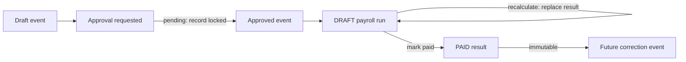

# Adjustments, ledgers and locking

## A ledger is a dated movement history, not a second copy

Store a ledger only when the business fact cannot be represented by the originating request or by a
paid payroll result. A ledger exists to preserve independently dated movements whose order and
running balance matter.

| Subject                        | Authoritative transaction                             | Separate ledger?         | Reason                                                                                                                               |
| ------------------------------ | ----------------------------------------------------- | ------------------------ | ------------------------------------------------------------------------------------------------------------------------------------ |
| Leave taken                    | Approved `leave_request`                              | No duplicate `TAKEN` row | The request already contains type, dates, quantity and approval. Counting both would double-consume leave.                           |
| Leave correction or encashment | `leave_requests.event` adjustment/encashment arm      | No second table          | It remains a signed, dated event, structurally distinct from a time-off request in the same authoritative stream.                    |
| Claim or allowance             | Approved `component_entry`                            | No                       | The entry is already the money transaction and carries service date, pay period, evidence and origin.                                |
| Loan                           | `repayment_agreement` plus scheduled recovery entries | Yes, as a schedule       | Principal, due date and every instalment must reconcile before payroll; each instalment can then be linked and frozen independently. |
| Payroll/YTD                    | Paid payslips and contributions                       | No mutable accumulator   | Earlier paid results are the immutable accounting history. YTD is their sum.                                                         |
| Payment file                   | Projection from a paid run                            | No                       | A file is an output transport, not another source of payroll truth.                                                                  |

Approved `TIME_OFF` requests create taken movements directly. Adjustments and encashments use their
own strict `leave_requests.event` arms. The migration keeps an unmatched historical `TAKEN` row as
`LEGACY_TAKEN`; a projection already matched to its request is not counted twice.

## Settled and projected balances

Two different questions read that ledger, and they must not read it the same way.

Payroll settles, so it acts on the **settled** basis: rows whose `norbital_approval_id` is null.
A movement still held by an approval request is not yet a fact, and paying against it would settle a
decision nobody has made.

A new leave or claim request is checked against the **projected** basis, which counts every row
including the pending ones. Otherwise someone with one request awaiting approval could submit a
second against a balance the first has already spent, and each would look affordable on its own while
the pair overdraws.

## Loan schedule

Creating an agreement provisions an exact instalment schedule. Equal instalments are a convenience,
not a restriction: the final remainder is adjusted so that the schedule reconciles exactly.

```text
SUM(instalment amounts) = principal
last instalment date    ≤ repay-by date
```

Both client and server reject either invariant when it fails. Each scheduled recovery is an approved
component entry, and a paid payslip line links to the entry it consumed. A linked instalment cannot
be edited or deleted; an unlinked future instalment may be changed while the two agreement
invariants remain true.

## Corrections and back pay

Corrections are classified by cause before they are entered:

| Cause                                                                                          | Seed or calculate?             | Treatment                                                                                                |
| ---------------------------------------------------------------------------------------------- | ------------------------------ | -------------------------------------------------------------------------------------------------------- |
| A source document states a genuine prior-period adjustment whose original event is unavailable | Seed                           | Approved entry with the source pay period, evidence and an explicit `inferred` or correction description |
| Prior-year statutory amount has to be carried into the tested horizon                          | Seed                           | Dated correction entry because the causal paid period is outside the available run history               |
| Joiner was correctly deferred by cutoff policy                                                 | Calculate                      | Re-derive the prior-period contract amount; do not seed the output                                       |
| Late claim/allowance is explicitly assigned to a later pay period                              | Seed the event, not the result | Keep service date and explicit `pay_period` distinct                                                     |
| A paid amount was wrong                                                                        | Correct prospectively          | Add an approved future-period adjustment or reversal; never rewrite a paid run                           |

Amounts are positive magnitudes. Earning or deduction direction comes from the pay component policy. A
reversal uses `origin = REVERSAL` and links to its original entry rather than storing a negative
amount.

## Locks



| Boundary             | Current guarantee                                                                    | Why                                                                                                      |
| -------------------- | ------------------------------------------------------------------------------------ | -------------------------------------------------------------------------------------------------------- |
| Pending approval     | A record carrying `norbital_approval_id` is locked; payroll reads only approved rows | Prevents use and mutation while a decision is outstanding                                                |
| Draft run            | Results may be wholly replaced by recalculation                                      | Keeps drafts responsive without mixing old and new lines                                                 |
| Paid run             | Recalculation and deletion are blocked; output children cannot be deleted            | Preserves the exact result used for payment, YTD and audit                                               |
| Loan instalment      | A recovery entry linked to a payslip is immutable                                    | Prevents a loan balance from changing behind a paid deduction                                            |
| Leave event stream   | Corrections use new adjustment events                                                | A balance correction remains visible instead of rewriting history                                        |
| General event source | The payslip line records consumption                                                 | Establishes provenance, but does **not yet** universally freeze every linked claim, leave or time record |

The final row is a documented gap, not an implied guarantee. Universal consumed-source immutability
requires a common server hook over every supported source kind. Until then, paid results remain
frozen, but some original inputs can still be edited independently.
