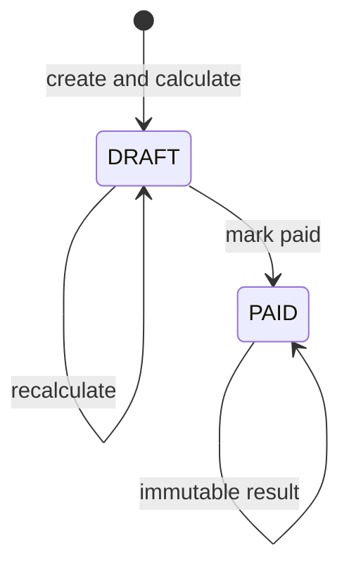

# Payroll lifecycle

## Run state

One `payroll_runs` row is unique by company and period.



A draft recalculation deletes that run's previous payslips and cascaded children before writing the
new answer. It never merges old and new lines. A paid run cannot be recalculated or deleted; a later
correction is a new approved event in a later draft.

## Eight phases

| Phase      | Reads or produces                                                                                                           | Failure behaviour                                                   |
| ---------- | --------------------------------------------------------------------------------------------------------------------------- | ------------------------------------------------------------------- |
| PICK       | Company, jurisdiction, component catalogue, rates, OT rules, shifts, holidays and leave policy; produces configuration hash | Fails when no effective configuration resolves                      |
| VALIDATE   | Mapping completeness, pay calendar and rule integrity                                                                       | Blocks before reading an employee                                   |
| GATHER     | Approved employee, terms, facts, money entries, leave, roster, clocks, agreements and earlier paid YTD                      | Refuses a truncated query or missing required employment facts      |
| MEASURE    | Converts schedule, entries, formulas and overtime into typed monetary lines                                                 | Refuses unpriced hours, missing terms or invalid formula inputs     |
| ACCUMULATE | Applies every line's statutory treatment to each contribution base                                                          | Refuses missing or undecided treatment cells                        |
| CONTRIBUTE | Applies effective rate bands and statutory special rules                                                                    | Refuses an uncovered band or missing selector fact                  |
| SETTLE     | Calculates gross, deductions, net, employer cost and deduction shortfall                                                    | Does not allow a negative net; carries an unpaid recovery forward   |
| PERSIST    | Replaces draft results with payslips and their complete direct component/statutory lines                                    | Writes in dependency order; a partial prior result is cleared first |

## Periods and cutoffs

Three dates must not be conflated:

| Concept                      | Meaning                                        | Example value (January)   |
| ---------------------------- | ---------------------------------------------- | ------------------------- |
| Salary period                | Calendar month contractual wages belong to     | `2026-01-01`–`2026-01-31` |
| Attendance settlement window | Dated attendance/ordinary NPL paid in this run | `2025-12-21`–`2026-01-20` |
| Pay date                     | Date the run is paid                           | 28th of the payroll month |

For `pay_cutoff_day = 21`, the implementation treats 21 as the first included day:

```text
attendance start = 21st of previous month
attendance end   = 20th of payroll month
```

This boundary is `[cutoff day of previous month, day before cutoff in current month]`. A 21st event
therefore belongs to the new window, not the closing one.

### Money-event cutoff

A `component_entry` may state `pay_period` explicitly. That is authoritative. If it is absent, the
default is:

```text
event day <= cutoff day  → event calendar month
event day >  cutoff day  → following payroll month
```

This default is intentionally distinct from attendance selection. A late-submitted claim may be
assigned to a specific pay period without rewriting the service or receipt date.

### Per-frequency overrides

The company settlement policy may define an OT/night-shift window for a pay frequency. This allows a
semi-monthly group to settle OT from the 1st–15th while monthly staff use the company window.
Ordinary unpaid leave continues to use its own settlement rule; an OT override does not silently
move NPL.

## Joiners, leavers and arrears

The salary month is intersected with the employment range. Proration uses the jurisdiction's
configured basis.

- A joiner inside the period is prorated from the hire date.
- If company policy defers a person who joined after the attendance window closed, that period has
  no payslip. The next run re-derives what the skipped period would have paid from the contract and
  records it as arrears.
- A leaver is measured through the applicable final settlement boundary. Policy can extend final
  attendance to the exit date or pay full-period wages without changing the contract row.

Derived late-joiner arrears are not seeded. For example, an employee who joins mid-February may
receive March basic plus a separate back-pay basic line for the six days worked before the period
closed — those arrears are calculated from hire date and salary, not copied from the source listing.

## YTD ordering

Creating a run is blocked while an earlier run for the company remains `DRAFT`. This makes YTD
deterministic: the new run sees only frozen prior periods.

YTD is keyed by employee rather than employment so a transfer or rehire does not silently reset tax
or statutory accumulation. The tax-year start month comes from the jurisdiction.

## Idempotency and failure

Draft calculation is repeatable under the same approved inputs and configuration. Query reads are
guarded by a page ceiling: reaching the limit is treated as a failure rather than silently omitting
a roster, time, term or entry row. This turns “possibly wrong pay” into an explicit blocked run.
