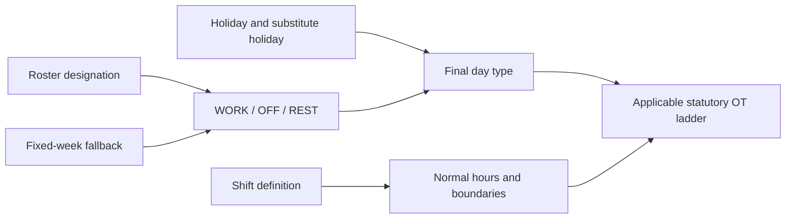
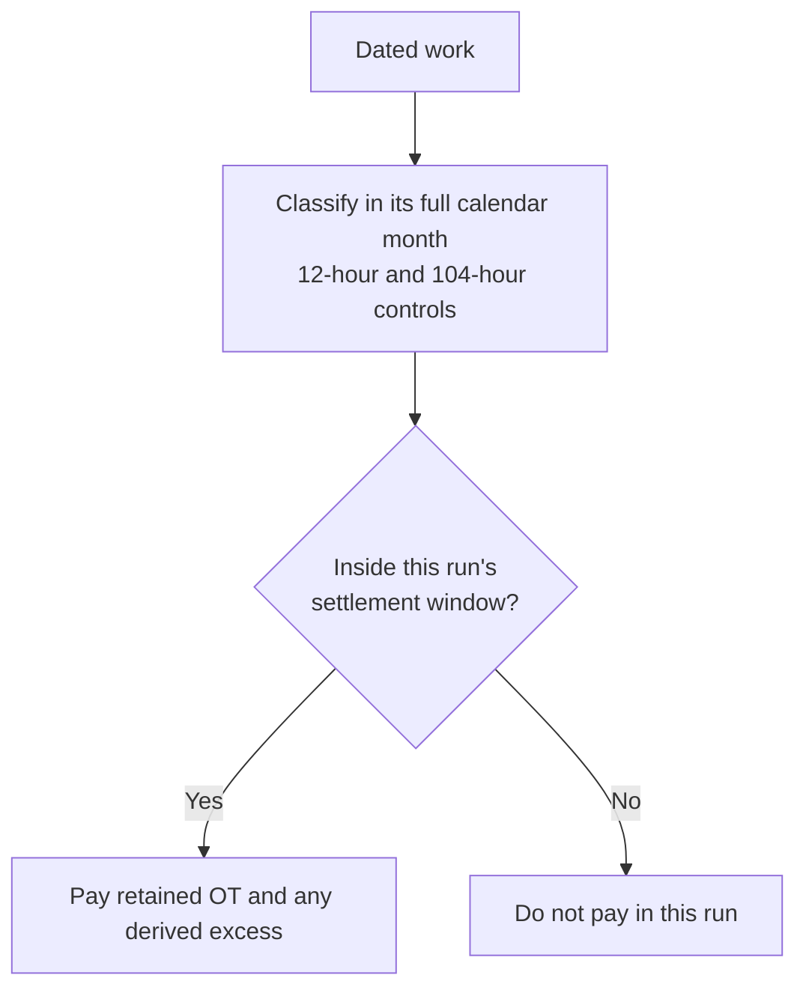

# Time, overtime and cutoffs

## From roster to day type

Day type is calculated before money:



For a rostered **shift worker**, the dated roster / attendance assignment is authoritative and may
place `REST` or `OFF` on any weekday. `WORK` is ordinary, `REST` is the statutory rest day and
`OFF` is an additional non-working day.

For a **fixed five-day (office / normal) worker** with no conflicting dated roster override:

- Saturday is `OFF`;
- Sunday is `REST` (statutory rest day);
- Monday–Friday are ordinary workdays unless a holiday or approved leave applies.

When no roster exists, working days per week and the configured rest weekday provide that fixed-week
fallback. Do not treat Saturday as the statutory rest day for a five-day contract.

`REST` does not mean that work is impossible. Malaysian law requires a weekly rest day; for shift
work, a continuous period of at least 30 hours can constitute that day. The employer prepares the
rest-day roster before the month. Work performed on the designated rest day remains rest-day work
and receives the rest-day ladder; it does not become ordinary OT merely because a replacement was
called in. `OFF` is an additional non-working day and is not interchangeable with the statutory
rest day. A genuine shift swap changes the dated roster before settlement rather than relabelling
the hours after they were worked.

An employee generally cannot be compelled to work on a rest day except for continuous/shift work or
the statutory exceptional circumstances. The engine still prices approved work that occurred; a
payment calculation is not evidence that scheduling the work was compliant.

A public holiday can replace an ordinary day. If a paid holiday falls on the statutory rest day,
the next working day is the substitute unless an explicit `company_holidays.substitutes_date`
already defines one. This changes schedule classification; it does not invent an OIL transaction.

## Gates

An overtime amount is produced only when all relevant gates pass:

1. the time entry is approved and `CLOSED`;
2. the shift permits overtime;
3. a separately punched OT interval, when supplied, is complete and forward-running; and
4. payable duration remains after flooring.

**Overtime is a calculated value, never a stored one.** A `time_entries` row records what happened
on the clock — the punches, the unpaid break, the clock state — and nothing about what those hours
are worth or who agreed to them. The payroll run derives the duration from the punches, and the
schedule decides whether the same hours were ordinary, rest-day or public-holiday work.

`time_entries` previously carried `overtime_authorized` and five `approved_ot_*_hours` buckets, and
both were engine inputs: a recorded refusal suppressed the day entirely, and a bucket total replaced
the clock as the payable duration. They were dropped in the `drop_time_entry_overtime_approval`
migration. A per-day authorisation decision, if a population needs one again, belongs on a record
that says who decided and when — not as an unattributed flag that silently withholds pay for hours
the clock says were worked.

## Hours

For an ordinary scheduled day without a dedicated OT punch:

```text
raw OT = clock-out − scheduled shift end − configured OT break
```

Early clock-in does not earn time because clock-in is clamped to shift start. On a rest, off or
holiday day, clocked work is measured from the actual punches less the applicable unpaid break.

A rest or off day schedules no shift — `roster_entries.shift_definition_id` is null on those arms —
so the clamp cannot come from the day itself. It is the employee's **ordinary** shift start, taken
from the rostered working days of the same window, so arriving before their normal starting time
stays unpaid on a rest day exactly as it does on a working one. The unpaid break on such a day is
the one the time entry records, because a day with no scheduled shift has no scheduled break.

Every dated quantity is floored down to a half-hour:

```text
1.99 → 1.5 hours
2.00 → 2.0 hours
2.49 → 2.0 hours
2.50 → 2.5 hours
```

There is no round-up and no automatic one-hour minimum.

## Pricing

An example company configuration uses the annualised dated method:

```text
HRP             = round(monthly salary × 12 / (weekly hours × 52), 2)
dated unit rate = round(HRP × statutory multiple, 2)
dated amount    = round(dated units × dated unit rate, 2)
payroll amount  = sum(dated amounts in the payment window)
```

The engine also calculates the statutory Malaysian floor when required:

```text
statutory HRP = round((monthly salary / 26) / normal daily hours, 2)
effective HRP = max(configured-method HRP, statutory HRP)
```

Ordinary/off-day work uses the ordinary OT ladder. Rest-day and public-holiday work can contain a
day-wage award for work within normal hours and an hourly award beyond normal hours. This is why a
legacy source's flat “1.5× hours” figure can differ from the statutory result, and why that figure
is not an input.

## Incentive OT (`OVERTIME_EXCESS`)

Incentive OT is calculated output. Source incentive-overtime columns are never an input.

Two independent limits classify already-earned statutory OT value:

### Daily total-work boundary

```text
daily excess hours = floor½(max(0, actual work hours − 12))
retained OT hours  = payable OT hours − daily excess hours
```

The legal ladder prices the whole day first. The value associated with excess hours is moved to the
matching `OVERTIME_EXCESS` component at the same statutory value; it is not discarded. The run then
**fails** on `DAILY_WORK_LIMIT_EXCEEDED`, naming the employee and the date: reclassification settles
what the day is worth, and does not make the schedule compliant.
The 12-hour boundary is the statutory daily maximum outside the Act's exceptional circumstances,
not a daily OT entitlement or a rule that permits twelve overtime hours.

### Calendar-month 104-hour boundary

The 104-hour counter:

- resets on the first day of the calendar month;
- counts ordinary-day and off-day OT;
- excludes rest-day and paid-public-holiday work; and
- advances chronologically by the full qualifying quantity, even when some hours also crossed the
  daily boundary.

Only the portion above 104 hours is moved to `OVERTIME_EXCESS`.

## Unpaid leave and the settlement window

NPL uses the same attendance settlement window as OT (21st–20th for Nihon). Calendar-month UL in
the source salary listing can therefore differ from the engine without either side being “broken”:

- Norbital: UL dates inside the run’s settlement window.
- Some Infotech April rows: UL dated in calendar April, including 21–30 April that belong to May
  settlement.

Named April examples are in the current variance report. Product rule: keep the 21st–20th window.

## Payment window versus compliance month

These are separate axes:



For January payroll with a 21st cutoff, the engine reads full December and January calendar months
to classify the dated hours, but pays only 21 December–20 January. Work on 21–31 January remains in
January's 104-hour counter and is paid by the following settlement window.

There is no blanket one-month incentive lag. Chronological classification determines whether a
specific dated hour crossed the threshold; the attendance window determines which run pays it.

## Coverage

Coverage is **data, not code**. It lives in `overtime_coverage_rules`, one effective-dated row per
jurisdiction, each carrying the section it comes from. Nothing about it is compiled in, and a
jurisdiction with no row covers everyone — absence of a coverage restriction is not a restriction
that excludes everyone. See
[Statutory overtime coverage](statutory-overtime-coverage.md) for the full model, the sources and
what is still unencoded.

A contractual entitlement can be more favourable: `employment_terms.overtime_eligible` widens
coverage and never narrows it. The legacy `work_classification = NON_EA` label is not, by itself,
proof that the Employment Act does not apply.

For Malaysia the row encodes the Employment Act 1955 First Schedule as substituted by the
Employment (Amendment of First Schedule) Order 2022 [P.U. (A) 262]: a ceiling of RM4,000 a month,
**inclusive** because paragraph 1A disapplies the ladder to wages that "exceeds" that figure; the
paragraph 2 categories — manual labour, supervisors of manual labour, and commercial vehicle
operators — covered irrespective of wages; and vessel work _excluded_ outright, because paragraph
2(4) disapplies the whole of Part XII, which is where ss.60, 60A and 60D live.

The ceiling is measured on First Schedule paragraph 3 wages — section 2 wages less commissions,
subsistence allowance and overtime payment — and **not** on base salary. The engine derives that
figure per employment: the contracted basic wage plus the signed totals of every cash-for-work
component's entries settling in the run, with the overtime components left out
(`classifyWageComparand` / `deriveStatutoryWages` in `payroll_runs/lib/coverage.ts`). A person on
RM3,800 basic plus a RM500 fixed allowance is outside the ladder; the old base-salary comparison
said inside. Where the model cannot express a distinction the statute draws — commissions and
subsistence allowance have no component category of their own — the derivation says so rather than
guessing, and a figure the run cannot produce fails the run naming the employee and the authority
instead of being approximated from the nearest column.

Meal breaks are data the same way: `rest_break_rules` carries each jurisdiction's cited row — the
consecutive-hours window the flat `break_minutes` columns cannot express, the minimum length, and
whether the statute counts the break as working time. The run picks them with the rest of its law
and records them in its configuration snapshot; nothing enforces them yet, because whether a break
was taken is a question over punches that payroll does not answer.
