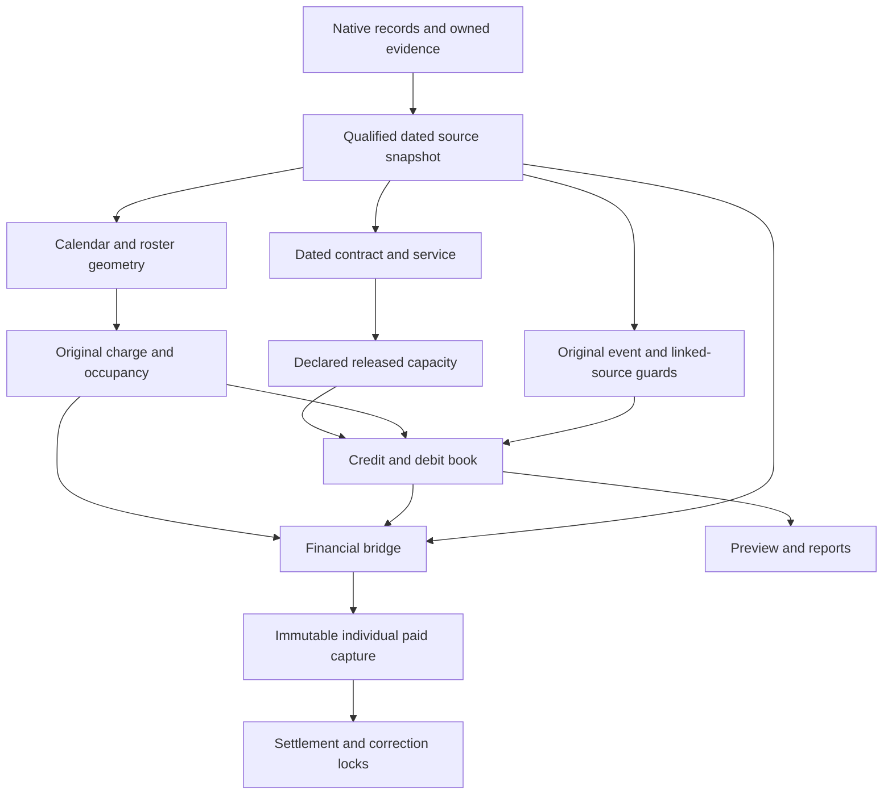

> Reference audit only. The sole active plan is [TAKEOVER.md](../TAKEOVER.md). Historical ownership/implementation proposals are not authorization; the two-schema dynamic-input model overrides them.

# Work and leave kernel contracts

Readonly architecture audit, 2026-10-03. All source paths below are relative to `templates/hr-payroll/src/`. The only authorized write in this audit is this document. No tests, probes, builds, source moves, schema changes or source rewrites were performed for this audit. Importer inventory includes TypeScript and Svelte imports, including type-only imports; it does not assert that every listed edge executes at runtime.

## A. Contract boundaries to freeze

| Boundary | Current exact contract locations | Invariant |
| --- | --- | --- |
| Original source admission | `lib/leave/context.ts`, `lib/leave/transferred-opening-admission.ts`, `lib/employment-lifecycle.ts`; native `data/collection/leave_entries/+collection.ts`, `employment_terms/+collection.ts`, `employments/+collection.ts` | Actual subject, original record/file/hash, effective period, observation instant and governing version remain attached. A key or legal label alone cannot qualify a source. Trusted same-write evidence is admitted before consumption and persisted atomically. |
| Dated employment | `lib/employment-contract.ts`, `lib/employment-lifecycle.ts`, `lib/payroll/run/eligibility.ts` | Legal classification at the actual evaluation date overlays status without rewriting original signed identity, expiry or historical paid capture. Same-stint lookback respects admitted replacement/correction boundaries. |
| Calendar and roster | `lib/scheduling/roster-code.ts`, `work-pattern.ts`, `lib/payroll/run/schedule.ts`, `lib/leave/context.ts`, `calendar-segments.ts` | Actual source date, worker/worksite scope, publication, source year and calendar identity survive projection. Missing coverage is unknown. No fabricated OFF day, attendance or holiday. Calendar charging and cash classification are separate. |
| Original charge | `lib/datatypes/leave_charges.ts`, `lib/leave/activity.ts`, `hourly-requirement.ts`, `calendar-segments.ts` | Actual charge date, required minutes, absent fraction, hour position, original statutory part and calendar-segment/person-calendar evidence remain immutable. Required minutes are not reconstructed from a later roster. |
| Credit/debit book | `lib/datatypes/leave_allocations.ts`, `lib/leave/balance.ts`, `event-pool.ts` | Debit and reversal retain exact original window, credit and pool. Pending positive credits cannot fund taking. Current dynamic capacity does not erase lawful approved taking or create a maximum historical grant. Manual/corrupt unsupported debits are not hidden by a zero clamp. |
| Financial bridge | `lib/leave/payroll.ts`, `original-statutory-source.ts`, `encashment-rate.ts`, `lib/payroll/family.ts` | Admission quantity is not money. Frozen original grant/charge identity joins exact pay-item and measured-adjustment indices; paid cash is conserved. Retained salary, statutory gross, extra earnings and guarantee differential remain distinct. |
| Findings and locks | `lib/scheduling/lock.ts`, `work-limits.ts`, `rest-break.ts`, `lib/payroll/work.ts` | Original paid/funded/captured rows stay locked. Source-declared findings do not silently suppress earned cash. Physical clock time and deemed normal paid time are separate quantities. |

The desired direction below is a contract DAG, not a claim that the present imports already form one:

## Current dependency seams

* `lib/leave/context.ts` imports `activeTimeOff` from `activity.ts`; `activity.ts` imports `leaveRules`, `leavePool`, `workplaceLeaveCatalogues` and `actualLeaveScheduleOn` from `context.ts`. This is an actual value-import cycle. Freeze the context/provider contract before extracting a small shared activity selector; do not relocate the whole planner or loader.
* `activity.ts` and `payroll.ts` both invoke original event/link/window/notice/calendar guards. Admission operates on a proposed reservation; payroll operates on captured approved originals and a dated financial source. Reuse pure guard contracts and original source decoders; retain both boundary invocations.
* `leave/context.ts` loads and qualifies original facts, assembles dated persons, resolves entitlement and calendars. It is a composition adapter, not one pure kernel. Its 25 importers are an existing coupling constraint, not justification for a wholesale rewrite.
* `scheduling/leave-coverage.ts::leaveCoverage` is one-record interval geometry; `leave/payroll.ts::leaveCoverage` is prepared payroll coverage. Identical names do not establish interchangeable semantics.
* `scheduling/rest-break.ts` contains render-tolerant interval assessment and strict original timed normal-rest valuation. Their malformed/open-interval behavior differs deliberately; sharing parsing must preserve that distinction.
* `work-limits.ts` handles planned capacity, while `payroll/work.ts` handles actual clocks and payable allocation. Planned normal-rest credit must be resolved with actual worker/date/source policy; an unassigned company pattern cannot use a blank worker to satisfy a conditional rule.

## Exact module classification and actual importers

A module can be a pure policy kernel, a source adapter, an orchestrator or a presenter. The following records its present responsibility and all discovered source-level importers, without proposing moves.

| Exact module | Present responsibility | Actual importers |
| --- | --- | --- |
| `lib/leave/activity-fields.ts` | Record vocabulary and event/interval normalization | `app/hr_controller/events/+leave.page.svelte`; `data/collection/benefit_cases/+collection.ts`; `data/collection/employees/+representation.svelte`; `data/collection/leave_contact_records/+collection.ts`; `data/collection/leave_entries/+collection.ts`; `data/collection/leave_entries/+representation.svelte`; `data/collection/work_day_credit_revisions/+collection.ts`; `lib/benefit-cases/payroll-guard.ts`; `lib/benefit-cases/reconciliation.ts`; `lib/benefit-cases/reimbursement-lifecycle.ts`; `lib/benefit-cases/reimbursement.ts`; `lib/employment-contract.ts`; `lib/leave/activity.ts`; `lib/leave/balance.ts`; `lib/leave/context.ts`; `lib/leave/payroll-time-off-credit.ts`; `lib/leave/payroll.ts`; `lib/leave/pending.ts`; `lib/leave/plan-batch.ts`; `lib/leave/preceding.ts`; `lib/notice-compensation.ts`; `lib/payroll/calendar-history.ts`; `lib/payroll/contribution.ts`; `lib/ui/leave/leave-activity-editor.svelte` |
| `lib/leave/activity.ts` | Admission orchestration, dated occupancy, reservations and original grant capture | `automation/+scheduled_entries.automation.ts`; `data/collection/leave_entries/+collection.ts`; `lib/deduction-authorization.ts`; `lib/leave/context.ts`; `lib/leave/exit-encashment.ts`; `lib/leave/payroll-time-off-credit.ts`; `lib/leave/payroll.ts`; `lib/leave/plan-batch.ts`; `lib/leave/preview.ts`; `lib/leave/transferred-opening-admission.ts`; `lib/notice-compensation.ts`; `lib/payroll/calendar-history.ts`; `lib/payroll/contribution.ts`; `lib/payroll/guaranteed-pay-family.ts`; `lib/payroll/money.ts`; `lib/payroll/original-leave-remuneration-source.ts`; `lib/payroll/work.ts`; `lib/replacement-time-source.ts`; `lib/ui/leave/leave-activity-editor.svelte` |
| `lib/leave/balance-report.ts` | Workbook/report presentation adapter | `app/hr_controller/events/+leave.page.svelte` |
| `lib/leave/balance.ts` | Pure credit/debit conservation, allocation, reversal and dynamic-budget integrity | `lib/leave/activity.ts`; `lib/leave/cash-waiver.ts`; `lib/leave/encashment-rate.ts`; `lib/leave/exit-settlement.ts`; `lib/leave/preview.ts`; `lib/leave/summary.ts` |
| `lib/leave/calendar-grid.ts` | Calendar presentation geometry | `lib/leave/preview.ts`; `lib/ui/leave/half-day-range-picker.svelte` |
| `lib/leave/calendar-period-budget.ts` | Source-declared calendar-period capacity guard | `lib/leave/event-pool.ts` |
| `lib/leave/calendar-segments.ts` | Source-qualified segmented calendar-day counter | `lib/leave/activity.ts`; `lib/leave/payroll.ts` |
| `lib/leave/cash-waiver.ts` | Original cash-room/waiver allocation | `lib/leave/activity.ts`; `lib/leave/exit-settlement.ts` |
| `lib/leave/codes.ts` | Leave/payroll code translation | `lib/leave/payroll.ts`; `lib/payroll/run/accumulate.ts` |
| `lib/leave/context.ts` | Async source loading, proof qualification, dated person/catalogue/calendar assembly | `automation/+scheduled_entries.automation.ts`; `data/collection/employments/+collection.ts`; `data/collection/jurisdiction_holidays/+collection.ts`; `data/collection/leave_entries/+collection.ts`; `data/collection/payment_events/+collection.ts`; `data/collection/payslips/+collection.ts`; `data/collection/source_cash_payments/+collection.ts`; `data/collection/work_days/+collection.ts`; `lib/checks.ts`; `lib/leave/activity.ts`; `lib/leave/cash-waiver.ts`; `lib/leave/contractual-relinquishment.ts`; `lib/leave/exit-settlement.ts`; `lib/leave/payroll-time-off-credit.ts`; `lib/leave/payroll.ts`; `lib/leave/plan-batch.ts`; `lib/leave/preview.ts`; `lib/leave/summary.ts`; `lib/leave/transferred-opening-admission.ts`; `lib/notice-compensation.ts`; `lib/property-liability-admission.ts`; `lib/statutory-election-source.ts`; `lib/successor-original-cash.ts` |
| `lib/leave/contractual-relinquishment.ts` | Original contractual surrender assessment | `lib/leave/context.ts` |
| `lib/leave/encashment-rate.ts` | Original credit-year wage-rate consumer | `lib/payroll/families.ts` |
| `lib/leave/entitlement.ts` | Policy-derived windows, service qualification and released/earned capacity | `automation/+scheduled_entries.automation.ts`; `data/collection/work_days/+collection.ts`; `data/collection/work_days/lib/import-month.ts`; `lib/leave/activity.ts`; `lib/leave/balance.ts`; `lib/leave/cash-waiver.ts`; `lib/leave/context.ts`; `lib/leave/contractual-relinquishment.ts`; `lib/leave/payroll-time-off-credit.ts`; `lib/leave/payroll.ts`; `lib/leave/preview.ts`; `lib/leave/summary.ts`; `lib/payroll/work.ts`; `lib/ui/leave/leave-activity-editor.svelte` |
| `lib/leave/event-pool.ts` | Original event identity, linked sources, dated windows and counted-day conservation | `lib/leave/activity.ts`; `lib/leave/payroll.ts`; `lib/pay_request_rules.ts`; `lib/payroll/money.ts` |
| `lib/leave/exit-encashment.ts` | Exit balance to encashment command preparation | `lib/leave/exit-settlement.ts` |
| `lib/leave/exit-settlement.ts` | Departure proof and settlement orchestration | `automation/+leave_encashment_due.automation.ts`; `automation/+leave_encashment_on_exit.automation.ts`; `data/collection/employments/+collection.ts` |
| `lib/leave/hourly-requirement.ts` | Hourly basis qualification and payable wage-day conversion | `lib/leave/activity.ts`; `lib/leave/context.ts`; `lib/leave/payroll.ts`; `lib/payroll/families.ts`; `lib/payroll/run/engine.ts` |
| `lib/leave/original-statutory-source.ts` | Frozen admitted statutory grant decoder for financial consumers | `lib/leave/payroll.ts`; `lib/payroll/original-leave-remuneration-source.ts` |
| `lib/leave/payroll-time-off-credit.ts` | Original paid-payroll time-off credit assessment | `lib/leave/context.ts` |
| `lib/leave/payroll.ts` | Payroll preparation, source re-admission and original leave-cash adapters | `lib/payroll/allowances.ts`; `lib/payroll/families.ts`; `lib/payroll/family.ts`; `lib/payroll/net-floor.ts`; `lib/payroll/run/configuration.ts`; `lib/payroll/run/export-data.ts`; `lib/payroll/run/gather.ts`; `lib/payroll/work.ts` |
| `lib/leave/pending.ts` | Pending/posted row normalization | `data/collection/payslips/+collection.ts`; `data/collection/work_day_credit_revisions/+collection.ts`; `lib/leave/activity.ts`; `lib/leave/calendar-period-budget.ts`; `lib/leave/cash-waiver.ts`; `lib/leave/context.ts`; `lib/leave/encashment-rate.ts`; `lib/leave/event-pool.ts`; `lib/leave/payroll.ts`; `lib/leave/preceding.ts`; `lib/pay_request_rules.ts`; `lib/payroll/calendar-history.ts`; `lib/payroll/original-leave-remuneration-source.ts`; `lib/replacement-time-source.ts` |
| `lib/leave/plan-batch.ts` | Native batch admission adapter and reservation sequencing | `data/collection/leave_entries/+collection.ts` |
| `lib/leave/preceding.ts` | Original preceding-leave admission guard | `lib/leave/activity.ts`; `lib/leave/payroll.ts` |
| `lib/leave/preview.ts` | Read/query adapter using actual admission and balance kernels | `data/collection/leave_entries/+collection.ts`; `lib/ui/leave/leave-activity-editor.svelte` |
| `lib/leave/return-period.ts` | Original agreed return-period qualification | `data/collection/leave_contact_records/+collection.ts`; `lib/leave/activity.ts`; `lib/leave/event-pool.ts`; `lib/payroll/history.ts` |
| `lib/leave/service-rights.ts` | Original predecessor continuity/transfer-right assessment | `lib/leave/context.ts`; `lib/leave/transferred-opening-admission.ts` |
| `lib/leave/summary.ts` | Balance and encashment summary orchestration | `app/hr_employee/+self_service.page.svelte`; `automation/+scheduled_entries.automation.ts`; `data/collection/leave_entries/+collection.ts`; `lib/leave/balance-report.ts`; `lib/leave/exit-encashment.ts`; `lib/leave/exit-settlement.ts` |
| `lib/leave/transferred-opening-admission.ts` | Async native transfer-source admission and predecessor usage locking | `data/collection/employment_history/+collection.ts`; `data/collection/leave_entries/+collection.ts`; `data/collection/leave_transfer_opening_sources/+collection.ts` |
| `lib/leave/transferred-opening.ts` | Pure audited opening reconciliation | `lib/leave/activity.ts`; `lib/leave/transferred-opening-admission.ts` |
| `lib/leave/work-resumption.ts` | Source-declared work-during-leave qualification | `data/collection/work_days/+collection.ts`; `lib/payroll/work.ts` |
| `lib/scheduling/leave-coverage.ts` | Single-record interval coverage geometry | `data/collection/work_days/+collection.ts`; `data/collection/work_days/lib/import-month.ts`; `lib/late-arrival.ts` |
| `lib/scheduling/lock.ts` | Original payroll capture/settlement lock policy | `app/hr_controller/events/+work.page.svelte`; `app/hr_employee/+self_service.page.svelte`; `data/collection/rosters/+collection.ts`; `data/collection/work_days/+collection.ts`; `data/collection/work_days/lib/import-month.ts`; `lib/leave/activity.ts`; `lib/pay_request_rules.ts`; `lib/ui/PayRequests.svelte`; `lib/ui/pay-request-form.svelte`; `lib/ui/roster/capture-claims.ts`; `lib/ui/roster/employment-month.svelte`; `lib/ui/roster/roster-month-board.svelte`; `lib/ui/roster/roster-month-calendar.svelte`; `lib/ui/roster/roster-month.ts` |
| `lib/scheduling/normal-cycle.ts` | Declared normal-cycle selection and projected hour findings | `lib/payroll/run/gather.ts`; `lib/payroll/work.ts`; `lib/payroll/world.ts` |
| `lib/scheduling/rest-break.ts` | Timed interval geometry, break assessment and actual normal-rest credit | `data/collection/work_days/lib/import-month.ts`; `lib/payroll/run/overtime.ts`; `lib/payroll/work.ts`; `lib/ui/roster/roster-month.ts` |
| `lib/scheduling/rest-cycle.ts` | Declared weekly-rest cycle selection | `data/collection/work_days/lib/import-month.ts`; `lib/payroll/work.ts` |
| `lib/scheduling/roster-code.ts` | Roster variant/window/half geometry | `data/collection/work_days/+collection.ts`; `data/collection/work_days/+representation.svelte`; `data/collection/work_days/lib/assignment-overlap.ts`; `data/collection/work_days/lib/import-month.ts`; `data/collection/work_days/lib/kiosk-punch.ts`; `lib/benefit-cases/reimbursement.ts`; `lib/late-arrival.ts`; `lib/leave/activity.ts`; `lib/leave/context.ts`; `lib/leave/encashment-rate.ts`; `lib/leave/hourly-requirement.ts`; `lib/leave/payroll.ts`; `lib/notice-compensation.ts`; `lib/payroll/run/export-data.ts`; `lib/payroll/run/overtime.ts`; `lib/payroll/run/schedule.ts`; `lib/payroll/run/validate.ts`; `lib/payroll/work.ts`; `lib/scheduling/work-limits.ts`; `lib/scheduling/work-pattern.ts`; `lib/scheduling/workforce-validation.ts`; `lib/ui/roster/roster-month.ts` |
| `lib/scheduling/work-limits.ts` | Declared applicability, planned headroom, period limits and projection findings | `app/hr_controller/events/+work.page.svelte`; `data/collection/shift_patterns/+collection.ts`; `data/collection/work_days/+representation.svelte`; `data/collection/work_days/lib/import-month.ts`; `lib/payroll/journey-payroll.ts`; `lib/payroll/work-bands.ts`; `lib/payroll/work-lines.ts`; `lib/payroll/work.ts`; `lib/ui/roster/day-overtime.ts`; `lib/ui/roster/employment-month.svelte` |
| `lib/scheduling/work-pattern.ts` | Original pattern resolution and workload geometry | `app/hr_controller/events/+work.page.svelte`; `data/collection/shift_patterns/+collection.ts`; `data/collection/work_days/+collection.ts`; `data/collection/work_days/+representation.svelte`; `data/collection/work_days/lib/assignment-overlap.ts`; `data/collection/work_days/lib/import-month.ts`; `data/collection/work_days/lib/kiosk-punch.ts`; `data/collection/work_days/lib/schedule-rules.ts`; `lib/leave/activity.ts`; `lib/leave/context.ts`; `lib/leave/encashment-rate.ts`; `lib/leave/hourly-requirement.ts`; `lib/notice-compensation.ts`; `lib/payroll/calendar-history.ts`; `lib/payroll/contract-allowances.ts`; `lib/payroll/contribution.ts`; `lib/payroll/money.ts`; `lib/payroll/run/export-data.ts`; `lib/payroll/run/precheck.ts`; `lib/payroll/run/schedule.ts`; `lib/payroll/work.ts`; `lib/scheduling/work-limits.ts`; `lib/ui/roster/employment-month.svelte`; `lib/ui/roster/month-sources.svelte.ts`; `lib/ui/roster/roster-month.ts` |
| `lib/scheduling/workforce-validation.ts` | Cross-assignment interval overlap geometry | `data/collection/work_days/lib/assignment-overlap.ts` |
| `lib/employment-contract.ts` | Native contract binding, signed range and stint projection | `app/hr_controller/events/+work.page.svelte`; `app/hr_employee/+self_service.page.svelte`; `data/collection/adhoc_requests/+collection.ts`; `data/collection/claim_requests/+collection.ts`; `data/collection/employment_terms/+collection.ts`; `data/collection/employments/+collection.ts`; `data/collection/loans/+collection.ts`; `data/collection/work_days/lib/import-month.ts`; `lib/component_entry_cap_subject.ts`; `lib/deduction-authorization.ts`; `lib/eligible-types.ts`; `lib/leave/context.ts`; `lib/leave/encashment-rate.ts`; `lib/leave/payroll.ts`; `lib/leave/plan-batch.ts`; `lib/payroll/allowances.ts`; `lib/payroll/contribution.ts`; `lib/payroll/families.ts`; `lib/payroll/money.ts`; `lib/payroll/net-floor.ts`; `lib/payroll/run/configuration.ts`; `lib/payroll/run/engine.ts`; `lib/payroll/run/export-data.ts`; `lib/payroll/run/gather.ts`; `lib/payroll/run/settlement.ts`; `lib/payroll/statutory-replacement-context.ts`; `lib/payroll/wage-assessment.ts`; `lib/payroll/work.ts`; `lib/ui/roster/employment-month.svelte`; `lib/wage-assessment-declarations.ts` |
| `lib/employment-lifecycle.ts` | Source-qualified lifecycle classification and same-stint lookback | `data/collection/employment_terms/+collection.ts`; `data/collection/employments/+collection.ts`; `lib/datatypes/employment_lifecycle.ts`; `lib/payroll/run/eligibility.ts` |

## Native work-day adapters

| Exact path | Present responsibility and boundary |
| --- | --- |
| `data/collection/work_days/+collection.ts` | Native record admission, captured source locks, candidate day facts, actual worker/contract/site binding and original assignment overlap. Conditional rest-policy assignment checks must use this actual worker; current original capture fields and paid locks cannot be rewritten by a projection refactor. |
| `data/collection/work_days/lib/import-month.ts` | Batch workbook projection, actual dated worker/day-fact selection, planned hour splitting and warning reporting. Its complete source month is not interchangeable with a partial individual assignment window. |
| `data/collection/work_days/lib/assignment-overlap.ts` | Native read adapter for `scheduling/workforce-validation.ts` interval overlap. No wage classification belongs here. |
| `data/collection/work_days/+representation.svelte` | UI source selection and projected headroom. A render-time estimate cannot become authoritative admitted legal capacity. |
| `data/collection/shift_patterns/+collection.ts` | Unassigned pattern admission. A conditional worker entitlement remains deferred to an actual assignment; no fabricated profile or attendance. |
| `lib/payroll/run/schedule.ts` | Actual shared schedule resolver used by payroll and leave context. Preserve recorded roster precedence, source windows and rest/holiday successor identity. |
| `lib/payroll/work.ts` | Actual work measurement and normal/premium cash allocation. Preserve physical attendance independently of source-qualified normal paid rest or legal paid activities. |

## B. Bounded changes after contracts freeze

| Candidate change | Exclusive kernel write scope | Paired caller scope | Preconditions and stop boundary |
| --- | --- | --- | --- |
| Break context/activity import cycle | A small existing selector in `lib/leave/activity-fields.ts` or `pending.ts`; exact imports in `activity.ts` and `context.ts` | Only current selector callers | Freeze active/approved/reversed/held semantics first. No planner/loader moves, no ownership-wide rewrite. |
| Unify source guard invocation inputs | `lib/leave/event-pool.ts`, `preceding.ts`, `return-period.ts` | `activity.ts`, `payroll.ts`, native admission proof producer | Same original subject, evidence snapshot, source clock and event identity on each boundary. Do not remove financial re-admission checks. |
| Dynamic capacity conservation | `lib/leave/balance.ts` only for ledger mathematics; `context.ts` only for policy transport | Allocation snapshot datatype/custom field and native atomic original approval | Original capacity snapshot must be native derived. Preserve valid approved original TIME_OFF, current-limit reporting and strict manual/corrupt debit refusal. No max-window grant or retroactive paid reversal. |
| Shared normal-rest quantity | `scheduling/rest-break.ts` for timed geometry; `work-limits.ts` for planned policy projection | Bound work-day assignment/import and `payroll/work.ts` | Original signed plan versus actual clock inputs remain explicit. No jurisdiction thresholds in runtime. Full period projection requires complete original plan source, not a single-day guess. |
| Same-stint classification lookback | `lib/employment-lifecycle.ts` decoder/selector; `employment-contract.ts` and eligibility only transport | Native qualified term identity plus payroll/leave actual term history | Admitted current contract identity, original conversion and replacement/correction bounds are mandatory. Null ordinary assessment must not erase legal continuity, and an unrelated old classification must not win blindly. |
| Calendar/charge source reuse | `calendar-segments.ts`, `hourly-requirement.ts`, pure roster geometry | Admission, payroll and frozen charge descriptors | Calendar unknown-year coverage, statutory versus employer-added source and original quantity/occupancy must remain conserved. No one global calendar boolean replacing segment semantics. |
| Exact financial source transport | `original-statutory-source.ts`, narrow `payroll.ts` adapter | Remuneration resolver, pay-item/adjustment schema and engine | Exact charge/pay-item indices, actual original required minutes and sourced guarantee. No date-only join, current roster reconstruction or cap applied as an invented extra earning. |

Each row is a potential bounded scope, not authorization to implement it during this audit. Freeze the input/output and observation contracts with native, schema and pricing owners before a source edit. No new standalone helper without a demonstrated current importer and owner.

## Unfrozen contracts found in the current source

1. Conditional individual roster-assignment period caps need the complete original worker-bound projection window. Import-month has an actual bound producer; an unassigned pattern is insufficient.
2. Financial ongoing-monthly-obligation transport is separate from post-exit covenant capture. Actual paid-universe observation, approved individual payment cutoff and original active-contract range must be paired before treating that path as complete.
3. Dated employment conversion lookback requires actual full term-history transport to every relevant person producer; the canonical selector alone does not establish caller coverage.
4. Benefit-case/event joins need explicit original case provenance where multiple same-day same-kind child/delivery cases are possible. A first matching label/date is not a conserved source join.
5. Original remuneration eligibility phase/charge-date recipe fields require frozen snapshot, descriptor and resolver pairing; registry acceptance alone is not financial closure.

These are source-contract residuals, not test results. Existing historical paid taking, original cash, transfer usage locks and evidence snapshots remain authoritative throughout any later extraction.
