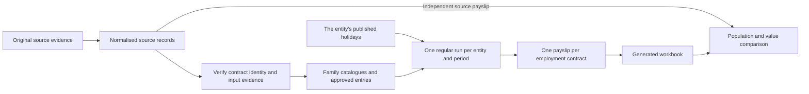

# Payroll source inputs and reconciliation

## Source-to-result flow



Normalisation preserves business values. It may unmerge cells, repeat identifying fields, remove
repeated headers and use consistent date, number and code representations. Retain the original
file hash, workbook, sheet and row or cell supporting each source record. A confirmed correction
keeps both the original evidence and the approval explaining the change.

Cleaning must not infer employment dates, manufacture a shift, adjust a claim amount, generate
encashment or carry-forward, or copy a calculated payslip amount into an input family.

## Fixtures and provisioning boundary

The template's `tests/fixtures/seed` contains synthetic fixtures for its public suites. Customer
source records, identities and reconciliation results do not belong in the template or its tests.

The host provisions from an explicitly configured source bundle and the collection stages declared
in `norbital.template.json`. It does not discover source data by scanning sibling checkouts. Shared
catalogues load before the events referencing them; contracts load before their terms and events;
Work assignments load before dated Leave evidence; source captures and permanent contract seals
load after their consumers.

Fixture rows use the current authored model and datatype shapes. The seed adapter reports unknown
columns and missing required values instead of silently dropping them. It does not translate
retired collections or invent missing business facts. Optional reconciliation fixtures load only
when their fixture stage is explicitly selected.

An incomplete source migration records its unresolved originals and a
`source_review/migration-blockers.json` file in the configured source bundle. The host seeds what
the bank holds and prints every blocker group in its provisioning output, so the review debt is
visible on every reset rather than a gate in front of the workspace (owner direction,
2026-09-09). Nothing is invented for a blocked group: the rows that exist are true, and the review
files preserve the evidence still owed. They are not workspace collections.

## Contract and family scope

`employments` represents one employment contract: one employee profile, one legal entity and one
uninterrupted stint. A profile may hold active contracts with different entities, but two service
windows for the same profile/entity cannot overlap. Rehire creates a new contract and a fresh
contract-scoped entitlement calculation. Source identifiers must distinguish those stints.

Every employee event, generated loan instalment and payslip carries its contract's `employment_id`.
An entry, its correction and its payslip captures must agree on that contract. Do not move an old
obligation to a rehire contract or combine two entities' payouts. Contribution may aggregate a
person's settled amounts across contracts within the same entity/year when its scheme requires it;
that does not merge their leave balances or source obligations.

Jurisdiction-relative residency status belongs to effective employment terms, with the day that
standing began (`residency_since`). Move an existing status only when its contract's jurisdiction
is evidenced; a profile shared across jurisdictions must not propagate one global status to every
contract. Unknown remains unknown and does not satisfy citizenship eligibility.

The predicate facts a statute keys on are columns: `employees.marital_status` (`SINGLE` or
`MARRIED`), `employees.spouse_status` (`NONE` | `WITHOUT_INCOME` | `WITH_INCOME`),
`employees.solo_parent`, `employees.race` and `employees.religion` (only where a fund is
selected by them), `employment_terms.residency_since`, and `companies.region`, which names the row of
`jurisdiction_settings.minimum_wages` a scheme's floor or cap reads. A fact that is unrecorded is
never inferred from another.

The first committed reference seals the contract, and the consumers themselves are the evidence:
actual Work dates, approved Leave charges or debit valuations and each payslip's `terms_through`
protect the effective terms through those dates. Future entitlement projections do not advance
them. There is no separate seal log to import.

Departure is the contract's own `exit_date`, `exit_reason` and `exit_note`, recorded once and
immutable afterwards. It preserves the signed contract and does not generate any payment. A missing
departure reason remains unresolved.

| Family       | Source inputs                                                                                                                                | Preservation requirement                                                                            |
| ------------ | -------------------------------------------------------------------------------------------------------------------------------------------- | --------------------------------------------------------------------------------------------------- |
| Work         | Work catalogue (rate, regime, one scheme-by-line treatments matrix, one citation), effective terms, shifts, schedules and dated Work entries | Preserve the actual dated assignment and attendance evidence; never apply a later pattern backwards |
| Leave        | Leave catalogue and manual `leave_entries`                                                                                                   | Preserve event category, exact dated charges, credit allocations, reference and approval evidence   |
| Claim        | Claim catalogue and approved claims                                                                                                          | Preserve entered amount, original dates, receipts, entitlement bands and settlement assignment      |
| Allowance    | Allowance catalogue and approved awards or recurring assignments                                                                             | Preserve recurrence, amount and the original eligibility window                                     |
| Payment      | Payment catalogue and approved one-off payments or deductions                                                                                | Preserve source and catalogue IDs, entered amount, effective date, reason and receipt               |
| Loan         | Loan catalogue, agreement and `loan_repayments`                                                                                              | Preserve principal, instalment sequence, due dates and each instalment's contract identity          |
| Contribution | Scheme catalogues, rates, their predicates and contract facts                                                                                | Preserve effective applicability and the explicit treatments declared by source-family outputs      |

Bonuses, notice pay and separation payments are Payment catalogue definitions. Who may raise a
claim, allowance or payment and up to what ceiling is the catalogue row's `eligibility` and
entitlement matrix, judged against the contract terms in force on the event date; `grade` on the
terms is the tier those predicates read. Every event form's type picker offers only the rows whose
predicate holds for the person today, so an ineligible type is not offered rather than refused; the
hook refuses it anyway on the event date. A receipt (`evidence_file`) is a column on all three
money families and is required when the catalogue row's `evidence` says so. A leave row grants days the same way: its entitlement
bands are `{eligibility, days}` rows read top-down, and `paid` plus one scheme × absence/encashment
`treatments` matrix say what an unpaid or encashed day does on the payslip. Encashment and
carry-forward remain manual Leave categories. No annual account rows, accrual scheduler, automatic
departure payments or automatic carry-forward policies are seeded.

## Leave and holiday evidence

Consecutive Leave dates may be collapsed only when contract, leave type, reason, approval context
and other source metadata agree, with no missing dates or half-days. Preserve total charges and
source identity. A range crossing payroll periods retains each dated charge so each period captures
only its own dates. Approved activity must not be rewritten to fit today's schedule or entitlement.

A TIME_OFF entry retains the exact catalogue, employment term, shift, calendar and optional Work
assignment supporting every charged date. Historical Work overrides must come from source evidence
and retain their original assignment code and origin. Missing evidence is not permission to choose
an arbitrary shift or distribute a range's quantity across dates.

Leave quantities reconcile against computed entitlement and explicit manual entries. Compare
usage on the dates it occurs, because the entitlement tier, eligibility and released entitlement
can change within a year. Distinguish missing policy on an actual activity date from an unavailable
future year-end valuation. Do not invent opening adjustments or carry-forward credits merely to
make an old usage total fit a formula.

Holidays are standalone **entity** rows — `unique(company_id, date)` — one per observed day, each
published on its own, with a `kind` (`PUBLIC`, `SPECIAL`, `SUBSTITUTE`) the run classifies the day
by and freezes with it. There is no per-jurisdiction holiday concept: two entities in one country
keep different holiday sets, and the seed bank carries each entity's own rows under
`records/<entity>/jurisdiction_holidays.json` rather than under `statutory/<lineage>/`. Company
closures and personal roster labels do not establish observed holidays. Imported rows keep their
provenance and arrive unpublished; the bank's own observed rows carry their own `published_at`, and an
unpublished holiday is not observed anywhere.

A Work day classified as a holiday pins it (`work_days.holiday_id`), each Leave charge carries the
`holiday_id` that excluded its day when one did, and a run captures the holidays it read
(`payroll_runs.holidays`); a paid run freezes that snapshot. A later publication cannot change a date a
pinned work day or a paid run classified.

## Monetary inputs and cutoff dates

Preserve both the original event date and any explicitly supplied settlement assignment. Do not
move an event date to force a cutoff. The configured attendance window determines which Work dates
are measured; the family determines when an approved monetary entry is due.

Exactly one payroll is allowed per entity and period. Late approved obligations remain attached
to their original contract and become eligible for a later regular run, including after departure.
A paid period is not reopened and no ad hoc run is created. A correction retains its original source
and capture evidence rather than making the original obligation payable again.

Calculated salary, overtime, unpaid-leave reductions, contributions, tax, gross, net and YTD totals
are outputs. Do not seed a second monetary copy. A manual historical correction is an input only
when the source explicitly supplies the transaction and its cause cannot already be reconstructed
from the supplied terms, attendance, Leave or other family entries.

Loan agreements whose principal and instalments disagree require reconciliation. Do not alter the
schedule to force equality or create an unapproved replacement deduction. Conflicting trackers and
paid listings similarly require explicit evidence of the approved amount and transaction dates.

## Reconciliation

Use an isolated local test database with the current template and verified source inputs. Calculate
regular periods chronologically and settle them in order so later contribution and YTD inputs are
stable. Export the resulting workbooks and record the source and generated file hashes.

Expected values come directly from the independent source workbooks. Generated output, previous
reports and cached calculated values must not supply expected results.

Compare by entity, employment contract and payroll period. A source keyed only by employee code
must first resolve that code to the correct stint; ambiguous rehires or concurrent entity payouts
remain unresolved. Report missing and extra contract/period rows separately from value variances.

For every compared field:

```text
delta = generated amount − independently sourced amount
```

Zero and blank are distinct unless the source contract says otherwise. Report signed and absolute
variance totals so opposite errors cannot cancel. Each assessed variance identifies the contract,
period, field, source cell and amount, generated cell and amount, arithmetic difference and supporting
input evidence. Gross, contribution and net consequences of one input error are not separate causes.

A numerical match alone is insufficient: dated quantity, rate basis, day classification, rounding,
source selection and permanent captures must also agree. List every unresolved source record and
required input that was not supplied. Passing fixture shape or coverage checks does not establish
private payroll parity or authorize loading incomplete approved history.
