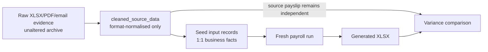
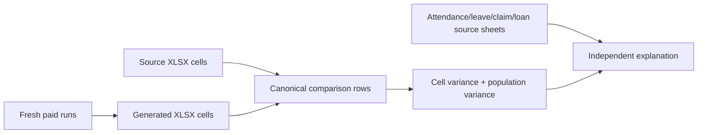

# Clean payroll data: source-to-seed and reconciliation

## Pipeline



`cleaned_source_data` is a navigable representation of supplied source material. It is not a place
to repair unexplained values or manufacture a cohesive dataset. Formatting, merged cells, repeated
headers and employee grouping may be normalised; business values remain unchanged.

When a source conflict is resolved with explicit business approval, record the correction in the
cleaned archive and document it in the seed audit. All other conflicts and omissions remain visible.

## What a reconciliation dataset contains

A typical private reconciliation exercise supplies the following input families. Counts vary by
engagement; the audit must report exact coverage for the dataset under test, not assumed totals.

| Input family                    | Seed rule                                       | Typical audit question                                  |
| ------------------------------- | ----------------------------------------------- | ------------------------------------------------------- |
| Medical claims                  | One seeded row per approved cleaned claim       | Does every tracker row map 1:1?                         |
| Loan instalments                | The obligation's inline schedule plus explicit reversals | Are unsupported schedules excluded rather than altered? |
| Direct allowances               | Source-backed money entries only                | Are calculated incentive columns excluded?              |
| Obligations                     | Claims, adjustments, recoveries with provenance | Is any payslip output copied back as input?             |
| Leave requests                  | Approved cleaned requests linked to employments | Do quantities and dates match the source?               |
| Employee master and employments | Codes, hire dates, terms, statutory facts       | Are incomplete master gaps disclosed?                   |
| Attendance                      | Dated rows per employment                       | Are rows without a complete master left unseeded?       |

Calculated payslip columns — basic earned, overtime amounts, incentive overtime, unpaid-leave
deductions, contributions, tax, gross, net and year-to-date totals — never enter seed. They are
produced by a fresh run and compared against the independent source workbook.

## Seed hygiene principles

- Remove placeholder employments when the employee master is incomplete; retain cleaned attendance
  rows so the missing-data boundary stays visible.
- Exclude loans whose principal and instalment schedule disagree; keep period recoveries
  that the source states explicitly.
- Do not seed business incentive overtime from a payslip column when no input policy or event exists.
- Do not seed derived late-joiner basic arrears; let the engine calculate them from hire date and
  contract salary.
- Retain source-stated closed-period corrections and prior-year statutory adjustments whose causal
  periods cannot be reconstructed inside the test horizon.

## Known missing-evidence categories

The seed audit must list every source record that cannot be seeded. Common categories:

| Missing source                                                               | Payroll impact                                                                                      |
| ---------------------------------------------------------------------------- | --------------------------------------------------------------------------------------------------- |
| Employee master for a population with attendance only                        | Attendance cannot form complete employments or money inputs                                         |
| Payslips withheld for blind testing                                          | Output can run but cannot yet be reconciled                                                         |
| Payslip amount that disagrees with the specialist tracker                    | Remains an input gap until HR confirms the paid amount; then seed the paid value with that evidence |
| Incomplete June joiner master while attendance exists                        | Keep cleaned attendance; key master/terms in UI for testing — do not invent                         |
| Loan whose principal does not equal the stated instalment schedule           | Period recoveries may pay, but the obligation cannot be represented consistently                    |
| Shift catalogue, roster definitions or independent medical register          | Identity, schedule and claim provenance remain incomplete                                           |
| Loan disbursement dates                                                      | Valid schedules exist, but origination-date audit is incomplete                                     |

## Source-to-seed contract

### Three field classes

| Class                     | Examples                                                                                                        | Seed rule                                                                               |
| ------------------------- | --------------------------------------------------------------------------------------------------------------- | --------------------------------------------------------------------------------------- |
| Supplied input            | employee master, terms, shift assignment, attendance, approved leave, claim, allowance, loan and its schedule   | Map one-to-one with provenance; normalise representation only                           |
| Derivable input structure | roster day generated from a supplied shift assignment and calendar                                              | Generate only when the governing source rule is present and retain the source code/date |
| Payroll output            | basic earned, OT amount, incentive OT, NPL amount, contributions, tax, gross, net, YTD                          | Never seed; calculate and compare                                                       |

The source payslip is test evidence, not seed. A matching output amount is not permission to copy it
back into an input table.

### Allowed cleaning

- unmerge cells and repeat employee identifiers on every dated row;
- use consistent sheet names and headers;
- preserve numbers as numbers, dates as dates and codes as text;
- remove decorative, empty and repeated-header rows;
- split a visually grouped block into one row per business record; and
- record original workbook, sheet, cell/row and file hash.

Cleaning must not calculate OT, infer a missing shift, convert leave, change a claim amount, invent a
transaction date or silently fill an employee master field. If source files conflict, both facts are
retained and the conflict is reported.

### Explicitly authorised entries when trackers disagree

An amount may appear on a source payslip but disagree with its specialist tracker. Prefer the
tracker when it matches the paid listing. When HR confirms a different paid amount with supporting
evidence, seed the **paid** amount and document the reason — do not invent a tracker receipt date
and do not leave the payslip amount as an unexplained gap.

Example: employee `NHPMY0053` has January medical RM93.50 on the salary listing (`JAN 2026!X5`).
The medical tracker also lists RM158 for January 2026 and RM215 for December 2025. The supporting
medical claim form shows the original claim RM158 struck through and replaced with RM93.50 because
the **2025 annual medical balance** remaining was RM93.50. Seed RM93.50 with that provenance; do
not invent a missing receipt date beyond the settlement window.

### Cutoff representation

Preserve both the event date and settlement assignment:

```text
event_date = when the attendance, claim, leave or instalment occurred
pay_period = explicit payroll assignment, when supplied
```

Do not move an event date to force it through a cutoff. Attendance is selected by the configured
21st–20th window. Obligations use explicit `pay_period` when present; otherwise their default
cutoff rule applies.

### Source-specific boundaries

- Paper January OT claims are corroborating evidence. Attendance remains the time input; a paper
  form never seeds an OT amount.
- Shift codes `01` and `10` remain source codes. Their roster/OT behaviour must come from the
  confirmed shift definition, not from a guessed label.
- OIL is calculated from holiday/rest-day rules when applicable. No missing OIL award transaction
  is fabricated.
- A late-joiner backpay derived from hire date and salary is output. A separately supplied historical
  statutory correction is input.
- Unsupported loan schedules are excluded rather than altered to make the totals fit.

### Completeness rule

The audit report must list every source record that cannot be seeded and every required payroll
input family that was not supplied. "No discrepancy" means exact cleaned-to-seed coverage within the
declared boundary; it does not mean that missing business documents were guessed.

## Reconciliation method

### Independence rule

The expected side is read directly from `cleaned_source_data` XLSX workbooks. Generated XLSX files
are actual results only. Cached JSON, old `output` folders, previous reports and generated workbooks
must never supply expected values.



### Refresh sequence

1. Reset the local test tenant from the current HR template and current seed.
2. Create and calculate periods chronologically; mark each period paid so later YTD is stable.
3. Export one generated workbook per period.
4. Hash every source and generated workbook.
5. Compare unique `(month, employee_code)` rows field by field.
6. Separately report missing and extra employee-month rows.
7. Audit source relationships for consumed events and deferred entries.
8. Explain representative variances from source attendance, leave, claim, loan and master workbooks;
   do not use a generated workbook to explain its own expected result.

### Comparison contract

For every field:

```text
delta = generated amount − source XLSX amount
```

Zero and blank are not interchangeable unless the source schema explicitly says so. Totals are
reported as both signed delta and absolute delta; otherwise positive and negative errors can cancel.

Each assessed example must include month, employee code, field, source amount and cell, generated
amount and cell, arithmetic delta, evidence used, conclusion and whether the cause is proven or
still unresolved.

### No-hallucination controls

- Expected values are loaded at runtime from XLSX, not copied into test code.
- The cleaned source file hash is recorded.
- A claim unsupported by the named source file is labelled unresolved.
- A mathematical match is necessary but not sufficient: the dated quantity, rate basis, day type
  and rounding order must also match.
- Downstream gross, contribution and net differences are not counted as independent root causes.
- The report is regenerated after any template, seed, source-cleaning or export change.

The current audited snapshot is maintained privately alongside the real source workbooks. This
document describes how to produce one; it deliberately embeds no client variance evidence, because a
public template that carried dated figures from one engagement would invite a reader to treat them
as the expected answer. Dated variance evidence against real source workbooks is maintained in the
private reconciliation suite, not in this public template.
