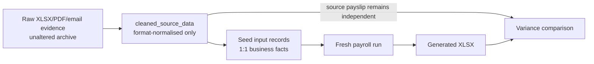

# Clean payroll data

## Pipeline

`cleaned_source_data` is a navigable representation of supplied source material. It is not a place
to repair unexplained values or manufacture a cohesive dataset. Formatting, merged cells, repeated
headers and employee grouping may be normalised; business values remain unchanged.

When a source conflict is resolved with explicit business approval, record the correction in the
cleaned archive and document it in the seed audit. All other conflicts and omissions remain visible.

## What a reconciliation dataset contains

A typical private reconciliation exercise supplies the following input families. Counts vary by
engagement; the audit must report exact coverage for the dataset under test, not assumed totals.

| Input family                    | Seed rule                                       | Typical audit question                                  |
| ------------------------------- | ----------------------------------------------- | ------------------------------------------------------- |
| Medical claims                  | One seeded row per approved cleaned claim       | Does every tracker row map 1:1?                         |
| Loan instalments                | Agreement schedule plus explicit reversals      | Are unsupported schedules excluded rather than altered? |
| Direct allowances               | Source-backed money entries only                | Are calculated incentive columns excluded?              |
| Component inputs                | Claims, adjustments, recoveries with provenance | Is any payslip output copied back as input?             |
| Leave requests                  | Approved cleaned requests linked to employments | Do quantities and dates match the source?               |
| Employee master and employments | Codes, hire dates, terms, statutory facts       | Are incomplete master gaps disclosed?                   |
| Attendance                      | Dated rows per employment                       | Are rows without a complete master left unseeded?       |

Calculated payslip columns — basic earned, overtime amounts, incentive overtime, unpaid-leave
deductions, contributions, tax, gross, net and year-to-date totals — never enter seed. They are
produced by a fresh run and compared against the independent source workbook.

## Seed hygiene principles

- Remove placeholder employments when the employee master is incomplete; retain cleaned attendance
  rows so the missing-data boundary stays visible.
- Exclude loan agreements whose principal and instalment schedule disagree; keep period recoveries
  that the source states explicitly.
- Do not seed business incentive overtime from a payslip column when no input policy or event exists.
- Do not seed derived late-joiner basic arrears; let the engine calculate them from hire date and
  contract salary.
- Retain source-stated closed-period corrections and prior-year statutory adjustments whose causal
  periods cannot be reconstructed inside the test horizon.

## Known missing-evidence categories

The seed audit must list every source record that cannot be seeded. Common categories:

| Missing source                                                               | Payroll impact                                                                                      |
| ---------------------------------------------------------------------------- | --------------------------------------------------------------------------------------------------- |
| Employee master for a population with attendance only                        | Attendance cannot form complete employments or money inputs                                         |
| Payslips withheld for blind testing                                          | Output can run but cannot yet be reconciled                                                         |
| Payslip amount that disagrees with the specialist tracker                    | Remains an input gap until HR confirms the paid amount; then seed the paid value with that evidence |
| Incomplete June joiner master while attendance exists                        | Keep cleaned attendance; key master/terms in UI for testing — do not invent                         |
| Loan agreement whose principal does not equal the stated instalment schedule | Period recoveries may pay, but the agreement cannot be represented consistently                     |
| Shift catalogue, roster definitions or independent medical register          | Identity, schedule and claim provenance remain incomplete                                           |
| Loan disbursement dates                                                      | Valid schedules exist, but origination-date audit is incomplete                                     |

See [Source-to-seed contract](source-to-seed.md) for the field rules and
[Reconciliation method](reconciliation.md) for the independent-output test. Dated variance evidence
against real source workbooks is maintained in the private Core reconciliation suite, not in this
public template.
