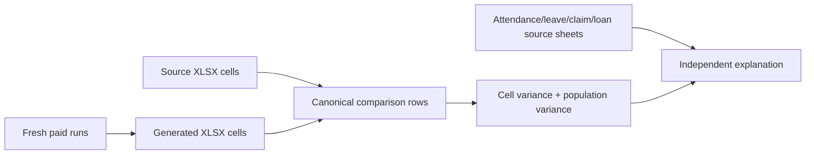

# Reconciliation method

## Independence rule

The expected side is read directly from `cleaned_source_data` XLSX workbooks. Generated XLSX files
are actual results only. Cached JSON, old `output` folders, previous reports and generated workbooks
must never supply expected values.



## Refresh sequence

1. Reset the local test tenant from the current HR template and current seed.
2. Create and calculate periods chronologically; mark each period paid so later YTD is stable.
3. Export one generated workbook per period.
4. Hash every source and generated workbook.
5. Compare unique `(month, employee_code)` rows field by field.
6. Separately report missing and extra employee-month rows.
7. Audit source relationships for consumed events and deferred entries.
8. Explain representative variances from source attendance, leave, claim, loan and master workbooks;
   do not use a generated workbook to explain its own expected result.

## Comparison contract

For every field:

```text
delta = generated amount − source XLSX amount
```

Zero and blank are not interchangeable unless the source schema explicitly says so. Totals are
reported as both signed delta and absolute delta; otherwise positive and negative errors can cancel.

Each assessed example must include month, employee code, field, source amount and cell, generated
amount and cell, arithmetic delta, evidence used, conclusion and whether the cause is proven or
still unresolved.

## No-hallucination controls

- Expected values are loaded at runtime from XLSX, not copied into test code.
- The cleaned source file hash is recorded.
- A claim unsupported by the named source file is labelled unresolved.
- A mathematical match is necessary but not sufficient: the dated quantity, rate basis, day type
  and rounding order must also match.
- Downstream gross, contribution and net differences are not counted as independent root causes.
- The report is regenerated after any template, seed, source-cleaning or export change.

The current audited snapshot is maintained privately alongside the real source workbooks. This
document describes how to produce one; it deliberately embeds no client variance evidence, because a
public template that carried dated figures from one engagement would invite a reader to treat them
as the expected answer.
