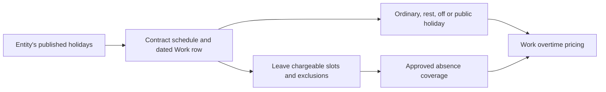

# Scheduling, attendance and Leave

Work records planned assignments and observed time for an employment contract. Leave records
approved activity against that contract and retains the dated charges used at approval. The shared
schedule combines effective terms, named patterns, explicit Work rows and the entity's published
holidays. Payroll uses those same facts.

See [Architecture](architecture.md) for family processing and [Leave](leave.md) for entitlement and
manual activity validation.

Work's preparation and calculation live in `src/lib/payroll/work.ts`; Leave's payroll preparation
and results live in `src/lib/leave/payroll.ts`. `src/lib/payroll/families.ts` coordinates their shared
schedule/absence inputs with the other families. Payroll consumes those prepared family results.

## Contract and schedule

`employees` identifies the person; `employments` identifies the stint with one entity. Work and Leave
always reference the contract. Only one contract for a person/entity pair can cover a date, while
contracts in other entities may be active simultaneously. Rehire starts a new contract. A sealed
contract's departure is recorded separately and does not create Leave or Payment entries.

Four scheduling layers have distinct meanings:

| Layer      | Stored input                                 | Meaning                                         |
| ---------- | -------------------------------------------- | ----------------------------------------------- |
| Base       | Terms reference a named `shift_patterns` row | The contractual schedule projected onto a date  |
| Assignment | `work_days.shift_definition_id`              | An explicit plan for that contract/date         |
| Overtime   | `approved_overtime_hours`, `incentive_hours` | Overtime planned with the shift, and its excess |
| Attendance | `work_days.worked_intervals`                 | Presence against the plan; the break is derived |

The shift assignment is one column of the contract's terms: `employment_terms.shift_pattern_id`,
always set. The days a week the contract works live in the pattern and nowhere else
(`patternDaysPerWeek`): a day cycle repeats roster codes from its row's anchor and works the WORK
days its weeks hold (an alternate-Saturday fortnight is 5.5); a declared week ("Rostered 6 days":
`days_per_week` and the paid minutes a week the roster must supply, or may not exceed) projects
nothing — the person holds a roster row with a shift for every day payroll prices, and a month
short of the declaration is a `WORKLOAD_BELOW_TERMS` warning in which a calendar holiday counts as
a met day. A rostered person is not ad hoc — their days move inside the declared week. Every reader
resolves the pattern through the effective terms.

`shift_definitions` is the collection for roster codes:

- `WORK` has start, end and unpaid break. Crossing midnight and paid minutes are derived.
- `REST` is the protected rest-day baseline.
- `OFF` is another planned non-working day.

An attendance-only row leaves the base assignment in force. A planned Work assignment on a patterned
REST/OFF day can supply clock boundaries while retaining the baseline classification for pricing.
A Work row with an empty interval list records absence unless approved Leave covers it. For a
patterned contract, no row means worked to the base with no overtime. For rostered contracts, missing
assignments remain visible and contractual workload checks prevent an unmet guarantee being treated
as a valid month.

Overtime is planned, like a rostered shift: the month board and the person's calendar print it in
the day's cell beside the shift code (`D` / `+2h OT · +1h inc`), and the day sheet keys the two
figures apart in the Planned section: approved overtime up to the maximum the day's statutory
headroom allows (shown beside the field; entry above it is blocked), and incentive hours by hand.
Nothing splits on the day sheet. A company holiday worked by someone the lineage's overtime rule
does not cover shows an inline notice to grant an off-in-lieu (OIL) leave day. Attendance is drawn only as a
presence check against shift plus planned overtime —
present, partial or absent. Clock time beyond that plan is shown on the day sheet as unplanned and
is never presented as overtime or paid.

Patterned changes are validated against the required monthly days and paid minutes. Rostered
changes are validated against their stated guarantee or cap. Assignment and attendance are separate
facts even when imported or displayed together.

## Entity holidays

Holidays are not roster codes, employee events or per-person selections. An entity's observed days
are rows of `jurisdiction_holidays` — `unique(company_id, date)` — each published on its own.
Company closures remain Work schedule decisions. The entity's Holidays tab is one table: add a day,
import the holidays spreadsheet or the Google calendar set beside it, and publish each day;
Settings → Catalog is untouched.

The yearly `holiday_import` automation reads the following year each 1 October from each entity's
configured Google calendar and adds the days that entity does not have yet, unpublished. A manual
run chooses an entity and a year. Every page must succeed before a row is written; credentials
belong to the managed connection. An imported day is not a payroll holiday until a person publishes
it.



Nothing asks a year to be complete: a day that is not published is simply not a holiday, and a
missing year is not a block. The freeze derives from live references, not a stamp: work days
never link a holiday (the calendar is overlaid by date) and a payroll run snapshots the
holidays it read (`payroll_runs.holidays`). Retracting a holiday (unpublish, moving its day or
entity, delete) is refused while a run snapshots it or a Leave charge names it. A finished run is
never touched by a holiday published later, and an import skips a day the entity already has.

Observed substitute dates are their own rows with an `original_date`. Work's explicit precedence
resolves an overlap with a rest day without inventing a personal substitute date. Leave charging,
calendar displays and overtime use the same resolved input and preserve existing Work links.

## Work import and overtime

Controller → Events → Work is the operational month board. People holds the contracts and effective
terms; Settings → Catalog holds family calculation definitions. The board identifies projected base,
explicit assignments and clocked time so an implied schedule cannot be confused with an observation.

A workbook may carry planned roster data, actual attendance and the planned overtime:

```text
planned code  → resolve WORK / REST / OFF assignment
blank cell    → no explicit assignment
PH token      → validate against the entity's published holidays
punch columns → normalize worked intervals
OT hours      → the day's total extra hours, split by the import into overtime and incentive hours
```

Import does not manufacture holiday rows or personal holiday scope, and it never derives overtime:
the Overtime sheet's half-hour cells are the day's total extra hours, breaks included. The import
— and only the import (and the one-off seed preparation) — splits it (`splitPlannedOvertime`) at
every statutory overtime limit — daily, weekly, monthly (over the pay's assessment window),
quarterly and yearly — in date order around the stored days of the same periods; none refuses the
file: the hours within all of them are written as `work_days.approved_overtime_hours`, and only the
excess as `work_days.incentive_hours`. A direct write (the day sheet, the API) keys both columns
itself and is refused where a day's approved hours pass their statutory headroom
(`overtimeHeadroom`), a later stored day included; incentive hours need no limit. Holidays are the
ones payroll observes (`observedHolidayDates`: the published rows, replacement days included, and a
SUBSTITUTE holiday carried off a rest day). A company holiday worked by someone the overtime rule
does not cover is imported with a warning (toast), stated again by the run as
`HOLIDAY_WORKED_NO_OVERTIME`; off-in-lieu leave is never created for it.
A daily total-hours limit binds every day; a daily overtime-hours limit binds an ordinary or off
day (ID art.26(2), VN art.107); rest, off and holiday hours count toward the longer periods. What
the import still refuses is not overtime: the weekly rest rule, a shift whose own hours or
spread-over exceed a limit, a short break, overlapping shifts. A file
still carrying the retired `overtime_in`/`overtime_out` columns is refused by name rather than imported with its overtime
silently dropped. Overlap normalization and source evidence belong to import; the resulting Work
rows follow the ordinary validation and approval path.

Overtime is an input, not a derivation. It is planned on the day like a rostered shift, as two
entries: `approved_overtime_hours` within the statutory limits and `incentive_hours` for the excess,
priced at exactly the same rate and multiple as the overtime it overflowed from.
Payroll turns each entry into a payslip line — hours × rate × the day type's multiple — the way a
leave entry becomes a line. Attendance only confirms the person was present for the plan; clock time
beyond the plan never pays. On a REST, OFF or observed public holiday only the planned entries pay:
the clock adds no premium.

The ordinary approval policy remains authoritative. Paying hours that were approved does not
establish that the schedule complied with working-time requirements. Detailed band pricing,
limits, breaks and coverage rules remain in
[Architecture](architecture.md#work-calculation).

## Time-off interaction

Employee → Events → Leave submits time off against the selected contract. HR uses the same family
for manual encashment, carry-forward, adjustments and reversals. Those activities do not appear as
fake absence ranges and are not triggered by departure or the calendar turning over.

One `TIME_OFF` activity contains one contiguous range. Each endpoint is a date and `FIRST` or `SECOND`
shift half; these halves need not be morning and afternoon. The server resolves the schedule and
calendar, derives chargeable slots, checks eligibility, certificate requirements, overlap, paid
windows and available quantity, and freezes the dated charges on approval.

The picker contract is:

- Show excluded REST/OFF/holiday slots with their reason.
- Use the same half-day model for pointer and keyboard selection.
- Show approved usage and pending reservations against the selected contract.
- Keep separate non-contiguous absences as separate activities.
- Repeat all validation on the server; a displayed preview is not approval.

A create that needs review is committed provisionally, stamped `approval_id`, and reserves its
range and debit quantity at once; a refusal restores the pre-image and releases the reservation.
Approval does not create a second usage movement. A submitted credit becomes spendable only after
the hold closes.

Entitlement is computed from the catalogue, contract and effective facts for the relevant window and
date. There is no stored annual account or monthly refresh prerequisite. Manual carry names its
source/destination windows and credit validity explicitly. Manual encashment names its approved
quantity and money. Each payroll consumes only the dated charges or due monetary amounts belonging
to its window; a multi-month absence is not charged entirely to the first month.

## Stored facts and derived views

| Store                                                           | Derive or prepare                                          |
| --------------------------------------------------------------- | ---------------------------------------------------------- |
| Contract, terms and named pattern reference                     | Service scope and projected base                           |
| Roster-code variant and explicit dated assignment               | Normal minutes, final day type and workload                |
| Published holiday rows and an entry's own pay link              | Holiday classification for each date                       |
| Observed intervals and break minutes                            | Open/closed state and presence against the plan            |
| Planned overtime and incentive hours, keyed on the day          | The payable time beyond the shift                          |
| Approved activity, half-day range and frozen dated charges      | Calendar presentation and period-specific charge selection |
| Manual carry/encashment/correction terms and source allocations | Balance, expiry and outstanding monetary obligations       |
| Effective family catalogues and contract facts                  | Eligibility, entitlement, statutory opt-ins and amounts    |

An approved charge or frozen classification is historical evidence, even if the original value was
calculated. Recomputing a current preview must not rewrite consumed evidence. Corrections use new
approved activities.

## Attendance kiosk

The kiosk writes `work_days.worked_intervals` through the same contract, Leave, link and paid-window
guards as other attendance entry. Device accounts use the Attendance Kiosk team and restricted kiosk
policy. The kiosk app declares `bolt:kiosk` for the chromeless shell. Camera use requires HTTPS;
matching and punches require the network because there is no offline queue.

Face enrollment belongs on the employee profile. The guided five-pose flow produces the stored
embedding and consent evidence; HR controls enrollment status. Matching reads approved profiles and
resolves a contract before a punch. Both face matching and manual selection require the chosen entity
and resolve exactly one active contract within it. Conflicting active contracts are refused. Entity
selection and the resulting Work records are implemented and exercised by the kiosk and public-seed
suites.

Model assets are bundled from the pinned Human package and resolved relative to the immutable
browser artifact. The page reports unavailable models instead of claiming the camera is ready.
Manual check-in/check-out remains available when recognition is unavailable. Punch guards include
cooldown, orientation checks and source locks. Antispoof and blink checks reduce simple replay
attempts but do not establish a general guarantee against spoofing.

Spoken guidance uses the phrase list in `src/lib/kiosk/phrases.ts` and bundled clips in
`assets/kiosk-voice/`, played serially. Phrase and asset changes must be verified together. The kiosk
and employee views require browser acceptance for contract selection, locked inputs, empty states
and import/review feedback; unit checks alone do not establish those interactions work.
